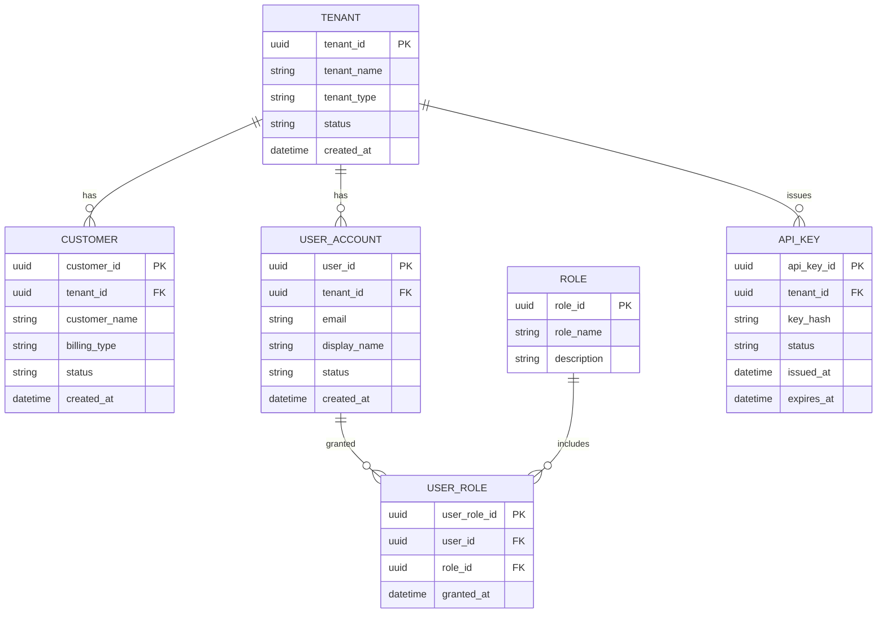

# 1. 고객 계정 관리 ERD

## 도메인 개요

고객/계정 관리는 멀티테넌트 시스템의 조직 경계, 고객 계정, 사용자 계정, 권한, API 인증을 관리하는 업무 도메인이다.

## 서브 도메인별 업무

- `테넌트 관리`: 고객사 또는 사업부 단위의 운영 경계와 상태를 관리한다.
- `고객 계정 관리`: 계약 및 과금 대상 고객 계정을 관리한다.
- `사용자 계정 관리`: 운영자, 검토자, 고객 사용자 계정을 관리한다.
- `권한 관리`: 역할 정의와 사용자-역할 매핑을 통해 접근 권한을 통제한다.
- `API 인증 관리`: 시스템 연동용 API 키 발급과 만료를 관리한다.

## 포함 테이블

- `TENANT`
- `CUSTOMER`
- `USER_ACCOUNT`
- `ROLE`
- `USER_ROLE`
- `API_KEY`

## 도메인 ERD (Mermaid)

## 외부 연계

- `USER_ACCOUNT`는 feasibility 실행, 리뷰, 스케줄 변경, 명령 승인 업무의 주체로 연결된다.
- `CUSTOMER`와 `TENANT`는 촬영 요청, 데이터 상품, 과금의 소유 주체로 연결된다.

## 테이블 정의서

### TENANT
- 목적: 시스템의 최상위 멀티테넌트 조직 단위다.
- 업무 역할: 데이터 격리, 정책 적용, 과금 집계, 감사 범위의 기준이 된다.
- 주요 컬럼: `tenant_id`는 테넌트 식별자, `tenant_name`은 표시명, `tenant_type`은 조직 유형, `status`는 운영 상태, `created_at`은 생성 시각이다.

### CUSTOMER
- 목적: 테넌트 산하의 실제 서비스 이용 고객 또는 계약 계정 단위다.
- 업무 역할: 촬영 요청 제출 주체와 과금 청구 대상을 분리해 관리한다.
- 주요 컬럼: `customer_id`는 고객 식별자, `tenant_id`는 소속 테넌트, `customer_name`은 고객명, `billing_type`은 과금 방식, `status`는 계정 상태, `created_at`은 생성 시각이다.

### USER_ACCOUNT
- 목적: 시스템 사용자 계정 마스터다.
- 업무 역할: 평가 실행, 리뷰, 승인, 스케줄 조정, 명령 요청의 행위 주체를 표현한다.
- 주요 컬럼: `user_id`는 사용자 식별자, `tenant_id`는 소속 테넌트, `email`은 로그인 식별자, `display_name`은 표시명, `status`는 계정 상태, `created_at`은 생성 시각이다.

### ROLE
- 목적: 권한 집합을 표현하는 롤 마스터다.
- 업무 역할: Planner, Reviewer, Operator, Admin 등 업무 역할 단위를 표준화한다.
- 주요 컬럼: `role_id`는 롤 식별자, `role_name`은 롤 이름, `description`은 역할 설명이다.

### USER_ROLE
- 목적: 사용자와 롤 사이의 매핑을 저장한다.
- 업무 역할: 한 사용자가 여러 권한을 가질 수 있도록 하고, 권한 부여 시점을 추적한다.
- 주요 컬럼: `user_role_id`는 매핑 식별자, `user_id`는 사용자 FK, `role_id`는 롤 FK, `granted_at`은 권한 부여 시각이다.

### API_KEY
- 목적: 외부 시스템 연동용 인증 키를 관리한다.
- 업무 역할: 시스템 간 호출의 인증 수단을 제공하고, 키 상태 및 만료를 통제한다.
- 주요 컬럼: `api_key_id`는 키 식별자, `tenant_id`는 발급 주체 테넌트, `key_hash`는 키 해시, `status`는 활성 상태, `issued_at`과 `expires_at`은 발급 및 만료 시각이다.

## 구현 권장사항

### TENANT
- PK/FK: PK는 `tenant_id`. 다른 도메인 다수 테이블이 FK로 참조한다.
- NULL/필수: `tenant_name`, `tenant_type`, `status`, `created_at`은 `NOT NULL` 권장.
- 권장 인덱스: `tenant_name` 유니크 검토, `status` 보조 인덱스 권장.
- 예시 enum/status: `tenant_type`은 `commercial`, `defense`, `internal`. `status`는 `active`, `suspended`, `terminated`.

### CUSTOMER
- PK/FK: PK는 `customer_id`, FK는 `tenant_id -> TENANT.tenant_id`.
- NULL/필수: `tenant_id`, `customer_name`, `billing_type`, `status`, `created_at`은 `NOT NULL` 권장.
- 권장 인덱스: `(tenant_id, customer_name)` 유니크 검토, `(tenant_id, status)` 인덱스 권장.
- 예시 enum/status: `billing_type`은 `payg`, `subscription`, `contract`. `status`는 `active`, `inactive`, `closed`.

### USER_ACCOUNT
- PK/FK: PK는 `user_id`, FK는 `tenant_id -> TENANT.tenant_id`.
- NULL/필수: `tenant_id`, `email`, `display_name`, `status`, `created_at`은 `NOT NULL` 권장.
- 권장 인덱스: `email` 유니크, `(tenant_id, status)` 인덱스, `(tenant_id, email)` 보조 인덱스 권장.
- 예시 enum/status: `status`는 `active`, `locked`, `disabled`, `pending`.

### ROLE
- PK/FK: PK는 `role_id`.
- NULL/필수: `role_name`은 `NOT NULL`, `description`은 선택 가능.
- 권장 인덱스: `role_name` 유니크 권장.
- 예시 enum/status: 예시 롤은 `Planner`, `Reviewer`, `Operator`, `Admin`, `BillingManager`.

### USER_ROLE
- PK/FK: PK는 `user_role_id`, FK는 `user_id -> USER_ACCOUNT.user_id`, `role_id -> ROLE.role_id`.
- NULL/필수: `user_id`, `role_id`, `granted_at`은 `NOT NULL` 권장.
- 권장 인덱스: `(user_id, role_id)` 유니크, `role_id` 단독 인덱스 권장.
- 예시 enum/status: 별도 enum 없음. 중복 할당 방지를 위한 유니크 제약이 중요하다.

### API_KEY
- PK/FK: PK는 `api_key_id`, FK는 `tenant_id -> TENANT.tenant_id`.
- NULL/필수: `tenant_id`, `key_hash`, `status`, `issued_at`은 `NOT NULL`, `expires_at`은 정책에 따라 nullable 가능.
- 권장 인덱스: `key_hash` 유니크, `(tenant_id, status)` 인덱스, `expires_at` 인덱스 권장.
- 예시 enum/status: `status`는 `active`, `revoked`, `expired`, `rotating`.
