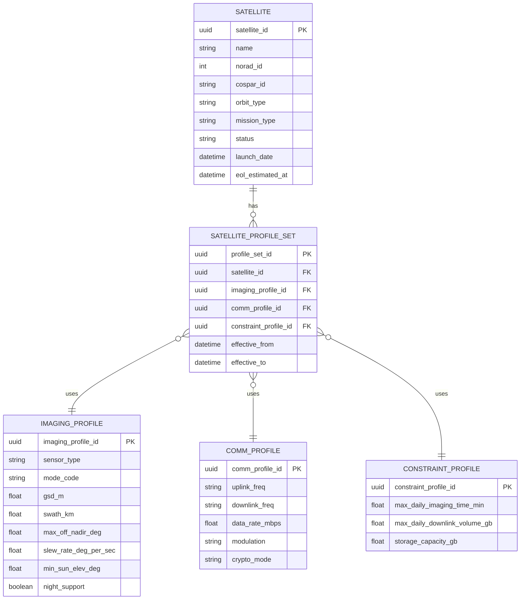

# 2. 위성 자산 관리 ERD

## 도메인 개요

위성 자산 관리는 위성 마스터와 촬영, 통신, 운용 제약 프로파일을 관리하는 업무 도메인이다.

## 서브 도메인별 업무

- `위성 마스터 관리`: 위성 식별 정보와 임무 유형, 운영 상태를 관리한다.
- `촬영 프로파일 관리`: 센서 모드, 해상도, 촬영 폭, 오프나딜 한계를 관리한다.
- `통신 프로파일 관리`: 업링크/다운링크 주파수와 데이터 전송 특성을 관리한다.
- `운용 제약 관리`: 일일 촬영/다운링크 가능량과 저장 용량을 관리한다.
- `프로파일 세트 운영`: 시점별로 유효한 위성 운용 프로파일 조합을 적용한다.

## 포함 테이블

- `SATELLITE`
- `SATELLITE_PROFILE_SET`
- `IMAGING_PROFILE`
- `COMM_PROFILE`
- `CONSTRAINT_PROFILE`

## 도메인 ERD (Mermaid)

## 외부 연계

- `SATELLITE`는 패스 계산, 촬영 후보, 스케줄 슬롯, 접촉 세션, 명령 요청, 데이터 상품의 기준 엔터티로 연결된다.

## 테이블 정의서

### SATELLITE
- 목적: 위성 자산의 기준 마스터다.
- 업무 역할: 촬영, 패스 예측, 스케줄링, 명령 전송, 데이터 상품 생성 전 과정에서 공통 참조 엔터티로 사용된다.
- 주요 컬럼: `satellite_id`는 식별자, `name`은 위성명, `norad_id`와 `cospar_id`는 우주 객체 식별 정보, `orbit_type`은 궤도 유형, `mission_type`은 임무 유형, `status`는 운용 상태, `launch_date`와 `eol_estimated_at`은 수명 주기 정보다.

### SATELLITE_PROFILE_SET
- 목적: 특정 시점에 적용되는 위성 운용 프로파일 묶음을 관리한다.
- 업무 역할: 동일 위성이라도 시기별 센서 모드, 통신 설정, 제약 조건 조합이 달라질 수 있으므로 유효 기간 기반으로 프로파일 세트를 관리한다.
- 주요 컬럼: `profile_set_id`는 세트 식별자, `satellite_id`는 대상 위성, `imaging_profile_id`, `comm_profile_id`, `constraint_profile_id`는 하위 프로파일 FK, `effective_from`과 `effective_to`는 적용 기간이다.

### IMAGING_PROFILE
- 목적: 위성 센서의 촬영 성능과 제약을 정의한다.
- 업무 역할: feasibility 평가와 실제 촬영 계획 수립 시 가능한 모드와 품질 수준을 판단하는 기준이 된다.
- 주요 컬럼: `imaging_profile_id`는 식별자, `sensor_type`은 센서 유형, `mode_code`는 촬영 모드, `gsd_m`은 해상도, `swath_km`은 촬영 폭, `max_off_nadir_deg`는 최대 오프나딜, `slew_rate_deg_per_sec`는 기동 속도, `min_sun_elev_deg`는 최소 태양고도, `night_support`는 야간 지원 여부다.

### COMM_PROFILE
- 목적: 위성의 통신 능력과 설정을 정의한다.
- 업무 역할: 명령 업링크 가능성과 데이터 다운링크 성능을 계획할 때 기준으로 사용된다.
- 주요 컬럼: `comm_profile_id`는 식별자, `uplink_freq`와 `downlink_freq`는 주파수, `data_rate_mbps`는 전송률, `modulation`은 변조 방식, `crypto_mode`는 암호화 운용 방식이다.

### CONSTRAINT_PROFILE
- 목적: 위성 운용의 자원 제약을 정의한다.
- 업무 역할: 하루 단위의 촬영 가능 시간, 다운링크 가능량, 저장 용량을 기반으로 feasibility와 스케줄링의 현실 제약을 제공한다.
- 주요 컬럼: `constraint_profile_id`는 식별자, `max_daily_imaging_time_min`은 일일 최대 촬영 시간, `max_daily_downlink_volume_gb`는 일일 최대 다운링크량, `storage_capacity_gb`는 저장 용량이다.

## 구현 권장사항

### SATELLITE
- PK/FK: PK는 `satellite_id`.
- NULL/필수: `name`, `norad_id`, `orbit_type`, `mission_type`, `status`는 `NOT NULL` 권장, `cospar_id`, `launch_date`, `eol_estimated_at`은 nullable 가능.
- 권장 인덱스: `norad_id` 유니크, `cospar_id` 유니크 검토, `(status, mission_type)` 인덱스 권장.
- 예시 enum/status: `orbit_type`은 `LEO`, `MEO`, `GEO`, `SSO`. `mission_type`은 `optical`, `sar`, `multispectral`. `status`는 `active`, `commissioning`, `maintenance`, `retired`.

### SATELLITE_PROFILE_SET
- PK/FK: PK는 `profile_set_id`, FK는 `satellite_id`, `imaging_profile_id`, `comm_profile_id`, `constraint_profile_id`.
- NULL/필수: 모든 FK와 `effective_from`은 `NOT NULL`, `effective_to`는 현재 유효 세트 표현을 위해 nullable 가능.
- 권장 인덱스: `(satellite_id, effective_from, effective_to)` 인덱스, 현재 세트 조회용 partial index 검토.
- 예시 enum/status: 별도 enum 없음. 유효 기간 겹침 방지 제약 권장.

### IMAGING_PROFILE
- PK/FK: PK는 `imaging_profile_id`.
- NULL/필수: `sensor_type`, `mode_code`, `gsd_m`, `swath_km`, `max_off_nadir_deg`는 `NOT NULL` 권장.
- 권장 인덱스: `(sensor_type, mode_code)` 유니크 권장.
- 예시 enum/status: `sensor_type`은 `optical`, `sar`, `video`. `night_support`는 boolean.

### COMM_PROFILE
- PK/FK: PK는 `comm_profile_id`.
- NULL/필수: `uplink_freq`, `downlink_freq`, `data_rate_mbps`는 `NOT NULL` 권장, `crypto_mode`는 nullable 가능.
- 권장 인덱스: `(uplink_freq, downlink_freq)` 조합 인덱스, `data_rate_mbps`는 정렬 조회 많을 때 보조 인덱스 검토.
- 예시 enum/status: `modulation`은 `QPSK`, `8PSK`, `QAM`. `crypto_mode`는 `none`, `AES256`, `mission-specific`.

### CONSTRAINT_PROFILE
- PK/FK: PK는 `constraint_profile_id`.
- NULL/필수: 핵심 수치 컬럼은 `NOT NULL` 권장.
- 권장 인덱스: 단독 조회 위주면 PK 외 추가 인덱스는 선택적이다.
- 예시 enum/status: 별도 enum 없음. 단위 일관성 체크와 양수 제약 권장.
