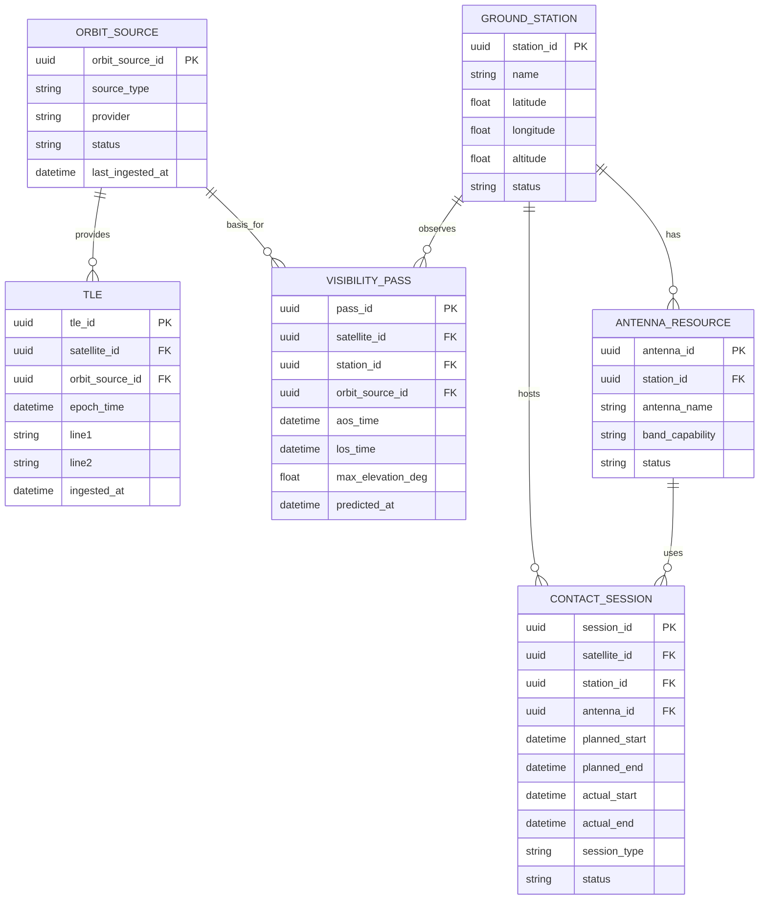

# 3. 궤도 지상국 운영 ERD

## 도메인 개요

궤도/지상국 운영은 위성 궤도 입력, 가시 패스 계산, 지상국 자원, 접촉 세션을 관리하는 업무 도메인이다.

## 서브 도메인별 업무

- `궤도 원천 관리`: TLE 등 궤도 입력 원천을 수집하고 버전을 관리한다.
- `패스 계산`: 위성과 지상국 간 가시 구간을 계산하고 예측 결과를 저장한다.
- `지상국 자원 관리`: 지상국, 안테나, 밴드 가용성을 관리한다.
- `세션 운영`: 명령/다운링크 수행용 접촉 세션을 계획하고 실제 수행 이력을 관리한다.

## 포함 테이블

- `ORBIT_SOURCE`
- `TLE`
- `GROUND_STATION`
- `VISIBILITY_PASS`
- `ANTENNA_RESOURCE`
- `CONTACT_SESSION`

## 도메인 ERD (Mermaid)

## 외부 연계

- `VISIBILITY_PASS`는 촬영 후보와 feasibility 다운링크 창의 핵심 입력이다.
- `CONTACT_SESSION`은 명령 실행과 다운링크 계획의 수행 단위로 연결된다.

## 테이블 정의서

### ORBIT_SOURCE
- 목적: 궤도 정보의 원천과 공급자를 관리한다.
- 업무 역할: 어떤 제공자와 어떤 형식의 궤도 데이터를 사용했는지 추적하고, 패스 계산의 근거를 제공한다.
- 주요 컬럼: `orbit_source_id`는 식별자, `source_type`은 TLE/EPH 등 데이터 유형, `provider`는 제공자, `status`는 사용 상태, `last_ingested_at`은 최근 수집 시각이다.

### TLE
- 목적: 위성 궤도 계산에 사용되는 TLE 이력을 저장한다.
- 업무 역할: 위성 패스 계산과 feasibility 스냅샷의 원본 데이터 저장소 역할을 한다.
- 주요 컬럼: `tle_id`는 식별자, `satellite_id`는 대상 위성, `orbit_source_id`는 원천 정보, `epoch_time`은 기준 시각, `line1`, `line2`는 TLE 본문, `ingested_at`은 수집 시각이다.

### GROUND_STATION
- 목적: 지상국 마스터다.
- 업무 역할: 패스 계산, 다운링크 수신, 명령 전송, 세션 운영에서 지상 자원의 기준 엔터티로 사용된다.
- 주요 컬럼: `station_id`는 식별자, `name`은 지상국명, `latitude`, `longitude`, `altitude`는 위치 정보, `status`는 운용 상태다.

### VISIBILITY_PASS
- 목적: 위성과 지상국 간 가시 구간 예측 결과를 저장한다.
- 업무 역할: 촬영 후보 도출, 다운링크 feasibility, 세션 계획 수립의 핵심 입력 데이터다.
- 주요 컬럼: `pass_id`는 식별자, `satellite_id`와 `station_id`는 위성/지상국 FK, `orbit_source_id`는 계산 근거, `aos_time`과 `los_time`은 가시 시작/종료, `max_elevation_deg`는 최대 고도, `predicted_at`은 계산 시각이다.

### ANTENNA_RESOURCE
- 목적: 지상국 내 개별 안테나 자원을 관리한다.
- 업무 역할: 동일 지상국 내 여러 안테나의 밴드 지원과 가용 상태를 분리 관리한다.
- 주요 컬럼: `antenna_id`는 식별자, `station_id`는 소속 지상국, `antenna_name`은 자원명, `band_capability`는 지원 밴드, `status`는 사용 상태다.

### CONTACT_SESSION
- 목적: 위성과 지상국 간 실제 또는 계획된 접촉 세션이다.
- 업무 역할: 명령 전송과 다운링크 실행의 물리적 수행 단위를 관리한다.
- 주요 컬럼: `session_id`는 식별자, `satellite_id`, `station_id`, `antenna_id`는 사용 자원, `planned_start`, `planned_end`는 계획 시각, `actual_start`, `actual_end`는 실제 시각, `session_type`은 세션 목적, `status`는 진행 상태다.

## 구현 권장사항

### ORBIT_SOURCE
- PK/FK: PK는 `orbit_source_id`.
- NULL/필수: `source_type`, `provider`, `status`는 `NOT NULL`, `last_ingested_at`은 nullable 가능.
- 권장 인덱스: `(provider, source_type)` 유니크 검토, `status` 인덱스 권장.
- 예시 enum/status: `source_type`은 `TLE`, `EPH`, `OEM`. `status`는 `active`, `paused`, `deprecated`.

### TLE
- PK/FK: PK는 `tle_id`, FK는 `satellite_id -> SATELLITE.satellite_id`, `orbit_source_id -> ORBIT_SOURCE.orbit_source_id`.
- NULL/필수: 모든 FK와 `epoch_time`, `line1`, `line2`, `ingested_at`은 `NOT NULL` 권장.
- 권장 인덱스: `(satellite_id, epoch_time DESC)` 인덱스, `(orbit_source_id, epoch_time DESC)` 인덱스 권장.
- 예시 enum/status: 별도 enum 없음. `(satellite_id, epoch_time)` 유니크 검토.

### GROUND_STATION
- PK/FK: PK는 `station_id`.
- NULL/필수: `name`, `latitude`, `longitude`, `status`는 `NOT NULL`, `altitude`는 기본값 0 검토.
- 권장 인덱스: `name` 유니크 검토, `status` 인덱스, 위치 기반 조회 많으면 공간 인덱스 검토.
- 예시 enum/status: `status`는 `active`, `maintenance`, `offline`, `retired`.

### VISIBILITY_PASS
- PK/FK: PK는 `pass_id`, FK는 `satellite_id`, `station_id`, `orbit_source_id`.
- NULL/필수: 모든 FK와 `aos_time`, `los_time`, `max_elevation_deg`, `predicted_at`은 `NOT NULL` 권장.
- 권장 인덱스: `(satellite_id, aos_time)`, `(station_id, aos_time)`, `(predicted_at)` 인덱스 권장.
- 예시 enum/status: 별도 enum 없음. `aos_time < los_time` 체크 제약 권장.

### ANTENNA_RESOURCE
- PK/FK: PK는 `antenna_id`, FK는 `station_id -> GROUND_STATION.station_id`.
- NULL/필수: `station_id`, `antenna_name`, `band_capability`, `status`는 `NOT NULL` 권장.
- 권장 인덱스: `(station_id, antenna_name)` 유니크, `(station_id, status)` 인덱스 권장.
- 예시 enum/status: `band_capability`는 `S`, `X`, `Ka`, `S/X`. `status`는 `active`, `reserved`, `maintenance`.

### CONTACT_SESSION
- PK/FK: PK는 `session_id`, FK는 `satellite_id`, `station_id`, `antenna_id`.
- NULL/필수: `satellite_id`, `station_id`, `antenna_id`, `planned_start`, `planned_end`, `session_type`, `status`는 `NOT NULL`, 실제 시각은 nullable 가능.
- 권장 인덱스: `(satellite_id, planned_start)`, `(station_id, planned_start)`, `(antenna_id, planned_start)` 인덱스 권장.
- 예시 enum/status: `session_type`은 `command`, `downlink`, `mixed`. `status`는 `planned`, `active`, `completed`, `cancelled`, `failed`.
