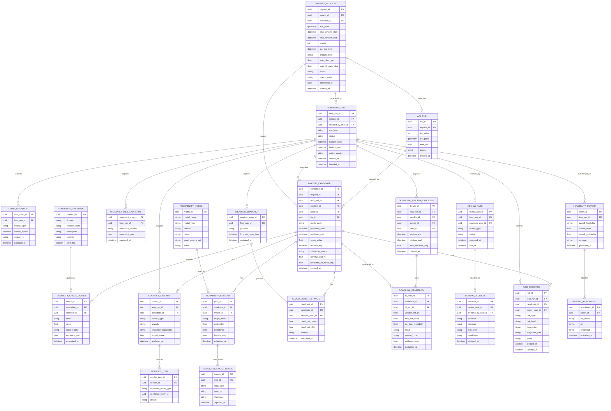

# 4. 촬영 요청 Feasibility 평가 ERD

## 도메인 개요

촬영 요청/Feasibility 평가는 고객 요청 접수부터 가능성 평가, 확률 추정, 사람 리뷰, 리스크 관리, 보고서 생성까지의 업무 도메인이다.

## 서브 도메인별 업무

- `요청 접수`: AOI, 시간창, 품질 조건, SLA를 포함한 촬영 요청을 등록한다.
- `AOI 분할`: 대면적 요청을 타일로 분할해 계산 복잡도를 제어한다.
- `평가 실행 관리`: 궤도, 기상, 제약 스냅샷을 캡처해 재현 가능한 실행 단위를 만든다.
- `후보 생성`: 위성, 패스, 타일을 조합해 촬영 후보를 생성한다.
- `기준 체크`: 평가 기준별 PASS/FAIL/WARN과 점수를 기록한다.
- `충돌 분석`: 기존 정책, 우선순위, 일정과 충돌하는 후보를 분석한다.
- `확률 추정`: 성공 확률, 품질 확률, 구름량, 다운링크 정시성 등을 추정한다.
- `리뷰 및 승인`: 자동 평가 결과를 사람이 검토하고 최종 판단한다.
- `리스크 및 보고`: 리스크와 완화 계획을 기록하고 feasibility 보고서를 발행한다.

## 포함 테이블

- `IMAGING_REQUEST`
- `AOI_TILE`
- `FEASIBILITY_RUN`
- `ORBIT_SNAPSHOT`
- `WEATHER_SNAPSHOT`
- `OP_CONSTRAINT_SNAPSHOT`
- `IMAGING_CANDIDATE`
- `FEASIBILITY_CRITERION`
- `FEASIBILITY_CHECK_RESULT`
- `CONFLICT_ANALYSIS`
- `CONFLICT_ITEM`
- `PROBABILITY_MODEL`
- `PROBABILITY_ESTIMATE`
- `MODEL_EVIDENCE_LINEAGE`
- `CLOUD_COVER_ESTIMATE`
- `DOWNLINK_WINDOW_CANDIDATE`
- `DOWNLINK_FEASIBILITY`
- `REVIEW_TASK`
- `REVIEW_DECISION`
- `RISK_REGISTER`
- `FEASIBILITY_REPORT`
- `REPORT_ATTACHMENT`

## 도메인 ERD (Mermaid)

## 외부 연계

- `IMAGING_CANDIDATE`는 스케줄링 도메인의 `SCHEDULE_SLOT`으로 연결된다.
- `DOWNLINK_WINDOW_CANDIDATE`는 궤도/지상국 운영 도메인의 패스 정보에 의존한다.
- `USER_ACCOUNT`는 실행 주체, 검토자, 리스크 담당자로 연결된다.

## 테이블 정의서

### IMAGING_REQUEST
- 목적: 촬영 요청의 원장 테이블이다.
- 업무 역할: AOI, 시간창, 품질 조건, SLA 등 고객 요구를 표준 구조로 저장하며 이후 모든 평가와 실행의 출발점이 된다.
- 주요 컬럼: `request_id`는 요청 식별자, `tenant_id`와 `customer_id`는 요청 주체, `aoi_geom`은 촬영 영역, `time_window_start`, `time_window_end`는 요청 가능 시간창, `priority`는 우선순위, `sla_due_time`은 납기, `product_level`은 산출물 수준, `max_cloud_pct`와 `max_off_nadir_deg`는 품질 제약, `status`와 `reason_code`는 처리 상태와 사유, `correlation_id`는 추적 키, `created_at`은 생성 시각이다.

### AOI_TILE
- 목적: 대면적 촬영 영역을 작은 평가 단위로 분할한 테이블이다.
- 업무 역할: 후보 생성 시 계산량 폭증을 막고, 부분 촬영 가능성 평가를 가능하게 한다.
- 주요 컬럼: `tile_id`는 타일 식별자, `request_id`는 상위 요청, `tile_index`는 순번, `tile_geom`은 타일 영역, `area_km2`는 면적, `status`는 분할 상태, `created_at`은 생성 시각이다.

### FEASIBILITY_RUN
- 목적: 특정 촬영 요청에 대해 수행한 feasibility 평가 실행 단위다.
- 업무 역할: 한 번의 평가를 독립 실행 단위로 보관하여 재현성과 감사 추적을 가능하게 한다.
- 주요 컬럼: `feas_run_id`는 실행 식별자, `request_id`는 대상 요청, `initiated_by_user_id`는 실행 사용자, `run_type`은 실행 유형, `status`는 상태, `horizon_start`, `horizon_end`는 평가 범위, `policy_version`은 적용 정책 버전, `started_at`, `finished_at`은 실행 시각이다.

### ORBIT_SNAPSHOT
- 목적: 평가 시점에 사용한 궤도 입력을 고정 저장한다.
- 업무 역할: 같은 평가 결과를 나중에 재현하거나 검증할 수 있도록 원천 데이터를 캡처한다.
- 주요 컬럼: `orbit_snap_id`는 식별자, `feas_run_id`는 상위 실행, `source_type`은 입력 유형, `source_epoch`는 기준 시각, `source_ref`는 원본 참조, `captured_at`은 캡처 시각이다.

### WEATHER_SNAPSHOT
- 목적: 평가 시점에 사용한 기상 예보 입력을 고정 저장한다.
- 업무 역할: 구름량과 품질 확률 계산에 사용된 예보 원천을 보존한다.
- 주요 컬럼: `weather_snap_id`는 식별자, `feas_run_id`는 상위 실행, `provider`는 제공자, `forecast_base_time`은 기준 시각, `captured_at`은 캡처 시각이다.

### OP_CONSTRAINT_SNAPSHOT
- 목적: 평가 시점의 운영 제약을 JSON 형태로 저장한다.
- 업무 역할: 위성 자원 한계, 정책 제한, 운용 규칙 등 실행 당시 조건을 그대로 남긴다.
- 주요 컬럼: `constraint_snap_id`는 식별자, `feas_run_id`는 상위 실행, `constraint_version`은 제약 버전, `constraint_json`은 상세 제약, `captured_at`은 캡처 시각이다.

### IMAGING_CANDIDATE
- 목적: 요청 또는 실행 기준으로 도출된 촬영 후보안이다.
- 업무 역할: feasibility 평가 결과와 스케줄링을 연결하는 중심 엔터티로, 어떤 위성/패스/타일 조합이 실제 가능 후보인지 표현한다.
- 주요 컬럼: `candidate_id`는 후보 식별자, `request_id`는 원 요청, `feas_run_id`는 상위 실행, `satellite_id`와 `pass_id`는 위성/패스 연결, `tile_id`는 대상 타일, `mode_code`는 촬영 모드, `predicted_start`, `predicted_end`는 예측 시각, `score_value`는 종합 점수, `feasible_flag`는 가능 여부, `infeasible_reason`은 불가 사유, `nominal_gsd_m`과 `predicted_off_nadir_deg`는 품질 추정치, `created_at`은 생성 시각이다.

### FEASIBILITY_CRITERION
- 목적: feasibility 평가 기준을 정의하는 마스터다.
- 업무 역할: 클라우드, 오프나딜, 태양고도, 저장 용량, 정책 제한 등 다양한 체크 항목을 표준화한다.
- 주요 컬럼: `criterion_id`는 식별자, `domain`은 평가 영역, `criterion_code`는 기준 코드, `description`은 설명, `severity`는 중요도, `hard_flag`는 필수 조건 여부다.

### FEASIBILITY_CHECK_RESULT
- 목적: 후보별로 기준 평가 결과를 저장한다.
- 업무 역할: PASS/FAIL/WARN, 점수, 근거를 남겨 후보 채택 여부와 설명 가능성을 제공한다.
- 주요 컬럼: `check_id`는 결과 식별자, `candidate_id`는 대상 후보, `criterion_id`는 적용 기준, `result`는 판정 결과, `score`는 점수, `reason_code`는 사유 코드, `evidence_json`은 근거 데이터, `evaluated_at`은 평가 시각이다.

### CONFLICT_ANALYSIS
- 목적: 후보가 기존 일정, 정책, 우선순위와 충돌하는지 분석한 결과다.
- 업무 역할: 단순히 가능한 후보인지뿐 아니라 운영상 채택 가능한 후보인지 판단하도록 돕는다.
- 주요 컬럼: `conflict_id`는 식별자, `feas_run_id`와 `candidate_id`는 분석 문맥, `conflict_type`은 충돌 유형, `severity`는 심각도, `resolution_suggestion`은 해소 제안, `impact_score`는 영향 점수, `analyzed_at`은 분석 시각이다.

### CONFLICT_ITEM
- 목적: 충돌 분석을 구성하는 개별 충돌 항목 상세다.
- 업무 역할: 어떤 슬롯, 정책, 리소스와 충돌하는지 세부 증적을 남긴다.
- 주요 컬럼: `conflict_item_id`는 식별자, `conflict_id`는 상위 분석, `conflicted_entity_type`은 충돌 대상 종류, `conflicted_entity_id`는 대상 식별자, `details`는 상세 내용이다.

### PROBABILITY_MODEL
- 목적: 성공 확률이나 품질 확률을 계산하는 모델의 메타데이터다.
- 업무 역할: 어떤 모델과 어떤 버전이 어떤 입력 스키마로 평가에 사용되었는지 관리한다.
- 주요 컬럼: `model_id`는 식별자, `model_name`은 모델명, `model_type`은 유형, `version`은 버전, `owner`는 관리 주체, `input_schema_uri`는 입력 스키마 참조, `status`는 운영 상태다.

### PROBABILITY_ESTIMATE
- 목적: 후보에 대한 목표 지표별 확률 추정 결과다.
- 업무 역할: 단순 가능/불가를 넘어 성공 가능성, 품질 확보 가능성, 정시 납기 가능성을 수치로 제시한다.
- 주요 컬럼: `prob_id`는 식별자, `candidate_id`는 대상 후보, `model_id`는 사용 모델, `target_metric`은 목표 지표, `probability`는 확률값, `confidence`는 신뢰도, `feature_json`은 입력 피처 스냅샷, `estimated_at`은 계산 시각이다.

### MODEL_EVIDENCE_LINEAGE
- 목적: 확률 추정의 입력 근거를 추적한다.
- 업무 역할: 어떤 데이터 원천을 기반으로 확률값이 생성되었는지 감사 가능하게 만든다.
- 주요 컬럼: `lineage_id`는 식별자, `prob_id`는 상위 확률 결과, `input_type`은 입력 종류, `input_ref`는 원본 참조, `checksum`은 무결성 값, `captured_at`은 기록 시각이다.

### CLOUD_COVER_ESTIMATE
- 목적: 후보 시간/영역에 대한 구름량 추정 결과다.
- 업무 역할: 광학 촬영에서 성공 가능성과 품질 확보 가능성을 판단하는 핵심 지표를 제공한다.
- 주요 컬럼: `cloud_est_id`는 식별자, `candidate_id`는 대상 후보, `weather_snap_id`는 사용 예보, `cloud_pct_mean`은 평균 구름량, `cloud_pct_p90`은 보수적 추정치, `method`는 추정 방식, `estimated_at`은 계산 시각이다.

### DOWNLINK_WINDOW_CANDIDATE
- 목적: feasibility 관점에서 가능한 다운링크 창을 표현한다.
- 업무 역할: 촬영 성공 이후 데이터를 적시에 수신할 수 있는 운영 가능성을 함께 검토한다.
- 주요 컬럼: `dl_win_id`는 식별자, `feas_run_id`는 상위 실행, `satellite_id`, `station_id`, `pass_id`는 관련 자원, `window_start`, `window_end`는 가능 시간창, `max_elevation_deg`는 예상 최대 고도, `created_at`은 생성 시각이다.

### DOWNLINK_FEASIBILITY
- 목적: 특정 촬영 후보의 다운링크 가능성을 평가한 결과다.
- 업무 역할: 예상 데이터 용량과 전송 속도를 바탕으로 납기 충족 가능성을 계산한다.
- 주요 컬럼: `dl_feas_id`는 식별자, `candidate_id`는 대상 후보, `dl_win_id`는 사용 다운링크 창, `volume_est_gb`는 예상 용량, `rate_est_mbps`는 예상 전송률, `on_time_probability`는 정시 전송 확률, `result`는 판정, `reason_code`는 사유 코드, `evidence_json`은 근거 데이터, `evaluated_at`은 평가 시각이다.

### REVIEW_TASK
- 목적: 사람이 검토해야 하는 feasibility 업무 단위다.
- 업무 역할: 자동 평가 후 운영자, 보안 담당자, 사업 담당자에게 검토 과업을 할당한다.
- 주요 컬럼: `review_task_id`는 식별자, `feas_run_id`는 상위 실행, `assignee_user_id`는 담당자, `review_type`은 검토 유형, `status`는 진행 상태, `assigned_at`과 `due_at`은 할당 및 마감 시각이다.

### REVIEW_DECISION
- 목적: 리뷰 태스크의 최종 판단 결과다.
- 업무 역할: 승인, 반려, 조건부 승인과 그 근거를 공식적으로 기록한다.
- 주요 컬럼: `decision_id`는 식별자, `review_task_id`는 대상 태스크, `decided_by_user_id`는 결정자, `decision`은 판정, `rationale`은 근거, `risk_level`은 리스크 수준, `conditions`는 부가 조건, `decided_at`은 결정 시각이다.

### RISK_REGISTER
- 목적: 후보 또는 실행 단위의 리스크를 관리한다.
- 업무 역할: 리스크 식별, 수준 평가, 완화 계획, 담당자 추적을 통해 사후 이슈를 줄인다.
- 주요 컬럼: `risk_id`는 식별자, `feas_run_id`와 `candidate_id`는 리스크 문맥, `owner_user_id`는 담당자, `risk_type`은 분류, `risk_level`은 수준, `description`은 설명, `mitigation_plan`은 완화 계획, `status`는 처리 상태, `created_at`, `updated_at`은 기록 시각이다.

### FEASIBILITY_REPORT
- 목적: 실행 단위의 공식 feasibility 결과 보고서다.
- 업무 역할: 종합 점수, 종합 확률, 판정 결과를 내외부 공유 가능한 산출물로 정리한다.
- 주요 컬럼: `report_id`는 식별자, `feas_run_id`는 대상 실행, `overall_feasibility`는 종합 판정, `overall_score`는 종합 점수, `overall_probability`는 종합 확률, `summary`는 요약, `generated_at`은 생성 시각이다.

### REPORT_ATTACHMENT
- 목적: feasibility 보고서에 연결된 증빙 자료를 관리한다.
- 업무 역할: 지도 이미지, 로그, 근거 파일, PDF 등 보고서 관련 첨부물을 저장하고 무결성을 확인한다.
- 주요 컬럼: `attachment_id`는 식별자, `report_id`는 상위 보고서, `file_name`은 파일명, `uri`는 저장 위치, `checksum`은 무결성 값, `uploaded_at`은 업로드 시각이다.

## 구현 권장사항

### IMAGING_REQUEST
- PK/FK: PK는 `request_id`, FK는 `tenant_id -> TENANT.tenant_id`, `customer_id -> CUSTOMER.customer_id`.
- NULL/필수: 핵심 업무 컬럼인 `tenant_id`, `aoi_geom`, `time_window_start`, `time_window_end`, `priority`, `product_level`, `status`, `created_at`은 `NOT NULL` 권장.
- 권장 인덱스: `(tenant_id, status, created_at DESC)`, `(customer_id, created_at DESC)`, `sla_due_time`, `correlation_id` 인덱스 권장. `aoi_geom`에는 공간 인덱스 권장.
- 예시 enum/status: `status`는 `requested`, `in_review`, `approved`, `scheduled`, `captured`, `cancelled`. `product_level`은 `L0`, `L1`, `L2`, `L3`.

### AOI_TILE
- PK/FK: PK는 `tile_id`, FK는 `request_id -> IMAGING_REQUEST.request_id`.
- NULL/필수: `request_id`, `tile_index`, `tile_geom`, `status`, `created_at`은 `NOT NULL` 권장.
- 권장 인덱스: `(request_id, tile_index)` 유니크, `tile_geom` 공간 인덱스 권장.
- 예시 enum/status: `status`는 `generated`, `evaluated`, `selected`, `dropped`.

### FEASIBILITY_RUN
- PK/FK: PK는 `feas_run_id`, FK는 `request_id -> IMAGING_REQUEST.request_id`, `initiated_by_user_id -> USER_ACCOUNT.user_id`.
- NULL/필수: `request_id`, `run_type`, `status`, `horizon_start`, `horizon_end`, `policy_version`, `started_at`은 `NOT NULL`, `finished_at`은 nullable 가능.
- 권장 인덱스: `(request_id, started_at DESC)`, `(status, started_at DESC)`, `initiated_by_user_id` 인덱스 권장.
- 예시 enum/status: `run_type`은 `auto`, `manual`, `emergency`. `status`는 `created`, `running`, `completed`, `failed`.

### ORBIT_SNAPSHOT
- PK/FK: PK는 `orbit_snap_id`, FK는 `feas_run_id -> FEASIBILITY_RUN.feas_run_id`.
- NULL/필수: `feas_run_id`, `source_type`, `captured_at`은 `NOT NULL`, `source_epoch`, `source_ref`는 nullable 가능.
- 권장 인덱스: `(feas_run_id, captured_at DESC)` 인덱스 권장.
- 예시 enum/status: `source_type`은 `TLE`, `EPH`, `OEM`.

### WEATHER_SNAPSHOT
- PK/FK: PK는 `weather_snap_id`, FK는 `feas_run_id -> FEASIBILITY_RUN.feas_run_id`.
- NULL/필수: `feas_run_id`, `provider`, `forecast_base_time`, `captured_at`은 `NOT NULL` 권장.
- 권장 인덱스: `(feas_run_id, captured_at DESC)`, `(provider, forecast_base_time)` 인덱스 권장.
- 예시 enum/status: `provider`는 `ECMWF`, `GFS`, `KMA`, `internal-nowcast`.

### OP_CONSTRAINT_SNAPSHOT
- PK/FK: PK는 `constraint_snap_id`, FK는 `feas_run_id -> FEASIBILITY_RUN.feas_run_id`.
- NULL/필수: `feas_run_id`, `constraint_version`, `constraint_json`, `captured_at`은 `NOT NULL` 권장.
- 권장 인덱스: `(feas_run_id, captured_at DESC)` 인덱스 권장.
- 예시 enum/status: 별도 enum 없음. JSON schema 검증 권장.

### IMAGING_CANDIDATE
- PK/FK: PK는 `candidate_id`, FK는 `request_id`, `feas_run_id`, `satellite_id`, `pass_id`, `tile_id`.
- NULL/필수: `request_id`, `feas_run_id`, `satellite_id`, `mode_code`, `predicted_start`, `predicted_end`, `created_at`은 `NOT NULL` 권장.
- 권장 인덱스: `(feas_run_id, score_value DESC)`, `(request_id, feasible_flag)`, `(satellite_id, predicted_start)`, `(pass_id)` 인덱스 권장.
- 예시 enum/status: `feasible_flag`는 boolean. 별도 상태 컬럼 추가 시 `generated`, `ranked`, `selected`, `rejected` 권장.

### FEASIBILITY_CRITERION
- PK/FK: PK는 `criterion_id`.
- NULL/필수: `domain`, `criterion_code`, `description`, `severity`, `hard_flag`는 `NOT NULL` 권장.
- 권장 인덱스: `(domain, criterion_code)` 유니크 권장.
- 예시 enum/status: `domain`은 `orbit`, `weather`, `resource`, `policy`, `downlink`. `severity`는 `low`, `medium`, `high`, `critical`.

### FEASIBILITY_CHECK_RESULT
- PK/FK: PK는 `check_id`, FK는 `candidate_id -> IMAGING_CANDIDATE.candidate_id`, `criterion_id -> FEASIBILITY_CRITERION.criterion_id`.
- NULL/필수: `candidate_id`, `criterion_id`, `result`, `evaluated_at`은 `NOT NULL`, `score`, `reason_code`, `evidence_json`은 nullable 가능.
- 권장 인덱스: `(candidate_id, criterion_id)` 유니크, `(candidate_id, result)` 인덱스 권장.
- 예시 enum/status: `result`는 `PASS`, `FAIL`, `WARN`, `INFO`.

### CONFLICT_ANALYSIS
- PK/FK: PK는 `conflict_id`, FK는 `feas_run_id`, `candidate_id`.
- NULL/필수: `feas_run_id`, `candidate_id`, `conflict_type`, `severity`, `analyzed_at`은 `NOT NULL`.
- 권장 인덱스: `(candidate_id, severity)`, `(feas_run_id, analyzed_at DESC)` 인덱스 권장.
- 예시 enum/status: `conflict_type`은 `schedule_overlap`, `priority_preemption`, `policy_violation`, `resource_exhaustion`. `severity`는 `low`, `medium`, `high`.

### CONFLICT_ITEM
- PK/FK: PK는 `conflict_item_id`, FK는 `conflict_id -> CONFLICT_ANALYSIS.conflict_id`.
- NULL/필수: `conflict_id`, `conflicted_entity_type`, `conflicted_entity_id`는 `NOT NULL`, `details`는 nullable 가능.
- 권장 인덱스: `(conflict_id)`, `(conflicted_entity_type, conflicted_entity_id)` 인덱스 권장.
- 예시 enum/status: `conflicted_entity_type`은 `schedule_slot`, `policy_rule`, `antenna_resource`, `downlink_window`.

### PROBABILITY_MODEL
- PK/FK: PK는 `model_id`.
- NULL/필수: `model_name`, `model_type`, `version`, `owner`, `status`는 `NOT NULL`, `input_schema_uri`는 nullable 가능.
- 권장 인덱스: `(model_name, version)` 유니크, `status` 인덱스 권장.
- 예시 enum/status: `model_type`은 `classification`, `regression`, `bayesian`, `rules`. `status`는 `active`, `shadow`, `deprecated`.

### PROBABILITY_ESTIMATE
- PK/FK: PK는 `prob_id`, FK는 `candidate_id -> IMAGING_CANDIDATE.candidate_id`, `model_id -> PROBABILITY_MODEL.model_id`.
- NULL/필수: `candidate_id`, `model_id`, `target_metric`, `probability`, `estimated_at`은 `NOT NULL`, `confidence`, `feature_json`은 nullable 가능.
- 권장 인덱스: `(candidate_id, target_metric)`, `(model_id, estimated_at DESC)` 인덱스 권장.
- 예시 enum/status: `target_metric`은 `SUCCESS`, `QUALITY`, `SLA_ON_TIME`, `DOWNLINK_ON_TIME`.

### MODEL_EVIDENCE_LINEAGE
- PK/FK: PK는 `lineage_id`, FK는 `prob_id -> PROBABILITY_ESTIMATE.prob_id`.
- NULL/필수: `prob_id`, `input_type`, `input_ref`, `captured_at`은 `NOT NULL`, `checksum`은 nullable 가능.
- 권장 인덱스: `(prob_id)`, `(input_type, input_ref)` 인덱스 권장.
- 예시 enum/status: `input_type`은 `weather_snapshot`, `orbit_snapshot`, `constraint_snapshot`, `feature_table`.

### CLOUD_COVER_ESTIMATE
- PK/FK: PK는 `cloud_est_id`, FK는 `candidate_id -> IMAGING_CANDIDATE.candidate_id`, `weather_snap_id -> WEATHER_SNAPSHOT.weather_snap_id`.
- NULL/필수: `candidate_id`, `weather_snap_id`, `cloud_pct_mean`, `cloud_pct_p90`, `method`, `estimated_at`은 `NOT NULL` 권장.
- 권장 인덱스: `(candidate_id)`, `(weather_snap_id)` 인덱스 권장.
- 예시 enum/status: `method`는 `NWP`, `Nowcast`, `Ensemble`, `SatelliteBlend`.

### DOWNLINK_WINDOW_CANDIDATE
- PK/FK: PK는 `dl_win_id`, FK는 `feas_run_id`, `satellite_id`, `station_id`, `pass_id`.
- NULL/필수: 모든 FK와 `window_start`, `window_end`, `max_elevation_deg`, `created_at`은 `NOT NULL` 권장.
- 권장 인덱스: `(feas_run_id, window_start)`, `(satellite_id, window_start)`, `(station_id, window_start)` 인덱스 권장.
- 예시 enum/status: 별도 enum 없음. `window_start < window_end` 체크 권장.

### DOWNLINK_FEASIBILITY
- PK/FK: PK는 `dl_feas_id`, FK는 `candidate_id -> IMAGING_CANDIDATE.candidate_id`, `dl_win_id -> DOWNLINK_WINDOW_CANDIDATE.dl_win_id`.
- NULL/필수: `candidate_id`, `dl_win_id`, `volume_est_gb`, `rate_est_mbps`, `on_time_probability`, `result`, `evaluated_at`은 `NOT NULL` 권장.
- 권장 인덱스: `(candidate_id, result)`, `(dl_win_id)` 인덱스 권장.
- 예시 enum/status: `result`는 `FEASIBLE`, `NOT_FEASIBLE`, `CONDITIONAL`.

### REVIEW_TASK
- PK/FK: PK는 `review_task_id`, FK는 `feas_run_id -> FEASIBILITY_RUN.feas_run_id`, `assignee_user_id -> USER_ACCOUNT.user_id`.
- NULL/필수: `feas_run_id`, `review_type`, `status`, `assigned_at`은 `NOT NULL`, `assignee_user_id`, `due_at`는 nullable 가능.
- 권장 인덱스: `(assignee_user_id, status, due_at)`, `(feas_run_id, status)` 인덱스 권장.
- 예시 enum/status: `review_type`은 `TECH`, `OPS`, `SECURITY`, `COMMERCIAL`. `status`는 `OPEN`, `IN_REVIEW`, `DONE`, `REJECTED`.

### REVIEW_DECISION
- PK/FK: PK는 `decision_id`, FK는 `review_task_id -> REVIEW_TASK.review_task_id`, `decided_by_user_id -> USER_ACCOUNT.user_id`.
- NULL/필수: `review_task_id`, `decision`, `decided_at`은 `NOT NULL`, `rationale`, `risk_level`, `conditions`는 nullable 가능.
- 권장 인덱스: `(review_task_id)` 유니크 검토, `(decided_by_user_id, decided_at DESC)` 인덱스 권장.
- 예시 enum/status: `decision`은 `APPROVE`, `REJECT`, `CONDITIONAL_APPROVE`. `risk_level`은 `LOW`, `MEDIUM`, `HIGH`.

### RISK_REGISTER
- PK/FK: PK는 `risk_id`, FK는 `feas_run_id`, `candidate_id`, `owner_user_id`.
- NULL/필수: `feas_run_id`, `risk_type`, `risk_level`, `description`, `status`, `created_at`은 `NOT NULL`, `candidate_id`, `owner_user_id`, `updated_at`은 nullable 가능.
- 권장 인덱스: `(feas_run_id, status)`, `(owner_user_id, status)`, `(candidate_id)` 인덱스 권장.
- 예시 enum/status: `risk_type`은 `weather`, `resource`, `policy`, `customer`, `delivery`. `status`는 `OPEN`, `MITIGATING`, `ACCEPTED`, `CLOSED`.

### FEASIBILITY_REPORT
- PK/FK: PK는 `report_id`, FK는 `feas_run_id -> FEASIBILITY_RUN.feas_run_id`.
- NULL/필수: `feas_run_id`, `overall_feasibility`, `generated_at`은 `NOT NULL`, `overall_score`, `overall_probability`, `summary`는 nullable 가능.
- 권장 인덱스: `(feas_run_id)` 유니크 검토, `generated_at` 인덱스 권장.
- 예시 enum/status: `overall_feasibility`는 `FEASIBLE`, `NOT_FEASIBLE`, `CONDITIONAL`.

### REPORT_ATTACHMENT
- PK/FK: PK는 `attachment_id`, FK는 `report_id -> FEASIBILITY_REPORT.report_id`.
- NULL/필수: `report_id`, `file_name`, `uri`, `uploaded_at`은 `NOT NULL`, `checksum`은 nullable 가능.
- 권장 인덱스: `(report_id)`, `checksum` 인덱스 권장.
- 예시 enum/status: 별도 enum 없음. 파일 타입 분리 필요 시 MIME 컬럼 추가 권장.
