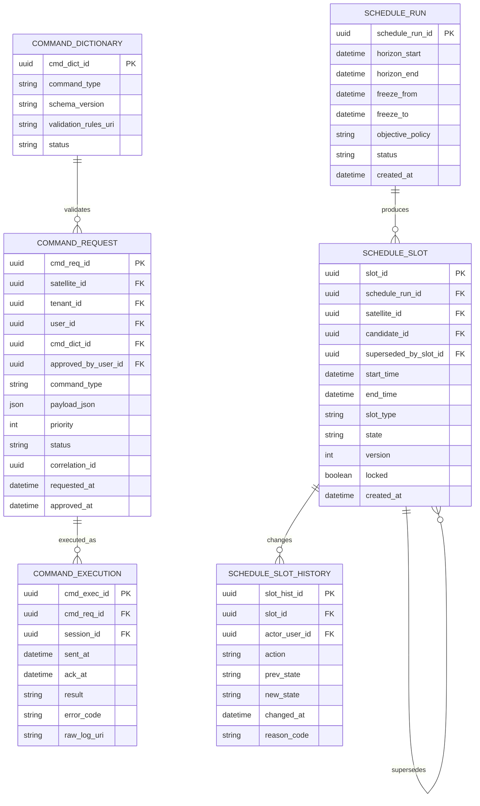

# 5. 스케줄링 실행 통제 ERD

## 도메인 개요

스케줄링/실행 통제는 촬영 후보를 실제 운용 일정으로 배치하고, 명령 요청과 실행을 통제하는 업무 도메인이다.

## 서브 도메인별 업무

- `스케줄 실행`: horizon 범위 내에서 촬영, 다운링크, 기타 운용 슬롯을 생성한다.
- `슬롯 상태 관리`: 배정, 고정, 대체, 취소 등 슬롯의 상태를 관리한다.
- `변경 이력 관리`: 수동 개입과 자동 재계산 이력을 추적한다.
- `명령 사전 관리`: 실행 가능한 명령의 유형과 검증 규칙을 통제한다.
- `명령 요청/승인/실행`: 명령 요청, 승인, 세션 내 전송, 결과 수집을 관리한다.

## 포함 테이블

- `SCHEDULE_RUN`
- `SCHEDULE_SLOT`
- `SCHEDULE_SLOT_HISTORY`
- `COMMAND_DICTIONARY`
- `COMMAND_REQUEST`
- `COMMAND_EXECUTION`

## 도메인 ERD (Mermaid)

## 외부 연계

- `SCHEDULE_SLOT`는 feasibility 도메인의 `IMAGING_CANDIDATE`와 위성 도메인의 `SATELLITE`를 참조한다.
- `COMMAND_EXECUTION`은 궤도/지상국 운영 도메인의 `CONTACT_SESSION`에서 수행된다.
- `USER_ACCOUNT`는 슬롯 변경과 명령 요청/승인의 주체로 연결된다.

## 테이블 정의서

### SCHEDULE_RUN
- 목적: 일정 생성 또는 재계산 실행 단위다.
- 업무 역할: 특정 기간의 촬영, 다운링크, 유휴 슬롯을 어떤 정책으로 생성했는지 실행 이력을 남긴다.
- 주요 컬럼: `schedule_run_id`는 실행 식별자, `horizon_start`, `horizon_end`는 스케줄링 범위, `freeze_from`, `freeze_to`는 고정 구간, `objective_policy`는 최적화 정책, `status`는 실행 상태, `created_at`은 생성 시각이다.

### SCHEDULE_SLOT
- 목적: 실제 운용 일정표에 배치된 개별 슬롯이다.
- 업무 역할: 촬영, 다운링크, 대기, 정비 등 시간 단위 운영 계획을 표현하며 후보 채택 결과를 실제 일정으로 전환한다.
- 주요 컬럼: `slot_id`는 식별자, `schedule_run_id`는 상위 스케줄 실행, `satellite_id`는 대상 위성, `candidate_id`는 원 후보, `superseded_by_slot_id`는 대체 슬롯, `start_time`, `end_time`은 슬롯 구간, `slot_type`은 유형, `state`는 상태, `version`은 버전, `locked`는 고정 여부, `created_at`은 생성 시각이다.

### SCHEDULE_SLOT_HISTORY
- 목적: 슬롯 상태 변경 이력을 저장한다.
- 업무 역할: 자동 재계산과 수동 수정 모두에 대해 누가 언제 어떤 이유로 변경했는지 추적한다.
- 주요 컬럼: `slot_hist_id`는 이력 식별자, `slot_id`는 대상 슬롯, `actor_user_id`는 변경 사용자, `action`은 수행 행위, `prev_state`, `new_state`는 상태 전이, `changed_at`은 변경 시각, `reason_code`는 사유 코드다.

### COMMAND_DICTIONARY
- 목적: 허용 가능한 위성 명령 유형을 정의하는 사전이다.
- 업무 역할: 어떤 명령이 어떤 스키마와 검증 규칙을 따라야 하는지 표준화한다.
- 주요 컬럼: `cmd_dict_id`는 식별자, `command_type`은 명령 유형, `schema_version`은 스키마 버전, `validation_rules_uri`는 검증 규칙 참조, `status`는 사용 상태다.

### COMMAND_REQUEST
- 목적: 사용자 또는 시스템이 생성한 명령 요청 원장이다.
- 업무 역할: 요청, 승인, 우선순위, 페이로드를 관리하여 무분별한 명령 전송을 통제한다.
- 주요 컬럼: `cmd_req_id`는 식별자, `satellite_id`, `tenant_id`, `user_id`, `cmd_dict_id`는 관련 자원, `approved_by_user_id`는 승인자, `command_type`은 명령 종류, `payload_json`은 명령 본문, `priority`는 우선순위, `status`는 상태, `correlation_id`는 추적 키, `requested_at`, `approved_at`은 요청 및 승인 시각이다.

### COMMAND_EXECUTION
- 목적: 명령이 실제 세션에서 수행된 실행 결과다.
- 업무 역할: 어떤 명령이 언제 전송되었고 어떤 응답을 받았는지 운영 로그 수준으로 기록한다.
- 주요 컬럼: `cmd_exec_id`는 식별자, `cmd_req_id`는 원 요청, `session_id`는 수행 세션, `sent_at`, `ack_at`은 전송/응답 시각, `result`는 실행 결과, `error_code`는 오류 코드, `raw_log_uri`는 원시 로그 위치다.

## 구현 권장사항

### SCHEDULE_RUN
- PK/FK: PK는 `schedule_run_id`.
- NULL/필수: `horizon_start`, `horizon_end`, `objective_policy`, `status`, `created_at`은 `NOT NULL`, `freeze_from`, `freeze_to`는 nullable 가능.
- 권장 인덱스: `(created_at DESC)`, `(status, created_at DESC)` 인덱스 권장.
- 예시 enum/status: `objective_policy`는 `maximize_revenue`, `maximize_completion`, `priority_first`. `status`는 `created`, `running`, `completed`, `failed`.

### SCHEDULE_SLOT
- PK/FK: PK는 `slot_id`, FK는 `schedule_run_id -> SCHEDULE_RUN.schedule_run_id`, `satellite_id -> SATELLITE.satellite_id`, `candidate_id -> IMAGING_CANDIDATE.candidate_id`, `superseded_by_slot_id -> SCHEDULE_SLOT.slot_id`.
- NULL/필수: `schedule_run_id`, `satellite_id`, `start_time`, `end_time`, `slot_type`, `state`, `version`, `locked`, `created_at`은 `NOT NULL`, `candidate_id`, `superseded_by_slot_id`는 nullable 가능.
- 권장 인덱스: `(satellite_id, start_time)`, `(schedule_run_id, start_time)`, `(candidate_id)` 인덱스 권장.
- 예시 enum/status: `slot_type`은 `imaging`, `downlink`, `idle`, `maintenance`. `state`는 `planned`, `locked`, `executing`, `completed`, `cancelled`.

### SCHEDULE_SLOT_HISTORY
- PK/FK: PK는 `slot_hist_id`, FK는 `slot_id -> SCHEDULE_SLOT.slot_id`, `actor_user_id -> USER_ACCOUNT.user_id`.
- NULL/필수: `slot_id`, `action`, `prev_state`, `new_state`, `changed_at`은 `NOT NULL`, `actor_user_id`, `reason_code`는 nullable 가능.
- 권장 인덱스: `(slot_id, changed_at DESC)`, `(actor_user_id, changed_at DESC)` 인덱스 권장.
- 예시 enum/status: `action`은 `CREATE`, `LOCK`, `UNLOCK`, `RESCHEDULE`, `CANCEL`.

### COMMAND_DICTIONARY
- PK/FK: PK는 `cmd_dict_id`.
- NULL/필수: `command_type`, `schema_version`, `status`는 `NOT NULL`, `validation_rules_uri`는 nullable 가능.
- 권장 인덱스: `(command_type, schema_version)` 유니크, `status` 인덱스 권장.
- 예시 enum/status: `status`는 `active`, `deprecated`, `blocked`.

### COMMAND_REQUEST
- PK/FK: PK는 `cmd_req_id`, FK는 `satellite_id`, `tenant_id`, `user_id`, `cmd_dict_id`, `approved_by_user_id`.
- NULL/필수: `satellite_id`, `tenant_id`, `user_id`, `cmd_dict_id`, `command_type`, `payload_json`, `priority`, `status`, `requested_at`은 `NOT NULL`, `approved_by_user_id`, `approved_at`은 nullable 가능.
- 권장 인덱스: `(satellite_id, status, requested_at DESC)`, `(user_id, requested_at DESC)`, `correlation_id` 인덱스 권장.
- 예시 enum/status: `status`는 `requested`, `approved`, `rejected`, `queued`, `sent`, `failed`. `priority`는 수치형이지만 `1-5` 또는 `10-100` 체계 표준화 권장.

### COMMAND_EXECUTION
- PK/FK: PK는 `cmd_exec_id`, FK는 `cmd_req_id -> COMMAND_REQUEST.cmd_req_id`, `session_id -> CONTACT_SESSION.session_id`.
- NULL/필수: `cmd_req_id`, `session_id`, `sent_at`, `result`는 `NOT NULL`, `ack_at`, `error_code`, `raw_log_uri`는 nullable 가능.
- 권장 인덱스: `(cmd_req_id)`, `(session_id, sent_at DESC)`, `(result, sent_at DESC)` 인덱스 권장.
- 예시 enum/status: `result`는 `ACK`, `NACK`, `TIMEOUT`, `PARTIAL`, `FAILED`.
