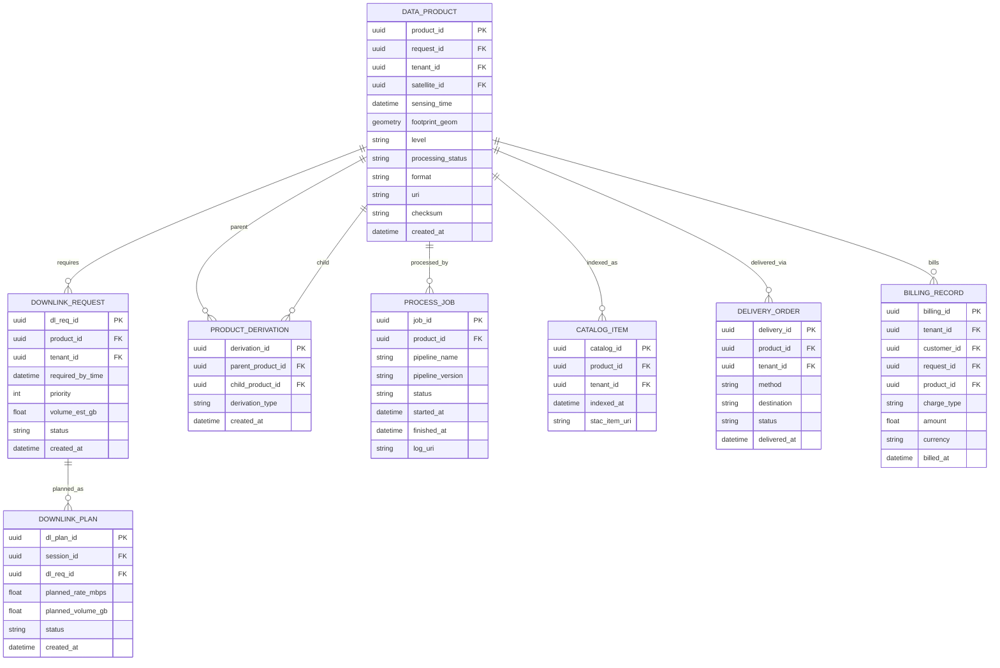

# 6. 데이터 상품 다운링크 전달 ERD

## 도메인 개요

데이터 상품/다운링크/전달은 실제 촬영 결과물의 생성, 다운링크 계획, 처리, 카탈로그 등록, 전달, 과금을 담당하는 업무 도메인이다.

## 서브 도메인별 업무

- `상품 원장 관리`: 촬영 결과물의 수준, 포맷, 저장 위치, 무결성을 관리한다.
- `다운링크 요청 및 계획`: 상품을 어떤 세션으로 전송할지 계획한다.
- `처리 파이프라인 운영`: 파생 상품 생성과 처리 작업 이력을 관리한다.
- `카탈로그 운영`: 검색과 메타데이터 노출을 관리한다.
- `전달 관리`: 외부 목적지로의 배송과 전달 상태를 관리한다.
- `과금 관리`: 요청 또는 상품 기준 과금을 집계하고 청구 기록을 남긴다.

## 포함 테이블

- `DOWNLINK_REQUEST`
- `DOWNLINK_PLAN`
- `DATA_PRODUCT`
- `PRODUCT_DERIVATION`
- `PROCESS_JOB`
- `CATALOG_ITEM`
- `DELIVERY_ORDER`
- `BILLING_RECORD`

## 도메인 ERD (Mermaid)

## 외부 연계

- `DATA_PRODUCT`는 촬영 요청 도메인의 `IMAGING_REQUEST`와 위성 도메인의 `SATELLITE`를 참조한다.
- `DOWNLINK_PLAN`은 궤도/지상국 운영 도메인의 `CONTACT_SESSION`에서 수행된다.
- `BILLING_RECORD`는 고객/계정 도메인의 `TENANT`, `CUSTOMER`와 연결된다.

## 테이블 정의서

### DOWNLINK_REQUEST
- 목적: 생성된 데이터 상품을 지상으로 전송해야 한다는 운영 요구를 저장한다.
- 업무 역할: 상품 단위 다운링크 필요 시점과 우선순위를 관리한다.
- 주요 컬럼: `dl_req_id`는 식별자, `product_id`는 대상 상품, `tenant_id`는 요청 테넌트, `required_by_time`은 필요 시점, `priority`는 우선순위, `volume_est_gb`는 예상 용량, `status`는 처리 상태, `created_at`은 생성 시각이다.

### DOWNLINK_PLAN
- 목적: 다운링크 요청을 실제 접촉 세션에 매핑한 실행 계획이다.
- 업무 역할: 어떤 세션에서 어느 정도 전송률과 전송량으로 데이터를 내릴지 운영 계획을 수립한다.
- 주요 컬럼: `dl_plan_id`는 식별자, `session_id`는 실행 세션, `dl_req_id`는 요청 FK, `planned_rate_mbps`는 계획 전송률, `planned_volume_gb`는 계획 전송량, `status`는 상태, `created_at`은 생성 시각이다.

### DATA_PRODUCT
- 목적: 실제 촬영 결과로 생성된 데이터 상품의 원장이다.
- 업무 역할: 상품의 원천 요청, 촬영 위성, 품질 수준, 저장 위치, 처리 상태를 일관되게 관리한다.
- 주요 컬럼: `product_id`는 식별자, `request_id`는 원 요청, `tenant_id`는 소유 테넌트, `satellite_id`는 촬영 위성, `sensing_time`은 촬영 시각, `footprint_geom`은 장면 발자국, `level`은 처리 레벨, `processing_status`는 처리 상태, `format`은 저장 형식, `uri`는 저장 위치, `checksum`은 무결성 값, `created_at`은 생성 시각이다.

### PRODUCT_DERIVATION
- 목적: 원본 상품과 파생 상품 간 관계를 저장한다.
- 업무 역할: 정사보정, 재포맷, 분석 산출물 등 파생 상품의 계보를 추적한다.
- 주요 컬럼: `derivation_id`는 식별자, `parent_product_id`와 `child_product_id`는 상위/하위 상품, `derivation_type`은 파생 유형, `created_at`은 생성 시각이다.

### PROCESS_JOB
- 목적: 데이터 상품에 수행된 처리 작업 이력이다.
- 업무 역할: 어떤 파이프라인이 어떤 버전으로 실행되었고 정상 종료했는지 추적한다.
- 주요 컬럼: `job_id`는 식별자, `product_id`는 대상 상품, `pipeline_name`과 `pipeline_version`은 처리 파이프라인 정보, `status`는 실행 상태, `started_at`, `finished_at`은 처리 시각, `log_uri`는 로그 위치다.

### CATALOG_ITEM
- 목적: 상품을 검색 가능하게 노출하기 위한 카탈로그 메타데이터다.
- 업무 역할: STAC 또는 내부 카탈로그와 연결되는 색인 정보를 유지한다.
- 주요 컬럼: `catalog_id`는 식별자, `product_id`는 대상 상품, `tenant_id`는 소유 테넌트, `indexed_at`은 색인 시각, `stac_item_uri`는 STAC 메타데이터 위치다.

### DELIVERY_ORDER
- 목적: 상품을 외부 시스템이나 사용자에게 전달하는 주문 단위다.
- 업무 역할: 다운로드 링크, 스토리지 버킷, API 푸시 등 전달 방식과 상태를 관리한다.
- 주요 컬럼: `delivery_id`는 식별자, `product_id`는 대상 상품, `tenant_id`는 소유 테넌트, `method`는 전달 방식, `destination`은 전달 목적지, `status`는 처리 상태, `delivered_at`은 전달 완료 시각이다.

### BILLING_RECORD
- 목적: 요청 또는 상품 단위 과금 내역을 저장한다.
- 업무 역할: 고객 청구, 비용 정산, 매출 분석에 필요한 기준 데이터를 제공한다.
- 주요 컬럼: `billing_id`는 식별자, `tenant_id`와 `customer_id`는 과금 주체, `request_id`와 `product_id`는 과금 대상 문맥, `charge_type`은 과금 유형, `amount`는 금액, `currency`는 통화, `billed_at`은 청구 시각이다.

## 구현 권장사항

### DOWNLINK_REQUEST
- PK/FK: PK는 `dl_req_id`, FK는 `product_id -> DATA_PRODUCT.product_id`, `tenant_id -> TENANT.tenant_id`.
- NULL/필수: `product_id`, `tenant_id`, `required_by_time`, `priority`, `volume_est_gb`, `status`, `created_at`은 `NOT NULL` 권장.
- 권장 인덱스: `(tenant_id, status, required_by_time)`, `(product_id)` 인덱스 권장.
- 예시 enum/status: `status`는 `requested`, `planned`, `in_progress`, `completed`, `failed`.

### DOWNLINK_PLAN
- PK/FK: PK는 `dl_plan_id`, FK는 `session_id -> CONTACT_SESSION.session_id`, `dl_req_id -> DOWNLINK_REQUEST.dl_req_id`.
- NULL/필수: `session_id`, `dl_req_id`, `planned_rate_mbps`, `planned_volume_gb`, `status`, `created_at`은 `NOT NULL`.
- 권장 인덱스: `(session_id)`, `(dl_req_id)` 유니크 검토, `(status, created_at DESC)` 인덱스 권장.
- 예시 enum/status: `status`는 `planned`, `reserved`, `executing`, `completed`, `cancelled`.

### DATA_PRODUCT
- PK/FK: PK는 `product_id`, FK는 `request_id -> IMAGING_REQUEST.request_id`, `tenant_id -> TENANT.tenant_id`, `satellite_id -> SATELLITE.satellite_id`.
- NULL/필수: `request_id`, `tenant_id`, `satellite_id`, `sensing_time`, `level`, `processing_status`, `format`, `uri`, `created_at`은 `NOT NULL`, `footprint_geom`, `checksum`은 nullable 가능.
- 권장 인덱스: `(tenant_id, sensing_time DESC)`, `(request_id)`, `(satellite_id, sensing_time DESC)`, `uri` 유니크 검토. `footprint_geom`에는 공간 인덱스 권장.
- 예시 enum/status: `level`은 `L0`, `L1`, `L2`, `L3`. `processing_status`는 `raw`, `processing`, `ready`, `failed`, `archived`.

### PRODUCT_DERIVATION
- PK/FK: PK는 `derivation_id`, FK는 `parent_product_id -> DATA_PRODUCT.product_id`, `child_product_id -> DATA_PRODUCT.product_id`.
- NULL/필수: 두 FK와 `derivation_type`, `created_at`은 `NOT NULL` 권장.
- 권장 인덱스: `(parent_product_id, child_product_id)` 유니크, `(child_product_id)` 인덱스 권장.
- 예시 enum/status: `derivation_type`은 `orthorectified`, `cropped`, `compressed`, `analytics`.

### PROCESS_JOB
- PK/FK: PK는 `job_id`, FK는 `product_id -> DATA_PRODUCT.product_id`.
- NULL/필수: `product_id`, `pipeline_name`, `pipeline_version`, `status`, `started_at`은 `NOT NULL`, `finished_at`, `log_uri`는 nullable 가능.
- 권장 인덱스: `(product_id, started_at DESC)`, `(status, started_at DESC)` 인덱스 권장.
- 예시 enum/status: `status`는 `queued`, `running`, `completed`, `failed`, `retrying`.

### CATALOG_ITEM
- PK/FK: PK는 `catalog_id`, FK는 `product_id -> DATA_PRODUCT.product_id`, `tenant_id -> TENANT.tenant_id`.
- NULL/필수: `product_id`, `tenant_id`, `indexed_at`, `stac_item_uri`는 `NOT NULL` 권장.
- 권장 인덱스: `(product_id)` 유니크 검토, `(tenant_id, indexed_at DESC)` 인덱스 권장.
- 예시 enum/status: 별도 enum 없음. STAC 컬렉션 컬럼 추가 검토.

### DELIVERY_ORDER
- PK/FK: PK는 `delivery_id`, FK는 `product_id -> DATA_PRODUCT.product_id`, `tenant_id -> TENANT.tenant_id`.
- NULL/필수: `product_id`, `tenant_id`, `method`, `destination`, `status`는 `NOT NULL`, `delivered_at`은 nullable 가능.
- 권장 인덱스: `(tenant_id, status)`, `(product_id)`, `(delivered_at DESC)` 인덱스 권장.
- 예시 enum/status: `method`는 `download_link`, `s3_push`, `api_push`, `media_export`. `status`는 `requested`, `preparing`, `delivered`, `failed`, `expired`.

### BILLING_RECORD
- PK/FK: PK는 `billing_id`, FK는 `tenant_id -> TENANT.tenant_id`, `customer_id -> CUSTOMER.customer_id`, `request_id -> IMAGING_REQUEST.request_id`, `product_id -> DATA_PRODUCT.product_id`.
- NULL/필수: `tenant_id`, `charge_type`, `amount`, `currency`, `billed_at`은 `NOT NULL`, `customer_id`, `request_id`, `product_id`는 청구 모델에 따라 nullable 가능.
- 권장 인덱스: `(tenant_id, billed_at DESC)`, `(customer_id, billed_at DESC)`, `(request_id)`, `(product_id)` 인덱스 권장.
- 예시 enum/status: `charge_type`은 `tasking_fee`, `capture_fee`, `processing_fee`, `delivery_fee`, `subscription_adjustment`.
