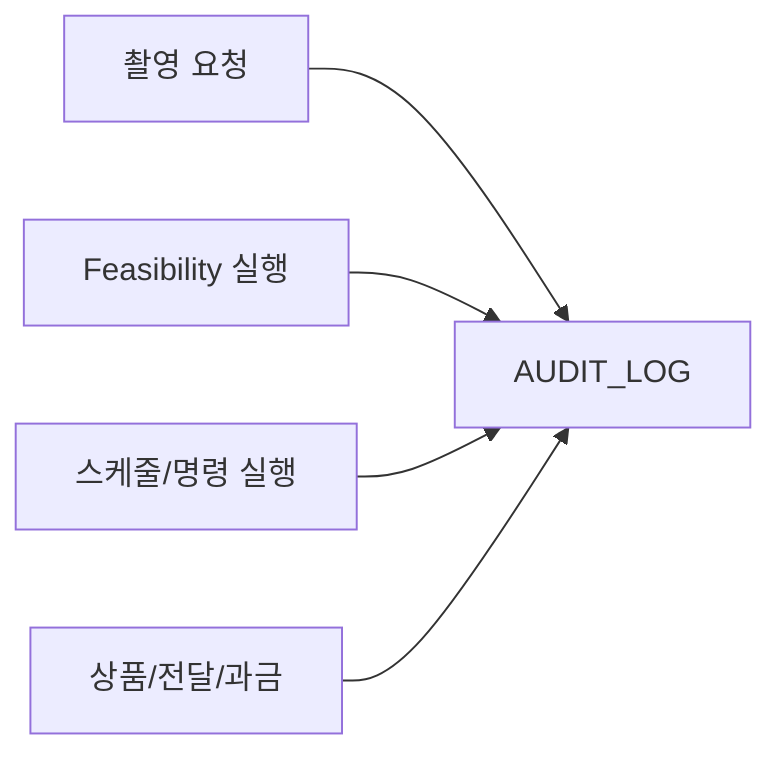

# 7. 감사 추적 ERD

## 도메인 개요

감사/추적은 요청, 평가, 실행, 상품, 과금 등 전 도메인의 주요 행위를 추적하고 규제 및 분쟁 대응 근거를 제공하는 공통 업무 도메인이다.

## 서브 도메인별 업무

- `행위 감사`: 사용자, 시스템, API 호출의 주요 행위를 기록한다.
- `엔터티 추적`: 어떤 엔터티에 대해 어떤 액션이 일어났는지 기록한다.
- `상관관계 추적`: 하나의 `correlation_id`로 업무 흐름 전체를 연결한다.
- `감사 증빙`: 규제 대응, 사고 분석, 분쟁 대응을 위한 감사 근거를 제공한다.

## 포함 테이블

- `AUDIT_LOG`

## 도메인 차트 (Mermaid)

## 테이블 정의서

### AUDIT_LOG
- 목적: 전 도메인 공통 감사 로그다. 평가, 스케줄링, 명령, 전달, 과금 등 주요 이벤트를 추적한다.
- 업무 역할: 사용자, 시스템, API 호출이 어떤 엔터티에 어떤 행동을 했는지 기록하고, 규제 대응과 사고 분석의 근거를 제공한다.
- 주요 컬럼: `audit_id`는 식별자, `tenant_id`는 소속 테넌트, `actor_type`과 `actor_id`는 행위 주체, `action`은 수행 행위, `entity_type`과 `entity_id`는 대상 엔터티, `correlation_id`는 요청-평가-실행-전달 흐름을 잇는 추적 키, `event_time`은 이벤트 시각, `metadata_json`은 상세 메타데이터다.

## 구현 권장사항

### AUDIT_LOG
- PK/FK: PK는 `audit_id`, FK는 `tenant_id -> TENANT.tenant_id`.
- NULL/필수: `tenant_id`, `actor_type`, `action`, `entity_type`, `entity_id`, `event_time`은 `NOT NULL`, `actor_id`, `correlation_id`, `metadata_json`은 nullable 가능.
- 권장 인덱스: `(tenant_id, event_time DESC)`, `(correlation_id)`, `(entity_type, entity_id, event_time DESC)`, `(actor_type, actor_id, event_time DESC)` 인덱스 권장.
- 예시 enum/status: `actor_type`은 `USER`, `SYSTEM`, `API_KEY`, `SCHEDULER`. `action`은 `CREATE`, `UPDATE`, `DELETE`, `RUN_START`, `RUN_FINISH`, `APPROVE`, `SEND_COMMAND`, `DELIVER_PRODUCT`.
