# 통합 ERD

## 통합 기준

- `modleing-ERD-v2.md`를 운영 기준 베이스로 사용
- `modeling-feasibility-v2.md`의 평가 실행, 스냅샷, 체크, 확률, 리뷰, 리포트 계층을 병합
- 중복 엔터티는 더 풍부한 속성을 채택하고 관계는 양쪽 문서의 의미를 유지하도록 정규화

## 공통 핵심 엔터티

- 두 문서 공통: `TENANT`, `IMAGING_REQUEST`, `SATELLITE`, `GROUND_STATION`, `VISIBILITY_PASS`, `IMAGING_CANDIDATE`, `AUDIT_LOG`
- 운영 확장: 사용자/권한, 위성 프로파일, 스케줄링, 명령, 상품/전송/과금
- 평가 확장: `FEASIBILITY_RUN`, 스냅샷, 체크 결과, 확률 추정, 리뷰/리스크, feasibility 리포트

## 통합 ERD (Mermaid)

```mermaid
erDiagram

%% =========================
%% IDENTITY / TENANT DOMAIN
%% =========================
TENANT {
  uuid tenant_id PK
  string tenant_name
  string tenant_type
  string status
  datetime created_at
}

CUSTOMER {
  uuid customer_id PK
  uuid tenant_id FK
  string customer_name
  string billing_type
  string status
  datetime created_at
}

USER_ACCOUNT {
  uuid user_id PK
  uuid tenant_id FK
  string email
  string display_name
  string status
  datetime created_at
}

ROLE {
  uuid role_id PK
  string role_name
  string description
}

USER_ROLE {
  uuid user_role_id PK
  uuid user_id FK
  uuid role_id FK
  datetime granted_at
}

API_KEY {
  uuid api_key_id PK
  uuid tenant_id FK
  string key_hash
  string status
  datetime issued_at
  datetime expires_at
}

%% =========================
%% SATELLITE / ASSET DOMAIN
%% =========================
SATELLITE {
  uuid satellite_id PK
  string name
  int norad_id
  string cospar_id
  string orbit_type
  string mission_type
  string status
  datetime launch_date
  datetime eol_estimated_at
}

SATELLITE_PROFILE_SET {
  uuid profile_set_id PK
  uuid satellite_id FK
  uuid imaging_profile_id FK
  uuid comm_profile_id FK
  uuid constraint_profile_id FK
  datetime effective_from
  datetime effective_to
}

IMAGING_PROFILE {
  uuid imaging_profile_id PK
  string sensor_type
  string mode_code
  float gsd_m
  float swath_km
  float max_off_nadir_deg
  float slew_rate_deg_per_sec
  float min_sun_elev_deg
  boolean night_support
}

COMM_PROFILE {
  uuid comm_profile_id PK
  string uplink_freq
  string downlink_freq
  float data_rate_mbps
  string modulation
  string crypto_mode
}

CONSTRAINT_PROFILE {
  uuid constraint_profile_id PK
  float max_daily_imaging_time_min
  float max_daily_downlink_volume_gb
  float storage_capacity_gb
}

%% =========================
%% ORBIT / GROUND DOMAIN
%% =========================
ORBIT_SOURCE {
  uuid orbit_source_id PK
  string source_type
  string provider
  string status
  datetime last_ingested_at
}

TLE {
  uuid tle_id PK
  uuid satellite_id FK
  uuid orbit_source_id FK
  datetime epoch_time
  string line1
  string line2
  datetime ingested_at
}

GROUND_STATION {
  uuid station_id PK
  string name
  float latitude
  float longitude
  float altitude
  string status
}

VISIBILITY_PASS {
  uuid pass_id PK
  uuid satellite_id FK
  uuid station_id FK
  uuid orbit_source_id FK
  datetime aos_time
  datetime los_time
  float max_elevation_deg
  datetime predicted_at
}

ANTENNA_RESOURCE {
  uuid antenna_id PK
  uuid station_id FK
  string antenna_name
  string band_capability
  string status
}

CONTACT_SESSION {
  uuid session_id PK
  uuid satellite_id FK
  uuid station_id FK
  uuid antenna_id FK
  datetime planned_start
  datetime planned_end
  datetime actual_start
  datetime actual_end
  string session_type
  string status
}

%% =========================
%% TASKING / FEASIBILITY DOMAIN
%% =========================
IMAGING_REQUEST {
  uuid request_id PK
  uuid tenant_id FK
  uuid customer_id FK
  geometry aoi_geom
  datetime time_window_start
  datetime time_window_end
  int priority
  datetime sla_due_time
  string product_level
  float max_cloud_pct
  float max_off_nadir_deg
  string status
  string reason_code
  uuid correlation_id
  datetime created_at
}

AOI_TILE {
  uuid tile_id PK
  uuid request_id FK
  int tile_index
  geometry tile_geom
  float area_km2
  string status
  datetime created_at
}

FEASIBILITY_RUN {
  uuid feas_run_id PK
  uuid request_id FK
  uuid initiated_by_user_id FK
  string run_type
  string status
  datetime horizon_start
  datetime horizon_end
  string policy_version
  datetime started_at
  datetime finished_at
}

ORBIT_SNAPSHOT {
  uuid orbit_snap_id PK
  uuid feas_run_id FK
  string source_type
  datetime source_epoch
  string source_ref
  datetime captured_at
}

WEATHER_SNAPSHOT {
  uuid weather_snap_id PK
  uuid feas_run_id FK
  string provider
  datetime forecast_base_time
  datetime captured_at
}

OP_CONSTRAINT_SNAPSHOT {
  uuid constraint_snap_id PK
  uuid feas_run_id FK
  string constraint_version
  json constraint_json
  datetime captured_at
}

IMAGING_CANDIDATE {
  uuid candidate_id PK
  uuid request_id FK
  uuid feas_run_id FK
  uuid satellite_id FK
  uuid pass_id FK
  uuid tile_id FK
  string mode_code
  datetime predicted_start
  datetime predicted_end
  float score_value
  boolean feasible_flag
  string infeasible_reason
  float nominal_gsd_m
  float predicted_off_nadir_deg
  datetime created_at
}

FEASIBILITY_CRITERION {
  uuid criterion_id PK
  string domain
  string criterion_code
  string description
  string severity
  boolean hard_flag
}

FEASIBILITY_CHECK_RESULT {
  uuid check_id PK
  uuid candidate_id FK
  uuid criterion_id FK
  string result
  float score
  string reason_code
  json evidence_json
  datetime evaluated_at
}

CONFLICT_ANALYSIS {
  uuid conflict_id PK
  uuid feas_run_id FK
  uuid candidate_id FK
  string conflict_type
  string severity
  string resolution_suggestion
  float impact_score
  datetime analyzed_at
}

CONFLICT_ITEM {
  uuid conflict_item_id PK
  uuid conflict_id FK
  string conflicted_entity_type
  uuid conflicted_entity_id
  string details
}

PROBABILITY_MODEL {
  uuid model_id PK
  string model_name
  string model_type
  string version
  string owner
  string input_schema_uri
  string status
}

PROBABILITY_ESTIMATE {
  uuid prob_id PK
  uuid candidate_id FK
  uuid model_id FK
  string target_metric
  float probability
  float confidence
  json feature_json
  datetime estimated_at
}

MODEL_EVIDENCE_LINEAGE {
  uuid lineage_id PK
  uuid prob_id FK
  string input_type
  string input_ref
  string checksum
  datetime captured_at
}

CLOUD_COVER_ESTIMATE {
  uuid cloud_est_id PK
  uuid candidate_id FK
  uuid weather_snap_id FK
  float cloud_pct_mean
  float cloud_pct_p90
  string method
  datetime estimated_at
}

DOWNLINK_WINDOW_CANDIDATE {
  uuid dl_win_id PK
  uuid feas_run_id FK
  uuid satellite_id FK
  uuid station_id FK
  uuid pass_id FK
  datetime window_start
  datetime window_end
  float max_elevation_deg
  datetime created_at
}

DOWNLINK_FEASIBILITY {
  uuid dl_feas_id PK
  uuid candidate_id FK
  uuid dl_win_id FK
  float volume_est_gb
  float rate_est_mbps
  float on_time_probability
  string result
  string reason_code
  json evidence_json
  datetime evaluated_at
}

REVIEW_TASK {
  uuid review_task_id PK
  uuid feas_run_id FK
  uuid assignee_user_id FK
  string review_type
  string status
  datetime assigned_at
  datetime due_at
}

REVIEW_DECISION {
  uuid decision_id PK
  uuid review_task_id FK
  uuid decided_by_user_id FK
  string decision
  string rationale
  string risk_level
  string conditions
  datetime decided_at
}

RISK_REGISTER {
  uuid risk_id PK
  uuid feas_run_id FK
  uuid candidate_id FK
  uuid owner_user_id FK
  string risk_type
  string risk_level
  string description
  string mitigation_plan
  string status
  datetime created_at
  datetime updated_at
}

FEASIBILITY_REPORT {
  uuid report_id PK
  uuid feas_run_id FK
  string overall_feasibility
  float overall_score
  float overall_probability
  string summary
  datetime generated_at
}

REPORT_ATTACHMENT {
  uuid attachment_id PK
  uuid report_id FK
  string file_name
  string uri
  string checksum
  datetime uploaded_at
}

%% =========================
%% SCHEDULING / EXECUTION DOMAIN
%% =========================
SCHEDULE_RUN {
  uuid schedule_run_id PK
  datetime horizon_start
  datetime horizon_end
  datetime freeze_from
  datetime freeze_to
  string objective_policy
  string status
  datetime created_at
}

SCHEDULE_SLOT {
  uuid slot_id PK
  uuid schedule_run_id FK
  uuid satellite_id FK
  uuid candidate_id FK
  uuid superseded_by_slot_id
  datetime start_time
  datetime end_time
  string slot_type
  string state
  int version
  boolean locked
  datetime created_at
}

SCHEDULE_SLOT_HISTORY {
  uuid slot_hist_id PK
  uuid slot_id FK
  uuid actor_user_id FK
  string action
  string prev_state
  string new_state
  datetime changed_at
  string reason_code
}

COMMAND_DICTIONARY {
  uuid cmd_dict_id PK
  string command_type
  string schema_version
  string validation_rules_uri
  string status
}

COMMAND_REQUEST {
  uuid cmd_req_id PK
  uuid satellite_id FK
  uuid tenant_id FK
  uuid user_id FK
  uuid cmd_dict_id FK
  uuid approved_by_user_id FK
  string command_type
  json payload_json
  int priority
  string status
  uuid correlation_id
  datetime requested_at
  datetime approved_at
}

COMMAND_EXECUTION {
  uuid cmd_exec_id PK
  uuid cmd_req_id FK
  uuid session_id FK
  datetime sent_at
  datetime ack_at
  string result
  string error_code
  string raw_log_uri
}

%% =========================
%% PRODUCT / DOWNLINK / DELIVERY DOMAIN
%% =========================
DOWNLINK_REQUEST {
  uuid dl_req_id PK
  uuid product_id FK
  uuid tenant_id FK
  datetime required_by_time
  int priority
  float volume_est_gb
  string status
  datetime created_at
}

DOWNLINK_PLAN {
  uuid dl_plan_id PK
  uuid session_id FK
  uuid dl_req_id FK
  float planned_rate_mbps
  float planned_volume_gb
  string status
  datetime created_at
}

DATA_PRODUCT {
  uuid product_id PK
  uuid request_id FK
  uuid tenant_id FK
  uuid satellite_id FK
  datetime sensing_time
  geometry footprint_geom
  string level
  string processing_status
  string format
  string uri
  string checksum
  datetime created_at
}

PRODUCT_DERIVATION {
  uuid derivation_id PK
  uuid parent_product_id FK
  uuid child_product_id FK
  string derivation_type
  datetime created_at
}

PROCESS_JOB {
  uuid job_id PK
  uuid product_id FK
  string pipeline_name
  string pipeline_version
  string status
  datetime started_at
  datetime finished_at
  string log_uri
}

CATALOG_ITEM {
  uuid catalog_id PK
  uuid product_id FK
  uuid tenant_id FK
  datetime indexed_at
  string stac_item_uri
}

DELIVERY_ORDER {
  uuid delivery_id PK
  uuid product_id FK
  uuid tenant_id FK
  string method
  string destination
  string status
  datetime delivered_at
}

BILLING_RECORD {
  uuid billing_id PK
  uuid tenant_id FK
  uuid customer_id FK
  uuid request_id FK
  uuid product_id FK
  string charge_type
  float amount
  string currency
  datetime billed_at
}

%% =========================
%% AUDIT DOMAIN
%% =========================
AUDIT_LOG {
  uuid audit_id PK
  uuid tenant_id FK
  string actor_type
  uuid actor_id
  string action
  string entity_type
  uuid entity_id
  uuid correlation_id
  datetime event_time
  json metadata_json
}

%% =========================
%% RELATIONSHIPS
%% =========================
TENANT ||--o{ CUSTOMER : has
TENANT ||--o{ USER_ACCOUNT : has
TENANT ||--o{ API_KEY : issues
USER_ACCOUNT ||--o{ USER_ROLE : granted
ROLE ||--o{ USER_ROLE : includes

SATELLITE ||--o{ SATELLITE_PROFILE_SET : has
SATELLITE_PROFILE_SET }o--|| IMAGING_PROFILE : uses
SATELLITE_PROFILE_SET }o--|| COMM_PROFILE : uses
SATELLITE_PROFILE_SET }o--|| CONSTRAINT_PROFILE : uses

ORBIT_SOURCE ||--o{ TLE : provides
SATELLITE ||--o{ TLE : has
ORBIT_SOURCE ||--o{ VISIBILITY_PASS : basis_for
SATELLITE ||--o{ VISIBILITY_PASS : generates
GROUND_STATION ||--o{ VISIBILITY_PASS : observes
GROUND_STATION ||--o{ ANTENNA_RESOURCE : has
GROUND_STATION ||--o{ CONTACT_SESSION : hosts
ANTENNA_RESOURCE ||--o{ CONTACT_SESSION : uses
SATELLITE ||--o{ CONTACT_SESSION : contacts

TENANT ||--o{ IMAGING_REQUEST : owns
CUSTOMER ||--o{ IMAGING_REQUEST : submits
IMAGING_REQUEST ||--o{ AOI_TILE : splits_into
IMAGING_REQUEST ||--o{ FEASIBILITY_RUN : evaluated_by
USER_ACCOUNT ||--o{ FEASIBILITY_RUN : initiates
FEASIBILITY_RUN ||--o{ ORBIT_SNAPSHOT : captures
FEASIBILITY_RUN ||--o{ WEATHER_SNAPSHOT : captures
FEASIBILITY_RUN ||--o{ OP_CONSTRAINT_SNAPSHOT : captures

IMAGING_REQUEST ||--o{ IMAGING_CANDIDATE : scopes
FEASIBILITY_RUN ||--o{ IMAGING_CANDIDATE : generates
AOI_TILE ||--o{ IMAGING_CANDIDATE : targeted_by
SATELLITE ||--o{ IMAGING_CANDIDATE : candidate_for
VISIBILITY_PASS ||--o{ IMAGING_CANDIDATE : based_on

FEASIBILITY_CRITERION ||--o{ FEASIBILITY_CHECK_RESULT : applied_as
IMAGING_CANDIDATE ||--o{ FEASIBILITY_CHECK_RESULT : produces
FEASIBILITY_RUN ||--o{ CONFLICT_ANALYSIS : analyzes
IMAGING_CANDIDATE ||--o{ CONFLICT_ANALYSIS : has
CONFLICT_ANALYSIS ||--o{ CONFLICT_ITEM : includes

PROBABILITY_MODEL ||--o{ PROBABILITY_ESTIMATE : used_by
IMAGING_CANDIDATE ||--o{ PROBABILITY_ESTIMATE : has
PROBABILITY_ESTIMATE ||--o{ MODEL_EVIDENCE_LINEAGE : traces_inputs
WEATHER_SNAPSHOT ||--o{ CLOUD_COVER_ESTIMATE : provides
IMAGING_CANDIDATE ||--o{ CLOUD_COVER_ESTIMATE : has

FEASIBILITY_RUN ||--o{ DOWNLINK_WINDOW_CANDIDATE : proposes
SATELLITE ||--o{ DOWNLINK_WINDOW_CANDIDATE : downlinks_on
GROUND_STATION ||--o{ DOWNLINK_WINDOW_CANDIDATE : receives_at
VISIBILITY_PASS ||--o{ DOWNLINK_WINDOW_CANDIDATE : derived_to
IMAGING_CANDIDATE ||--o{ DOWNLINK_FEASIBILITY : evaluated_by
DOWNLINK_WINDOW_CANDIDATE ||--o{ DOWNLINK_FEASIBILITY : uses

FEASIBILITY_RUN ||--o{ REVIEW_TASK : reviewed_by
USER_ACCOUNT ||--o{ REVIEW_TASK : assigned_to
REVIEW_TASK ||--o{ REVIEW_DECISION : decided_as
USER_ACCOUNT ||--o{ REVIEW_DECISION : decides

FEASIBILITY_RUN ||--o{ RISK_REGISTER : records
IMAGING_CANDIDATE ||--o{ RISK_REGISTER : has
USER_ACCOUNT ||--o{ RISK_REGISTER : owns

FEASIBILITY_RUN ||--o{ FEASIBILITY_REPORT : summarized_as
FEASIBILITY_REPORT ||--o{ REPORT_ATTACHMENT : attaches

SCHEDULE_RUN ||--o{ SCHEDULE_SLOT : produces
SATELLITE ||--o{ SCHEDULE_SLOT : scheduled_on
IMAGING_CANDIDATE ||--o{ SCHEDULE_SLOT : selected_from
SCHEDULE_SLOT ||--o{ SCHEDULE_SLOT_HISTORY : changes
USER_ACCOUNT ||--o{ SCHEDULE_SLOT_HISTORY : changes_by
SCHEDULE_SLOT ||--o{ SCHEDULE_SLOT : supersedes

COMMAND_DICTIONARY ||--o{ COMMAND_REQUEST : validates
TENANT ||--o{ COMMAND_REQUEST : owns
USER_ACCOUNT ||--o{ COMMAND_REQUEST : requests
USER_ACCOUNT ||--o{ COMMAND_REQUEST : approves
SATELLITE ||--o{ COMMAND_REQUEST : receives
COMMAND_REQUEST ||--o{ COMMAND_EXECUTION : executed_as
CONTACT_SESSION ||--o{ COMMAND_EXECUTION : carries

IMAGING_REQUEST ||--o{ DATA_PRODUCT : results_in
TENANT ||--o{ DATA_PRODUCT : owns
SATELLITE ||--o{ DATA_PRODUCT : captures
DATA_PRODUCT ||--o{ PRODUCT_DERIVATION : parent
DATA_PRODUCT ||--o{ PRODUCT_DERIVATION : child
DATA_PRODUCT ||--o{ PROCESS_JOB : processed_by
DATA_PRODUCT ||--o{ CATALOG_ITEM : indexed_as
DATA_PRODUCT ||--o{ DELIVERY_ORDER : delivered_via

DATA_PRODUCT ||--o{ DOWNLINK_REQUEST : requires
DOWNLINK_REQUEST ||--o{ DOWNLINK_PLAN : planned_as
CONTACT_SESSION ||--o{ DOWNLINK_PLAN : executes_in

TENANT ||--o{ BILLING_RECORD : billed
CUSTOMER ||--o{ BILLING_RECORD : billed_for
IMAGING_REQUEST ||--o{ BILLING_RECORD : charges
DATA_PRODUCT ||--o{ BILLING_RECORD : bills

TENANT ||--o{ AUDIT_LOG : logs
```

## 해석 메모

- `IMAGING_CANDIDATE`는 운영 문서의 요청 중심 모델과 feasibility 문서의 실행 중심 모델을 모두 수용하기 위해 `request_id`와 `feas_run_id`를 함께 유지
- `DOWNLINK_WINDOW_CANDIDATE`와 `DOWNLINK_FEASIBILITY`는 사전 평가용, `DOWNLINK_REQUEST`와 `DOWNLINK_PLAN`은 실제 실행 계획용으로 분리
- `FEASIBILITY_REPORT`는 평가 결과의 공식 산출물, `DATA_PRODUCT`는 실제 촬영 및 처리 결과물로 역할이 다름

## 테이블 정의서

### 1. Identity / Tenant Domain

#### TENANT

- 목적: 시스템의 최상위 멀티테넌트 조직 단위다. 데이터 격리, 정책 적용, 과금 집계의 기준이 된다.
- 주요 컬럼: `tenant_id`는 테넌트 식별자, `tenant_name`은 표시명, `tenant_type`은 commercial/defense/internal 등 운영 구분, `status`는 사용 상태, `created_at`은 생성 시각이다.

#### CUSTOMER

- 목적: 테넌트 산하의 실제 고객 또는 계약 계정 단위다. 요청 주체와 과금 대상을 분리할 때 사용한다.
- 주요 컬럼: `customer_id`는 고객 식별자, `tenant_id`는 소속 테넌트, `customer_name`은 고객명, `billing_type`은 과금 방식, `status`는 계정 상태, `created_at`은 생성 시각이다.

#### USER_ACCOUNT

- 목적: 시스템 사용자 계정이다. 평가 실행, 리뷰, 승인, 스케줄 변경, 명령 요청의 행위 주체로 사용한다.
- 주요 컬럼: `user_id`는 사용자 식별자, `tenant_id`는 소속 테넌트, `email`은 로그인 식별자, `display_name`은 표시명, `status`는 계정 상태, `created_at`은 생성 시각이다.

#### ROLE

- 목적: 권한 묶음을 표현하는 롤 마스터다.
- 주요 컬럼: `role_id`는 롤 식별자, `role_name`은 롤 이름, `description`은 권한 설명이다.

#### USER_ROLE

- 목적: 사용자와 롤의 다대다 매핑 테이블이다.
- 주요 컬럼: `user_role_id`는 매핑 식별자, `user_id`는 사용자 FK, `role_id`는 롤 FK, `granted_at`은 부여 시각이다.

#### API_KEY

- 목적: 외부 시스템 연동용 인증 키 관리 테이블이다.
- 주요 컬럼: `api_key_id`는 키 식별자, `tenant_id`는 발급 테넌트, `key_hash`는 키 해시, `status`는 활성 상태, `issued_at`과 `expires_at`은 발급 및 만료 시각이다.

### 2. Satellite / Asset Domain

#### SATELLITE

- 목적: 위성 자산의 기준 마스터다. 촬영, 패스 계산, 명령 전송, 상품 생성 전 과정의 기준 엔터티다.
- 주요 컬럼: `satellite_id`는 위성 식별자, `name`은 위성명, `norad_id`와 `cospar_id`는 우주 객체 식별자, `orbit_type`은 궤도 유형, `mission_type`은 임무 유형, `status`는 운용 상태, `launch_date`와 `eol_estimated_at`은 수명 주기 정보다.

#### SATELLITE_PROFILE_SET

- 목적: 특정 시점에 적용되는 위성 운용 프로파일 묶음이다.
- 주요 컬럼: `profile_set_id`는 프로파일 세트 식별자, `satellite_id`는 대상 위성, `imaging_profile_id`, `comm_profile_id`, `constraint_profile_id`는 세부 프로파일 FK, `effective_from`과 `effective_to`는 적용 기간이다.

#### IMAGING_PROFILE

- 목적: 촬영 센서와 촬영 모드의 성능 특성을 정의한다.
- 주요 컬럼: `imaging_profile_id`는 식별자, `sensor_type`은 광학/SAR 등 센서 종류, `mode_code`는 운용 모드, `gsd_m`은 해상도, `swath_km`은 촬영 폭, `max_off_nadir_deg`는 최대 오프나딜, `slew_rate_deg_per_sec`는 기동 속도, `min_sun_elev_deg`는 최소 태양고도, `night_support`는 야간 지원 여부다.

#### COMM_PROFILE

- 목적: 위성 통신 특성과 명령/다운링크 능력을 정의한다.
- 주요 컬럼: `comm_profile_id`는 식별자, `uplink_freq`와 `downlink_freq`는 주파수, `data_rate_mbps`는 전송률, `modulation`은 변조 방식, `crypto_mode`는 암호화 운용 방식이다.

#### CONSTRAINT_PROFILE

- 목적: 위성의 일일 운용 한계와 저장 용량 등 자원 제약을 정의한다.
- 주요 컬럼: `constraint_profile_id`는 식별자, `max_daily_imaging_time_min`은 일일 최대 촬영 시간, `max_daily_downlink_volume_gb`는 일일 최대 다운링크량, `storage_capacity_gb`는 저장 용량이다.

### 3. Orbit / Ground Domain

#### ORBIT_SOURCE

- 목적: 궤도 정보의 원천 시스템 또는 공급자 메타데이터를 관리한다.
- 주요 컬럼: `orbit_source_id`는 식별자, `source_type`은 TLE/EPH 등 원천 유형, `provider`는 제공자, `status`는 사용 상태, `last_ingested_at`은 최근 수집 시각이다.

#### TLE

- 목적: 위성 궤도 계산에 사용되는 TLE 이력 저장소다.
- 주요 컬럼: `tle_id`는 식별자, `satellite_id`는 위성 FK, `orbit_source_id`는 원천 FK, `epoch_time`은 기준 epoch, `line1`, `line2`는 TLE 본문, `ingested_at`은 수집 시각이다.

#### GROUND_STATION

- 목적: 지상국 자원과 패스, 세션, 다운링크 수신의 기준 마스터다.
- 주요 컬럼: `station_id`는 지상국 식별자, `name`은 지상국명, `latitude`, `longitude`, `altitude`는 위치 정보, `status`는 운용 상태다.

#### VISIBILITY_PASS

- 목적: 위성-지상국 간 가시 구간 예측 결과다. 후보 생성과 다운링크 가능성 검토의 기반 데이터다.
- 주요 컬럼: `pass_id`는 패스 식별자, `satellite_id`와 `station_id`는 위성/지상국 FK, `orbit_source_id`는 계산 근거, `aos_time`과 `los_time`은 가시 시작/종료, `max_elevation_deg`는 최대 고도, `predicted_at`은 계산 시각이다.

#### ANTENNA_RESOURCE

- 목적: 지상국 내 개별 안테나 자원을 관리한다.
- 주요 컬럼: `antenna_id`는 안테나 식별자, `station_id`는 소속 지상국, `antenna_name`은 자원명, `band_capability`는 지원 밴드, `status`는 사용 상태다.

#### CONTACT_SESSION

- 목적: 위성과 지상국 간 실제 또는 계획된 접촉 세션을 저장한다. 명령 전송과 다운링크 실행 단위가 된다.
- 주요 컬럼: `session_id`는 세션 식별자, `satellite_id`, `station_id`, `antenna_id`는 자원 FK, `planned_start`, `planned_end`는 계획 시각, `actual_start`, `actual_end`는 실제 시각, `session_type`은 세션 목적, `status`는 진행 상태다.

### 4. Tasking / Feasibility Domain

#### IMAGING_REQUEST

- 목적: 촬영 요청의 원장 테이블이다. 사용자 요구조건과 SLA를 정의하며 모든 평가와 실행의 출발점이다.
- 주요 컬럼: `request_id`는 요청 식별자, `tenant_id`와 `customer_id`는 요청 주체, `aoi_geom`은 촬영 영역, `time_window_start`, `time_window_end`는 요청 시간창, `priority`는 우선순위, `sla_due_time`은 납기, `product_level`은 산출물 레벨, `max_cloud_pct`와 `max_off_nadir_deg`는 품질 제약, `status`와 `reason_code`는 처리 상태, `correlation_id`는 추적 키, `created_at`은 생성 시각이다.

#### AOI_TILE

- 목적: 대면적 AOI를 평가와 스케줄링이 가능한 크기로 분할한 단위다.
- 주요 컬럼: `tile_id`는 타일 식별자, `request_id`는 원본 요청, `tile_index`는 순번, `tile_geom`은 타일 영역, `area_km2`는 면적, `status`는 분할 상태, `created_at`은 생성 시각이다.

#### FEASIBILITY_RUN

- 목적: 특정 촬영 요청에 대한 가능성 평가 실행 단위다. 재현성과 감사 추적의 루트 엔터티다.
- 주요 컬럼: `feas_run_id`는 실행 식별자, `request_id`는 대상 요청, `initiated_by_user_id`는 실행 사용자, `run_type`은 실행 유형, `status`는 상태, `horizon_start`, `horizon_end`는 평가 범위, `policy_version`은 적용 정책 버전, `started_at`, `finished_at`은 실행 시각이다.

#### ORBIT_SNAPSHOT

- 목적: 평가 시점에 사용된 궤도 입력의 스냅샷을 보관한다.
- 주요 컬럼: `orbit_snap_id`는 식별자, `feas_run_id`는 평가 실행 FK, `source_type`은 데이터 유형, `source_epoch`는 기준 시각, `source_ref`는 원본 참조, `captured_at`은 캡처 시각이다.

#### WEATHER_SNAPSHOT

- 목적: 평가 시점의 기상 예보 입력을 고정 저장한다.
- 주요 컬럼: `weather_snap_id`는 식별자, `feas_run_id`는 평가 실행 FK, `provider`는 예보 제공자, `forecast_base_time`은 기준 시각, `captured_at`은 캡처 시각이다.

#### OP_CONSTRAINT_SNAPSHOT

- 목적: 평가 시점의 운영 제약 조건을 JSON 형태로 보관한다.
- 주요 컬럼: `constraint_snap_id`는 식별자, `feas_run_id`는 평가 실행 FK, `constraint_version`은 제약 버전, `constraint_json`은 상세 제약, `captured_at`은 캡처 시각이다.

#### IMAGING_CANDIDATE

- 목적: 특정 요청 또는 평가 실행에서 도출된 촬영 후보안이다. 평가와 스케줄링을 연결하는 핵심 엔터티다.
- 주요 컬럼: `candidate_id`는 후보 식별자, `request_id`는 원 요청, `feas_run_id`는 평가 실행, `satellite_id`와 `pass_id`는 위성/패스 연결, `tile_id`는 대상 타일, `mode_code`는 촬영 모드, `predicted_start`, `predicted_end`는 예측 시각, `score_value`는 종합 점수, `feasible_flag`는 가능 여부, `infeasible_reason`은 불가 사유, `nominal_gsd_m`과 `predicted_off_nadir_deg`는 품질 추정치, `created_at`은 생성 시각이다.

#### FEASIBILITY_CRITERION

- 목적: feasibility 평가에서 사용하는 기준 정의 마스터다.
- 주요 컬럼: `criterion_id`는 기준 식별자, `domain`은 평가 영역, `criterion_code`는 기준 코드, `description`은 설명, `severity`는 중요도, `hard_flag`는 필수 조건 여부다.

#### FEASIBILITY_CHECK_RESULT

- 목적: 후보별 기준 체크 결과를 저장한다.
- 주요 컬럼: `check_id`는 결과 식별자, `candidate_id`는 대상 후보, `criterion_id`는 적용 기준, `result`는 PASS/FAIL/WARN 등 결과, `score`는 점수, `reason_code`는 사유 코드, `evidence_json`은 근거 데이터, `evaluated_at`은 평가 시각이다.

#### CONFLICT_ANALYSIS

- 목적: 후보가 기존 스케줄, 우선순위, 정책과 충돌하는지 분석한 결과다.
- 주요 컬럼: `conflict_id`는 식별자, `feas_run_id`와 `candidate_id`는 분석 대상, `conflict_type`은 충돌 유형, `severity`는 심각도, `resolution_suggestion`은 해소 제안, `impact_score`는 영향 점수, `analyzed_at`은 분석 시각이다.

#### CONFLICT_ITEM

- 목적: 충돌 분석에 포함된 개별 충돌 항목의 상세 내역이다.
- 주요 컬럼: `conflict_item_id`는 식별자, `conflict_id`는 상위 분석, `conflicted_entity_type`은 충돌 대상 종류, `conflicted_entity_id`는 대상 식별자, `details`는 세부 내용이다.

#### PROBABILITY_MODEL

- 목적: 성공 확률, 품질 확률, 납기 충족 확률 계산에 쓰이는 모델 메타데이터다.
- 주요 컬럼: `model_id`는 모델 식별자, `model_name`은 모델명, `model_type`은 분류/회귀 등 유형, `version`은 버전, `owner`는 관리 주체, `input_schema_uri`는 입력 스키마 참조, `status`는 운영 상태다.

#### PROBABILITY_ESTIMATE

- 목적: 후보별 특정 목표 지표에 대한 확률 추정 결과다.
- 주요 컬럼: `prob_id`는 추정 식별자, `candidate_id`는 대상 후보, `model_id`는 사용 모델, `target_metric`은 SUCCESS/QUALITY/SLA_ON_TIME 등 목표 지표, `probability`는 확률값, `confidence`는 신뢰도, `feature_json`은 입력 피처 스냅샷, `estimated_at`은 계산 시각이다.

#### MODEL_EVIDENCE_LINEAGE

- 목적: 확률 추정 결과가 어떤 입력 데이터에 의해 생성되었는지 추적한다.
- 주요 컬럼: `lineage_id`는 식별자, `prob_id`는 확률 결과 FK, `input_type`은 입력 데이터 유형, `input_ref`는 원본 참조, `checksum`은 무결성 값, `captured_at`은 기록 시각이다.

#### CLOUD_COVER_ESTIMATE

- 목적: 후보 구간과 영역에 대한 구름량 추정 결과다.
- 주요 컬럼: `cloud_est_id`는 식별자, `candidate_id`는 대상 후보, `weather_snap_id`는 사용 예보, `cloud_pct_mean`은 평균 구름량, `cloud_pct_p90`은 보수적 추정치, `method`는 추정 방법, `estimated_at`은 계산 시각이다.

#### DOWNLINK_WINDOW_CANDIDATE

- 목적: feasibility 단계에서 도출한 잠재적 다운링크 가능 창이다.
- 주요 컬럼: `dl_win_id`는 식별자, `feas_run_id`는 평가 실행, `satellite_id`, `station_id`, `pass_id`는 관련 자원, `window_start`, `window_end`는 가능 창, `max_elevation_deg`는 예상 최대 고도, `created_at`은 생성 시각이다.

#### DOWNLINK_FEASIBILITY

- 목적: 특정 촬영 후보가 납기 내에 데이터를 내릴 수 있는지 평가한 결과다.
- 주요 컬럼: `dl_feas_id`는 식별자, `candidate_id`는 대상 후보, `dl_win_id`는 사용 다운링크 창, `volume_est_gb`는 예상 용량, `rate_est_mbps`는 예상 전송률, `on_time_probability`는 정시 전송 확률, `result`는 판정, `reason_code`는 사유 코드, `evidence_json`은 근거 데이터, `evaluated_at`은 평가 시각이다.

#### REVIEW_TASK

- 목적: 자동 평가 이후 사람이 검토해야 하는 업무 단위다.
- 주요 컬럼: `review_task_id`는 식별자, `feas_run_id`는 상위 평가 실행, `assignee_user_id`는 담당자, `review_type`은 검토 유형, `status`는 진행 상태, `assigned_at`과 `due_at`은 할당 및 마감 시각이다.

#### REVIEW_DECISION

- 목적: 리뷰 태스크에 대한 최종 승인, 반려, 조건부 승인 결과다.
- 주요 컬럼: `decision_id`는 식별자, `review_task_id`는 대상 태스크, `decided_by_user_id`는 결정자, `decision`은 판정, `rationale`은 결정 근거, `risk_level`은 리스크 수준, `conditions`는 부가 조건, `decided_at`은 결정 시각이다.

#### RISK_REGISTER

- 목적: 후보 또는 평가 실행에 대한 리스크 항목과 완화 계획을 관리한다.
- 주요 컬럼: `risk_id`는 식별자, `feas_run_id`와 `candidate_id`는 리스크 문맥, `owner_user_id`는 담당자, `risk_type`은 리스크 분류, `risk_level`은 수준, `description`은 설명, `mitigation_plan`은 완화 계획, `status`는 처리 상태, `created_at`, `updated_at`은 기록 시각이다.

#### FEASIBILITY_REPORT

- 목적: 평가 실행 단위의 공식 종합 결과 보고서다.
- 주요 컬럼: `report_id`는 식별자, `feas_run_id`는 대상 실행, `overall_feasibility`는 종합 판정, `overall_score`는 종합 점수, `overall_probability`는 종합 확률, `summary`는 요약, `generated_at`은 생성 시각이다.

#### REPORT_ATTACHMENT

- 목적: feasibility 보고서에 연결되는 증빙 파일 관리 테이블이다.
- 주요 컬럼: `attachment_id`는 식별자, `report_id`는 상위 보고서, `file_name`은 파일명, `uri`는 저장 위치, `checksum`은 무결성 값, `uploaded_at`은 업로드 시각이다.

### 5. Scheduling / Execution Domain

#### SCHEDULE_RUN

- 목적: 일정 생성 또는 재계산 실행 단위다.
- 주요 컬럼: `schedule_run_id`는 실행 식별자, `horizon_start`, `horizon_end`는 스케줄링 범위, `freeze_from`, `freeze_to`는 고정 구간, `objective_policy`는 최적화 목표, `status`는 실행 상태, `created_at`은 생성 시각이다.

#### SCHEDULE_SLOT

- 목적: 위성 일정표에 배치된 개별 슬롯이다. 촬영, 다운링크, 유휴 등 운영 단위를 표현한다.
- 주요 컬럼: `slot_id`는 슬롯 식별자, `schedule_run_id`는 생성 배치 실행, `satellite_id`는 대상 위성, `candidate_id`는 원본 후보, `superseded_by_slot_id`는 대체 슬롯, `start_time`, `end_time`은 시간 구간, `slot_type`은 슬롯 유형, `state`는 상태, `version`은 버전, `locked`는 고정 여부, `created_at`은 생성 시각이다.

#### SCHEDULE_SLOT_HISTORY

- 목적: 슬롯 상태 변경 이력을 감사 가능하게 보관한다.
- 주요 컬럼: `slot_hist_id`는 이력 식별자, `slot_id`는 대상 슬롯, `actor_user_id`는 변경 사용자, `action`은 수행 행위, `prev_state`, `new_state`는 상태 전이, `changed_at`은 변경 시각, `reason_code`는 변경 사유다.

#### COMMAND_DICTIONARY

- 목적: 위성 명령의 허용 스키마와 검증 규칙을 정의하는 사전 테이블이다.
- 주요 컬럼: `cmd_dict_id`는 식별자, `command_type`은 명령 유형, `schema_version`은 명령 스키마 버전, `validation_rules_uri`는 검증 규칙 참조, `status`는 사용 상태다.

#### COMMAND_REQUEST

- 목적: 사용자가 위성 또는 세션에 대해 요청한 명령의 승인 전 단계를 관리한다.
- 주요 컬럼: `cmd_req_id`는 식별자, `satellite_id`, `tenant_id`, `user_id`, `cmd_dict_id`는 관련 자원, `approved_by_user_id`는 승인자, `command_type`은 명령 종류, `payload_json`은 명령 본문, `priority`는 우선순위, `status`는 상태, `correlation_id`는 추적 키, `requested_at`, `approved_at`은 요청 및 승인 시각이다.

#### COMMAND_EXECUTION

- 목적: 명령이 실제 세션에서 전송되고 응답을 받은 실행 결과다.
- 주요 컬럼: `cmd_exec_id`는 식별자, `cmd_req_id`는 원 요청, `session_id`는 수행 세션, `sent_at`과 `ack_at`은 전송/응답 시각, `result`는 실행 결과, `error_code`는 오류 코드, `raw_log_uri`는 원시 로그 위치다.

### 6. Product / Downlink / Delivery Domain

#### DOWNLINK_REQUEST

- 목적: 생성된 데이터 상품을 지상으로 전송해야 한다는 운영 요구를 표현한다.
- 주요 컬럼: `dl_req_id`는 식별자, `product_id`는 대상 상품, `tenant_id`는 요청 테넌트, `required_by_time`은 필요 시점, `priority`는 우선순위, `volume_est_gb`는 예상 용량, `status`는 처리 상태, `created_at`은 생성 시각이다.

#### DOWNLINK_PLAN

- 목적: 다운링크 요청을 실제 접촉 세션에 매핑한 실행 계획이다.
- 주요 컬럼: `dl_plan_id`는 식별자, `session_id`는 실행 세션, `dl_req_id`는 요청 FK, `planned_rate_mbps`는 계획 전송률, `planned_volume_gb`는 계획 전송량, `status`는 상태, `created_at`은 생성 시각이다.

#### DATA_PRODUCT

- 목적: 실제 촬영과 처리 결과로 생성된 데이터 상품의 원장이다.
- 주요 컬럼: `product_id`는 식별자, `request_id`는 원 요청, `tenant_id`는 소유 테넌트, `satellite_id`는 촬영 위성, `sensing_time`은 촬영 시각, `footprint_geom`은 장면 발자국, `level`은 처리 레벨, `processing_status`는 처리 상태, `format`은 저장 형식, `uri`는 저장 위치, `checksum`은 무결성 값, `created_at`은 생성 시각이다.

#### PRODUCT_DERIVATION

- 목적: 원본 상품과 파생 상품 간 계보를 관리한다.
- 주요 컬럼: `derivation_id`는 식별자, `parent_product_id`와 `child_product_id`는 상위/하위 상품, `derivation_type`은 파생 유형, `created_at`은 생성 시각이다.

#### PROCESS_JOB

- 목적: 데이터 상품에 수행된 처리 파이프라인 실행 이력이다.
- 주요 컬럼: `job_id`는 식별자, `product_id`는 대상 상품, `pipeline_name`과 `pipeline_version`은 처리 파이프라인 정보, `status`는 실행 상태, `started_at`, `finished_at`은 처리 시각, `log_uri`는 로그 위치다.

#### CATALOG_ITEM

- 목적: 데이터 상품을 검색 카탈로그나 STAC에 노출하기 위한 메타데이터다.
- 주요 컬럼: `catalog_id`는 식별자, `product_id`는 대상 상품, `tenant_id`는 소유 테넌트, `indexed_at`은 색인 시각, `stac_item_uri`는 STAC 메타데이터 위치다.

#### DELIVERY_ORDER

- 목적: 상품을 외부 사용자 또는 외부 시스템으로 전달하는 주문 단위다.
- 주요 컬럼: `delivery_id`는 식별자, `product_id`는 대상 상품, `tenant_id`는 소유 테넌트, `method`는 전달 방식, `destination`은 수신 위치, `status`는 처리 상태, `delivered_at`은 전달 완료 시각이다.

#### BILLING_RECORD

- 목적: 요청 또는 생성 상품에 대해 발생한 과금 내역이다.
- 주요 컬럼: `billing_id`는 식별자, `tenant_id`, `customer_id`는 과금 주체, `request_id`와 `product_id`는 과금 기준 대상, `charge_type`은 과금 유형, `amount`는 금액, `currency`는 통화, `billed_at`은 청구 시각이다.

### 7. Audit Domain

#### AUDIT_LOG

- 목적: 전 도메인 공통 감사 로그다. 평가, 스케줄링, 명령, 전달, 과금 등 주요 이벤트를 추적한다.
- 주요 컬럼: `audit_id`는 식별자, `tenant_id`는 소속 테넌트, `actor_type`과 `actor_id`는 행위 주체, `action`은 수행 행위, `entity_type`과 `entity_id`는 대상 엔터티, `correlation_id`는 추적 키, `event_time`은 이벤트 시각, `metadata_json`은 상세 메타데이터다.
