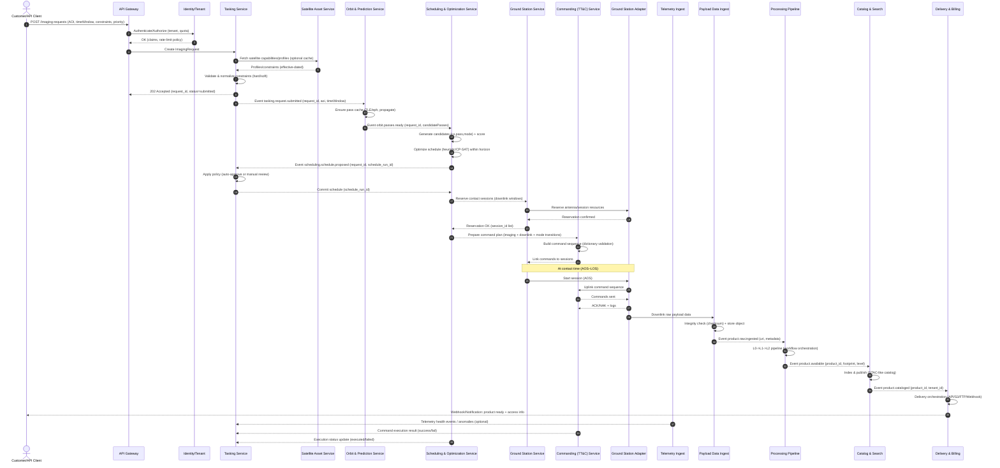
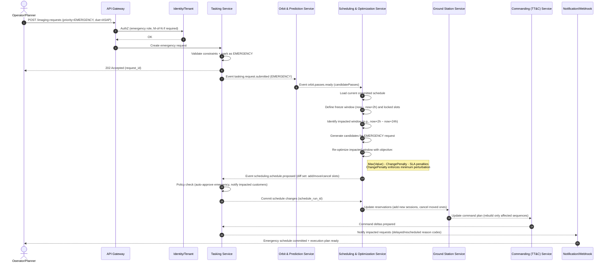
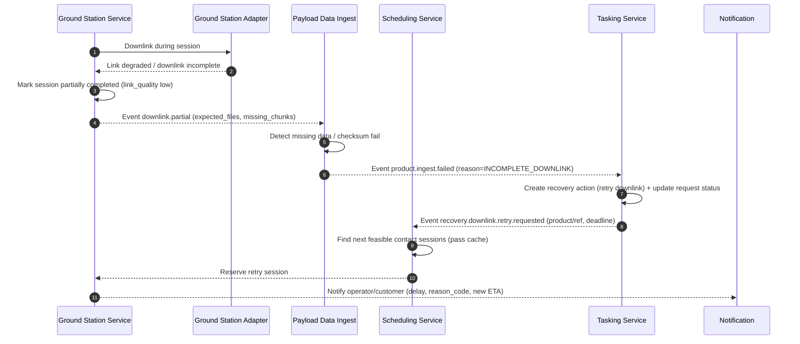

아래는 **기지국 기반 위성제어 시스템 + 촬영계획시스템 연계 + 위성정보 관리 + 부가서비스 확장**을 전제로 한
**인공위성(Satellite) 엔터티의 전체 속성 체계 정의안**입니다.

단순 물리적 스펙이 아니라,

- 식별(Identification)
- 제어(Control)
- 임무(Mission)
- 영상촬영(Tasking)
- 데이터처리(Data)
- 운영(Operation)
- 서비스 확장(Service Enablement)

까지 포함하는 **플랫폼 관점의 통합 속성 모델**입니다.

---

# 1. 최상위 엔터티 구조

위성은 단일 테이블로 끝내면 안 됩니다.
아래와 같은 **도메인 분리형 모델**로 설계하는 것이 적절합니다.

```
Satellite
 ├─ Identification
 ├─ Orbit & Dynamics
 ├─ Physical Bus
 ├─ Payload
 ├─ Communication
 ├─ Power
 ├─ ADCS (자세제어)
 ├─ Thermal
 ├─ Onboard Computer
 ├─ Mission Profile
 ├─ Imaging Capability
 ├─ Ground Interface
 ├─ Operation Status
 ├─ Data Product Capability
 ├─ Security
 ├─ Lifecycle
 └─ Service Enablement
```

---

# 2. 식별(Identification) 속성

### 기본 식별자

- satellite_id (내부 시스템 PK)
- satellite_name
- norad_id
- international_designator (COSPAR ID)
- operator
- owner
- manufacturer
- constellation_name
- satellite_version
- launch_vehicle
- launch_date
- launch_site
- mission_type (EO, SAR, Comm, Weather, Science 등)

### 분류 정보

- orbit_type (LEO/MEO/GEO/HEO/SSO)
- satellite_class (Nano/Micro/Mini/Medium/Large)
- mission_category (Commercial / Defense / Research)

---

# 3. 궤도 및 동역학(Orbit & Dynamics)

촬영계획 및 가시성 계산의 핵심 영역입니다.

- semi_major_axis
- eccentricity
- inclination
- raan
- argument_of_perigee
- mean_anomaly
- mean_motion
- orbital_period
- altitude
- local_time_of_ascending_node (SSO의 경우 중요)
- revisit_time
- ground_track_pattern
- ephemeris_data_source
- tle_last_updated
- maneuver_capability (ΔV 총량)
- propulsion_type
- station_keeping_capability

---

# 4. 위성 본체(Bus) 사양

- dry_mass
- launch_mass
- dimensions (L/W/H)
- structure_material
- design_life_years
- redundancy_level

---

# 5. Payload (탑재체)

촬영계획 시스템과 직결되는 핵심 영역

### 센서 유형

- payload_type (Optical / SAR / IR / Hyperspectral 등)
- sensor_model
- sensor_manufacturer
- spectral_bands
- wavelength_range
- polarization_mode (SAR)
- frequency_band (X, C, L 등)

### 영상 성능

- gsd (Ground Sampling Distance)
- swath_width
- dynamic_range
- snr
- radiometric_resolution
- bit_depth
- pointing_accuracy
- geo_location_accuracy
- mti_support 여부
- stereo_imaging_support 여부
- video_mode_support 여부

---

# 6. 촬영 Capability (Tasking 관점)

촬영계획시스템에서 반드시 필요한 속성

- max_off_nadir_angle
- min_off_nadir_angle
- roll_limit
- pitch_limit
- yaw_limit
- slew_rate
- max_imaging_duration
- max_daily_imaging_time
- storage_capacity
- storage_available
- imaging_mode_list
- priority_support_level
- emergency_tasking_support
- conflict_resolution_policy
- cloud_avoidance_support (광학)
- night_imaging_support
- all_weather_support (SAR)

---

# 7. 통신(Communication)

기지국 연동 핵심 영역

### 링크 정보

- uplink_frequency
- downlink_frequency
- frequency_band
- modulation_type
- data_rate
- encryption_supported
- encryption_algorithm
- authentication_method
- antenna_type
- antenna_gain
- eirp
- link_margin

### 지상국 연동

- supported_ground_station_list
- ground_station_visibility_window
- contact_duration_avg
- max_daily_contact_time
- tt_and_c_protocol
- data_downlink_protocol
- api_endpoint
- message_format
- command_latency

---

# 8. 전력(Power)

- solar_panel_type
- solar_panel_area
- battery_type
- battery_capacity
- power_generation_capacity
- power_consumption_nominal
- peak_power_consumption
- eclipse_operation_support

---

# 9. ADCS (자세제어)

- attitude_control_type
- reaction_wheel_count
- magnetorquer_support
- star_tracker_count
- gyro_type
- pointing_stability
- jitter_level

---

# 10. 열제어(Thermal)

- thermal_control_type
- operating_temperature_range
- radiator_area
- heater_support

---

# 11. 온보드 컴퓨터(OBC)

- processor_type
- cpu_frequency
- onboard_memory
- os_type
- fault_detection_recovery_support
- autonomy_level (0~5)

---

# 12. 운영 상태(Operation Status)

실시간 상태 관리

- satellite_health_status
- subsystem_health_status
- fuel_remaining
- battery_health
- current_mode (Safe / Imaging / Downlink / Idle)
- anomaly_flag
- last_contact_time
- next_contact_time
- predicted_eol

---

# 13. 데이터 처리/상품(Data Product Capability)

부가서비스 개발 관점 핵심

- raw_data_format
- processed_data_levels (L0~L4)
- orthorectification_support
- radiometric_correction_support
- ai_preprocessing_support
- onboard_processing_support
- compression_algorithm
- metadata_standard (OGC, ISO19115 등)
- delivery_format (GeoTIFF, HDF5 등)
- api_data_access_support
- streaming_support

---

# 14. 보안(Security)

- command_encryption_enabled
- key_rotation_policy
- secure_boot_support
- tamper_detection_support
- cyber_hardening_level
- access_control_model

---

# 15. 수명주기(Lifecycle)

- development_phase
- operational_phase
- decommissioning_plan
- disposal_orbit
- reentry_plan
- insurance_status
- compliance_certification

---

# 16. 서비스 확장(Service Enablement)

플랫폼 비즈니스 관점

- multi_tenant_support
- billing_model
- qos_level
- sla_support
- priority_queue_support
- third_party_integration_support
- sdk_available
- open_api_support
- marketplace_support
- analytics_integration_support
- digital_twin_support

---

# 17. 시스템 설계 관점에서의 핵심 엔터티 분리

실제 시스템 설계 시에는 위성을 단일 객체로 두지 않고 다음과 같이 분리하는 것이 바람직합니다:

### 1️⃣ Satellite Master

→ 식별/기본 정보

### 2️⃣ Satellite Capability

→ 촬영/통신/기술적 스펙

### 3️⃣ Satellite Telemetry

→ 실시간 상태

### 4️⃣ Satellite Mission

→ 임무 정의

### 5️⃣ Imaging Task

→ 촬영 요청 단위

### 6️⃣ Data Product

→ 생성되는 영상 상품

### 7️⃣ Ground Contact Session

→ 지상국 접속 세션

---

# 18. 아키텍처 설계 시 고려사항

### ✔ 촬영계획시스템과 연동 시

- visibility 계산 모델
- 기상 데이터 연동
- 충돌 회피 로직
- 임무 우선순위 엔진
- 자동 재계획 기능

### ✔ 기지국 제어 연동 시

- Command Queue
- Acknowledge 처리
- Fail-safe 모드
- Safe Mode 전환 자동화
- 로그 및 감사 추적

---

# 19. 결론

인공위성의 속성 정의는 단순한 스펙 나열이 아니라,

> **“제어 가능성 + 임무 수행 능력 + 데이터 생산 능력 + 플랫폼 확장성”**

을 모두 포함해야 합니다.

특히 귀하의 목적이

- 기지국 제어
- 촬영계획 시스템 연동
- 위성 정보 관리
- 부가서비스 확장

이라면,

위성은 단순 장비가 아니라
**서비스 플랫폼의 핵심 자산(Asset Model)** 로 정의되어야 합니다.

---

필요하다면 다음 단계로:

- ERD 수준의 논리 데이터 모델 설계
- 마이크로서비스 분리 구조 설계
- 위성운영 통합 플랫폼 아키텍처 제안
- 촬영계획 최적화 알고리즘 구조 설계

아래는 요청하신 **4가지(1) ERD 논리 데이터 모델, (2) 마이크로서비스 분리, (3) 통합 플랫폼 아키텍처, (4) 촬영계획 최적화 알고리즘 구조**를 **순서대로**, 그리고 **전문가 수준(실제 구현을 염두에 둔 수준)**으로 정리한 답변입니다.
전제는 “위성 자산(Asset) + 기지국 TT&C 제어 + 촬영계획(Tasking) + 영상상품(Data Product) + 부가서비스(상용 API)”입니다.

---

## 1) ERD 수준 논리 데이터 모델 설계

### 1.1 도메인 경계(핵심 엔터티 그룹)

ERD를 “위성=한 테이블”로 만들면 운영/확장 시 반드시 터집니다. 최소 아래 7개 도메인으로 분리합니다.

1. **Asset(자산)**: Satellite Master/Configuration
2. **Orbit/Prediction(궤도/예측)**: TLE/Ephemeris, Pass Prediction
3. **Capability(성능/제약)**: Imaging/Comms/ADCS/Power 제약, 모드
4. **Operations(운영)**: Telemetry, Mode, Anomaly, Commanding
5. **Tasking(임무/촬영요청)**: Imaging Request, Plan, Schedule, Conflict
6. **Ground Segment(지상국)**: Station, Contact Session, Downlink Plan
7. **Data Products(데이터/상품)**: Raw/Processed Product, Catalog, Delivery, Billing

---

### 1.2 핵심 엔터티와 관계(요약 ERD)

아래 관계가 “촬영계획+제어+상품화”를 완성하는 핵심 골격입니다.

#### (A) Satellite 자산(마스터)

- **SATELLITE**
  - satellite_id(PK), name, norad_id, cospar_id, operator_id(FK), constellation_id(FK)
  - status(operational/safe/eol), launch_date, orbit_type(LEO/SSO…), mission_type(EO/SAR…)

- **SATELLITE_VERSION / CONFIG**
  - config_id(PK), satellite_id(FK)
  - bus_version, payload_version, comms_profile_id(FK), imaging_profile_id(FK)
  - effective_from, effective_to (중요: 성능/파라미터는 시간에 따라 바뀜 → **유효기간 모델** 필수)

> 설계 포인트: “위성 성능/제약 값”은 변경이 잦고 히스토리가 필요합니다. 따라서 `SATELLITE`에 박지 말고 `PROFILE(유효기간)`로 관리합니다.

#### (B) 궤도/예측

- **ORBIT_SOURCE**
  - source_id(PK), type(TLE/EPHEMERIS), provider, update_interval

- **TLE**
  - tle_id(PK), satellite_id(FK), line1, line2, epoch_time, ingested_at

- **EPHEMERIS_STATE_VECTOR**
  - eph_id(PK), satellite_id(FK), time, position(x,y,z), velocity(vx,vy,vz), frame(TEME/ITRF)

- **VISIBILITY_PASS**
  - pass_id(PK), satellite_id(FK), station_id(FK)
  - aos_time, los_time, max_elevation, pass_type(TT&C/DL), predicted_at

> 촬영계획/다운링크는 “가시구간”이 핵심이므로 `VISIBILITY_PASS`를 1급 엔터티로 둡니다(매번 계산하지 않고 캐싱/재사용).

#### (C) Capability / Constraint (촬영/통신/전력/자세)

- **IMAGING_PROFILE**
  - imaging_profile_id(PK), sensor_type(optical/SAR…), gsd, swath, bit_depth, max_off_nadir, slew_rate
  - modes(JSON or child table), min_sun_elevation, cloud_constraint_flag 등

- **COMM_PROFILE**
  - comms_profile_id(PK), uplink_freq, downlink_freq, data_rate, modulation, crypto_mode

- **OPERATION_CONSTRAINT**
  - constraint_id(PK), satellite_id(FK), effective_from/to
  - max_daily_imaging_time, max_task_count, max_downlink_volume, power_budget_model_id(FK)

> 설계 포인트: 촬영계획은 결국 “제약조건의 결합”입니다. 제약을 코드에만 두면 운영이 불가능해집니다. **제약을 데이터로 승격**시키세요.

#### (D) Operations (텔레메트리/명령/모드/이상)

- **TELEMETRY_POINT**
  - tm_id(PK), satellite_id(FK), time, parameter_code, value, unit, quality_flag

- **SATELLITE_MODE_EVENT**
  - mode_event_id(PK), satellite_id(FK), time_from, time_to, mode(safe/imaging/downlink/idle)

- **ANOMALY_TICKET**
  - anomaly_id(PK), satellite_id(FK), opened_at, severity, subsystem, description, status

- **COMMAND_REQUEST**
  - cmd_req_id(PK), satellite_id(FK), requested_by, requested_at, command_type, payload(JSON), priority

- **COMMAND_EXECUTION**
  - cmd_exec_id(PK), cmd_req_id(FK), contact_session_id(FK), sent_at, ack_at, result(success/fail), error_code, raw_log

> 설계 포인트: “요청”과 “실행”은 분리해야 합니다(승인/스케줄/전송/ACK/재시도/감사추적 때문에).

#### (E) Tasking (촬영 요청→계획→스케줄→실행)

- **IMAGING_REQUEST** (고객/내부 요청)
  - request_id(PK), customer_id(FK), aoi(Polygon), time_window_start/end
  - priority, product_level(L1/L2…), max_off_nadir, cloud_limit, latency_requirement

- **IMAGING_PLAN** (요청을 위성별/패스별로 쪼갠 계획)
  - plan_id(PK), request_id(FK), satellite_id(FK), candidate_pass_id(FK)
  - feasibility_status, score, reason_code

- **SCHEDULE_SLOT** (최종 스케줄링 결과: 시간축 예약)
  - slot_id(PK), satellite_id(FK), start_time, end_time, slot_type(imaging/downlink/maneuver)
  - linked_plan_id(FK), state(planned/committed/executed/cancelled)

- **IMAGING_EXECUTION**
  - exec_id(PK), slot_id(FK), actual_start/end, result, quicklook_uri, anomalies

> 설계 포인트: `IMAGING_REQUEST`는 “고객언어”, `IMAGING_PLAN`은 “계획언어”, `SCHEDULE_SLOT`은 “운영언어(시간축 예약)”입니다. 이 3단 분리를 안 하면 기능이 커질수록 복잡도가 폭발합니다.

#### (F) Ground Segment (지상국/컨택/다운링크)

- **GROUND_STATION**
  - station_id(PK), name, lat, lon, altitude, capabilities(TT&C/DL bands…)

- **CONTACT_SESSION**
  - session_id(PK), pass_id(FK), station_id(FK), satellite_id(FK)
  - planned_start/end, actual_start/end, status, link_quality

- **DOWNLINK_REQUEST**
  - dl_req_id(PK), product_id(FK), required_by_time, priority, volume_estimate

- **DOWNLINK_PLAN**
  - dl_plan_id(PK), session_id(FK), dl_req_id(FK), planned_rate, planned_volume

#### (G) Data Products (카탈로그/배송/과금)

- **DATA_PRODUCT**
  - product_id(PK), request_id(FK), satellite_id(FK), sensing_time, level(L0~L4)
  - footprint, cloud_cover_est, processing_status, storage_uri

- **PRODUCT_DERIVATION**
  - parent_product_id(FK), child_product_id(FK) (파생관계)

- **DELIVERY_ORDER**
  - delivery_id(PK), customer_id(FK), product_id(FK), method(API/S3/FTP), status

- **BILLING_RECORD**
  - billing_id(PK), customer_id(FK), request_id/product_id(FK), price, currency, invoiced_at

---

### 1.3 물리 설계로 넘어가기 전 “필수 규칙”

- **시간 유효기간(Effective Dating)**: 성능/제약/프로파일은 거의 반드시 변경됨
- **이벤트 소싱 성격(Operational Audit)**: 명령/실행/ACK/로그는 감사추적이 핵심
- **지리정보 타입**: AOI/Footprint는 공간인덱스(PostGIS 등) 전제
- **표준 메타데이터**: ISO19115/OGC STAC 등과 매핑 가능한 필드 구조 고려

---

## 2) 마이크로서비스 분리 구조 설계

### 2.1 서비스 경계 원칙

- **상태가 강하게 결합**되는 것끼리 묶고,
- **계획/최적화** 같은 계산집약은 별도 서비스로 떼며,
- 외부 고객 트래픽(API)과 내부 운영 트래픽(제어/텔레메트리)을 분리합니다.

### 2.2 권장 마이크로서비스(권장 10~12개)

#### (1) Identity & Tenant Service

- 고객/테넌트/권한/키 관리(API Key, OAuth, RBAC/ABAC)

#### (2) Satellite Asset Service

- 위성 마스터/버전/프로파일(촬영/통신) 관리
- “이 위성이 무엇을 할 수 있나”의 소스 오브 트루스

#### (3) Orbit & Prediction Service

- TLE/ephemeris 수집, 궤도전파(SGP4 등), 패스/가시성/재방문 계산
- 캐시된 `VISIBILITY_PASS` 제공

#### (4) Mission Tasking Service

- 촬영요청 접수, 요구조건(제약) 정규화, 후보 생성

#### (5) Scheduling & Optimization Service

- 후보들을 받아 스케줄 슬롯을 생성(최적화)
- 충돌해소/리플래닝(재계획)

#### (6) Commanding (TT&C) Service

- 명령 생성/검증/큐잉/승인 플로우
- 지상국 세션에 태워 전송하고 ACK/재시도 처리

#### (7) Ground Station Service

- 지상국 자원(안테나) 캘린더/세션/링크상태 관리
- 타 시스템(실제 GS SW) 연동 어댑터 포함

#### (8) Telemetry Ingest Service

- TM 스트리밍 인입(MQTT/Kafka), 품질/정합성 체크, 저장
- 알람 룰 엔진(임계치/추세)

#### (9) Payload Data Ingest Service

- 다운링크 파일 인입, 무결성 검증, 스토리지 적재

#### (10) Processing Pipeline Service

- L0→L1→L2… 처리 파이프라인 오케스트레이션
- 워크플로(Argo/Airflow 류) + 작업이력

#### (11) Catalog & Search Service

- 데이터 카탈로그(STAC 유사), 공간/시간/메타 기반 검색 API

#### (12) Delivery & Billing Service

- 배송/구독/과금/SLA/사용량 집계

---

### 2.3 데이터 소유권(중요)

- 서비스마다 DB를 소유(독립 스키마)하고,
- 교차 조회는 **API/이벤트**로 해결합니다.
- 대표 이벤트 예:
  - `ImagingRequestSubmitted`
  - `PlanFeasibleComputed`
  - `ScheduleCommitted`
  - `ContactSessionCompleted`
  - `ProductAvailable`
  - `DeliveryCompleted`

---

### 2.4 동기 vs 비동기

- 고객 API는 동기(빠른 응답) + 결과는 비동기(웹훅/폴링)
- 스케줄링/처리는 비동기(잡)
- 제어(TT&C)는 “세션 기반 동기”처럼 보이지만 내부는 큐 기반 비동기(재시도/ACK 때문)

---

## 3) 위성운영 통합 플랫폼 아키텍처 제안

### 3.1 레이어드 아키텍처(권장)

1. **External API Layer**
   - API Gateway, Rate Limit, AuthN/Z, Tenant, SLA

2. **Mission & Planning Layer**
   - Tasking, Scheduling, Orbit Prediction

3. **Operations & Ground Layer**
   - Commanding(TT&C), Ground Station Adapter, Contact Session

4. **Data Layer**
   - Ingest, Processing, Catalog, Delivery

5. **Observability & Governance**
   - Logging/Tracing/Metric, Audit, Data Lineage, Policy

---

### 3.2 “연동”의 실제 형태(어댑터 패턴)

기지국/위성은 보통 표준이 제각각입니다. 그래서 **Adapter/Connector 계층**이 별도여야 합니다.

- **Ground Station Adapter**
  - vendor별 프로토콜(SLE, CCSDS, proprietary) 추상화
  - 기능: Session 예약/시작/종료, Uplink, Downlink, RF 상태, 로그 수집

- **Satellite Command Adapter**
  - command dictionary 관리(명령어/파라미터/유효성)
  - pre-check(모드/전력/가시성) + post-check(ACK/telemetry confirmation)

---

### 3.3 이벤트 스트리밍 중심(운영에 필수)

- Kafka(또는 동급)로
  - TM 스트림
  - 계획/스케줄 이벤트
  - 처리 파이프라인 이벤트
  - 고객 사용량 이벤트
    를 단일 이벤트 버스로 흘립니다.

**이점**

- 운영 관제(대시보드)와 서비스 개발(부가서비스)이 결합도를 낮게 유지
- 새 부가서비스는 이벤트를 구독해 만들 수 있음(“위성 기반 플랫폼”의 핵심)

---

### 3.4 저장소 전략(현실적인 조합)

- 관계형(PostgreSQL/PostGIS): 자산/요청/스케줄/카탈로그 인덱스
- 시계열(Timescale/Influx 등): 텔레메트리
- 오브젝트 스토리지(S3 compatible): 원시/처리 데이터
- 검색(OpenSearch/Elastic): 카탈로그 검색 가속
- 캐시(Redis): 패스/가시성/요청 상태 캐시

---

### 3.5 운영/감사/보안(실무 핵심)

- **Command Audit**: 누가/언제/무엇을/왜 보냈는지 + 결과
- **Separation of Duties**: 계획자와 승인자 분리(특히 고우선/긴급)
- **Key Management**: 위성 제어키/링크 암호키 로테이션, HSM/KMS
- **Tenant Isolation**: 데이터(요청/상품) 테넌트 격리 + 리소스 쿼터

---

## 4) 촬영계획 최적화 알고리즘 구조 설계

촬영계획은 전형적으로 **제약최적화(Constraint Optimization)** 문제입니다.
요구사항이 늘수록 “휴리스틱+정수계획+재계획”의 하이브리드가 실무적으로 가장 안정적입니다.

### 4.1 문제 정의(수학적 모델의 골격)

- **입력**
  - 요청 집합 R: AOI, 시간창, 우선순위, 최대 오프나딜, 구름제약, 요구 레벨, 납기
  - 위성 집합 S: 궤도/가시성 패스, 센서모드, 자세 Slew rate, 일일 제한
  - 자원: 지상국 세션, 다운링크 용량, 온보드 스토리지, 전력/열 제약

- **출력**
  - 시간축 스케줄 슬롯: Imaging/Downlink/Maneuver의 순서열

### 4.2 파이프라인(권장 5단계)

#### Step 1) 후보 생성(Candidate Generation)

각 요청 r에 대해:

- Orbit/Prediction으로 가능한 패스 목록 도출
- 센서/모드/오프나딜/태양고도 등 “하드 제약”으로 1차 필터
- 후보 `(r, s, pass, mode)` 생성

산출물: `IMAGING_PLAN 후보군 + score feature`

#### Step 2) 후보 스코어링(Feasibility & Scoring)

후보마다 점수:

- 가치(우선순위, 고객등급, 매출, 전략)
- 품질(예상 GSD, 예상 구름, 태양각, 오프나딜 페널티)
- 비용(자세 변경량, 전력 소모 추정, 다운링크 부담, 스토리지 사용)
- 리스크(짧은 시간창, 지상국 혼잡, 연속 촬영으로 열부하)

> 실무 팁: 스코어는 “학습 가능(feature 기반)”로 설계하면 나중에 자동 튜닝이 쉬워집니다.

#### Step 3) 스케줄링(Optimization Core)

여기서 2가지 접근을 혼합합니다.

- **(A) 빠른 휴리스틱(초기해)**
  - Greedy + Local Search
  - 우선순위 높은 요청부터 넣고 충돌 시 교체/이동
  - 장점: 빠르고 실시간 재계획에 강함

- **(B) 정수계획/CP-SAT(정교한 최적화)**
  - 시간 슬롯 선택 변수 x(r,candidate) ∈ {0,1}
  - 충돌 제약(같은 위성 시간 겹침 금지)
  - Slew time 전이 제약(연속 촬영 간 최소 간격)
  - 다운링크/스토리지/일일 제한
  - 목적함수: Σ 가치 - Σ 비용 - Σ SLA 위반 페널티

권장 운영 방식:

- 평시: (A)로 즉시 일정 생성 → (B)로 배치 최적화(야간/주기)
- 긴급: (A) 기반의 부분 재계획(impacted window만 재계산)

#### Step 4) 검증 및 커밋(Validation & Commit)

- 하드 제약 재검증(모드/전력/열/연속전이)
- 지상국 세션 예약 가능성 확인
- 커밋 시 `SCHEDULE_SLOT` 확정 + 변경 이력 기록

#### Step 5) 실행/피드백/재계획(Closed Loop)

- 실행 결과(성공/실패/품질)를 스코어링 모델에 피드백
- 구름/지상국 장애/위성 safe mode 발생 시:
  - 영향 구간 탐지(impacted slots)
  - 최소 변경 재계획(minimum perturbation) 수행

---

### 4.3 필수 제약 목록(운영에서 실제로 터지는 것들)

- Slew time(자세 변경 시간)
- 연속 촬영으로 인한 열 제한(thermal duty cycle)
- 일일 촬영 총량/촬영 횟수 제한
- 다운링크 창 부족(지상국 혼잡)
- 온보드 스토리지 부족(다운링크 지연)
- 광학의 경우 구름/야간 불가, SAR은 모드 전이 제약
- 긴급 요청 삽입 시 기존 SLA를 얼마나 깨도 되는지 정책

---

### 4.4 데이터 구조(알고리즘 구현을 위한 내부 모델)

스케줄러 서비스 내부에는 보통 아래 구조가 필요합니다.

- Timeline per Satellite: interval tree(충돌 검사)
- Transition Matrix: mode/angle 전이 비용(슬루/전력/열)
- Candidate Graph: 요청→후보→슬롯 네트워크(최적화 입력)
- Constraint Evaluator: 하드/소프트 제약 엔진

---

## 마무리: 실무적으로 “가장 먼저” 결정해야 하는 5가지

(질문 안 하셔도, 설계 품질을 좌우하는 핵심이라 같이 드립니다.)

1. **프로파일/제약의 유효기간 모델**(시간에 따라 변하는 값)
2. 스케줄 확정의 단위: **slot(시간축 예약)** 기반으로 갈지 여부
3. 지상국 자원까지 포함한 **통합 최적화** 범위(촬영만 vs 촬영+다운링크)
4. 긴급 삽입 정책: “최소 변경 재계획”을 기본으로 할지
5. 고객 API 계약: 동기 응답(접수) + 비동기 결과(확정/상품 생성) 모델

---

원하시면, 위 4개 산출물을 더 “설계 문서 형태”로 만들어드릴 수 있습니다.

- (1) ERD: 엔터티별 속성 리스트(필드 타입/PK/FK/인덱스/공간인덱스 포함)
- (2) 마이크로서비스: API 목록(REST/gRPC), 이벤트 토픽 설계, 데이터 소유권 표
- (3) 아키텍처: 컴포넌트 다이어그램(텍스트/mermaid) + 운영 시나리오 시퀀스
- (4) 스케줄러: 목적함수/제약식 템플릿 + 휴리스틱/CP-SAT 혼합 전략 상세

다음으로는 보통 **위성 종류(광학/ SAR / 복수 위성군 여부) + 지상국 운영 형태(자체/외부/혼합)**에 따라 최적 설계가 갈리는데, 일단 지금 답변은 “가장 일반적이고 확장 가능한 베이스라인”으로 구성했습니다.

좋습니다. 앞서 4개 항목을 “개념/구조” 중심으로 설명했으니, 이제는 **실제 설계 산출물 수준(필드, API, 이벤트, 시퀀스, 최적화 수식 템플릿, 운영 시나리오)**로 한 단계 더 내려가서 계속하겠습니다. 순서는 동일하게 **1) ERD 상세 → 2) 마이크로서비스 상세 → 3) 통합 아키텍처 시나리오/보안/운영 → 4) 최적화 알고리즘(수식/휴리스틱/재계획)** 입니다.

---

## 1) ERD 논리 모델 상세(필드/키/인덱스/정규화 규칙)

### 1.1 공통 규칙(데이터 모델링 원칙)

- **모든 운영 엔터티는 시간축을 가진다**
  - `created_at`, `updated_at`, (운영 이벤트는 `event_time`)

- **“변경되는 값”은 Master에 두지 않는다**
  - 센서 성능/제약/통신 파라미터는 `PROFILE + effective_from/to`로 히스토리 관리

- **명령/스케줄/세션은 감사 추적이 필수**
  - `requested_by`, `approved_by`, `correlation_id`, `audit_log_ref`

- **AOI/Footprint는 공간 타입 + 인덱스**
  - PostGIS 기준 `geometry(Polygon, 4326)` + `GIST` 인덱스

- **상태는 Enum + 상태전이 이벤트 테이블 병행**
  - 현재 상태는 컬럼에, 히스토리는 이벤트 테이블에

---

### 1.2 핵심 테이블 상세 스펙(대표 엔터티)

#### (A) SATELLITE (Master)

- **PK**: `satellite_id (UUID)`
- `name`, `norad_id (int, unique)`, `cospar_id (varchar, unique)`
- `operator_id (FK)`, `constellation_id (FK)`
- `orbit_type`, `mission_type`, `status`
- `launch_date`, `eol_estimated_at`
- **Index**
  - `unique(norad_id)`, `unique(cospar_id)`
  - `idx_satellite_status`

#### (B) SATELLITE_PROFILE_SET (현재 적용되는 프로파일 포인터)

- **PK**: `profile_set_id`
- `satellite_id (FK)`
- `imaging_profile_id (FK)`, `comm_profile_id (FK)`, `constraint_profile_id (FK)`
- `effective_from`, `effective_to`
- **Index**
  - `(satellite_id, effective_from desc)` 최신 적용 빠르게

> 프로파일을 위성에 직접 FK로 물리면 “시간 유효기간”이 깨집니다. 포인터 테이블로 묶는 방식이 운영에 강합니다.

#### (C) IMAGING_PROFILE

- **PK**: `imaging_profile_id`
- `sensor_type`, `mode_code`, `spectral_band_set`
- `gsd_m`, `swath_km`, `bit_depth`
- `max_off_nadir_deg`, `slew_rate_deg_per_sec`
- `min_sun_elev_deg`, `night_support_flag`
- `stereo_flag`, `video_flag`
- **Index**
  - `(sensor_type, mode_code)` 조합 조회

#### (D) ORBIT_DATA (TLE/Ephemeris)

- `TLE(tle_id, satellite_id, epoch_time, line1, line2, ingested_at)`
- `EPHEMERIS_STATE_VECTOR(eph_id, satellite_id, time, x,y,z,vx,vy,vz, frame, ingested_at)`
- **Index**
  - `TLE(satellite_id, epoch_time desc)`
  - `EPHEMERIS(satellite_id, time)`

#### (E) VISIBILITY_PASS (위성-지상국 가시구간 캐시)

- **PK**: `pass_id`
- `satellite_id (FK)`, `station_id (FK)`
- `aos_time`, `los_time`, `max_elevation_deg`
- `pass_type (ttc/downlink/both)`
- `predicted_at`, `orbit_source_ref`
- **Index**
  - `(satellite_id, aos_time)`
  - `(station_id, aos_time)`
  - 시간 범위 조회가 많으니 time index 필수

#### (F) IMAGING_REQUEST (고객요청)

- **PK**: `request_id`
- `tenant_id/customer_id`
- `aoi_geom (geometry polygon)`
- `time_window_start/end`
- `priority (1..n)`, `sla_due_time`
- `product_level`, `max_cloud_pct`, `max_off_nadir_deg`
- `status(submitted/validated/planned/scheduled/executed/failed/cancelled)`
- **Index**
  - `GIST(aoi_geom)`
  - `(status, priority, sla_due_time)`
  - `(time_window_start, time_window_end)`

#### (G) IMAGING_CANDIDATE (요청별 후보)

- **PK**: `candidate_id`
- `request_id (FK)`, `satellite_id (FK)`, `pass_id (FK)`
- `mode_code`, `predicted_start/end`
- `score_value`, `feasible_flag`, `infeasible_reason`
- **Index**
  - `(request_id, score_value desc)`
  - `(satellite_id, predicted_start)`

#### (H) SCHEDULE_SLOT (시간축 예약 — 가장 중요)

- **PK**: `slot_id`
- `satellite_id (FK)`
- `start_time`, `end_time`
- `slot_type(imaging/downlink/maneuver/safe)`
- `linked_candidate_id (FK, nullable)`
- `state(planned/committed/executed/cancelled)`
- `version` (낙관적 락), `schedule_run_id` (어떤 최적화 실행 결과인지)
- **Index**
  - `(satellite_id, start_time)` + overlap 체크용(구현은 exclusion constraint 권장)
  - `(state, start_time)`

> PostgreSQL이면 `(satellite_id, tsrange(start,end))` + `EXCLUDE USING gist`로 “겹침 금지”를 DB 차원에서 보장하는 설계가 강력합니다.

#### (I) COMMAND_REQUEST / COMMAND_EXECUTION

- COMMAND_REQUEST: 승인/큐잉용
  - `cmd_req_id`, `satellite_id`, `command_type`, `payload_json`
  - `requested_by`, `approved_by`, `priority`, `status`

- COMMAND_EXECUTION: 세션 기반 실행/ACK
  - `cmd_exec_id`, `cmd_req_id`, `session_id`, `sent_at`, `ack_at`, `result`, `raw_log_uri`

- **Index**
  - `(satellite_id, requested_at desc)`
  - `(status, priority)`

#### (J) DATA_PRODUCT / DELIVERY

- DATA_PRODUCT
  - `product_id`, `request_id`, `satellite_id`, `sensing_time`
  - `footprint_geom`, `cloud_cover_est`, `level`, `format`
  - `processing_status`, `uri`, `checksum`

- DELIVERY_ORDER
  - `delivery_id`, `product_id`, `tenant_id`, `method`, `status`, `delivered_at`

- **Index**
  - `GIST(footprint_geom)`
  - `(tenant_id, sensing_time desc)`

---

### 1.3 ERD에서 자주 놓치는 “현실 필드”

- **correlation_id**: 요청→계획→스케줄→명령→상품까지 추적용
- **reason_code**: infeasible/failed 원인 코드(운영에서 필수)
- **quota/limit snapshot**: 스케줄 확정 당시의 쿼터/제약 스냅샷(사후 분쟁 대응)

---

## 2) 마이크로서비스 상세(API 계약, 이벤트 토픽, 데이터 소유권)

### 2.1 서비스별 “소유 DB”와 책임

- Asset Service DB: `SATELLITE*, PROFILE*`
- Orbit Service DB: `TLE, EPHEMERIS, VISIBILITY_PASS`
- Tasking Service DB: `IMAGING_REQUEST, VALIDATION`
- Scheduling Service DB: `IMAGING_CANDIDATE, SCHEDULE_SLOT, schedule_run`
- Ground Service DB: `GROUND_STATION, CONTACT_SESSION`
- Commanding Service DB: `COMMAND_*`
- Processing/Catalog/Delivery는 별도

**규칙**: 다른 서비스의 DB를 직접 join하지 말고, **API+이벤트로 복제(read model)** 하세요.

---

### 2.2 대표 REST API(현업 수준 스펙)

#### Tasking Service

- `POST /imaging-requests`
  - body: AOI, time_window, priority, constraints, product_level
  - return: `request_id`, `status=submitted`

- `GET /imaging-requests/{id}`
- `POST /imaging-requests/{id}:cancel`

#### Orbit Service

- `GET /satellites/{id}/passes?stationId=&from=&to=`
- `POST /passes:compute` (캐시 갱신 트리거)

#### Scheduling Service

- `POST /schedules:runs`
  - body: horizon(from/to), objective(policy), freeze_window
  - return: `schedule_run_id`

- `GET /schedules:runs/{id}`
- `POST /schedules:runs/{id}:commit` (커밋/배포)
- `GET /satellites/{id}/schedule?from=&to=`

#### Commanding Service

- `POST /commands`
  - body: satellite_id, command_type, payload, priority

- `POST /commands/{id}:approve`
- `GET /commands/{id}`

#### Catalog/Delivery

- `GET /products?bbox=&timeFrom=&timeTo=&cloud<=`
- `POST /deliveries`
- `GET /deliveries/{id}`

---

### 2.3 이벤트 토픽 설계(운영+확장 핵심)

Kafka 토픽 예시:

- `tasking.request.submitted`
- `tasking.request.validated`
- `scheduling.candidate.generated`
- `scheduling.schedule.committed`
- `ground.session.started`
- `ground.session.completed`
- `command.sent`
- `command.acknowledged`
- `product.available`
- `delivery.completed`
- `telemetry.ingested`
- `telemetry.alert.raised`

이벤트 페이로드 공통 필드:

- `event_id`, `event_time`, `correlation_id`
- `tenant_id` (멀티테넌트면 필수)
- `entity_type`, `entity_id`
- `schema_version`

---

### 2.4 SAGA 패턴(촬영요청→상품)

촬영은 전형적인 분산 트랜잭션이므로 SAGA를 추천합니다.

- Request Submitted
- Validated
- Candidate Generated
- Schedule Committed
- Command Prepared/Sent
- Execution Done
- Product Ingested
- Product Processed
- Delivered/Billed

실패 시 보상 트랜잭션:

- 스케줄 슬롯 해제
- 지상국 세션 예약 취소
- 고객 상태 롤백/대체 제안

---

## 3) 통합 플랫폼 아키텍처 “시퀀스”와 운영 시나리오

### 3.1 시나리오 A: 일반 촬영(계획→실행→상품)

1. 고객 `POST /imaging-requests`
2. Tasking: 검증(제약 정규화) 후 이벤트 발행
3. Orbit: horizon 내 패스 계산/캐시
4. Scheduling: 후보 생성+최적화 → `SCHEDULE_SLOT(planned)`
5. 운영 승인(정책에 따라 자동/수동)
6. Commit → `SCHEDULE_SLOT(committed)` 이벤트
7. Ground: 해당 시간대 세션 예약(자원 캘린더)
8. Commanding: 촬영 명령 + 다운링크 계획 명령을 세션에 맞춰 큐잉
9. Contact Session 발생 시 Uplink/Downlink 실행 및 ACK
10. Payload Ingest → Processing → Catalog 등록
11. Delivery 서비스가 고객에게 전달(API/webhook)
12. Billing 집계

---

### 3.2 시나리오 B: 긴급 촬영(기존 스케줄 영향 최소화)

- Scheduling에 **freeze window**(예: 현재~+2시간) 적용
- **impacted window**만 국소 재계획
- 목적함수에 “변경 페널티(minimum perturbation)” 추가
- SLA가 높은 기존 요청을 보존하면서 긴급 삽입

---

### 3.3 보안/권한(특히 TT&C)

- Command는 최소 2단계 권한:
  - `Planner`(요청/계획) vs `Operator`(승인/전송)

- “고위험 명령”은 **M-of-N 승인**(2인 승인 등) 지원
- 명령은 전부 **불변 로그(append-only) + 서명** 저장 권장

---

## 4) 촬영계획 최적화: 수식 템플릿 + 휴리스틱/CP-SAT 하이브리드

### 4.1 결정변수

- 후보 집합 C: 각 후보 c는 (request r, satellite s, start/end, mode, pass)
- **x_c ∈ {0,1}**: 후보 c를 선택하면 1

### 4.2 목적함수(예시)

최대화:

- Σ (value_r \* x_c)
- − Σ (slew*cost(c, prev) * x*c) *(전이는 보통 pairwise라 CP/그래프 모델에서 처리)\*
- − Σ (lateness_penalty(r) )
- − Σ (schedule*change_penalty) *(재계획 시)\_

실무에서는 목적함수를 다음 4항으로 분해해 가중치로 운영 튜닝합니다.

- 고객가치(매출/등급/우선순위)
- 품질(오프나딜/태양각/예상 구름)
- 비용(슬루/전력/열/다운링크 부담)
- 안정성(변경량/리스크)

### 4.3 핵심 제약(대표)

1. **요청은 최대 1개 후보만 선택**

- ∀r: Σ\_{c∈C(r)} x_c ≤ 1

2. **같은 위성 시간 겹침 금지**

- ∀(c1,c2) overlap and same satellite:
  - x*{c1} + x*{c2} ≤ 1

3. **전이 시간(슬루) 제약**

- 연속 선택 후보 사이에 최소 간격 확보
  (CP-SAT에서는 interval + transition constraint로 구현)

4. **일일/궤도별 제한**

- Σ imaging_duration(c)\*x_c ≤ max_daily_imaging_time(s)

5. **스토리지/다운링크 밸런스**

- 누적 생성량 - 누적 다운링크량 ≤ storage_capacity

6. **지상국 세션 자원 제약**

- 같은 안테나/스테이션에서 세션 겹침 금지

---

### 4.4 운영용 하이브리드 전략(추천)

- **Phase 1(초기해)**: Greedy + repair
  - 우선순위 높은 것부터 삽입
  - 충돌 시 낮은 점수 후보 제거/대체

- **Phase 2(개선)**: Local search / simulated annealing / tabu (선택)
- **Phase 3(정교화)**: CP-SAT/ILP로 배치 최적화(주기 실행)
- **긴급재계획**: impacted window만 재최적화 + 변경 페널티 강화

---

### 4.5 “품질 피드백”을 통한 스코어 튜닝(고급)

- 실행 결과에서
  - 실제 구름률/품질
  - 실패 원인(명령 실패, 다운링크 실패 등)
  - 처리 지연
    을 feature로 저장하고, 스코어링 가중치를 주기적으로 튜닝(규칙 기반→ML로 진화 가능)

---

# 다음으로 이어갈 수 있는 “더 실무적인 산출물”

원하시면 아래 중 하나를 바로 이어서 작성하겠습니다(질문은 최소화하고 바로 제시 가능합니다).

1. **ERD를 테이블 정의서 형태로**: 컬럼/타입/PK/FK/인덱스/제약조건(겹침 금지, 공간 인덱스 포함)
2. **서비스별 OpenAPI 수준의 API 목록** + 이벤트 스키마(JSON schema)
3. **시퀀스 다이어그램(mermaid)**: 일반촬영/긴급촬영/다운링크 실패 재처리 3종
4. **스케줄러 상세 설계서**: 후보 생성 규칙, hard/soft 제약 목록, 목적함수 가중치 운영전략, 재계획 정책

원하시는 방향을 고르지 않으셔도 됩니다. 보통은 “(3) 시퀀스 다이어그램”부터 만들면 팀 커뮤니케이션이 빨라지니, 다음 답변에서 제가 **일반촬영/긴급촬영** 두 개를 mermaid로 바로 제시해도 좋습니다.

좋습니다. 그러면 바로 **(3) 시퀀스 다이어그램(mermaid)**부터 “일반 촬영”과 “긴급 촬영(재계획)” 2종을 제시하겠습니다.
(이 다이어그램은 그대로 설계 문서/위키에 붙여 넣어도 되는 수준으로 작성했습니다.)

---

## 3-1) 시퀀스 다이어그램: 일반 촬영 (Request → Plan → Schedule → Command → Downlink → Product → Delivery)



### 설계 포인트(현업에서 중요한 것만)

- 고객 요청은 **202 Accepted + 비동기 완료**(스케줄 확정/상품 생성까지 기다리면 API가 무너집니다).
- `Orbit passes ready`는 매번 계산하지 않고 **캐시(가시구간 엔터티)**를 재사용.
- `Commit` 이후에는 지상국 예약/명령 준비가 이어지므로, 스케줄은 **proposed → committed** 상태를 명확히 분리.
- TT&C는 표면상 동기처럼 보이지만 내부적으로는 **큐잉 + ACK + 재시도 + 감사로그**가 본질.

---

## 3-2) 시퀀스 다이어그램: 긴급 촬영 삽입 (Freeze Window + Impacted Replan + Minimum Perturbation)



### 설계 포인트

- **Freeze Window**는 운영 안정성을 위한 안전장치입니다. “지금 당장 실행될 작업”을 건드리면 TT&C 실패가 급증합니다.
- 재계획 목표는 “최대한 좋은 해”가 아니라 **최소 변경(minimum perturbation)**이 실무에선 더 중요합니다.
- 변경된 슬롯에 대해:
  - 지상국 예약 변경
  - 명령 시퀀스 재생성(영향 범위만)
  - 영향받는 고객/요청에 reason_code 기반 통지
    가 **일관되게 자동화**되어야 운영이 가능합니다.

---

## 3-3) 실패 시나리오(다운링크 실패) — 운영에서 정말 자주 터지는 케이스



### 설계 포인트

- 다운링크 실패는 “촬영 실패”가 아니라 “전송 실패”입니다. 요청 상태모델이 이를 구분해야 합니다.
  - `EXECUTED_OK + DOWNLINK_PENDING`
  - `EXECUTED_OK + DOWNLINK_FAILED_RETRYING`

- 복구는 스케줄러가 담당하되, **복구 요청도 하나의 Tasking 이벤트**로 취급하면 시스템이 단순해집니다.

---

# 다음 단계(제가 이어서 바로 작성할 수 있는 것)

지금 다이어그램까지가 “전체 흐름의 공통 이해”를 만드는 단계라면, 다음은 팀이 바로 개발에 들어갈 수 있도록 문서화하는 단계입니다. 아래 중 하나로 이어가겠습니다(원하시면 “둘 다”도 가능합니다).

1. **상태 모델(State Machine) 정의서**
   - ImagingRequest 상태 전이, ScheduleSlot 상태 전이, Command 상태 전이, Product 상태 전이

2. **이벤트 스키마(JSON Schema) + 토픽 목록 확정**
   - correlation_id 규칙, schema_version 전략, 역호환 정책

3. **DB 제약조건/인덱스 설계 디테일**
   - schedule overlap 금지(exclusion), PostGIS 인덱스, 시계열 파티셔닝

4. **스케줄러 목적함수/제약의 “운영 튜닝 가이드”**
   - 가중치 테이블, 우선순위 정책, freeze window 정책, KPI

원하시는 방향을 한마디로만 주셔도 되고, 말씀 없으면 제가 **(1) 상태 모델 정의서**부터 이어서 계속하겠습니다.

좋습니다. “둘 다”를 **(1) 상태 모델(State Machine) 정의서** + **(2) 이벤트 스키마/토픽 확정(표준 규칙 포함)**으로 해석하고, 바로 실무 문서 수준으로 정리합니다. (다음 단계로 DB 제약/인덱스까지 확장 가능)

---

# 1) 상태 모델(State Machine) 정의서

여기서는 **4개 핵심 오브젝트**의 상태모델을 명확히 정의합니다.

- A. ImagingRequest(촬영요청)
- B. ScheduleRun / ScheduleSlot(스케줄 산출물)
- C. CommandRequest / CommandExecution(TT&C)
- D. DataProduct / Delivery(상품/전달)

각 상태는 **(i) 단일 “현재 상태”** + **(ii) 이벤트 로그(히스토리)**를 병행합니다.

---

## A) ImagingRequest 상태 모델

### A.1 상태 목록

- `SUBMITTED` : 요청 접수 완료(비동기 처리 시작)
- `VALIDATING` : 요구사항 정규화/정합성 검증
- `REJECTED` : 불가(하드 제약 위반, 정책 위반, 쿼터 초과 등)
- `VALIDATED` : 검증 통과(후보 생성 대상으로 확정)
- `PLANNING` : 후보 패스/후보 촬영 윈도 생성 중
- `PLANNED` : 후보군/추천안 생성 완료(아직 슬롯 확정 전)
- `SCHEDULING` : 스케줄러가 시간축 할당 중
- `SCHEDULED` : 슬롯 확정(커밋됨)
- `COMMANDING` : 명령 생성/큐잉/승인/세션 연결 진행 중
- `EXECUTING` : 촬영 실행 구간(실제 온보드 수행 중)
- `EXECUTED` : 촬영 자체는 완료(다운링크/처리는 별개)
- `DOWNLINK_PENDING` : 데이터 하행 대기
- `DOWNLINKED` : 원시 데이터 수신 완료(ingest OK)
- `PROCESSING` : L0→L1→L2… 처리 중
- `PRODUCT_READY` : 카탈로그 등록 및 접근 가능
- `DELIVERING` : 고객 전달(푸시/다운로드/구독)
- `COMPLETED` : 전달/정산까지 완료(종결)
- `FAILED` : 최종 실패(복구 불가 또는 SLA 포기)
- `CANCELLED` : 고객/운영에 의한 취소

> 실무 팁: `EXECUTED` 이후를 별도로 분리해야 “촬영 성공 vs 전송 실패 vs 처리 실패”를 명확히 운영할 수 있습니다.

### A.2 핵심 전이(트리거 이벤트)

- `SUBMITTED → VALIDATING` : `tasking.request.submitted`
- `VALIDATING → REJECTED` : `tasking.request.rejected (reason_code)`
- `VALIDATING → VALIDATED` : `tasking.request.validated`
- `VALIDATED → PLANNING → PLANNED` : `orbit.passes.ready`, `scheduling.candidate.generated`
- `PLANNED → SCHEDULING → SCHEDULED` : `scheduling.schedule.proposed`, `scheduling.schedule.committed`
- `SCHEDULED → COMMANDING` : `command.plan.prepared`
- `COMMANDING → EXECUTING` : `ground.session.started` 또는 `command.sent`
- `EXECUTING → EXECUTED` : `imaging.execution.completed`
- `EXECUTED → DOWNLINK_PENDING → DOWNLINKED` : `downlink.*`, `product.raw.ingested`
- `DOWNLINKED → PROCESSING → PRODUCT_READY` : `processing.started`, `product.available`
- `PRODUCT_READY → DELIVERING → COMPLETED` : `delivery.started`, `delivery.completed`
- **어디서든 → CANCELLED** : 취소 정책에 따라(특히 freeze window 이후 취소 제한)
- **어디서든 → FAILED** : 치명 장애(특정 상태에서는 재시도/복구 이벤트로 복원 가능)

### A.3 reason_code 표준(필수)

`REJECTED/FAILED`에 최소 아래를 표준화하세요.

- `HARD_CONSTRAINT_VIOLATION` (오프나딜/태양각/모드 불가 등)
- `NO_FEASIBLE_PASS` (시간창 내 패스 없음)
- `QUOTA_EXCEEDED` (테넌트/고객 제한)
- `SATELLITE_NOT_AVAILABLE` (safe mode, 유지보수)
- `GROUND_RESOURCE_CONFLICT` (지상국 혼잡)
- `COMMAND_FAILED` (ACK 실패/타임아웃)
- `DOWNLINK_INCOMPLETE` (부분 수신/체크섬 실패)
- `PROCESSING_FAILED` (파이프라인 실패)
- `SLA_EXPIRED` (납기 초과로 폐기)

---

## B) ScheduleRun / ScheduleSlot 상태 모델

### B.1 ScheduleRun (스케줄 계산 실행 단위)

- `CREATED`
- `RUNNING`
- `PROPOSED` (해 산출 완료)
- `COMMITTING`
- `COMMITTED`
- `ABORTED`
- `FAILED`

**전이**

- `RUNNING → PROPOSED` : 후보/제약 만족 해 산출
- `PROPOSED → COMMITTED` : 운영 정책 승인 후 커밋
- `PROPOSED → ABORTED` : 더 나은 해 재계산/폐기
- `FAILED` : 계산 실패/데이터 불완전

### B.2 ScheduleSlot (시간축 예약 핵심)

- `PLANNED` : 제안된 슬롯(겹침/정합성 검증 통과 전일 수도)
- `VALIDATED` : 겹침 금지/전이 제약/자원 제약 검증 OK
- `COMMITTED` : 운영적으로 확정(지상국/명령 준비 트리거)
- `EXECUTING`
- `EXECUTED`
- `CANCELLED`
- `SUPERSEDED` : 재계획으로 대체됨(이력 보존)
- `FAILED` : 실행 실패(명령 실패 등)

**중요 규칙**

- **재계획 시 기존 COMMITTED 슬롯은 즉시 삭제하지 말고 `SUPERSEDED`로 마킹**
- freeze window 안의 슬롯은 기본적으로 `LOCKED=true`로 두고 재계획에서 제외

---

## C) CommandRequest / CommandExecution 상태 모델(TT&C)

### C.1 CommandRequest

- `DRAFT` : 생성됨(검증 전)
- `VALIDATED` : 커맨드 딕셔너리/파라미터 검증 OK
- `PENDING_APPROVAL` : 승인 대기(SoD 정책)
- `APPROVED`
- `QUEUED` : 세션/타이밍에 맞춰 큐에 적재
- `DISPATCHING` : 실제 전송 시도 중
- `DISPATCHED` : 전송 완료(ACK는 별개)
- `ACKED` : 위성 ACK 수신(또는 TM으로 확인)
- `NACKED`
- `TIMEOUT`
- `CANCELLED`

### C.2 CommandExecution (세션 단위 실행 기록)

- `READY`
- `SENT`
- `ACK_RECEIVED`
- `CONFIRMED_BY_TM` (권장: TM 기반 추가 확증)
- `FAILED_RETRYING`
- `FAILED_FINAL`

**실무 포인트**

- ACK만으로 끝내지 말고 가능하면 `CONFIRMED_BY_TM`까지 가는 모델이 운영 신뢰도가 높습니다.
- 재시도 정책은 command_type 별로 다릅니다(예: 모드 전환, 안전모드 진입은 재시도 조건이 엄격).

---

## D) DataProduct / Delivery 상태 모델

### D.1 DataProduct

- `PLANNED` (요청에 의해 생성 예정)
- `CAPTURED` (촬영은 완료)
- `DOWNLINK_PENDING`
- `INGESTING`
- `INGESTED` (무결성 OK)
- `PROCESSING`
- `PROCESSED` (L1/L2 산출)
- `CATALOGED`
- `PUBLISHED` (고객 접근 가능)
- `FAILED` (원인 코드 포함)

### D.2 DeliveryOrder

- `CREATED`
- `AUTH_CHECKED`
- `PACKAGING` (포맷 변환/압축/타일링)
- `DELIVERING`
- `DELIVERED`
- `FAILED_RETRYING`
- `FAILED_FINAL`
- `CANCELLED`

---

# 2) 이벤트 토픽/스키마(표준 규칙 + JSON Schema 템플릿)

이 섹션은 **이벤트 기반 통합**을 제대로 하려면 반드시 필요한 “규약”입니다.

---

## 2.1 이벤트 설계 원칙(운영 필수 규칙)

1. **Correlation ID 의무화**

- 하나의 촬영요청이 생성하는 모든 이벤트는 동일한 `correlation_id`를 공유
- (추천) `correlation_id = request_id` 또는 request_id 기반 ULID

2. **Schema Versioning**

- 모든 이벤트는 `schema_version` 포함
- 호환성 원칙: backward-compatible 변경만 허용(필드 추가는 OK, 의미 변경/삭제는 원칙상 금지)

3. **Idempotency**

- consumer는 `event_id` 기반 중복처리를 방지(Exactly-once는 현실적으로 어렵고, at-least-once 전제)

4. **Tenant Isolation**

- 멀티테넌트면 이벤트에도 `tenant_id`가 반드시 포함되어야 함

5. **Event Time vs Produced Time**

- `event_time`(실제 발생 시간)과 `produced_at`(발행 시간)을 분리(지상국/위성 로그 지연 때문에 중요)

---

## 2.2 토픽 목록(권장 표준)

도메인별로 prefix를 고정합니다.

### Tasking

- `tasking.request.submitted`
- `tasking.request.validated`
- `tasking.request.rejected`
- `tasking.request.cancelled`
- `tasking.request.status.changed`

### Orbit/Prediction

- `orbit.tle.ingested`
- `orbit.passes.ready`
- `orbit.passes.invalidated` (TLE 갱신 등으로 캐시 무효화)

### Scheduling

- `scheduling.candidate.generated`
- `scheduling.schedule.proposed`
- `scheduling.schedule.committed`
- `scheduling.schedule.superseded`

### Ground

- `ground.session.reserved`
- `ground.session.started`
- `ground.session.completed`
- `ground.session.failed`

### Commanding

- `command.plan.prepared`
- `command.request.approved`
- `command.sent`
- `command.acknowledged`
- `command.failed`

### Data Ingest/Processing/Catalog

- `product.raw.ingested`
- `product.ingest.failed`
- `processing.started`
- `processing.failed`
- `product.available`
- `catalog.product.indexed`

### Delivery/Billing

- `delivery.started`
- `delivery.completed`
- `delivery.failed`
- `billing.usage.recorded`

---

## 2.3 공통 이벤트 Envelope(JSON) — “반드시 통일”

모든 이벤트는 아래 Envelope를 공통으로 씁니다.

```json
{
  "event_id": "01J...ULID",
  "event_type": "scheduling.schedule.committed",
  "schema_version": 1,
  "tenant_id": "tnt_123",
  "correlation_id": "req_456",
  "entity": {
    "type": "ScheduleRun",
    "id": "schrun_789"
  },
  "event_time": "2026-03-13T10:15:00Z",
  "produced_at": "2026-03-13T10:15:01Z",
  "producer": {
    "service": "scheduling-service",
    "instance_id": "sched-7f9d"
  },
  "payload": {}
}
```

---

## 2.4 핵심 이벤트별 Payload 스키마(실무 템플릿)

### (1) tasking.request.submitted

```json
{
  "request_id": "req_456",
  "priority": "NORMAL|HIGH|EMERGENCY",
  "time_window": { "start": "...", "end": "..." },
  "aoi": {
    "type": "Polygon",
    "coordinates": [[[...]]]
  },
  "constraints": {
    "max_off_nadir_deg": 25,
    "max_cloud_pct": 20,
    "product_level": "L1|L2",
    "latency_minutes": 180
  }
}
```

### (2) orbit.passes.ready

```json
{
  "request_id": "req_456",
  "candidates": [
    {
      "satellite_id": "sat_1",
      "pass_id": "pass_abc",
      "aos_time": "...",
      "los_time": "...",
      "max_elevation_deg": 62.1
    }
  ],
  "orbit_source": {
    "type": "TLE",
    "epoch_time": "..."
  }
}
```

### (3) scheduling.schedule.proposed / committed

```json
{
  "schedule_run_id": "schrun_789",
  "horizon": { "from": "...", "to": "..." },
  "freeze_window": { "from": "...", "to": "..." },
  "slots": [
    {
      "slot_id": "slot_001",
      "satellite_id": "sat_1",
      "type": "IMAGING|DOWNLINK|MANEUVER",
      "start_time": "...",
      "end_time": "...",
      "linked_request_id": "req_456",
      "score": 0.873,
      "state": "PLANNED|COMMITTED"
    }
  ],
  "diff": {
    "added": ["slot_001"],
    "moved": ["slot_010"],
    "cancelled": ["slot_003"],
    "superseded": ["slot_007"]
  }
}
```

### (4) command.sent / acknowledged

```json
{
  "cmd_req_id": "cmd_123",
  "satellite_id": "sat_1",
  "session_id": "sess_55",
  "command_type": "PAYLOAD_START|PAYLOAD_STOP|MODE_CHANGE|DOWNLINK_START",
  "sent_at": "...",
  "ack_at": "...",
  "result": "ACK|NACK|TIMEOUT",
  "reason_code": "..."
}
```

### (5) product.available

```json
{
  "product_id": "prd_999",
  "request_id": "req_456",
  "satellite_id": "sat_1",
  "sensing_time": "...",
  "level": "L1",
  "footprint": { "type": "Polygon", "coordinates": [[[...]]] },
  "cloud_cover_est": 12.3,
  "uri": "s3://bucket/path/file.tif",
  "checksum": "sha256:..."
}
```

---

## 2.5 이벤트 거버넌스(팀 운영 규칙)

- **스키마 레지스트리 운영**(Confluent든 자체든): 이벤트 스키마를 “코드+문서”로 동기화
- **Topic ACL**: TT&C/보안 관련 토픽은 접근 최소화
- **PII/민감정보 금지**: 이벤트에는 최소한의 식별자만, 고객 상세는 API로 조회

---

# 다음(바로 이어서 만들면 좋은 실전 산출물 2개)

원하시면 이어서 바로 작성하겠습니다(역시 질문 최소화하고 베이스라인으로 진행).

1. **상태 전이 표(Transition Table)**
   - “현재상태 × 이벤트 → 다음상태”를 표로 확정(테스트케이스로도 활용)

2. **Event Catalog 문서**
   - 토픽별 producer/consumer, SLA, retry policy, DLQ 정책, schema_version 정책 포함

원하시면 다음 답변에서 제가 **Transition Table + Event Catalog**를 바로 만들어서 계속 이어가겠습니다.

좋습니다. 바로 **(1) 상태 전이 표(Transition Table)**와 **(2) Event Catalog(토픽별 Producer/Consumer/SLA/재시도/DLQ)**를 “문서 그대로 붙여넣기 가능한 수준”으로 작성합니다.
(표가 길어질 수 있어 핵심 객체 4종을 분리해 제시하고, 운영에서 반드시 필요한 예외/복구 전이까지 포함합니다.)

---

# 1) 상태 전이 표(Transition Table)

표기 규칙

- **E:** Event(이벤트)
- **G:** Guard/조건(전이 조건)
- **A:** Action/후처리(사이드이펙트)
- `→` 다음 상태
- `*` 는 “어디서든 들어올 수 있음(전역 전이)”

---

## 1-A) ImagingRequest 전이 표

### A.1 정상 플로우(End-to-End)

| Current          | E(Event)                       | G(조건)                    | Next             | A(후처리)                        |
| ---------------- | ------------------------------ | -------------------------- | ---------------- | -------------------------------- |
| SUBMITTED        | tasking.request.submitted      | request persisted          | VALIDATING       | validate/normalize constraints   |
| VALIDATING       | tasking.request.validated      | all hard checks pass       | VALIDATED        | emit validated event             |
| VALIDATING       | tasking.request.rejected       | any hard check fail        | REJECTED         | set reason_code, notify          |
| VALIDATED        | orbit.passes.ready             | passes computed            | PLANNING         | start candidate gen              |
| PLANNING         | scheduling.candidate.generated | candidates exist           | PLANNED          | store candidates + scores        |
| PLANNED          | scheduling.schedule.proposed   | schedule_run created       | SCHEDULING       | policy check start               |
| SCHEDULING       | scheduling.schedule.committed  | approved/auto-approved     | SCHEDULED        | freeze slots, trigger GS reserve |
| SCHEDULED        | command.plan.prepared          | command plan built         | COMMANDING       | create command requests          |
| COMMANDING       | ground.session.started         | AOS reached                | EXECUTING        | dispatch queued cmds             |
| EXECUTING        | imaging.execution.completed    | payload capture done       | EXECUTED         | create/advance DataProduct       |
| EXECUTED         | downlink.required              | product not yet downlinked | DOWNLINK_PENDING | enqueue downlink plan            |
| DOWNLINK_PENDING | product.raw.ingested           | checksum OK                | DOWNLINKED       | trigger processing               |
| DOWNLINKED       | processing.started             | pipeline accepted          | PROCESSING       | start workflow                   |
| PROCESSING       | product.available              | processed OK               | PRODUCT_READY    | catalog index                    |
| PRODUCT_READY    | delivery.started               | delivery order exists      | DELIVERING       | package/push                     |
| DELIVERING       | delivery.completed             | delivered                  | COMPLETED        | billing usage record             |

### A.2 실패/복구 플로우(현업 필수)

| Current                     | E(Event)                   | G(조건)                    | Next              | A(후처리)                               |
| --------------------------- | -------------------------- | -------------------------- | ----------------- | --------------------------------------- |
| \*                          | tasking.request.cancelled  | cancel policy allows       | CANCELLED         | supersede slots/commands if any         |
| PLANNED/ SCHEDULING         | scheduling.schedule.failed | solver error               | FAILED            | notify operator, keep request for retry |
| SCHEDULED                   | satellite.unavailable      | safe mode / maintenance    | FAILED or PLANNED | create recovery option (replan)         |
| COMMANDING                  | command.failed             | NACK/TIMEOUT and no retry  | FAILED            | reason_code=COMMAND_FAILED              |
| COMMANDING                  | command.failed             | retryable and retries left | COMMANDING        | retry with backoff                      |
| EXECUTED / DOWNLINK_PENDING | product.ingest.failed      | incomplete downlink        | DOWNLINK_PENDING  | emit recovery.downlink.retry.requested  |
| PROCESSING                  | processing.failed          | retryable                  | PROCESSING        | retry pipeline (limit N)                |
| PROCESSING                  | processing.failed          | non-retryable              | FAILED            | reason_code=PROCESSING_FAILED           |
| \*                          | sla.expired                | due time exceeded          | FAILED            | reason_code=SLA_EXPIRED                 |

> 운영 팁: `FAILED`를 “종결”로만 쓰지 말고, **복구 가능한 실패는 상태+이벤트로 재시도**하세요. 다만 SLA 만료는 종결이 맞습니다.

---

## 1-B) ScheduleRun 전이 표

| Current    | E                               | G                       | Next       | A                                 |
| ---------- | ------------------------------- | ----------------------- | ---------- | --------------------------------- |
| CREATED    | scheduling.run.started          | input ready             | RUNNING    | lock snapshot of constraints      |
| RUNNING    | scheduling.run.proposed         | feasible solution found | PROPOSED   | persist slots (PLANNED)           |
| RUNNING    | scheduling.run.failed           | solver failure          | FAILED     | record diagnostics                |
| PROPOSED   | scheduling.run.commit.requested | approved                | COMMITTING | validate overlaps + freeze window |
| COMMITTING | scheduling.schedule.committed   | validation OK           | COMMITTED  | mark slots COMMITTED, emit diff   |
| COMMITTING | scheduling.run.aborted          | validation fail         | ABORTED    | rollback planned slots            |

---

## 1-C) ScheduleSlot 전이 표(핵심: 시간축 예약)

| Current                     | E                             | G                           | Next       | A                                 |
| --------------------------- | ----------------------------- | --------------------------- | ---------- | --------------------------------- |
| PLANNED                     | scheduling.slot.validated     | no overlap + transitions OK | VALIDATED  | attach resource refs              |
| VALIDATED                   | scheduling.schedule.committed | run committed               | COMMITTED  | trigger GS reserve + command plan |
| COMMITTED                   | ground.session.started        | time reached                | EXECUTING  | mark executing                    |
| EXECUTING                   | imaging.execution.completed   | slot_type=IMAGING           | EXECUTED   | create product artifact           |
| EXECUTING                   | ground.session.completed      | slot_type=DOWNLINK          | EXECUTED   | downlink stats                    |
| COMMITTED/VALIDATED/PLANNED | scheduling.slot.cancelled     | cancel policy allows        | CANCELLED  | free resources                    |
| COMMITTED                   | scheduling.slot.superseded    | replan committed            | SUPERSEDED | keep history immutably            |
| EXECUTING                   | execution.failed              | anomaly                     | FAILED     | emit reason_code                  |

**DB 레벨 권장 제약(다음 단계에서 상세화 가능)**

- 동일 위성의 `(start,end)`는 겹침 금지(Exclusion)
- `COMMITTED` 슬롯은 freeze window 내 변경 제한(정책+DB락/버전)

---

## 1-D) CommandRequest / CommandExecution 전이 표

### CommandRequest

| Current          | E                          | G                   | Next             | A                          |
| ---------------- | -------------------------- | ------------------- | ---------------- | -------------------------- |
| DRAFT            | command.validated          | dictionary OK       | VALIDATED        | freeze payload             |
| VALIDATED        | command.approval.requested | high-risk?          | PENDING_APPROVAL | require M-of-N             |
| PENDING_APPROVAL | command.approved           | approvals satisfied | APPROVED         | enqueue for session        |
| APPROVED         | command.queued             | session planned     | QUEUED           | set dispatch time          |
| QUEUED           | ground.session.started     | AOS                 | DISPATCHING      | send                       |
| DISPATCHING      | command.sent               | sent                | DISPATCHED       | await ack                  |
| DISPATCHED       | command.acknowledged       | ACK                 | ACKED            | optionally wait TM confirm |
| DISPATCHED       | command.failed             | NACK/TIMEOUT        | NACKED/TIMEOUT   | retry or fail              |
| \*               | command.cancelled          | before dispatch     | CANCELLED        | audit log                  |

### CommandExecution

| Current      | E                    | G                  | Next            | A                  |
| ------------ | -------------------- | ------------------ | --------------- | ------------------ |
| READY        | command.sent         | sent               | SENT            | store raw logs     |
| SENT         | command.acknowledged | ACK                | ACK_RECEIVED    | emit event         |
| ACK_RECEIVED | telemetry.confirmed  | TM confirms effect | CONFIRMED_BY_TM | mark final success |
| SENT         | command.failed       | retryable          | FAILED_RETRYING | schedule retry     |
| SENT         | command.failed       | non-retryable      | FAILED_FINAL    | reason_code        |

---

## 1-E) DataProduct / DeliveryOrder 전이 표

### DataProduct

| Current          | E                           | G              | Next             | A                       |
| ---------------- | --------------------------- | -------------- | ---------------- | ----------------------- |
| PLANNED          | imaging.execution.completed | captured       | CAPTURED         | set sensing_time        |
| CAPTURED         | downlink.required           | not received   | DOWNLINK_PENDING | create downlink request |
| DOWNLINK_PENDING | product.raw.ingested        | checksum OK    | INGESTED         | persist uri+checksum    |
| INGESTED         | processing.started          | accepted       | PROCESSING       | start workflow          |
| PROCESSING       | product.available           | done           | PROCESSED        | derive metadata         |
| PROCESSED        | catalog.product.indexed     | indexed        | CATALOGED        | publish                 |
| CATALOGED        | product.published           | access granted | PUBLISHED        | ready for delivery      |
| \*               | product.ingest.failed       | retryable      | DOWNLINK_PENDING | recovery request        |
| PROCESSING       | processing.failed           | non-retryable  | FAILED           | reason_code             |

### DeliveryOrder

| Current         | E                     | G                 | Next            | A                  |
| --------------- | --------------------- | ----------------- | --------------- | ------------------ |
| CREATED         | delivery.auth.checked | permitted         | AUTH_CHECKED    | check entitlements |
| AUTH_CHECKED    | delivery.started      | packaging needed  | PACKAGING       | format/tiling      |
| PACKAGING       | delivery.started      | ready             | DELIVERING      | push               |
| DELIVERING      | delivery.completed    | ok                | DELIVERED       | billing record     |
| DELIVERING      | delivery.failed       | retryable         | FAILED_RETRYING | retry policy       |
| FAILED_RETRYING | delivery.retry        | retries left      | DELIVERING      | backoff            |
| FAILED_RETRYING | delivery.failed       | retries exhausted | FAILED_FINAL    | notify             |

---

# 2) Event Catalog (토픽별 Producer/Consumer/SLA/재시도/DLQ)

표기 규칙

- **Producer**: 이벤트 발행 서비스(소유자)
- **Consumers**: 주요 구독자(필요 시 다수)
- **SLA**: 이벤트 “처리 지연 허용”의 운영 목표 (예: P95)
- **Retry/DLQ**: 재처리 전략(소비자 기준)

---

## 2.1 Tasking 도메인

### tasking.request.submitted

- Producer: Tasking Service
- Consumers: Orbit Service, Scheduling Service(옵션: 직접 후보 생성 시), Notification
- SLA: **P95 < 5s**
- Retry: consumer retry (exponential backoff, max 10m)
- DLQ: `dlq.tasking.request.submitted` (schema error/validation fail 시)

### tasking.request.validated / rejected

- Producer: Tasking Service
- Consumers: Scheduling(Service) / Notification / Billing(쿼터)
- SLA: **P95 < 10s**
- Retry: 동일
- DLQ: 도메인 규칙 위반(payload mismatch)만 DLQ

---

## 2.2 Orbit/Prediction 도메인

### orbit.passes.ready

- Producer: Orbit Service
- Consumers: Scheduling Service, Tasking Service(상태 업데이트)
- SLA: **P95 < 60s** (궤도전파+AOI 교차 계산 비용 고려)
- Retry: 소비자 재시도(최대 30m), producer는 재발행 가능(캐시 키 기반)
- DLQ: `dlq.orbit.passes.ready` (좌표/시간 범위 오류 등)

### orbit.passes.invalidated

- Producer: Orbit Service
- Consumers: Scheduling Service(재계획 트리거), Tasking
- SLA: **P95 < 30s**
- Retry/DLQ: 동일

---

## 2.3 Scheduling 도메인

### scheduling.candidate.generated

- Producer: Scheduling Service
- Consumers: Tasking Service(PLANNED로 전이), Analytics
- SLA: **P95 < 30s**
- Retry: 소비자 retry
- DLQ: 스키마 에러/중복키 충돌

### scheduling.schedule.proposed

- Producer: Scheduling Service
- Consumers: Tasking Service(정책), Ground Service(사전 검증 옵션)
- SLA: **P95 < 60s**
- Retry: consumer retry, 단 “같은 schedule_run_id”는 idempotent 처리
- DLQ: 승인 정책 오류는 DLQ가 아니라 **업무 알람**으로 처리 권장

### scheduling.schedule.committed

- Producer: Scheduling Service (권장: commit owner가 scheduling)
- Consumers: Ground Service(세션 예약), Commanding Service(명령계획), Tasking(상태)
- SLA: **P95 < 10s** (커밋 후 연쇄 작업 시작이 빠를수록 좋음)
- Retry: 소비자 retry (최대 1h)
- DLQ: `dlq.scheduling.schedule.committed` + operator alert (치명)

---

## 2.4 Ground 도메인

### ground.session.reserved

- Producer: Ground Service
- Consumers: Scheduling(검증), Commanding(세션 연결)
- SLA: **P95 < 10s** (예약 시스템 성능에 좌우)
- Retry: 실패 시 재예약 로직(정책 기반)
- DLQ: 외부 GS 어댑터 장애 시 DLQ + 수동介入 알람

### ground.session.started / completed / failed

- Producer: Ground Service
- Consumers: Commanding, Ingest, Tasking, Observability
- SLA: near-real-time **P95 < 2s**
- Retry: 소비자 retry(단, 시작/완료 이벤트는 순서가 중요 → partition key = session_id)
- DLQ: 순서 뒤틀림/필수 필드 누락

---

## 2.5 Commanding 도메인

### command.plan.prepared

- Producer: Commanding Service
- Consumers: Tasking, Ground Service
- SLA: **P95 < 30s**
- Retry: 소비자 retry
- DLQ: command dictionary mismatch는 DLQ + 즉시 알람(운영 위험)

### command.sent / acknowledged / failed

- Producer: Commanding Service (또는 GS Adapter가 raw를 내고 Commanding이 정규화)
- Consumers: Tasking(상태), Observability, Analytics
- SLA: **P95 < 2s** (운영 모니터링)
- Retry: 소비자 retry
- DLQ: 스키마 에러는 DLQ, 실패 자체는 payload로 표현(=DLQ 아님)

---

## 2.6 Product/Processing/Catalog 도메인

### product.raw.ingested / product.ingest.failed

- Producer: Payload Data Ingest Service
- Consumers: Processing Service, Tasking(상태), Scheduling(복구 트리거)
- SLA: **P95 < 10s**
- Retry: ingest 실패는 이벤트로 알리고, 실제 재시도는 워크플로에서 수행
- DLQ: checksum/manifest 형식 오류

### product.available

- Producer: Processing Service
- Consumers: Catalog, Delivery, Billing
- SLA: **P95 < 10s** (처리 완료 후)
- Retry: 소비자 retry
- DLQ: 메타데이터 누락 시 DLQ + 재처리 필요

### delivery.completed / failed

- Producer: Delivery Service
- Consumers: Customer Notification, Billing
- SLA: **P95 < 30s**
- Retry: delivery 자체 재시도는 Delivery 내부 상태머신으로 처리
- DLQ: 외부 전송 채널 오류 지속 시

---

# 2.7 운영 표준(반드시 박아야 하는 정책 6개)

1. **Partition Key 표준**

- request 중심 이벤트: `partition_key = request_id`
- session 중심 이벤트: `partition_key = session_id`

2. **Idempotency Key 표준**

- `event_id` + `entity.id` 조합으로 소비자 중복 방지

3. **DLQ 처리 프로세스**

- DLQ는 “버려두는 곳”이 아니라 **재주입/수정/승인 워크플로**의 입력

4. **Schema Registry + CI Gate**

- 스키마 변경은 PR에서 호환성 체크 통과해야 merge

5. **Observability 필수 필드**

- correlation_id는 tracing의 루트 키로 사용

6. **보안 토픽 격리**

- TT&C 관련 토픽은 별도 클러스터/네임스페이스도 고려(조직 정책에 따라)

---

## 다음으로(선택 없이도 이어갈 수 있는 실무 산출물)

여기까지가 “상태/이벤트 계약”을 확정한 단계입니다. 다음에 바로 효과가 나는 것은 보통 아래 2개입니다.

- **(3) DB 제약/인덱스/파티셔닝 설계서**
  - schedule overlap exclusion, PostGIS, telemetry 시계열 파티션, FK/유니크 설계

- **(4) API + 이벤트의 상호참조(Contract Map)**
  - “어떤 API 호출이 어떤 이벤트를 낳는지” 한 장으로 정리(개발/QA에 매우 유용)

원하시면 제가 다음 답변에서 **(3) DB 설계서**부터 이어서 계속 작성하겠습니다.

좋습니다. 그럼 바로 **(3) DB 제약/인덱스/파티셔닝 설계서**를 “실제 구축 가능한 수준”으로 정리하겠습니다. (PostgreSQL + PostGIS + TimescaleDB 조합을 기준으로 작성하되, 다른 스택이어도 원칙은 동일합니다.)

---

# 3) DB 제약/인덱스/파티셔닝 설계서

## 3.1 핵심 원칙(운영 안정성과 성능을 좌우)

1. **시간축(Temporal) + 공간(Spatial) + 이벤트(Audit)**는 분리 저장
2. “겹침 금지/이중 확정” 같은 불변 규칙은 **DB 제약으로 강제**
3. 텔레메트리/이벤트는 **파티셔닝(또는 하이퍼테이블)** 없으면 장기 운영에서 반드시 장애
4. 멀티테넌트면 모든 고객 데이터에 **tenant_id + 인덱스** 필수
5. 스케줄/명령은 동시성 이슈가 많아 **낙관적 락(version) + 트랜잭션 경계**가 필수

---

## 3.2 도메인별 저장소 권장안(“어느 DB에 무엇을 둘지”)

### (A) 관계형(PostgreSQL/PostGIS): 트랜잭션/조인/제약이 중요한 영역

- SATELLITE, PROFILE, REQUEST, CANDIDATE, SLOT, COMMAND, SESSION, PRODUCT 메타
- AOI/Footprint geometry

### (B) 시계열(TimescaleDB/Influx): 텔레메트리

- TELEMETRY_POINT (고빈도, 대량)

### (C) 오브젝트 스토리지(S3): 페이로드 파일

- 원시/처리 영상 파일, 대용량 로그, raw rf captures 등

### (D) 검색(OpenSearch/Elastic): 카탈로그 검색 가속

- bbox+time+keyword 검색, faceting

---

## 3.3 테이블별 “반드시 필요한” 제약과 인덱스

아래는 실무에서 장애/데이터 오염을 막는 핵심입니다.

---

### 3.3.1 SCHEDULE_SLOT: 겹침 금지(가장 중요)

#### 필수 컬럼(요약)

- `slot_id (PK)`
- `satellite_id (FK)`
- `start_time`, `end_time`
- `slot_type`
- `state (PLANNED/COMMITTED/...)`
- `version` (낙관적 락)
- `schedule_run_id`
- `locked` (freeze window용 boolean)

#### (1) 기본 CHECK 제약

- `CHECK (end_time > start_time)`
- `CHECK (state IN (...))`

#### (2) 동일 위성 시간 겹침 금지(Exclusion Constraint 권장)

PostgreSQL + GIST를 이용해 “DB가 겹침을 허용하지 않게” 강제합니다.

- `tsrange(start_time, end_time, '[)')` 를 사용
- **state가 CANCELLED/SUPERSEDED면 겹침 허용**이 필요할 수 있으므로, 보통은 “활성 상태만 겹침 금지” 조건을 둡니다.

권장 논리:

- overlap 금지 대상 상태: `PLANNED`, `VALIDATED`, `COMMITTED`, `EXECUTING`

> 구현 팁: 조건부 exclusion은 구현 방식이 몇 가지라, 간단히는 “활성 슬롯 테이블”과 “이력 슬롯 테이블”을 분리(아카이빙)하는 것도 좋은 선택입니다.

#### (3) 인덱스

- `(satellite_id, start_time)`
- `(state, start_time)`
- `(schedule_run_id)`
- 겹침 검사/조회가 많으면 `(satellite_id, tsrange)`에 GIST 인덱스

#### (4) 동시성(낙관적 락)

- 스케줄 커밋/변경 시 `version` 비교 업데이트
- `UPDATE ... WHERE slot_id=? AND version=?` 성공 여부로 충돌 감지

---

### 3.3.2 IMAGING_REQUEST: 공간/시간 질의 최적화

#### 필수 컬럼(요약)

- `request_id (PK)`
- `tenant_id`
- `aoi_geom geometry(Polygon,4326)`
- `time_window_start/end`
- `priority`, `sla_due_time`
- `status`, `reason_code`

#### 제약

- `CHECK (time_window_end > time_window_start)`
- `CHECK (priority BETWEEN 1 AND N)` (혹은 ENUM)
- `CHECK (max_cloud_pct BETWEEN 0 AND 100)` 등

#### 인덱스(매우 중요)

- `GIST(aoi_geom)` : AOI 교차/포함 검색
- `(tenant_id, created_at desc)`
- `(status, priority, sla_due_time)`
- `(time_window_start, time_window_end)` 또는 `tsrange` 인덱스

> 운영 팁: “기간이 넓은 요청”이 많으면 time-window 검색 비용이 커집니다. `tsrange` 기반으로 통일하는 게 스케줄링에 유리합니다.

---

### 3.3.3 VISIBILITY_PASS: 패스 캐시 테이블(대량 + 시간범위 조회)

#### 필수 컬럼

- `pass_id (PK)`
- `satellite_id`, `station_id`
- `aos_time`, `los_time`
- `max_elevation`, `predicted_at`
- `orbit_source_ref`

#### 제약

- `CHECK (los_time > aos_time)`
- (선택) `CHECK (max_elevation BETWEEN 0 AND 90)`

#### 인덱스

- `(satellite_id, aos_time)`
- `(station_id, aos_time)`
- `(predicted_at desc)` : 최신 예측 우선
- 대량이면 파티셔닝 고려(아래 3.5 참조)

---

### 3.3.4 COMMAND_REQUEST / COMMAND_EXECUTION: 감사추적/조회 최적화

#### COMMAND_REQUEST 인덱스

- `(satellite_id, requested_at desc)`
- `(status, priority, requested_at)`
- `(correlation_id)` : 요청 단위 트레이스

#### COMMAND_EXECUTION 인덱스

- `(session_id, sent_at)`
- `(cmd_req_id)`
- `(result, sent_at desc)`

#### 제약

- command payload는 JSON이라도 최소한:
  - `command_type`는 ENUM
  - `payload_json` 스키마 검증은 앱 레벨 + (가능하면) JSON schema validation 파이프라인

---

### 3.3.5 DATA_PRODUCT: 카탈로그/검색을 위한 공간+시간 인덱스

#### 필수 컬럼

- `product_id (PK)`
- `tenant_id`, `request_id`, `satellite_id`
- `sensing_time`
- `footprint_geom geometry(Polygon,4326)`
- `level`, `format`, `processing_status`
- `uri`, `checksum`

#### 인덱스

- `GIST(footprint_geom)`
- `(tenant_id, sensing_time desc)`
- `(satellite_id, sensing_time desc)`
- `(processing_status, updated_at)` : 처리 큐/모니터링
- `(level, format)` : 필터링

---

## 3.4 파티셔닝/아카이빙(대량 데이터 대응)

### 3.4.1 TELEMETRY_POINT: Timescale HyperTable 권장

- 파티션 키: `time`
- 추가 분할(공간): `satellite_id` (Timescale의 space partition)
- Retention Policy:
  - 원시 고주파(예: 1Hz 이상): 30~90일
  - 다운샘플 롤업(1m/5m 평균): 1~3년

- 인덱스:
  - `(satellite_id, time desc)`
  - `(parameter_code, time desc)` (자주 보는 파라미터만)

> 운영 팁: 텔레메트리는 “원시 유지”에 집착하면 비용 폭증합니다. 롤업 테이블을 기본 설계로 포함하세요.

### 3.4.2 VISIBILITY_PASS 파티셔닝(선택)

패스는 많이 쌓입니다(위성 수×지상국 수×일).
권장 파티션:

- 월 단위 range partition by `aos_time` (또는 predicted_at)
- 최신 3~6개월은 hot, 이전은 cold

### 3.4.3 이벤트 로그(감사로그) 아카이빙

- COMMAND/스케줄 변경 이력은 최소 1~3년 요구가 흔함
- 이벤트 원문(payload)은 오브젝트 스토리지에 저장하고,
  - DB에는 `event_id`, `event_time`, `type`, `entity_id`, `uri`만 두는 방식이 비용 효율적

---

## 3.5 멀티테넌시(tenant) 모델 선택과 인덱스

### 옵션 1) Shared DB + tenant_id 컬럼(권장 기본)

- 장점: 운영/비용 효율, 확장 쉬움
- 필수:
  - 모든 고객 데이터 테이블에 `tenant_id`
  - 주요 인덱스는 `(tenant_id, time)` 혹은 `(tenant_id, status)` 복합 인덱스

### 옵션 2) Schema-per-tenant

- 장점: 격리 강화
- 단점: 운영 복잡도 폭증(마이그레이션/관제)

**대부분 위성 플랫폼은 옵션1로 시작하고**, 특정 대형 고객만 옵션2/전용 DB로 분기합니다.

---

## 3.6 참조 무결성(FK) 전략(현실적인 타협)

- Master 데이터(SATELLITE, PROFILE)는 FK 강제 OK
- 고빈도/대량(TELEMETRY, 일부 이벤트)은 FK를 강제하면 쓰기 성능 저하
  - 대량 테이블은 FK 대신 “정합성 검증 배치”로 관리하는 패턴이 흔함

---

## 3.7 “실제로 장애를 막는” 추가 제약 8개

1. **ScheduleSlot Overlap 금지**(가장 중요)
2. **ContactSession 자원 중복 예약 금지**(station/antenna 별 겹침 금지)
3. **CommandRequest 중복 전송 방지 키**
   - `(satellite_id, command_type, dispatch_window, correlation_id)` 유니크(정책에 따라)

4. **DataProduct 무결성**
   - `checksum NOT NULL` (INGESTED 이상 상태에서)

5. **상태전이 불일치 방지**
   - 예: `DELIVERY`는 `PRODUCT_READY` 이전이면 생성 불가(앱/워크플로에서 강제)

6. **Version 기반 동시성 제어**
7. **ReasonCode 표준**
8. **시간대 표준화**
   - DB 저장은 UTC 고정, UI에서만 로컬 변환 (위성/지상국은 다국가 운영 가능)

---

# 다음 산출물: (4) API + 이벤트 상호참조(Contract Map)

DB 설계서 다음으로 팀이 바로 개발/QA 들어가려면 **Contract Map**이 제일 효율이 좋습니다.

- 어떤 API 호출이 어떤 이벤트를 발행하는지
- 이벤트를 받으면 어떤 API/DB 작업이 수행되는지
- E2E 테스트 케이스가 무엇인지

원하시면 다음 답변에서 제가 **Contract Map(표 + 시퀀스)**를 만들어서 계속 이어가겠습니다.

좋습니다. 아래는 요청하신 **(4) API + 이벤트 상호참조(Contract Map)** 입니다.
목표는 “개발/QA/운영이 같은 그림을 보게” 만드는 것이고, **API 호출 ↔ 이벤트 발행/소비 ↔ DB 변경 ↔ 상태전이**를 한 장의 계약으로 고정합니다.

---

# 4) Contract Map

## 4.1 표기 규칙

- **API**: 외부/내부 REST(gRPC도 동일 개념)
- **Emit**: API 처리 후 발행하는 이벤트
- **Consume**: 해당 서비스가 구독(소비)하는 이벤트
- **DB Write**: 해당 트랜잭션에서 쓰는 주요 테이블
- **State**: 상태 전이(앞서 정의한 State Machine 준수)
- **Idempotency**: 중복 호출/중복 이벤트 처리 키

---

## 4.2 E2E “촬영요청→상품전달” 계약 표(핵심 플로우)

### (1) 고객이 촬영 요청을 접수한다

**API**

- `POST /imaging-requests` (Tasking)

**Tasking: DB Write**

- `IMAGING_REQUEST`(status=SUBMITTED)
- `REQUEST_EVENT_LOG`(append-only, optional)

**Tasking: Emit**

- `tasking.request.submitted`

**State**

- `SUBMITTED → VALIDATING` (내부)
- 검증 완료 시 `VALIDATED` 또는 `REJECTED`

**Idempotency**

- `Idempotency-Key`(HTTP header) + `(tenant_id, client_request_id)` 유니크 권장
- 중복이면 기존 `request_id` 반환(201/202가 아닌 200 + existing resource)

---

### (2) 요청을 검증하고 통과/거절을 확정한다

**API**

- (보통 내부 비동기) `POST /imaging-requests/{id}:validate` (옵션)
- 또는 제출 시 즉시 validate 수행

**Tasking: DB Write**

- `IMAGING_REQUEST` status 업데이트
- `REASON_CODE` 기록

**Tasking: Emit**

- `tasking.request.validated` 또는 `tasking.request.rejected`

**State**

- `VALIDATING → VALIDATED` or `REJECTED`

**Idempotency**

- `request_id` 단위 멱등(이미 VALIDATED면 no-op)

---

### (3) 궤도/패스를 계산하고 후보 패스 캐시를 만든다

**Consume**

- Orbit Service consumes: `tasking.request.submitted` 또는 `tasking.request.validated`

**Orbit: DB Write**

- `TLE`/`EPHEMERIS_STATE_VECTOR`(이미 있으면 reuse)
- `VISIBILITY_PASS`(request horizon 범위 캐시/갱신)
- (선택) `REQUEST_PASS_MAP`(request_id와 pass_id 매핑 캐시)

**Orbit: Emit**

- `orbit.passes.ready`

**Idempotency**

- key: `(satellite_id, station_id, aos_time, los_time, orbit_epoch)` 또는 `pass_cache_key`
- 동일 horizon 재계산 시 upsert

---

### (4) 후보(촬영 가능 윈도/모드)를 생성한다

**Consume**

- Scheduling consumes: `orbit.passes.ready`
- (또는 Tasking이 passes를 끌어다 Scheduler API 호출)

**Scheduling: DB Write**

- `IMAGING_CANDIDATE` (feasible_flag, score)
- `SCHEDULE_RUN`(CREATED/RUNNING)

**Scheduling: Emit**

- `scheduling.candidate.generated`
- (옵션) `tasking.request.status.changed`(PLANNED로)

**State**

- `VALIDATED/PLANNING → PLANNED`

**Idempotency**

- key: `(request_id, pass_id, satellite_id, mode_code)` 유니크

---

### (5) 스케줄을 산출(제안)하고 커밋한다

**API**

- `POST /schedules:runs` (Scheduling)
- `POST /schedules:runs/{id}:commit` (Scheduling)
  (커밋은 정책상 Tasking이 호출할 수도 있음)

**Scheduling: DB Write**

- `SCHEDULE_RUN` RUNNING→PROPOSED→COMMITTED
- `SCHEDULE_SLOT`(PLANNED→VALIDATED→COMMITTED)
- 기존 커밋 슬롯은 `SUPERSEDED` 처리(삭제 금지)

**Scheduling: Emit**

- `scheduling.schedule.proposed`
- `scheduling.schedule.committed`

**State**

- `PLANNED/SCHEDULING → SCHEDULED`
- slot: `VALIDATED → COMMITTED`

**Idempotency**

- commit은 `schedule_run_id` 멱등
- slot 생성은 `(satellite_id, tsrange)` 겹침 금지(Exclusion)로 DB가 최종 방어

---

### (6) 지상국 세션을 예약하고 명령 계획을 생성한다

**Consume**

- Ground Service consumes: `scheduling.schedule.committed`
- Commanding consumes: `scheduling.schedule.committed`

**Ground: API/Adapter Call**

- `ReserveSession(station, aos/los, band, antenna)` to GS Adapter

**Ground: DB Write**

- `CONTACT_SESSION` status=RESERVED
- `SESSION_RESOURCE_LOCK`(안테나/자원 캘린더)

**Ground: Emit**

- `ground.session.reserved`

**Commanding: DB Write**

- `COMMAND_REQUEST`(VALIDATED/PENDING_APPROVAL/QUEUED)
- `COMMAND_SEQUENCE`(세션별 시퀀스, optional)

**Commanding: Emit**

- `command.plan.prepared`

**State**

- request: `SCHEDULED → COMMANDING`

**Idempotency**

- session reservation: `(station_id, antenna_id, tsrange)` 겹침 금지
- command plan: `(slot_id, command_type, sequence_no)` 유니크

---

### (7) 세션 시작 시 TT&C 수행(업링크/다운링크)

**Consume**

- Ground/Commanding consumes internal triggers(시간 기반) 또는 adapter callback

**Ground: Emit**

- `ground.session.started`

**Commanding: Emit**

- `command.sent`
- `command.acknowledged` or `command.failed`

**Ground: Emit**

- `ground.session.completed` (link stats)

**DB Write**

- `CONTACT_SESSION`(STARTED/COMPLETED/FAILED)
- `COMMAND_EXECUTION`(SENT/ACK/FAIL)
- `SCHEDULE_SLOT`(EXECUTING/EXECUTED)

**State**

- slot: `COMMITTED → EXECUTING → EXECUTED`
- request: `COMMANDING → EXECUTING → EXECUTED`

**Idempotency**

- `session_id` partition key, 순서 보장
- `event_id` 기반 dedupe

---

### (8) 원시 데이터를 ingest하고 처리 파이프라인을 수행한다

**Consume**

- Ingest consumes: `ground.session.completed`(or adapter raw downlink event)

**Ingest: DB Write**

- `DATA_PRODUCT`(CAPTURED/DOWNLINK_PENDING→INGESTED)
- `PRODUCT_FILE_MANIFEST`(파일/청크/체크섬)

**Ingest: Emit**

- `product.raw.ingested` 또는 `product.ingest.failed`

**Processing consumes**

- `product.raw.ingested`

**Processing: DB Write**

- `PROCESS_JOB`(RUNNING/SUCCEEDED/FAILED)
- `DATA_PRODUCT`(PROCESSING→PROCESSED)

**Processing: Emit**

- `product.available` / `processing.failed`

**State**

- request: `DOWNLINK_PENDING → DOWNLINKED → PROCESSING → PRODUCT_READY`

**Idempotency**

- ingest: `(product_id, checksum)` 또는 `(uri, checksum)` 유니크
- processing job: `(product_id, pipeline_version)` 유니크

---

### (9) 카탈로그 인덱싱 후 고객에게 전달/과금

**Catalog consumes**

- `product.available`

**Catalog: DB Write**

- `CATALOG_ITEM`(STAC-like), 공간 인덱스 갱신
- `DATA_PRODUCT`(CATALOGED/PUBLISHED)

**Catalog: Emit**

- `catalog.product.indexed`

**Delivery consumes**

- `catalog.product.indexed` (또는 `product.available` 직접)

**Delivery: API**

- `POST /deliveries` (internal or customer action)
- `GET /deliveries/{id}`

**Delivery: DB Write**

- `DELIVERY_ORDER`(DELIVERING/DELIVERED/FAILED)
- `BILLING_RECORD` or `USAGE_EVENT`

**Delivery: Emit**

- `delivery.completed` / `delivery.failed`
- `billing.usage.recorded`

**State**

- request: `DELIVERING → COMPLETED`

**Idempotency**

- delivery: `(tenant_id, product_id, method, destination)` 유니크

---

## 4.3 “긴급 촬영” 계약(변경량 최소화 포함)

### API

- `POST /imaging-requests` with `priority=EMERGENCY`
- `POST /schedules:runs` with `{freeze_window, objective=min_perturbation}`

### 추가 이벤트/필드

- `scheduling.schedule.proposed` payload에 `diff`(added/moved/cancelled/superseded) 필수
- `tasking.request.status.changed`로 영향받은 기존 요청들의 status/eta 변경 통지

### DB 규칙

- freeze window 내 `locked=true` 슬롯은 업데이트 금지(정책+DB락/버전)
- 기존 커밋 슬롯은 삭제가 아니라 `SUPERSEDED`로 보존

---

## 4.4 E2E 테스트 케이스(이 Contract Map에 대응)

### TC-01 정상 촬영

- 입력: request 1건
- 기대:
  - `tasking.request.submitted` → `orbit.passes.ready` → `scheduling.schedule.committed` → `product.available` → `delivery.completed`
  - request 상태: SUBMITTED→…→COMPLETED
  - slot overlap 없음, command audit 존재, product checksum 존재

### TC-02 하드 제약 불가

- 입력: max_off_nadir=5° (불가능)
- 기대: `tasking.request.rejected(reason=HARD_CONSTRAINT_VIOLATION)`, downstream 이벤트 없음

### TC-03 다운링크 실패 후 복구

- 입력: 정상 촬영 후 downlink partial
- 기대:
  - `product.ingest.failed(reason=DOWNLINK_INCOMPLETE)`
  - `recovery.downlink.retry.requested`
  - 재세션 예약 후 `product.raw.ingested` 성공

### TC-04 긴급 삽입

- 입력: 기존 커밋 스케줄 존재 + emergency request
- 기대:
  - freeze window 내 슬롯 변경 없음
  - diff에 moved/cancelled/superseded가 명확
  - 영향받은 요청 notification 발생

---

## 4.5 “이 문서로 확정해야 하는” 마지막 6개 계약 포인트

(여기서 흔히 팀 간 갈등이 나서 미리 고정해두는 항목입니다.)

1. **커밋 권한의 소유자**

- Scheduling이 커밋 owner인지, Tasking이 승인 후 커밋 호출하는지

2. **스케줄 단위**

- 슬롯이 “위성 단위만”인지 vs “위성+지상국 자원까지 통합 슬롯”인지

3. **Product Ready의 정의**

- `PROCESSED`인지 `CATALOGED/PUBLISHED`까지인지

4. **ACK 성공 기준**

- ACK만으로 성공인가, TM confirm까지 요구하는가(커맨드 타입별)

5. **SLA 만료 처리**

- 만료 시 즉시 FAILED 종결 vs 재시도 허용(고객 정책)

6. **이벤트 보존/재생**

- 최소 보존 기간, DLQ 재주입 절차, 스키마 호환 정책

---
