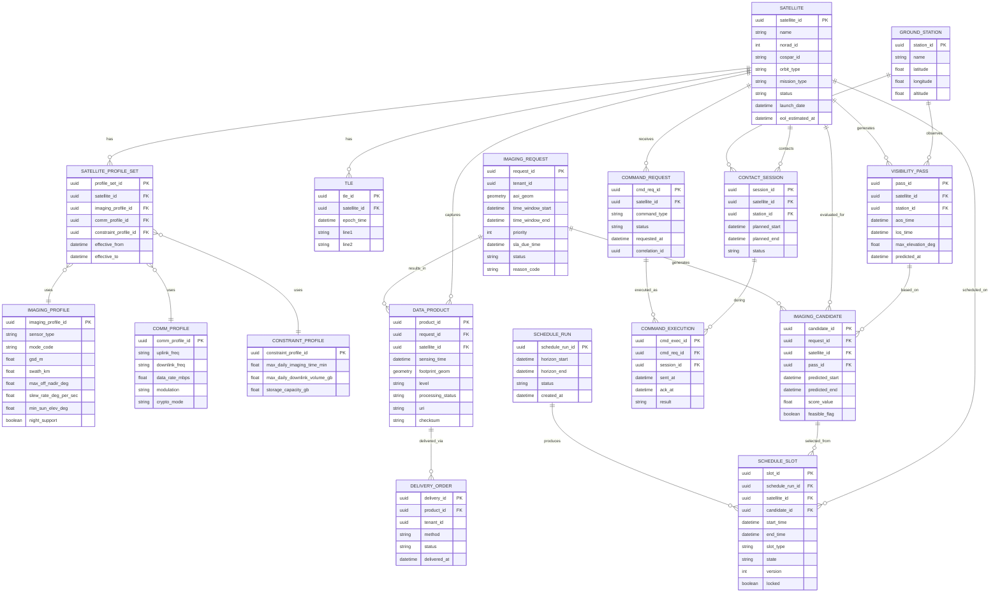

아래는 지금까지 설계한 **위성 운영/촬영계획 통합 ERD**를 기반으로 정리한 **Mermaid ER 다이어그램**입니다.
(논리 모델 기준이며, 상태/이벤트 로그 테이블은 핵심만 포함했습니다.)

복사 후 Mermaid 지원 환경에 그대로 사용 가능합니다.

---

# 📡 Satellite Mission Platform ERD (Logical Model)

---

# 📌 다이어그램 구조 요약

이 ERD는 7개 도메인으로 구성됩니다:

1. **Satellite Domain** – 위성 자산/프로파일
2. **Orbit Domain** – TLE/가시패스
3. **Tasking Domain** – 촬영 요청 및 후보
4. **Scheduling Domain** – 시간축 슬롯 확정
5. **Ground Domain** – 지상국 세션
6. **Command Domain** – TT&C 명령/ACK
7. **Data Product Domain** – 영상 상품/전달

---

# 🔎 설계적 특징

- **위성 성능은 Profile Set 기반 (유효기간 확장 가능)**
- **ScheduleSlot이 시간축 충돌 방지의 중심 엔터티**
- **Candidate → Slot 선택 구조로 최적화 결과 추적 가능**
- **CommandExecution은 세션 기반 감사 추적**
- **Product는 Request와 Satellite 양방향 추적 가능**

---

아래는 앞서 Mermaid ERD에 포함된 **모든 테이블**에 대해 **테이블명 / 엔터티 설명 / 속성(컬럼) 설명**을 한 번에 정리한 **데이터 사전(Data Dictionary) 형태의 표**입니다.
(논리 모델 기준이며, 타입/PK/FK 표기도 포함했습니다.)

---

## 1) Satellite Domain

### SATELLITE

| 항목        | 내용                                                                                                                                                                                                                                                                                                                                                               |
| ----------- | ------------------------------------------------------------------------------------------------------------------------------------------------------------------------------------------------------------------------------------------------------------------------------------------------------------------------------------------------------------------ |
| 테이블명    | `SATELLITE`                                                                                                                                                                                                                                                                                                                                                        |
| 엔터티 설명 | 인공위성 자산(Asset) 마스터. 시스템 내 위성 식별과 기본 운영 단위                                                                                                                                                                                                                                                                                                  |
| 속성(컬럼)  | `satellite_id (UUID, PK)` 내부 식별자 `name (string)` 위성명 `norad_id (int, UQ)` NORAD Catalog ID `cospar_id (string, UQ)` COSPAR 국제식별자 `orbit_type (string)` LEO/SSO/GEO 등 `mission_type (string)` EO/SAR/Comm 등 `status (string)` operational/safe/eol 등 `launch_date (datetime)` 발사일 `eol_estimated_at (datetime)` EOL 예상 |

### SATELLITE_PROFILE_SET

| 항목        | 내용                                                                                                                                                                                                                                                                                                        |
| ----------- | ----------------------------------------------------------------------------------------------------------------------------------------------------------------------------------------------------------------------------------------------------------------------------------------------------------- |
| 테이블명    | `SATELLITE_PROFILE_SET`                                                                                                                                                                                                                                                                                     |
| 엔터티 설명 | 특정 기간에 위성에 적용되는 성능/통신/제약 프로파일 “묶음”. 성능의 시간 유효기간 관리 핵심                                                                                                                                                                                                                  |
| 속성(컬럼)  | `profile_set_id (UUID, PK)` `satellite_id (UUID, FK→SATELLITE)` `imaging_profile_id (UUID, FK→IMAGING_PROFILE)` `comm_profile_id (UUID, FK→COMM_PROFILE)` `constraint_profile_id (UUID, FK→CONSTRAINT_PROFILE)` `effective_from (datetime)` 적용 시작 `effective_to (datetime)` 적용 종료 |

### IMAGING_PROFILE

| 항목        | 내용                                                                                                                                                                                                                                                                                                                                                                       |
| ----------- | -------------------------------------------------------------------------------------------------------------------------------------------------------------------------------------------------------------------------------------------------------------------------------------------------------------------------------------------------------------------------- |
| 테이블명    | `IMAGING_PROFILE`                                                                                                                                                                                                                                                                                                                                                          |
| 엔터티 설명 | 촬영 탑재체/모드별 성능 프로파일. 후보 생성/제약검증/품질점수 계산의 기준                                                                                                                                                                                                                                                                                                  |
| 속성(컬럼)  | `imaging_profile_id (UUID, PK)` `sensor_type (string)` optical/SAR/IR 등 `mode_code (string)` 촬영 모드 코드 `gsd_m (float)` GSD(m) `swath_km (float)` 폭(km) `max_off_nadir_deg (float)` 최대 오프나딜(°) `slew_rate_deg_per_sec (float)` 자세전환 속도(°/s) `min_sun_elev_deg (float)` 최소 태양고도(°) `night_support (boolean)` 야간 촬영 지원 |

### COMM_PROFILE

| 항목        | 내용                                                                                                                                                                                                                                  |
| ----------- | ------------------------------------------------------------------------------------------------------------------------------------------------------------------------------------------------------------------------------------- |
| 테이블명    | `COMM_PROFILE`                                                                                                                                                                                                                        |
| 엔터티 설명 | TT&C/데이터 링크 통신 프로파일. 지상국 세션 계획/링크 예산/속도 추정에 사용                                                                                                                                                           |
| 속성(컬럼)  | `comm_profile_id (UUID, PK)` `uplink_freq (string)` 업링크 주파수 `downlink_freq (string)` 다운링크 주파수 `data_rate_mbps (float)` 전송률(Mbps) `modulation (string)` 변조 방식 `crypto_mode (string)` 암호/보안 모드 |

### CONSTRAINT_PROFILE

| 항목        | 내용                                                                                                                                                                                                                            |
| ----------- | ------------------------------------------------------------------------------------------------------------------------------------------------------------------------------------------------------------------------------- |
| 테이블명    | `CONSTRAINT_PROFILE`                                                                                                                                                                                                            |
| 엔터티 설명 | 운영 제약(일일 촬영/다운링크/스토리지 등). 스케줄 최적화의 “하드/소프트 제약” 데이터화                                                                                                                                          |
| 속성(컬럼)  | `constraint_profile_id (UUID, PK)` `max_daily_imaging_time_min (float)` 일일 촬영 최대 시간(분) `max_daily_downlink_volume_gb (float)` 일일 다운링크 최대량(GB) `storage_capacity_gb (float)` 온보드 스토리지 용량(GB) |

---

## 2) Orbit Domain

### TLE

| 항목        | 내용                                                                                                                                                        |
| ----------- | ----------------------------------------------------------------------------------------------------------------------------------------------------------- |
| 테이블명    | `TLE`                                                                                                                                                       |
| 엔터티 설명 | 위성 궤도전파용 TLE 저장. 패스/재방문/가시성 계산 입력                                                                                                      |
| 속성(컬럼)  | `tle_id (UUID, PK)` `satellite_id (UUID, FK→SATELLITE)` `epoch_time (datetime)` TLE epoch `line1 (string)` TLE line1 `line2 (string)` TLE line2 |

### VISIBILITY_PASS

| 항목        | 내용                                                                                                                                                                                                                                                                  |
| ----------- | --------------------------------------------------------------------------------------------------------------------------------------------------------------------------------------------------------------------------------------------------------------------- |
| 테이블명    | `VISIBILITY_PASS`                                                                                                                                                                                                                                                     |
| 엔터티 설명 | 위성–지상국 가시구간(패스) 캐시. 스케줄링/다운링크 계획에서 반복 활용되는 1급 엔터티                                                                                                                                                                                  |
| 속성(컬럼)  | `pass_id (UUID, PK)` `satellite_id (UUID, FK→SATELLITE)` `station_id (UUID, FK→GROUND_STATION)` `aos_time (datetime)` AOS(가시 시작) `los_time (datetime)` LOS(가시 종료) `max_elevation_deg (float)` 최대 고각 `predicted_at (datetime)` 계산 시각 |

---

## 3) Tasking Domain

### IMAGING_REQUEST

| 항목        | 내용                                                                                                                                                                                                                                                                                                                                                                           |
| ----------- | ------------------------------------------------------------------------------------------------------------------------------------------------------------------------------------------------------------------------------------------------------------------------------------------------------------------------------------------------------------------------------ |
| 테이블명    | `IMAGING_REQUEST`                                                                                                                                                                                                                                                                                                                                                              |
| 엔터티 설명 | 촬영 요청(고객/내부). AOI/시간창/제약/SLA/우선순위를 포함하는 “요청 원장”                                                                                                                                                                                                                                                                                                      |
| 속성(컬럼)  | `request_id (UUID, PK)` `tenant_id (UUID)` 테넌트/고객 식별자 `aoi_geom (geometry)` AOI 폴리곤(예: SRID 4326) `time_window_start (datetime)` 촬영 가능 시작 `time_window_end (datetime)` 촬영 가능 종료 `priority (int)` 우선순위 `sla_due_time (datetime)` SLA 납기 `status (string)` 상태(Submitted~Completed) `reason_code (string)` 실패/거절 사유 |

### IMAGING_CANDIDATE

| 항목        | 내용                                                                                                                                                                                                                                                                                                                            |
| ----------- | ------------------------------------------------------------------------------------------------------------------------------------------------------------------------------------------------------------------------------------------------------------------------------------------------------------------------------- |
| 테이블명    | `IMAGING_CANDIDATE`                                                                                                                                                                                                                                                                                                             |
| 엔터티 설명 | 요청별 촬영 후보(위성/패스/모드 조합). 최적화 입력 데이터(후보군)                                                                                                                                                                                                                                                               |
| 속성(컬럼)  | `candidate_id (UUID, PK)` `request_id (UUID, FK→IMAGING_REQUEST)` `satellite_id (UUID, FK→SATELLITE)` `pass_id (UUID, FK→VISIBILITY_PASS)` `predicted_start (datetime)` 후보 시작 `predicted_end (datetime)` 후보 종료 `score_value (float)` 점수(가치/품질/비용 종합) `feasible_flag (boolean)` 가능 여부 |

---

## 4) Scheduling Domain

### SCHEDULE_RUN

| 항목        | 내용                                                                                                                                                                                              |
| ----------- | ------------------------------------------------------------------------------------------------------------------------------------------------------------------------------------------------- |
| 테이블명    | `SCHEDULE_RUN`                                                                                                                                                                                    |
| 엔터티 설명 | 스케줄러 실행 단위(최적화 Run). 어떤 입력/정책/기간으로 산출했는지 추적                                                                                                                           |
| 속성(컬럼)  | `schedule_run_id (UUID, PK)` `horizon_start (datetime)` 계획 시작 `horizon_end (datetime)` 계획 종료 `status (string)` CREATED/RUNNING/COMMITTED 등 `created_at (datetime)` 생성 시각 |

### SCHEDULE_SLOT

| 항목        | 내용                                                                                                                                                                                                                                                                                                                                                                                                                                          |
| ----------- | --------------------------------------------------------------------------------------------------------------------------------------------------------------------------------------------------------------------------------------------------------------------------------------------------------------------------------------------------------------------------------------------------------------------------------------------- |
| 테이블명    | `SCHEDULE_SLOT`                                                                                                                                                                                                                                                                                                                                                                                                                               |
| 엔터티 설명 | 시간축 예약(촬영/다운링크/기동 등). 운영의 “단일 진실(SoT)”이 되는 핵심 엔터티                                                                                                                                                                                                                                                                                                                                                                |
| 속성(컬럼)  | `slot_id (UUID, PK)` `schedule_run_id (UUID, FK→SCHEDULE_RUN)` `satellite_id (UUID, FK→SATELLITE)` `candidate_id (UUID, FK→IMAGING_CANDIDATE)` 선택된 후보(촬영 슬롯인 경우) `start_time (datetime)` 시작 `end_time (datetime)` 종료 `slot_type (string)` IMAGING/DOWNLINK/MANEUVER 등 `state (string)` PLANNED/COMMITTED/EXECUTED 등 `version (int)` 낙관적 락 버전 `locked (boolean)` freeze window 등 변경 금지 |

---

## 5) Ground Domain

### GROUND_STATION

| 항목        | 내용                                                                                                                                  |
| ----------- | ------------------------------------------------------------------------------------------------------------------------------------- |
| 테이블명    | `GROUND_STATION`                                                                                                                      |
| 엔터티 설명 | 지상국 자원(위치/기본 정보). 가시구간/세션 계획의 기준                                                                                |
| 속성(컬럼)  | `station_id (UUID, PK)` `name (string)` 지상국명 `latitude (float)` 위도 `longitude (float)` 경도 `altitude (float)` 고도 |

### CONTACT_SESSION

| 항목        | 내용                                                                                                                                                                                                                                          |
| ----------- | --------------------------------------------------------------------------------------------------------------------------------------------------------------------------------------------------------------------------------------------- |
| 테이블명    | `CONTACT_SESSION`                                                                                                                                                                                                                             |
| 엔터티 설명 | 지상국–위성 접속 세션(예약/실행). 다운링크/업링크의 실제 수행 단위                                                                                                                                                                            |
| 속성(컬럼)  | `session_id (UUID, PK)` `satellite_id (UUID, FK→SATELLITE)` `station_id (UUID, FK→GROUND_STATION)` `planned_start (datetime)` 계획 시작 `planned_end (datetime)` 계획 종료 `status (string)` RESERVED/STARTED/COMPLETED/FAILED |

---

## 6) Command Domain

### COMMAND_REQUEST

| 항목        | 내용                                                                                                                                                                                                                                       |
| ----------- | ------------------------------------------------------------------------------------------------------------------------------------------------------------------------------------------------------------------------------------------ |
| 테이블명    | `COMMAND_REQUEST`                                                                                                                                                                                                                          |
| 엔터티 설명 | 위성 명령 요청(승인/큐잉 단위). 누가 무엇을 왜 보냈는지 감사 추적의 핵심                                                                                                                                                                   |
| 속성(컬럼)  | `cmd_req_id (UUID, PK)` `satellite_id (UUID, FK→SATELLITE)` `command_type (string)` 명령 타입 `status (string)` DRAFT/APPROVED/QUEUED 등 `requested_at (datetime)` 요청 시각 `correlation_id (UUID)` 요청-계획-상품 추적 키 |

### COMMAND_EXECUTION

| 항목        | 내용                                                                                                                                                                                                                      |
| ----------- | ------------------------------------------------------------------------------------------------------------------------------------------------------------------------------------------------------------------------- |
| 테이블명    | `COMMAND_EXECUTION`                                                                                                                                                                                                       |
| 엔터티 설명 | 세션 내 명령 실행 기록(전송/ACK 결과). 장애 분석, 재시도, 감사에 필요                                                                                                                                                     |
| 속성(컬럼)  | `cmd_exec_id (UUID, PK)` `cmd_req_id (UUID, FK→COMMAND_REQUEST)` `session_id (UUID, FK→CONTACT_SESSION)` `sent_at (datetime)` 전송 시각 `ack_at (datetime)` ACK 시각 `result (string)` ACK/NACK/TIMEOUT 등 |

---

## 7) Data Product Domain

### DATA_PRODUCT

| 항목        | 내용                                                                                                                                                                                                                                                                                                                                 |
| ----------- | ------------------------------------------------------------------------------------------------------------------------------------------------------------------------------------------------------------------------------------------------------------------------------------------------------------------------------------ |
| 테이블명    | `DATA_PRODUCT`                                                                                                                                                                                                                                                                                                                       |
| 엔터티 설명 | 촬영 결과 데이터 상품(원시/처리 레벨 포함). 카탈로그/검색/전달의 기준 엔터티                                                                                                                                                                                                                                                         |
| 속성(컬럼)  | `product_id (UUID, PK)` `request_id (UUID, FK→IMAGING_REQUEST)` `satellite_id (UUID, FK→SATELLITE)` `sensing_time (datetime)` 촬영 시각 `footprint_geom (geometry)` 촬영 풋프린트 `level (string)` L0~L4 `processing_status (string)` 처리 상태 `uri (string)` 스토리지 위치 `checksum (string)` 무결성 해시 |

### DELIVERY_ORDER

| 항목        | 내용                                                                                                                                                                                                                                    |
| ----------- | --------------------------------------------------------------------------------------------------------------------------------------------------------------------------------------------------------------------------------------- |
| 테이블명    | `DELIVERY_ORDER`                                                                                                                                                                                                                        |
| 엔터티 설명 | 데이터 전달 주문/작업(배송 방식/상태). API/S3/FTP/Webhook 등 전달 운영                                                                                                                                                                  |
| 속성(컬럼)  | `delivery_id (UUID, PK)` `product_id (UUID, FK→DATA_PRODUCT)` `tenant_id (UUID)` 수신 테넌트/고객 `method (string)` 전달 방식 `status (string)` CREATED/DELIVERING/DELIVERED 등 `delivered_at (datetime)` 전달 완료 시각 |

---

## 참고: 다음 단계에서 “반드시 추가되는” 테이블(권장)

현재 ERD에는 “핵심 흐름”만 넣었고, 실제 구축 시 보통 아래가 추가됩니다.

- `OPERATOR / CUSTOMER / TENANT` (계정/테넌트 마스터)
- `SCHEDULE_SLOT_HISTORY` 또는 `AUDIT_LOG` (불변 이력)
- `DOWNLINK_REQUEST / DOWNLINK_PLAN` (다운링크를 촬영과 분리 운영하려면 필수)
- `PROCESS_JOB / PIPELINE_RUN` (처리 파이프라인 운영/재처리)
