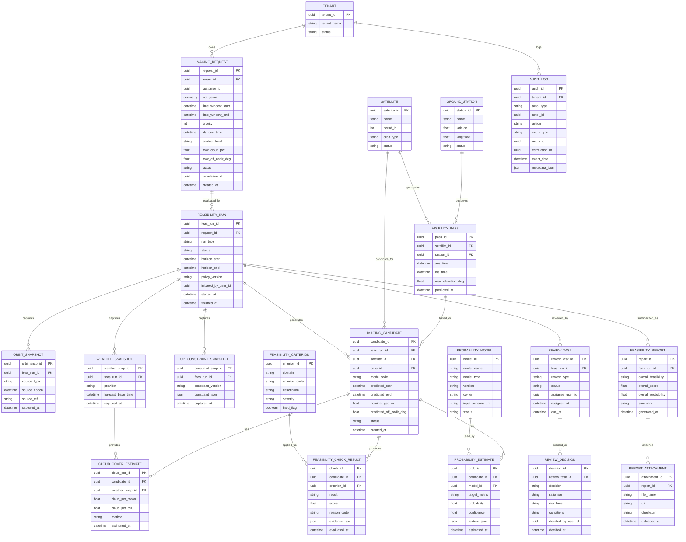
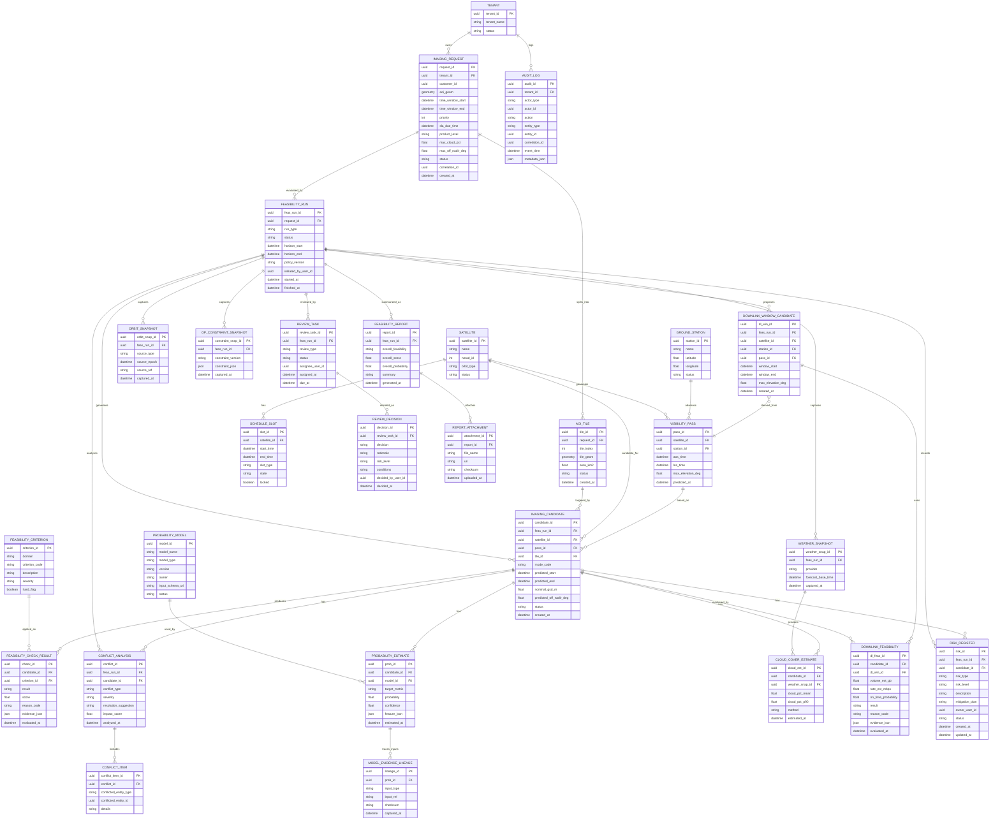

아래는 **촬영계획시스템에서 “위성영상 촬영계획”에 대해 Feasibility(가능성) + Probability(성공확률/품질확률) + 타당성(업무적/정책적 적합성) 검토**를 수행하는 **업무 플로우를 직접 지원하는 ERD**입니다.

구현 관점에서 핵심은:

- **요청(Request)** → **평가 실행(Run)** → **후보(Candidate)** → **체크(Checks) 결과** → **확률 추정(Probability)** → **리뷰(Review) 워크플로** → **최종 판정(Decision)**
- 평가 시점의 입력(궤도/기상/제약)을 “스냅샷”으로 고정해서 **재현성/감사추적**을 보장

---

## 1) Feasibility/Probability/Validity Workflow ERD (Mermaid)



---

## 2) 전체 테이블 설명 표 (테이블명 / 엔터티 / 속성)

아래는 ERD에 포함된 **모든 테이블**을 동일한 방식(데이터 사전)으로 정리했습니다.

---

# 2-1) Core Request / Context

### TENANT

| 항목        | 내용                                                                            |
| ----------- | ------------------------------------------------------------------------------- |
| 테이블명    | `TENANT`                                                                        |
| 엔터티 설명 | 멀티테넌트 최상위 조직. 요청/평가/감사 로그 격리 및 쿼터/정책 적용 기준         |
| 속성(컬럼)  | `tenant_id(PK)` 테넌트 ID<br>`tenant_name` 명칭<br>`status` active/suspended 등 |

### IMAGING_REQUEST

| 항목        | 내용                                                                                                                                                                                                                                                                                                                                                             |
| ----------- | ---------------------------------------------------------------------------------------------------------------------------------------------------------------------------------------------------------------------------------------------------------------------------------------------------------------------------------------------------------------- |
| 테이블명    | `IMAGING_REQUEST`                                                                                                                                                                                                                                                                                                                                                |
| 엔터티 설명 | 촬영 요청 원장. Feasibility/Probability/Validity 평가의 출발점이 되는 요구조건 집합                                                                                                                                                                                                                                                                              |
| 속성(컬럼)  | `request_id(PK)`<br>`tenant_id(FK→TENANT)`<br>`customer_id`(선택) 고객 식별자<br>`aoi_geom` AOI(공간타입)<br>`time_window_start/end` 요청 시간창<br>`priority` 우선순위<br>`sla_due_time` 납기<br>`product_level` L0~Lx<br>`max_cloud_pct` 구름 허용치<br>`max_off_nadir_deg` 오프나딜 제한<br>`status` 요청 상태<br>`correlation_id` E2E 추적키<br>`created_at` |

### SATELLITE

| 항목        | 내용                                                                   |
| ----------- | ---------------------------------------------------------------------- |
| 테이블명    | `SATELLITE`                                                            |
| 엔터티 설명 | 평가 대상 위성 마스터(후보 생성 및 패스 연결의 기준)                   |
| 속성(컬럼)  | `satellite_id(PK)`<br>`name`<br>`norad_id`<br>`orbit_type`<br>`status` |

### GROUND_STATION

| 항목        | 내용                                                           |
| ----------- | -------------------------------------------------------------- |
| 테이블명    | `GROUND_STATION`                                               |
| 엔터티 설명 | 가시성/다운링크 가능성 평가에 필요한 지상국 마스터             |
| 속성(컬럼)  | `station_id(PK)`<br>`name`<br>`latitude/longitude`<br>`status` |

### VISIBILITY_PASS

| 항목        | 내용                                                                                                                                             |
| ----------- | ------------------------------------------------------------------------------------------------------------------------------------------------ |
| 테이블명    | `VISIBILITY_PASS`                                                                                                                                |
| 엔터티 설명 | 위성–지상국 가시구간(패스) 캐시. 후보 생성의 기저 데이터                                                                                         |
| 속성(컬럼)  | `pass_id(PK)`<br>`satellite_id(FK→SATELLITE)`<br>`station_id(FK→GROUND_STATION)`<br>`aos_time/los_time`<br>`max_elevation_deg`<br>`predicted_at` |

---

# 2-2) Feasibility Run (재현 가능한 평가 실행)

### FEASIBILITY_RUN

| 항목        | 내용                                                                                                                                                                                                                                                                        |
| ----------- | --------------------------------------------------------------------------------------------------------------------------------------------------------------------------------------------------------------------------------------------------------------------------- |
| 테이블명    | `FEASIBILITY_RUN`                                                                                                                                                                                                                                                           |
| 엔터티 설명 | 특정 요청에 대해 feasibility/확률/타당성 검토를 “한 번 실행한 단위”. 결과 재현성과 감사 추적의 루트                                                                                                                                                                         |
| 속성(컬럼)  | `feas_run_id(PK)`<br>`request_id(FK→IMAGING_REQUEST)`<br>`run_type` auto/manual/emergency 등<br>`status` CREATED/RUNNING/DONE/FAILED<br>`horizon_start/end` 평가 범위<br>`policy_version` 평가 정책 버전<br>`initiated_by_user_id` 실행자(선택)<br>`started_at/finished_at` |

### ORBIT_SNAPSHOT

| 항목        | 내용                                                                                                                                                               |
| ----------- | ------------------------------------------------------------------------------------------------------------------------------------------------------------------ |
| 테이블명    | `ORBIT_SNAPSHOT`                                                                                                                                                   |
| 엔터티 설명 | 평가 시점에 사용한 궤도 입력(TLE/EPH 등)을 고정 저장(재현성 확보)                                                                                                  |
| 속성(컬럼)  | `orbit_snap_id(PK)`<br>`feas_run_id(FK→FEASIBILITY_RUN)`<br>`source_type` TLE/EPH<br>`source_epoch` 기준 epoch<br>`source_ref` 파일/레코드 참조키<br>`captured_at` |

### WEATHER_SNAPSHOT

| 항목        | 내용                                                                                                                                        |
| ----------- | ------------------------------------------------------------------------------------------------------------------------------------------- |
| 테이블명    | `WEATHER_SNAPSHOT`                                                                                                                          |
| 엔터티 설명 | 평가 시점에 사용한 기상 예보 입력을 고정 저장(구름 확률 평가의 근거)                                                                        |
| 속성(컬럼)  | `weather_snap_id(PK)`<br>`feas_run_id(FK→FEASIBILITY_RUN)`<br>`provider` 예보 제공자<br>`forecast_base_time` 예보 기준시각<br>`captured_at` |

### OP_CONSTRAINT_SNAPSHOT

| 항목        | 내용                                                                                                                                                  |
| ----------- | ----------------------------------------------------------------------------------------------------------------------------------------------------- |
| 테이블명    | `OP_CONSTRAINT_SNAPSHOT`                                                                                                                              |
| 엔터티 설명 | 평가 시점의 운영 제약(위성 모드/전력/일일 제한/다운링크 제한 등)을 스냅샷으로 고정                                                                    |
| 속성(컬럼)  | `constraint_snap_id(PK)`<br>`feas_run_id(FK→FEASIBILITY_RUN)`<br>`constraint_version` 제약 버전<br>`constraint_json` 제약 상세(JSON)<br>`captured_at` |

---

# 2-3) Candidates & Checks (가능성 평가의 핵심)

### IMAGING_CANDIDATE

| 항목        | 내용                                                                                                                                                                                                                                                                                                           |
| ----------- | -------------------------------------------------------------------------------------------------------------------------------------------------------------------------------------------------------------------------------------------------------------------------------------------------------------- |
| 테이블명    | `IMAGING_CANDIDATE`                                                                                                                                                                                                                                                                                            |
| 엔터티 설명 | Feasibility Run에서 생성된 촬영 후보(위성/패스/모드/예상시간). 체크/확률/리뷰의 대상 단위                                                                                                                                                                                                                      |
| 속성(컬럼)  | `candidate_id(PK)`<br>`feas_run_id(FK→FEASIBILITY_RUN)`<br>`satellite_id(FK→SATELLITE)`<br>`pass_id(FK→VISIBILITY_PASS)`<br>`mode_code` 촬영모드<br>`predicted_start/end`<br>`nominal_gsd_m` 예상 GSD<br>`predicted_off_nadir_deg` 예상 오프나딜<br>`status` CANDIDATE/REJECTED/RECOMMENDED 등<br>`created_at` |

### FEASIBILITY_CRITERION

| 항목        | 내용                                                                                                                                                                                                             |
| ----------- | ---------------------------------------------------------------------------------------------------------------------------------------------------------------------------------------------------------------- |
| 테이블명    | `FEASIBILITY_CRITERION`                                                                                                                                                                                          |
| 엔터티 설명 | 평가 기준(체크 항목) 마스터. 하드/소프트 제약 및 심각도(Severity) 포함                                                                                                                                           |
| 속성(컬럼)  | `criterion_id(PK)`<br>`domain` ORBIT/IMAGING/POWER/THERMAL/GROUND/SECURITY 등<br>`criterion_code` 코드(예: MAX_OFF_NADIR)<br>`description` 설명<br>`severity` LOW/MED/HIGH/CRITICAL<br>`hard_flag` 하드제약 여부 |

### FEASIBILITY_CHECK_RESULT

| 항목        | 내용                                                                                                                                                                                                                                                                  |
| ----------- | --------------------------------------------------------------------------------------------------------------------------------------------------------------------------------------------------------------------------------------------------------------------- |
| 테이블명    | `FEASIBILITY_CHECK_RESULT`                                                                                                                                                                                                                                            |
| 엔터티 설명 | 후보별 기준(criterion) 평가 결과. “가능/불가/경고 + 근거(evidence)”를 저장하는 핵심 테이블                                                                                                                                                                            |
| 속성(컬럼)  | `check_id(PK)`<br>`candidate_id(FK→IMAGING_CANDIDATE)`<br>`criterion_id(FK→FEASIBILITY_CRITERION)`<br>`result` PASS/FAIL/WARN<br>`score` 0~1 또는 가중치 점수<br>`reason_code` 실패/경고 사유<br>`evidence_json` 근거 데이터(계산값/입력/로그 참조)<br>`evaluated_at` |

---

# 2-4) Probability (성공확률/품질확률/납기확률)

### PROBABILITY_MODEL

| 항목        | 내용                                                                                                                                                          |
| ----------- | ------------------------------------------------------------------------------------------------------------------------------------------------------------- |
| 테이블명    | `PROBABILITY_MODEL`                                                                                                                                           |
| 엔터티 설명 | 확률 추정 모델 레지스트리(규칙기반/통계/ML). 버전/입력스키마를 관리                                                                                           |
| 속성(컬럼)  | `model_id(PK)`<br>`model_name`<br>`model_type` RULE/STAT/ML<br>`version`<br>`owner` 운영 책임자<br>`input_schema_uri` 입력 정의<br>`status` active/deprecated |

### PROBABILITY_ESTIMATE

| 항목        | 내용                                                                                                                                                                                                                                                                        |
| ----------- | --------------------------------------------------------------------------------------------------------------------------------------------------------------------------------------------------------------------------------------------------------------------------- |
| 테이블명    | `PROBABILITY_ESTIMATE`                                                                                                                                                                                                                                                      |
| 엔터티 설명 | 후보에 대해 특정 모델로 계산한 확률 결과(성공, 품질, SLA 준수 등 target_metric별)                                                                                                                                                                                           |
| 속성(컬럼)  | `prob_id(PK)`<br>`candidate_id(FK→IMAGING_CANDIDATE)`<br>`model_id(FK→PROBABILITY_MODEL)`<br>`target_metric` SUCCESS/QUALITY/SLA_ON_TIME 등<br>`probability` 0~1<br>`confidence` 신뢰도(예: 0~1 또는 CI 폭)<br>`feature_json` 입력 feature 스냅샷(재현성)<br>`estimated_at` |

### CLOUD_COVER_ESTIMATE

| 항목        | 내용                                                                                                                                                                                                                             |
| ----------- | -------------------------------------------------------------------------------------------------------------------------------------------------------------------------------------------------------------------------------- |
| 테이블명    | `CLOUD_COVER_ESTIMATE`                                                                                                                                                                                                           |
| 엔터티 설명 | 후보 시간/영역에서의 구름량 추정(평균/상위분위). 광학 촬영 성공확률의 주요 입력                                                                                                                                                  |
| 속성(컬럼)  | `cloud_est_id(PK)`<br>`candidate_id(FK→IMAGING_CANDIDATE)`<br>`weather_snap_id(FK→WEATHER_SNAPSHOT)`<br>`cloud_pct_mean` 평균 구름량<br>`cloud_pct_p90` 보수적(90퍼센타일)<br>`method` NWP/Nowcast/Ensemble 등<br>`estimated_at` |

---

# 2-5) Validity Review Workflow (업무적 타당성/정책/리스크)

### REVIEW_TASK

| 항목        | 내용                                                                                                                                                                                                          |
| ----------- | ------------------------------------------------------------------------------------------------------------------------------------------------------------------------------------------------------------- |
| 테이블명    | `REVIEW_TASK`                                                                                                                                                                                                 |
| 엔터티 설명 | 검토 업무(Task) 단위. 자동평가 결과를 사람이 확인/승인/조건부 승인하는 워크플로                                                                                                                               |
| 속성(컬럼)  | `review_task_id(PK)`<br>`feas_run_id(FK→FEASIBILITY_RUN)`<br>`review_type` TECH/OPS/SECURITY/COMMERCIAL 등<br>`status` OPEN/IN_REVIEW/DONE/REJECTED<br>`assignee_user_id` 담당자<br>`assigned_at`<br>`due_at` |

### REVIEW_DECISION

| 항목        | 내용                                                                                                                                                                                                                                                        |
| ----------- | ----------------------------------------------------------------------------------------------------------------------------------------------------------------------------------------------------------------------------------------------------------- |
| 테이블명    | `REVIEW_DECISION`                                                                                                                                                                                                                                           |
| 엔터티 설명 | 리뷰 태스크의 최종 판정(승인/거절/조건부). 리스크와 조건을 명문화                                                                                                                                                                                           |
| 속성(컬럼)  | `decision_id(PK)`<br>`review_task_id(FK→REVIEW_TASK)`<br>`decision` APPROVE/REJECT/CONDITIONAL_APPROVE<br>`rationale` 근거(요약)<br>`risk_level` LOW/MED/HIGH<br>`conditions` 조건(예: downlink 우선권 필요)<br>`decided_by_user_id` 결정자<br>`decided_at` |

### FEASIBILITY_REPORT

| 항목        | 내용                                                                                                                                                                                                                    |
| ----------- | ----------------------------------------------------------------------------------------------------------------------------------------------------------------------------------------------------------------------- |
| 테이블명    | `FEASIBILITY_REPORT`                                                                                                                                                                                                    |
| 엔터티 설명 | Run 단위 종합 결과(가능/불가/조건부 + 점수/확률/요약). 외부/내부 공유용 산출물                                                                                                                                          |
| 속성(컬럼)  | `report_id(PK)`<br>`feas_run_id(FK→FEASIBILITY_RUN)`<br>`overall_feasibility` FEASIBLE/NOT_FEASIBLE/CONDITIONAL<br>`overall_score` 종합 점수<br>`overall_probability` 종합 성공확률<br>`summary` 요약<br>`generated_at` |

### REPORT_ATTACHMENT

| 항목        | 내용                                                                                                                              |
| ----------- | --------------------------------------------------------------------------------------------------------------------------------- |
| 테이블명    | `REPORT_ATTACHMENT`                                                                                                               |
| 엔터티 설명 | 보고서 증빙(지도 이미지, 시뮬레이션 로그, 근거 파일, PDF 등) 관리                                                                 |
| 속성(컬럼)  | `attachment_id(PK)`<br>`report_id(FK→FEASIBILITY_REPORT)`<br>`file_name`<br>`uri` 저장 위치<br>`checksum` 무결성<br>`uploaded_at` |

---

# 2-6) Audit (감사/추적)

### AUDIT_LOG

| 항목        | 내용                                                                                                                                                                                                                                                               |
| ----------- | ------------------------------------------------------------------------------------------------------------------------------------------------------------------------------------------------------------------------------------------------------------------ |
| 테이블명    | `AUDIT_LOG`                                                                                                                                                                                                                                                        |
| 엔터티 설명 | 평가 실행/리뷰/결정/수정 전 과정 감사 로그. 규제/보안/분쟁 대응의 핵심                                                                                                                                                                                             |
| 속성(컬럼)  | `audit_id(PK)`<br>`tenant_id(FK→TENANT)`<br>`actor_type` USER/SYSTEM/API_KEY<br>`actor_id` 주체 ID<br>`action` RUN_START/DECIDE/ATTACH 등<br>`entity_type` 엔터티 타입<br>`entity_id` 엔터티 ID<br>`correlation_id` 추적키<br>`event_time`<br>`metadata_json` 상세 |

---

## 3) 업무 플로우를 ERD에 매핑하면 이렇게 흘러갑니다

- `IMAGING_REQUEST` 생성
- `FEASIBILITY_RUN` 시작(스냅샷 3종: `ORBIT_SNAPSHOT`, `WEATHER_SNAPSHOT`, `OP_CONSTRAINT_SNAPSHOT`)
- 패스 기반으로 `IMAGING_CANDIDATE` 생성
- 후보마다 `FEASIBILITY_CHECK_RESULT`(기준은 `FEASIBILITY_CRITERION`) 산출 → PASS/FAIL/WARN 근거 기록
- 후보마다 `CLOUD_COVER_ESTIMATE` 및 `PROBABILITY_ESTIMATE` 계산(모델은 `PROBABILITY_MODEL`)
- 필요 시 `REVIEW_TASK` 생성 → `REVIEW_DECISION`으로 승인/거절/조건부 승인
- 종합본 `FEASIBILITY_REPORT` 생성 + `REPORT_ATTACHMENT` 증빙 첨부
- 전 과정 `AUDIT_LOG`에 기록

---

## 다음 확장(원하시면 즉시 반영 가능)

실무에서 feasibility에 자주 추가되는 테이블(필요 시 ERD에 바로 확장):

- **CONFLICT_ANALYSIS**(기존 스케줄/우선권 충돌 분석)
- **DOWNLINK_FEASIBILITY**(세션/볼륨/납기 충족 확률)
- **RISK_REGISTER**(리스크 항목/완화책/담당)
- **AOI_TILE**(대면적 AOI 분할/후보 폭발 제어)
- **MODEL_EVIDENCE_LINEAGE**(확률값의 입력 데이터 라인리지)

원하시면 “광학 vs SAR”에 따라 criterion과 probability target_metric 표준도 같이 만들어드릴 수 있습니다.

아래는 직전 ERD(Feasibility/Probability/Validity Workflow)에, 제가 제안했던 확장 요소 **전부**를 반영해 **갱신(업데이트)한 ERD**와, **추가된 테이블까지 포함한 전체 데이터사전(테이블명/엔터티/속성 설명)**입니다.

---

## 1) 갱신 ERD (Mermaid)



---

## 2) 전체 테이블 설명 표 (데이터 사전)

아래는 **갱신 ERD에 포함된 모든 테이블**을 동일 형식으로 정리한 것입니다.

---

# 2-1) Core / Context

### TENANT

| 항목        | 내용                                                                 |
| ----------- | -------------------------------------------------------------------- |
| 테이블명    | `TENANT`                                                             |
| 엔터티 설명 | 멀티테넌트 최상위 조직. 요청/평가/감사 로그의 격리 및 정책/쿼터 기준 |
| 속성(컬럼)  | `tenant_id(PK)`<br>`tenant_name`<br>`status`                         |

### IMAGING_REQUEST

| 항목        | 내용                                                                                                                                                                                                                                                        |
| ----------- | ----------------------------------------------------------------------------------------------------------------------------------------------------------------------------------------------------------------------------------------------------------- |
| 테이블명    | `IMAGING_REQUEST`                                                                                                                                                                                                                                           |
| 엔터티 설명 | 촬영요청 원장. Feasibility/확률/타당성 검토의 입력 요구조건 집합                                                                                                                                                                                            |
| 속성(컬럼)  | `request_id(PK)`<br>`tenant_id(FK)`<br>`customer_id`(옵션)<br>`aoi_geom` AOI 폴리곤<br>`time_window_start/end`<br>`priority`<br>`sla_due_time`<br>`product_level`<br>`max_cloud_pct`<br>`max_off_nadir_deg`<br>`status`<br>`correlation_id`<br>`created_at` |

### AOI_TILE

| 항목        | 내용                                                                                                                                                                       |
| ----------- | -------------------------------------------------------------------------------------------------------------------------------------------------------------------------- |
| 테이블명    | `AOI_TILE`                                                                                                                                                                 |
| 엔터티 설명 | 대면적 AOI를 타일/세그먼트로 분할한 단위. 후보 폭발 제어 및 부분 촬영(모자이크) 계획에 사용                                                                                |
| 속성(컬럼)  | `tile_id(PK)`<br>`request_id(FK→IMAGING_REQUEST)`<br>`tile_index` 타일 순번<br>`tile_geom` 타일 지오메트리<br>`area_km2` 면적<br>`status` active/merged 등<br>`created_at` |

### SATELLITE

| 항목        | 내용                                                                   |
| ----------- | ---------------------------------------------------------------------- |
| 테이블명    | `SATELLITE`                                                            |
| 엔터티 설명 | 평가 대상 위성 마스터(후보 생성/패스/충돌 분석의 기준)                 |
| 속성(컬럼)  | `satellite_id(PK)`<br>`name`<br>`norad_id`<br>`orbit_type`<br>`status` |

### GROUND_STATION

| 항목        | 내용                                                           |
| ----------- | -------------------------------------------------------------- |
| 테이블명    | `GROUND_STATION`                                               |
| 엔터티 설명 | 가시성/다운링크 가능성 평가에 필요한 지상국 마스터             |
| 속성(컬럼)  | `station_id(PK)`<br>`name`<br>`latitude/longitude`<br>`status` |

### VISIBILITY_PASS

| 항목        | 내용                                                                                                                                             |
| ----------- | ------------------------------------------------------------------------------------------------------------------------------------------------ |
| 테이블명    | `VISIBILITY_PASS`                                                                                                                                |
| 엔터티 설명 | 위성–지상국 가시구간(패스). 후보 생성 및 다운링크 윈도우 후보의 기저                                                                             |
| 속성(컬럼)  | `pass_id(PK)`<br>`satellite_id(FK→SATELLITE)`<br>`station_id(FK→GROUND_STATION)`<br>`aos_time/los_time`<br>`max_elevation_deg`<br>`predicted_at` |

### SCHEDULE_SLOT

| 항목        | 내용                                                                                                                                                                       |
| ----------- | -------------------------------------------------------------------------------------------------------------------------------------------------------------------------- |
| 테이블명    | `SCHEDULE_SLOT`                                                                                                                                                            |
| 엔터티 설명 | (참조용) 기존/현행 스케줄 슬롯. 충돌 분석에서 “이미 확정된 커밋/락 슬롯”을 근거로 사용                                                                                     |
| 속성(컬럼)  | `slot_id(PK)`<br>`satellite_id(FK→SATELLITE)`<br>`start_time/end_time`<br>`slot_type` IMAGING/DOWNLINK 등<br>`state` COMMITTED/EXECUTING 등<br>`locked` freeze window 여부 |

---

# 2-2) Feasibility Run (재현성 중심)

### FEASIBILITY_RUN

| 항목        | 내용                                                                                                                                                                                                                         |
| ----------- | ---------------------------------------------------------------------------------------------------------------------------------------------------------------------------------------------------------------------------- |
| 테이블명    | `FEASIBILITY_RUN`                                                                                                                                                                                                            |
| 엔터티 설명 | 특정 요청에 대한 평가 실행 단위(가능성/확률/타당성). 모든 결과의 루트이며 재현성/감사추적 기준                                                                                                                               |
| 속성(컬럼)  | `feas_run_id(PK)`<br>`request_id(FK)`<br>`run_type` auto/manual/emergency<br>`status` CREATED/RUNNING/DONE/FAILED<br>`horizon_start/end`<br>`policy_version` 정책 버전<br>`initiated_by_user_id`<br>`started_at/finished_at` |

### ORBIT_SNAPSHOT

| 항목        | 내용                                                                                                                                   |
| ----------- | -------------------------------------------------------------------------------------------------------------------------------------- |
| 테이블명    | `ORBIT_SNAPSHOT`                                                                                                                       |
| 엔터티 설명 | 평가 시 사용한 궤도 입력(TLE/EPH)을 스냅샷으로 고정(재현성)                                                                            |
| 속성(컬럼)  | `orbit_snap_id(PK)`<br>`feas_run_id(FK)`<br>`source_type` TLE/EPH<br>`source_epoch`<br>`source_ref`(파일/레코드 참조)<br>`captured_at` |

### WEATHER_SNAPSHOT

| 항목        | 내용                                                                                              |
| ----------- | ------------------------------------------------------------------------------------------------- |
| 테이블명    | `WEATHER_SNAPSHOT`                                                                                |
| 엔터티 설명 | 평가 시 사용한 예보 입력 스냅샷(구름/가시/대기 조건 확률 평가 근거)                               |
| 속성(컬럼)  | `weather_snap_id(PK)`<br>`feas_run_id(FK)`<br>`provider`<br>`forecast_base_time`<br>`captured_at` |

### OP_CONSTRAINT_SNAPSHOT

| 항목        | 내용                                                                                                        |
| ----------- | ----------------------------------------------------------------------------------------------------------- |
| 테이블명    | `OP_CONSTRAINT_SNAPSHOT`                                                                                    |
| 엔터티 설명 | 평가 시점의 운영 제약(전력/열/모드/일일 제한/다운링크 제한 등)을 JSON으로 고정                              |
| 속성(컬럼)  | `constraint_snap_id(PK)`<br>`feas_run_id(FK)`<br>`constraint_version`<br>`constraint_json`<br>`captured_at` |

---

# 2-3) Candidates & Checks (Feasibility 핵심)

### IMAGING_CANDIDATE

| 항목        | 내용                                                                                                                                                                                                                                                                              |
| ----------- | --------------------------------------------------------------------------------------------------------------------------------------------------------------------------------------------------------------------------------------------------------------------------------- |
| 테이블명    | `IMAGING_CANDIDATE`                                                                                                                                                                                                                                                               |
| 엔터티 설명 | Run에서 생성된 촬영 후보(위성/패스/타일/모드/예상시간). 체크/확률/다운링크 평가의 최소 단위                                                                                                                                                                                       |
| 속성(컬럼)  | `candidate_id(PK)`<br>`feas_run_id(FK→FEASIBILITY_RUN)`<br>`satellite_id(FK)`<br>`pass_id(FK)`<br>`tile_id(FK→AOI_TILE)`(옵션)<br>`mode_code`<br>`predicted_start/end`<br>`nominal_gsd_m`<br>`predicted_off_nadir_deg`<br>`status` CANDIDATE/RECOMMENDED/REJECTED<br>`created_at` |

### FEASIBILITY_CRITERION

| 항목        | 내용                                                                                                                                                                  |
| ----------- | --------------------------------------------------------------------------------------------------------------------------------------------------------------------- |
| 테이블명    | `FEASIBILITY_CRITERION`                                                                                                                                               |
| 엔터티 설명 | 평가 기준(체크 항목) 마스터. 도메인/중요도/하드제약 여부를 표준화                                                                                                     |
| 속성(컬럼)  | `criterion_id(PK)`<br>`domain` ORBIT/IMAGING/POWER/THERMAL/GROUND/SECURITY 등<br>`criterion_code`<br>`description`<br>`severity` LOW/MED/HIGH/CRITICAL<br>`hard_flag` |

### FEASIBILITY_CHECK_RESULT

| 항목        | 내용                                                                                                                                                                                             |
| ----------- | ------------------------------------------------------------------------------------------------------------------------------------------------------------------------------------------------ |
| 테이블명    | `FEASIBILITY_CHECK_RESULT`                                                                                                                                                                       |
| 엔터티 설명 | 후보×기준 평가 결과. PASS/FAIL/WARN과 점수, 근거(evidence)를 기록하는 중심 테이블                                                                                                                |
| 속성(컬럼)  | `check_id(PK)`<br>`candidate_id(FK)`<br>`criterion_id(FK)`<br>`result` PASS/FAIL/WARN<br>`score` (0~1 또는 가중치)<br>`reason_code`<br>`evidence_json` 계산근거/입력값/참조URI<br>`evaluated_at` |

---

# 2-4) Conflict Analysis (스케줄/우선권/정책 충돌)

### CONFLICT_ANALYSIS

| 항목        | 내용                                                                                                                                                                                                                                    |
| ----------- | --------------------------------------------------------------------------------------------------------------------------------------------------------------------------------------------------------------------------------------- |
| 테이블명    | `CONFLICT_ANALYSIS`                                                                                                                                                                                                                     |
| 엔터티 설명 | 후보가 기존 커밋 스케줄/우선권/정책과 충돌하는지 분석한 결과(충돌 유형/심각도/영향)                                                                                                                                                     |
| 속성(컬럼)  | `conflict_id(PK)`<br>`feas_run_id(FK)`<br>`candidate_id(FK)`<br>`conflict_type` TIME_OVERLAP/PRIORITY/LOCKED_WINDOW/GROUND_RESOURCE 등<br>`severity`<br>`resolution_suggestion`(대안 제시)<br>`impact_score` 영향 점수<br>`analyzed_at` |

### CONFLICT_ITEM

| 항목        | 내용                                                                                                                                                                           |
| ----------- | ------------------------------------------------------------------------------------------------------------------------------------------------------------------------------ |
| 테이블명    | `CONFLICT_ITEM`                                                                                                                                                                |
| 엔터티 설명 | 충돌 분석의 세부 항목(어떤 엔터티와 무엇이 충돌하는지 상세화)                                                                                                                  |
| 속성(컬럼)  | `conflict_item_id(PK)`<br>`conflict_id(FK→CONFLICT_ANALYSIS)`<br>`conflicted_entity_type` SCHEDULE_SLOT/SESSION/REQUEST 등<br>`conflicted_entity_id` 대상 ID<br>`details` 설명 |

---

# 2-5) Probability (성공/품질/SLA 준수 확률)

### PROBABILITY_MODEL

| 항목        | 내용                                                                                                                                    |
| ----------- | --------------------------------------------------------------------------------------------------------------------------------------- |
| 테이블명    | `PROBABILITY_MODEL`                                                                                                                     |
| 엔터티 설명 | 확률 산정 모델 레지스트리(규칙/통계/ML). 버전과 입력 스키마를 고정                                                                      |
| 속성(컬럼)  | `model_id(PK)`<br>`model_name`<br>`model_type` RULE/STAT/ML<br>`version`<br>`owner`<br>`input_schema_uri`<br>`status` active/deprecated |

### PROBABILITY_ESTIMATE

| 항목        | 내용                                                                                                                                                                                                     |
| ----------- | -------------------------------------------------------------------------------------------------------------------------------------------------------------------------------------------------------- |
| 테이블명    | `PROBABILITY_ESTIMATE`                                                                                                                                                                                   |
| 엔터티 설명 | 후보에 대해 target_metric별 확률을 산정한 결과(성공확률/품질확률/납기준수확률 등)                                                                                                                        |
| 속성(컬럼)  | `prob_id(PK)`<br>`candidate_id(FK)`<br>`model_id(FK)`<br>`target_metric` SUCCESS/QUALITY/SLA_ON_TIME 등<br>`probability`<br>`confidence`<br>`feature_json` 입력 feature 스냅샷(재현성)<br>`estimated_at` |

### MODEL_EVIDENCE_LINEAGE

| 항목        | 내용                                                                                                                                                                                                             |
| ----------- | ---------------------------------------------------------------------------------------------------------------------------------------------------------------------------------------------------------------- |
| 테이블명    | `MODEL_EVIDENCE_LINEAGE`                                                                                                                                                                                         |
| 엔터티 설명 | 확률값의 입력 근거 라인리지(어떤 스냅샷/데이터셋/파일을 근거로 썼는지). 규제/감사/재현성 핵심                                                                                                                    |
| 속성(컬럼)  | `lineage_id(PK)`<br>`prob_id(FK→PROBABILITY_ESTIMATE)`<br>`input_type` ORBIT_SNAPSHOT/WEATHER_SNAPSHOT/CONSTRAINT_SNAPSHOT/DATASET/FILE 등<br>`input_ref` 참조키/URI<br>`checksum` 무결성(옵션)<br>`captured_at` |

### CLOUD_COVER_ESTIMATE

| 항목        | 내용                                                                                                                                                   |
| ----------- | ------------------------------------------------------------------------------------------------------------------------------------------------------ |
| 테이블명    | `CLOUD_COVER_ESTIMATE`                                                                                                                                 |
| 엔터티 설명 | 후보 시간/영역의 구름량 추정(평균/보수적 분위수). 광학 성공확률의 주요 입력                                                                            |
| 속성(컬럼)  | `cloud_est_id(PK)`<br>`candidate_id(FK)`<br>`weather_snap_id(FK)`<br>`cloud_pct_mean`<br>`cloud_pct_p90`<br>`method` NWP/Ensemble 등<br>`estimated_at` |

---

# 2-6) Downlink Feasibility (하행 가능성/납기 확률)

### DOWNLINK_WINDOW_CANDIDATE

| 항목        | 내용                                                                                                                                                         |
| ----------- | ------------------------------------------------------------------------------------------------------------------------------------------------------------ |
| 테이블명    | `DOWNLINK_WINDOW_CANDIDATE`                                                                                                                                  |
| 엔터티 설명 | 평가 Run 범위에서 가능한 다운링크 윈도우 후보(지상국/패스 기반). 실제 세션 예약 전의 평가용 후보                                                             |
| 속성(컬럼)  | `dl_win_id(PK)`<br>`feas_run_id(FK)`<br>`satellite_id(FK)`<br>`station_id(FK)`<br>`pass_id(FK)`<br>`window_start/end`<br>`max_elevation_deg`<br>`created_at` |

### DOWNLINK_FEASIBILITY

| 항목        | 내용                                                                                                                                                                                                                                                                                                                          |
| ----------- | ----------------------------------------------------------------------------------------------------------------------------------------------------------------------------------------------------------------------------------------------------------------------------------------------------------------------------- |
| 테이블명    | `DOWNLINK_FEASIBILITY`                                                                                                                                                                                                                                                                                                        |
| 엔터티 설명 | 특정 촬영 후보에 대해 하행이 가능한지(용량/전송률/납기 준수 확률)를 평가한 결과                                                                                                                                                                                                                                               |
| 속성(컬럼)  | `dl_feas_id(PK)`<br>`candidate_id(FK→IMAGING_CANDIDATE)`<br>`dl_win_id(FK→DOWNLINK_WINDOW_CANDIDATE)`<br>`volume_est_gb` 필요 전송량 추정<br>`rate_est_mbps` 전송률 추정<br>`on_time_probability` 납기 내 수신 확률<br>`result` PASS/FAIL/WARN<br>`reason_code`<br>`evidence_json` 근거(링크버짓/가용창 등)<br>`evaluated_at` |

---

# 2-7) Validity Review Workflow (업무적 타당성 검토)

### REVIEW_TASK

| 항목        | 내용                                                                                                                                                                       |
| ----------- | -------------------------------------------------------------------------------------------------------------------------------------------------------------------------- |
| 테이블명    | `REVIEW_TASK`                                                                                                                                                              |
| 엔터티 설명 | 자동 평가 결과에 대한 사람/조직의 검토 태스크(기술/운영/보안/상업정책 등)                                                                                                  |
| 속성(컬럼)  | `review_task_id(PK)`<br>`feas_run_id(FK)`<br>`review_type` TECH/OPS/SECURITY/COMMERCIAL<br>`status` OPEN/IN_REVIEW/DONE<br>`assignee_user_id`<br>`assigned_at`<br>`due_at` |

### REVIEW_DECISION

| 항목        | 내용                                                                                                                                                                                                                     |
| ----------- | ------------------------------------------------------------------------------------------------------------------------------------------------------------------------------------------------------------------------ |
| 테이블명    | `REVIEW_DECISION`                                                                                                                                                                                                        |
| 엔터티 설명 | 리뷰 태스크의 최종 판정(승인/거절/조건부 승인) 및 조건/리스크 명문화                                                                                                                                                     |
| 속성(컬럼)  | `decision_id(PK)`<br>`review_task_id(FK)`<br>`decision` APPROVE/REJECT/CONDITIONAL_APPROVE<br>`rationale` 근거 요약<br>`risk_level`<br>`conditions` 조건(예: 특정 지상국 우선권)<br>`decided_by_user_id`<br>`decided_at` |

---

# 2-8) Risk Register (리스크 항목/완화)

### RISK_REGISTER

| 항목        | 내용                                                                                                                                                                                                                                                                                                      |
| ----------- | --------------------------------------------------------------------------------------------------------------------------------------------------------------------------------------------------------------------------------------------------------------------------------------------------------- |
| 테이블명    | `RISK_REGISTER`                                                                                                                                                                                                                                                                                           |
| 엔터티 설명 | Run(또는 후보) 수준의 리스크 등록/추적(위험도, 완화책, 오너, 상태). 타당성 검토의 핵심 산출물                                                                                                                                                                                                             |
| 속성(컬럼)  | `risk_id(PK)`<br>`feas_run_id(FK)`<br>`candidate_id(FK)`(옵션: 후보별 리스크)<br>`risk_type` CLOUD/POWER/THERMAL/GROUND/SECURITY/SLA 등<br>`risk_level` LOW/MED/HIGH<br>`description`<br>`mitigation_plan` 완화책<br>`owner_user_id` 담당자<br>`status` OPEN/MITIGATING/CLOSED<br>`created_at/updated_at` |

---

# 2-9) Reporting / Evidence

### FEASIBILITY_REPORT

| 항목        | 내용                                                                                                                                                                       |
| ----------- | -------------------------------------------------------------------------------------------------------------------------------------------------------------------------- |
| 테이블명    | `FEASIBILITY_REPORT`                                                                                                                                                       |
| 엔터티 설명 | Run 종합 결과 보고서(가능/불가/조건부 + 점수/확률/요약). 의사결정/대외 공유용                                                                                              |
| 속성(컬럼)  | `report_id(PK)`<br>`feas_run_id(FK)`<br>`overall_feasibility` FEASIBLE/NOT_FEASIBLE/CONDITIONAL<br>`overall_score`<br>`overall_probability`<br>`summary`<br>`generated_at` |

### REPORT_ATTACHMENT

| 항목        | 내용                                                                                          |
| ----------- | --------------------------------------------------------------------------------------------- |
| 테이블명    | `REPORT_ATTACHMENT`                                                                           |
| 엔터티 설명 | 보고서 증빙 첨부(지도 이미지, 시뮬레이션 결과, 로그, PDF 등)                                  |
| 속성(컬럼)  | `attachment_id(PK)`<br>`report_id(FK)`<br>`file_name`<br>`uri`<br>`checksum`<br>`uploaded_at` |

---

# 2-10) Audit

### AUDIT_LOG

| 항목        | 내용                                                                                                                                                                                                              |
| ----------- | ----------------------------------------------------------------------------------------------------------------------------------------------------------------------------------------------------------------- |
| 테이블명    | `AUDIT_LOG`                                                                                                                                                                                                       |
| 엔터티 설명 | 평가 실행/리뷰/결정/첨부/수정 전 과정 감사 로그. 보안/규제/분쟁 대응의 기준                                                                                                                                       |
| 속성(컬럼)  | `audit_id(PK)`<br>`tenant_id(FK)`<br>`actor_type` USER/SYSTEM/API_KEY<br>`actor_id`<br>`action` RUN_START/DECIDE/ATTACH 등<br>`entity_type`<br>`entity_id`<br>`correlation_id`<br>`event_time`<br>`metadata_json` |

---

## 3) 이 갱신 모델이 지원하는 “업무 플로우” (요약)

1. `IMAGING_REQUEST` 접수 → 필요 시 `AOI_TILE`로 분할
2. `FEASIBILITY_RUN` 생성, 스냅샷 3종 캡처(`ORBIT/WEATHER/CONSTRAINT`)
3. `IMAGING_CANDIDATE` 생성(타일/패스/모드 기반)
4. 후보별 `FEASIBILITY_CHECK_RESULT` 생성(criterion 기준)
5. 후보별 `CLOUD_COVER_ESTIMATE`, `PROBABILITY_ESTIMATE` 산출 + `MODEL_EVIDENCE_LINEAGE`로 근거 라인리지 고정
6. 기존 확정 스케줄과 `CONFLICT_ANALYSIS` / `CONFLICT_ITEM`로 충돌 분석
7. 다운링크 관점 `DOWNLINK_WINDOW_CANDIDATE` 생성 후 `DOWNLINK_FEASIBILITY`로 납기 준수 확률 포함 평가
8. 필요 시 `REVIEW_TASK` → `REVIEW_DECISION`, 리스크는 `RISK_REGISTER`로 관리
9. 종합 `FEASIBILITY_REPORT` 생성 + `REPORT_ATTACHMENT` 첨부, 전 과정 `AUDIT_LOG` 기록

---

원하시면 다음 단계로, 이 ERD를 기반으로 **실제 운영에서 바로 쓰는 “Feasibility 기준(criterion_code) 표준 목록(광학/SAR 분기 포함)”**과 **PASS/FAIL/WARN 판정 규칙 템플릿**까지 같이 만들었습니다.

좋습니다. 그럼 방금 갱신한 ERD를 실제 운영에서 바로 돌릴 수 있도록, 요청하신 **(1) Feasibility 기준(criterion_code) 표준 목록(광학/ SAR 분기 포함)**과 **(2) PASS/FAIL/WARN 판정 규칙 템플릿**, 그리고 **(3) 점수/확률 집계(Overall) 산정 규칙**까지 한 세트로 정리합니다.
(모두 ERD의 `FEASIBILITY_CRITERION`, `FEASIBILITY_CHECK_RESULT`, `PROBABILITY_ESTIMATE`, `DOWNLINK_FEASIBILITY`, `RISK_REGISTER`에 그대로 매핑됩니다.)

---

# 1) Feasibility Criterion 표준(마스터) 정의

## 1.1 공통 필드 표준

`FEASIBILITY_CRITERION`

- `domain`: ORBIT / IMAGING / ATTITUDE / POWER / THERMAL / COMM / GROUND / DATA / SECURITY / POLICY / CONFLICT
- `criterion_code`: **불변 식별자**(버전 바뀌어도 코드 유지)
- `severity`: LOW / MED / HIGH / CRITICAL
- `hard_flag`: true(하드제약) / false(소프트제약)

`FEASIBILITY_CHECK_RESULT`

- `result`: PASS / WARN / FAIL
- `score`: 0.0~1.0 (PASS라도 품질 차이를 반영 가능)
- `reason_code`: 표준화된 실패/경고 코드
- `evidence_json`: 계산값/입력/임계치/참조키(스냅샷/라인리지) 포함

---

# 2) Criterion Master 목록(표준) — 공통 + 광학(OPT) + SAR

아래는 **실무에서 거의 반드시 필요한 항목들**을 “운영 가능한 수준”으로 표준화한 것입니다.

## 2.1 ORBIT / GEOMETRY 도메인 (공통)

| domain | criterion_code            |            hard | severity | 설명(의도)                                                    |
| ------ | ------------------------- | --------------: | -------- | ------------------------------------------------------------- |
| ORBIT  | ORB_PASS_EXISTS           |               Y | CRITICAL | 요청 시간창 내 촬영 가능한 패스 존재 여부                     |
| ORBIT  | ORB_REVISIT_WITHIN_WINDOW |               N | MED      | 시간창 내 재방문 횟수/대안 패스의 충분성                      |
| ORBIT  | GEO_AOI_COVERAGE          |               Y | HIGH     | AOI(또는 타일) 커버리지(부분 촬영 허용 여부에 따라 hard/soft) |
| ORBIT  | GEO_SUN_ELEVATION         | OPT: Y / SAR: N | HIGH     | 태양고도 임계치(광학은 필수)                                  |
| ORBIT  | GEO_MOON_ILLUMINATION     |          OPT: N | LOW      | 야간 광학/저조도 조건 보조 지표                               |

## 2.2 IMAGING / SENSOR 도메인

### (A) 광학(OPTICAL)

| domain  | criterion_code            |     hard | severity | 설명                                           |
| ------- | ------------------------- | -------: | -------- | ---------------------------------------------- |
| IMAGING | OPT_MAX_CLOUD_PCT         |   (정책) | HIGH     | 구름 허용치 초과 여부(요청 max_cloud_pct 기반) |
| IMAGING | OPT_SUN_GLINT_RISK        |        N | MED      | 태양반사(글린트) 위험(수면/각도)               |
| IMAGING | OPT_HAZE_AEROSOL_RISK     |        N | MED      | 박무/에어로졸로 인한 선명도 저하 위험          |
| IMAGING | OPT_LOW_LIGHT             | (야간) N | MED      | 태양고도 낮음(저조도) 조건                     |
| IMAGING | OPT_GSD_MEETS_REQUIREMENT |        Y | HIGH     | 요구 GSD 충족(해상도)                          |
| IMAGING | OPT_MTF_QUALITY_EST       |        N | MED      | MTF/선명도 품질 추정(소프트 점수화)            |

### (B) SAR

| domain  | criterion_code      |   hard | severity | 설명                                           |
| ------- | ------------------- | -----: | -------- | ---------------------------------------------- |
| IMAGING | SAR_MODE_AVAILABLE  |      Y | CRITICAL | 요청 SAR 모드(Stripmap/Spotlight/ScanSAR) 가능 |
| IMAGING | SAR_INC_ANGLE_RANGE | (정책) | HIGH     | 입사각 범위(목표/지형) 적합성                  |
| IMAGING | SAR_AMBIGUITY_RISK  |      N | MED      | 방위/거리 모호도 위험                          |
| IMAGING | SAR_RFI_RISK        |      N | MED      | RFI 간섭 위험(지역/주파수)                     |
| IMAGING | SAR_SNR_EST         |      N | MED      | SNR 추정(품질 점수화)                          |

## 2.3 ATTITUDE / MANEUVER 도메인(공통)

| domain   | criterion_code         | hard | severity | 설명                               |
| -------- | ---------------------- | ---: | -------- | ---------------------------------- |
| ATTITUDE | ATT_MAX_OFF_NADIR      |    Y | CRITICAL | 오프나딜 제한(max_off_nadir_deg)   |
| ATTITUDE | ATT_SLEW_TIME_FEASIBLE |    Y | HIGH     | 이전/다음 작업 대비 기동 시간 가능 |
| ATTITUDE | ATT_SLEW_RATE_LIMIT    |    Y | HIGH     | 기동 속도/가속도 제한 만족         |
| ATTITUDE | ATT_STABILIZATION_TIME |    N | MED      | 안정화 시간(품질 영향, 점수화)     |

## 2.4 POWER / THERMAL 도메인(공통)

| domain  | criterion_code       |   hard | severity | 설명                          |
| ------- | -------------------- | -----: | -------- | ----------------------------- |
| POWER   | PWR_ENERGY_BUDGET_OK | (정책) | HIGH     | 에너지 예산(일조/배터리) 만족 |
| POWER   | PWR_PEAK_LOAD_OK     |      Y | HIGH     | 피크 전력 제한 만족           |
| THERMAL | THR_TEMP_LIMIT_OK    |      Y | HIGH     | 열 한계(온도) 만족            |
| THERMAL | THR_DUTY_CYCLE_OK    | (정책) | MED      | 연속 촬영/송신 듀티 제한      |

## 2.5 COMM / GROUND / DOWNLINK 도메인(공통)

| domain | criterion_code             |   hard | severity | 설명                                             |
| ------ | -------------------------- | -----: | -------- | ------------------------------------------------ |
| GROUND | GND_DOWNLINK_WINDOW_EXISTS |      Y | CRITICAL | 납기 내 다운링크 창 존재                         |
| COMM   | COM_LINK_BUDGET_OK         | (정책) | HIGH     | 링크버짓(고각/밴드/전송률) 충족                  |
| COMM   | COM_REQUIRED_VOLUME_OK     | (정책) | HIGH     | 예상 데이터량을 창 내 전송 가능                  |
| GROUND | GND_RESOURCE_AVAILABLE     |      N | HIGH     | 지상국/안테나 혼잡(자원 가용성, 소프트→충돌분석) |
| DATA   | DATA_ONBOARD_STORAGE_OK    | (정책) | HIGH     | 온보드 저장공간 여유(촬영→다운링크 전까지)       |
| DATA   | DATA_LATENCY_SLA_OK        | (정책) | HIGH     | SLA 납기 준수 가능성(확률/다운링크 포함)         |

> `DOWNLINK_FEASIBILITY`는 위 항목들을 종합한 “전용 평가 결과”로 별도 테이블에 보관하도록 이미 ERD에 반영했습니다.

## 2.6 SECURITY / POLICY / COMPLIANCE (공통)

| domain   | criterion_code        |   hard | severity | 설명                                  |
| -------- | --------------------- | -----: | -------- | ------------------------------------- |
| SECURITY | SEC_EXPORT_CONTROL_OK |      Y | CRITICAL | 수출통제/제공 제한 위반 여부          |
| SECURITY | SEC_GEO_FENCE_OK      |      Y | CRITICAL | 촬영 금지 구역/고객 제한              |
| POLICY   | POL_QUOTA_OK          | (정책) | HIGH     | 테넌트/고객 쿼터(일/월/상품레벨)      |
| POLICY   | POL_PRIORITY_ALLOWED  |      Y | MED      | EMERGENCY 우선권 사용 권한            |
| POLICY   | POL_CONSENT_REQUIRED  |      N | MED      | 추가 승인/동의 필요(리뷰 태스크 생성) |

## 2.7 CONFLICT (공통, 기존 스케줄과의 충돌)

`CONFLICT_ANALYSIS/CONFLICT_ITEM`로 상세 관리하되, 결과 요약을 체크로도 반영 가능

| domain   | criterion_code               | hard | severity | 설명                            |
| -------- | ---------------------------- | ---: | -------- | ------------------------------- |
| CONFLICT | CON_TIME_OVERLAP_LOCKED      |    Y | CRITICAL | freeze/locked 슬롯과 시간 겹침  |
| CONFLICT | CON_TIME_OVERLAP_COMMITTED   |    N | HIGH     | 커밋 슬롯과 겹침(재계획 가능성) |
| CONFLICT | CON_GROUND_RESOURCE_CONFLICT |    N | HIGH     | 지상국 자원 충돌                |
| CONFLICT | CON_POLICY_MIN_PERTURBATION  |    N | MED      | 변경량 최소화 정책 위반 정도    |

---

# 3) PASS/FAIL/WARN 판정 규칙 템플릿(운영 표준)

각 criterion은 “임계치”와 “판정 규칙”이 있어야 합니다. 이를 `evidence_json`에 항상 남기면 감사/재현이 됩니다.

## 3.1 템플릿(일반형)

**입력**

- `measured_value`
- `thresholds`: `{pass, warn, fail}` 또는 구간
- `direction`: `<=` / `>=` / `range`
- `hard_flag`

**판정**

- hard_flag=true:
  - FAIL이면 후보는 `IMAGING_CANDIDATE.status = REJECTED`(또는 `NOT_FEASIBLE`)

- hard_flag=false:
  - FAIL/WARN도 후보는 유지하되 score를 낮춤

**예시(evidence_json)**

```json
{
  "measured": { "off_nadir_deg": 27.4 },
  "threshold": { "max_off_nadir_deg": 25.0 },
  "rule": "FAIL if off_nadir_deg > max_off_nadir_deg",
  "inputs": { "request_max_off_nadir_deg": 25.0 },
  "snapshot_refs": { "orbit_snap_id": "..." }
}
```

## 3.2 권장 판정 규칙(대표 6개)

### ATT_MAX_OFF_NADIR (Hard)

- PASS: `off_nadir <= max_off_nadir`
- FAIL: 초과
- score: PASS면 `1 - (off_nadir/max_off_nadir)*k`처럼 품질도 반영 가능(옵션)

### OPT_MAX_CLOUD_PCT (정책형: Hard/Soft 가능)

- PASS: `cloud_pct_p90 <= max_cloud_pct`
- WARN: `cloud_pct_mean <= max_cloud_pct < cloud_pct_p90`
- FAIL: `cloud_pct_mean > max_cloud_pct`
- 근거: `CLOUD_COVER_ESTIMATE`의 mean/p90 사용 (보수 운영이면 p90 중심)

### GND_DOWNLINK_WINDOW_EXISTS (Hard)

- PASS: 납기 `sla_due_time` 이전에 가능한 다운링크 윈도우 ≥ 1
- FAIL: 없음
- 근거: `DOWNLINK_WINDOW_CANDIDATE` 레코드 존재 + `window_end <= sla_due_time`

### DATA_LATENCY_SLA_OK (정책형)

- PASS: `on_time_probability >= 0.8`
- WARN: `0.5 <= on_time_probability < 0.8`
- FAIL: `< 0.5`
- 근거: `DOWNLINK_FEASIBILITY.on_time_probability` 또는 `PROBABILITY_ESTIMATE(target=SLA_ON_TIME)`

### SEC_GEO_FENCE_OK (Hard)

- PASS: AOI intersects forbidden zone = false
- FAIL: true
- 근거: 금지구역 dataset ref를 lineage에 남김

### CON_TIME_OVERLAP_LOCKED (Hard)

- PASS: overlap 없음
- FAIL: locked 슬롯과 overlap 존재
- 근거: `CONFLICT_ANALYSIS + CONFLICT_ITEM`로 어떤 slot과 충돌했는지 저장

---

# 4) Overall Feasibility / Score / Probability 집계 규칙(보고서 생성 기준)

`FEASIBILITY_REPORT`는 “후보 중 무엇을 선택할지”를 요약합니다. 운영 표준을 아래처럼 두면 일관됩니다.

## 4.1 후보 단위 Feasibility 판정

- 후보가 **하드 제약(criterion.hard_flag=true)** 중 하나라도 FAIL → 후보 `NOT_FEASIBLE`
- 하드 FAIL이 없고 WARN/소프트 FAIL만 존재 → 후보 `FEASIBLE_WITH_RISK`(또는 CONDITIONAL)

## 4.2 후보 점수(score) 산정(권장)

- 기준별 가중치 `w_i` (policy_version별 테이블/JSON로 관리)
- `candidate_score = Σ (w_i * check_score_i)`
- 충돌/변경 페널티 반영:
  - `candidate_score -= impact_score(conflict)`

- 품질/확률 반영:
  - `candidate_score *= P_success` 또는 별도 랭킹 기준으로 함께 표시

> 실무에서는 “점수”와 “확률”을 섞기보다, **점수(가치) + 확률(리스크)**를 함께 보여주고 의사결정합니다.

## 4.3 종합 확률(Overall Probability)

- 가장 단순/운영적 정의:
  - `overall_probability = P_capture_success * P_cloud_ok * P_downlink_on_time`

- 저장 방식:
  - `PROBABILITY_ESTIMATE`를 target_metric별로 저장하고,
  - 보고서 생성 시 결합 규칙을 `policy_version`로 고정해 계산 결과를 `FEASIBILITY_REPORT.overall_probability`에 적재

## 4.4 후보 추천(Recommendation) 규칙

- 1순위: `NOT_FEASIBLE` 제외
- 2순위: `overall_probability`가 최소 기준 이상(예: ≥0.7)
- 3순위: `candidate_score` 내림차순
- 동률이면: 납기 여유, 다운링크 여유, 충돌 영향 낮은 것 우선

---

# 5) 구현 관점에서 “마스터 데이터”를 어떻게 넣나

운영 시작 시 최소 아래 3개 마스터를 채워야 시스템이 돌아갑니다.

1. `FEASIBILITY_CRITERION` (오늘 드린 criterion_code 목록 기반)
2. `PROBABILITY_MODEL` (RULE 기반부터 시작 가능: cloud/다운링크/SLA)
3. `policy_version`별 가중치/임계치(JSON 또는 별도 테이블)

---

원하시면 다음 답변에서, 위 criterion_code를 그대로 써서 **초기 마스터 데이터 샘플(Seed 데이터: INSERT용 JSON/CSV/SQL)** 을 만들어 드리겠습니다. (광학/ SAR 각각 기본 policy_version도 같이 포함)

좋습니다. 아래는 **초기 운영을 바로 시작할 수 있는 Seed 데이터(초기 마스터 데이터)** 샘플입니다.

- (A) `FEASIBILITY_CRITERION` 초기값 (공통 + OPT + SAR)
- (B) `PROBABILITY_MODEL` 초기값 (RULE 기반부터)
- (C) `policy_version`별 **임계치/가중치/집계 규칙**(권장: 테이블 또는 JSON 파일)
  - ERD에 `policy_version`이 있으므로, 실운영에서는 **정책을 DB로 관리**하는 게 가장 안정적입니다.
  - 아래에 **권장 테이블 1개(`FEASIBILITY_POLICY`)**를 추가하고, 그에 대한 seed도 같이 제공합니다.

---

## 0) (권장) 정책 테이블 1개 추가: FEASIBILITY_POLICY

> 지금 ERD에는 `policy_version` 필드만 있고 정책 저장소는 없어서, 운영/감사/재현성을 위해 정책을 DB에 고정하는 걸 권장합니다.

**테이블(권장)**

- `FEASIBILITY_POLICY(policy_version PK, domain, config_json, status, created_at)`

---

## 1) SQL Seed — FEASIBILITY_CRITERION

> 아래는 “대표 운영 세트”이며, 실제로는 조직 정책에 따라 hard/soft와 severity를 조정하세요.

```sql
-- =========================
-- FEASIBILITY_CRITERION (Seed)
-- =========================
-- Columns assumed:
-- (criterion_id uuid, domain text, criterion_code text, description text, severity text, hard_flag boolean)

INSERT INTO FEASIBILITY_CRITERION
(criterion_id, domain, criterion_code, description, severity, hard_flag)
VALUES
-- ORBIT / GEOMETRY (Common)
(gen_random_uuid(), 'ORBIT', 'ORB_PASS_EXISTS', '요청 시간창 내 촬영 가능한 패스 존재 여부', 'CRITICAL', TRUE),
(gen_random_uuid(), 'ORBIT', 'ORB_REVISIT_WITHIN_WINDOW', '시간창 내 재방문/대안 패스 충분성', 'MED', FALSE),
(gen_random_uuid(), 'ORBIT', 'GEO_AOI_COVERAGE', 'AOI(또는 타일) 커버리지 충족', 'HIGH', TRUE),
(gen_random_uuid(), 'ORBIT', 'GEO_SUN_ELEVATION', '태양고도 임계치 충족(광학 핵심)', 'HIGH', TRUE),

-- IMAGING (OPTICAL)
(gen_random_uuid(), 'IMAGING', 'OPT_MAX_CLOUD_PCT', '구름량 허용치 충족(Mean/P90 기반)', 'HIGH', FALSE),
(gen_random_uuid(), 'IMAGING', 'OPT_SUN_GLINT_RISK', '태양 글린트 위험(수면/각도) 평가', 'MED', FALSE),
(gen_random_uuid(), 'IMAGING', 'OPT_HAZE_AEROSOL_RISK', '박무/에어로졸에 의한 품질 저하 위험', 'MED', FALSE),
(gen_random_uuid(), 'IMAGING', 'OPT_LOW_LIGHT', '저조도(야간/낮은 태양고도) 품질 위험', 'MED', FALSE),
(gen_random_uuid(), 'IMAGING', 'OPT_GSD_MEETS_REQUIREMENT', '요구 GSD(해상도) 충족', 'HIGH', TRUE),
(gen_random_uuid(), 'IMAGING', 'OPT_MTF_QUALITY_EST', 'MTF/선명도 품질 추정(소프트 점수)', 'MED', FALSE),

-- IMAGING (SAR)
(gen_random_uuid(), 'IMAGING', 'SAR_MODE_AVAILABLE', '요청 SAR 모드 가능 여부', 'CRITICAL', TRUE),
(gen_random_uuid(), 'IMAGING', 'SAR_INC_ANGLE_RANGE', '입사각 범위 적합성', 'HIGH', FALSE),
(gen_random_uuid(), 'IMAGING', 'SAR_AMBIGUITY_RISK', '거리/방위 모호도 위험', 'MED', FALSE),
(gen_random_uuid(), 'IMAGING', 'SAR_RFI_RISK', 'RFI 간섭 위험', 'MED', FALSE),
(gen_random_uuid(), 'IMAGING', 'SAR_SNR_EST', 'SNR 품질 추정(소프트 점수)', 'MED', FALSE),

-- ATTITUDE / MANEUVER (Common)
(gen_random_uuid(), 'ATTITUDE', 'ATT_MAX_OFF_NADIR', '오프나딜 제한 충족', 'CRITICAL', TRUE),
(gen_random_uuid(), 'ATTITUDE', 'ATT_SLEW_TIME_FEASIBLE', '이전/다음 작업 대비 기동시간 가능', 'HIGH', TRUE),
(gen_random_uuid(), 'ATTITUDE', 'ATT_SLEW_RATE_LIMIT', '기동 속도/가속도 제한 충족', 'HIGH', TRUE),
(gen_random_uuid(), 'ATTITUDE', 'ATT_STABILIZATION_TIME', '안정화 시간(품질 영향) 평가', 'MED', FALSE),

-- POWER / THERMAL (Common)
(gen_random_uuid(), 'POWER', 'PWR_ENERGY_BUDGET_OK', '에너지 예산 충족(일조/배터리)', 'HIGH', FALSE),
(gen_random_uuid(), 'POWER', 'PWR_PEAK_LOAD_OK', '피크 전력 제한 충족', 'HIGH', TRUE),
(gen_random_uuid(), 'THERMAL', 'THR_TEMP_LIMIT_OK', '열(온도) 한계 충족', 'HIGH', TRUE),
(gen_random_uuid(), 'THERMAL', 'THR_DUTY_CYCLE_OK', '듀티사이클(연속 촬영/송신) 제한', 'MED', FALSE),

-- COMM / GROUND / DATA (Common)
(gen_random_uuid(), 'GROUND', 'GND_DOWNLINK_WINDOW_EXISTS', '납기 내 다운링크 윈도우 존재', 'CRITICAL', TRUE),
(gen_random_uuid(), 'COMM', 'COM_LINK_BUDGET_OK', '링크버짓 충족(고각/밴드/전송률)', 'HIGH', FALSE),
(gen_random_uuid(), 'COMM', 'COM_REQUIRED_VOLUME_OK', '필요 전송량을 윈도우 내 처리 가능', 'HIGH', FALSE),
(gen_random_uuid(), 'GROUND', 'GND_RESOURCE_AVAILABLE', '지상국/안테나 자원 가용성(혼잡)', 'HIGH', FALSE),
(gen_random_uuid(), 'DATA', 'DATA_ONBOARD_STORAGE_OK', '온보드 저장공간 여유', 'HIGH', FALSE),
(gen_random_uuid(), 'DATA', 'DATA_LATENCY_SLA_OK', 'SLA 납기 준수 가능성(확률 기반)', 'HIGH', FALSE),

-- SECURITY / POLICY (Common)
(gen_random_uuid(), 'SECURITY', 'SEC_EXPORT_CONTROL_OK', '수출통제/제공 제한 위반 여부', 'CRITICAL', TRUE),
(gen_random_uuid(), 'SECURITY', 'SEC_GEO_FENCE_OK', '촬영 금지/제한 구역(지오펜스) 위반 여부', 'CRITICAL', TRUE),
(gen_random_uuid(), 'POLICY', 'POL_QUOTA_OK', '쿼터/요금제 정책 충족', 'HIGH', FALSE),
(gen_random_uuid(), 'POLICY', 'POL_PRIORITY_ALLOWED', '긴급 우선권 사용 권한', 'MED', TRUE),
(gen_random_uuid(), 'POLICY', 'POL_CONSENT_REQUIRED', '추가 승인/동의 필요(워크플로 생성)', 'MED', FALSE),

-- CONFLICT (Common)
(gen_random_uuid(), 'CONFLICT', 'CON_TIME_OVERLAP_LOCKED', 'Locked(Freeze) 슬롯과 시간 겹침', 'CRITICAL', TRUE),
(gen_random_uuid(), 'CONFLICT', 'CON_TIME_OVERLAP_COMMITTED', 'Committed 슬롯과 시간 겹침(재계획 가능성)', 'HIGH', FALSE),
(gen_random_uuid(), 'CONFLICT', 'CON_GROUND_RESOURCE_CONFLICT', '지상국 자원 충돌', 'HIGH', FALSE),
(gen_random_uuid(), 'CONFLICT', 'CON_POLICY_MIN_PERTURBATION', '변경량 최소화 정책 위반 정도', 'MED', FALSE);
```

---

## 2) SQL Seed — PROBABILITY_MODEL

> 초기에는 ML 없이도 **RULE/STAT 모델**로 충분히 운영 가능합니다. (나중에 ML로 교체해도 `model_id/version`만 올리면 됨)

```sql
-- =========================
-- PROBABILITY_MODEL (Seed)
-- =========================
-- Columns assumed:
-- (model_id uuid, model_name text, model_type text, version text, owner text, input_schema_uri text, status text)

INSERT INTO PROBABILITY_MODEL
(model_id, model_name, model_type, version, owner, input_schema_uri, status)
VALUES
(gen_random_uuid(), 'RULE_CLOUD_OK', 'RULE', '1.0.0', 'planning-team', 's3://schemas/prob/cloud_ok_v1.json', 'active'),
(gen_random_uuid(), 'RULE_CAPTURE_SUCCESS', 'RULE', '1.0.0', 'planning-team', 's3://schemas/prob/capture_success_v1.json', 'active'),
(gen_random_uuid(), 'RULE_DOWNLINK_ON_TIME', 'RULE', '1.0.0', 'ground-team', 's3://schemas/prob/downlink_ontime_v1.json', 'active'),
(gen_random_uuid(), 'RULE_SLA_ON_TIME', 'RULE', '1.0.0', 'ops-team', 's3://schemas/prob/sla_ontime_v1.json', 'active');
```

---

## 3) (권장) SQL Seed — FEASIBILITY_POLICY (policy_version별 임계치/가중치/집계)

### 3.1 테이블(권장) 생성 예시

```sql
-- 권장 정책 테이블(없다면 생성)
CREATE TABLE IF NOT EXISTS FEASIBILITY_POLICY (
  policy_version text PRIMARY KEY,
  domain text NOT NULL,              -- 'OPTICAL' / 'SAR' / 'COMMON'
  config_json jsonb NOT NULL,
  status text NOT NULL DEFAULT 'active',
  created_at timestamptz NOT NULL DEFAULT now()
);
```

### 3.2 정책 Seed: OPT_BASE_v1

- cloud 판정은 **p90 우선(보수적)**, 하드/소프트는 운영정책으로 선택 가능
- overall_probability 결합 규칙 포함

```sql
INSERT INTO FEASIBILITY_POLICY (policy_version, domain, config_json, status)
VALUES
('OPT_BASE_v1', 'OPTICAL',
'{
  "thresholds": {
    "sun_elev_min_deg": 10.0,
    "cloud_ok": { "pass_p90_le": 20.0, "warn_mean_le": 20.0 },
    "sla_on_time": { "pass_ge": 0.8, "warn_ge": 0.5 }
  },
  "weights": {
    "ATT_MAX_OFF_NADIR": 0.20,
    "OPT_GSD_MEETS_REQUIREMENT": 0.20,
    "OPT_MAX_CLOUD_PCT": 0.15,
    "ATT_SLEW_TIME_FEASIBLE": 0.10,
    "GND_DOWNLINK_WINDOW_EXISTS": 0.10,
    "DATA_LATENCY_SLA_OK": 0.10,
    "SEC_GEO_FENCE_OK": 0.15
  },
  "hard_overrides": {
    "GEO_SUN_ELEVATION": true,
    "OPT_MAX_CLOUD_PCT": false
  },
  "overall_probability_rule": {
    "combine": "multiply",
    "terms": ["P_CAPTURE_SUCCESS", "P_CLOUD_OK", "P_DOWNLINK_ON_TIME"]
  },
  "recommendation": {
    "min_overall_probability": 0.70,
    "rank_by": ["overall_probability_desc", "candidate_score_desc", "conflict_impact_asc"]
  }
}'::jsonb,
'active');
```

### 3.3 정책 Seed: SAR_BASE_v1

- SAR은 cloud 영향이 상대적으로 낮으므로 cloud는 품질 지표로만 반영(또는 제외)
- 대신 입사각/모드/다운링크/간섭(RFI) 중심

```sql
INSERT INTO FEASIBILITY_POLICY (policy_version, domain, config_json, status)
VALUES
('SAR_BASE_v1', 'SAR',
'{
  "thresholds": {
    "sla_on_time": { "pass_ge": 0.8, "warn_ge": 0.5 },
    "inc_angle": { "warn_range_deg": [20, 45], "fail_range_deg": [15, 55] }
  },
  "weights": {
    "SAR_MODE_AVAILABLE": 0.20,
    "SAR_INC_ANGLE_RANGE": 0.15,
    "SAR_RFI_RISK": 0.10,
    "SAR_SNR_EST": 0.15,
    "ATT_MAX_OFF_NADIR": 0.15,
    "GND_DOWNLINK_WINDOW_EXISTS": 0.10,
    "DATA_LATENCY_SLA_OK": 0.15
  },
  "hard_overrides": {
    "GEO_SUN_ELEVATION": false
  },
  "overall_probability_rule": {
    "combine": "multiply",
    "terms": ["P_CAPTURE_SUCCESS", "P_DOWNLINK_ON_TIME"]
  },
  "recommendation": {
    "min_overall_probability": 0.75,
    "rank_by": ["overall_probability_desc", "candidate_score_desc", "conflict_impact_asc"]
  }
}'::jsonb,
'active');
```

---

## 4) Seed 보강: reason_code / target_metric 표준(운영 편의)

DB 테이블은 아니지만 **코드 표준**을 seed와 같이 고정하는 걸 강력 권장합니다.

### 4.1 FEASIBILITY_CHECK_RESULT.reason_code 예시(표준)

- `NO_PASS_IN_WINDOW`
- `OFF_NADIR_EXCEEDED`
- `SLEW_NOT_FEASIBLE`
- `SUN_ELEV_TOO_LOW`
- `CLOUD_TOO_HIGH_P90`
- `GEOFENCE_VIOLATION`
- `DOWNLINK_WINDOW_MISSING`
- `DOWNLINK_VOLUME_INFEASIBLE`
- `SLA_PROB_TOO_LOW`
- `LOCKED_SLOT_CONFLICT`
- `GROUND_RESOURCE_CONFLICT`

### 4.2 PROBABILITY_ESTIMATE.target_metric 표준

- `P_CAPTURE_SUCCESS`
- `P_CLOUD_OK` (OPT 중심)
- `P_DOWNLINK_ON_TIME`
- `P_SLA_ON_TIME`
- `P_QUALITY_OK` (선명도/MTF/SNR 등)

---

## 5) 이 Seed로 “바로 돌아가는 최소 운영 루프”

1. `FEASIBILITY_CRITERION` 로 체크항목 표준 고정
2. `FEASIBILITY_POLICY` 로 policy_version에 따른 임계치/가중치/집계 규칙 고정
3. `PROBABILITY_MODEL` 로 확률 산정 “모델 레지스트리” 확보
4. Run 수행 시:
   - 후보 생성 → 체크 결과 저장 → 확률 저장 → 충돌/다운링크 평가 저장
   - 정책에 따라 점수/overall_probability 산정 → `FEASIBILITY_REPORT` 생성

---

원하시면 다음으로, 위 Seed를 기반으로 **(a) CSV 형태로도 출력**(운영팀이 엑셀로 관리하기 좋음)하고, **(b) 각 criterion_code별 판정 로직을 pseudo-code(또는 룰 DSL)로 표준 템플릿화**해서 바로 구현 가능한 수준으로 더 내려드리겠습니다.

좋습니다. 그럼 다음 단계로 요청하신 두 가지를 **바로 구현/운영 가능한 형태**로 내려드리겠습니다.

1. 운영팀이 엑셀/스프레드시트로 관리하기 좋은 **CSV(표) 형태**
2. 개발팀이 그대로 코드로 옮길 수 있는 **criterion_code별 판정 로직 템플릿(룰 DSL + 의사코드)**

---

# 1) CSV 형태 Seed (스프레드시트용)

아래는 “복사→CSV로 저장” 가능한 형태입니다.
(실무에서는 `criterion_id/model_id`는 DB에서 생성하므로 CSV에는 코드 중심으로 둡니다.)

## 1.1 FEASIBILITY_CRITERION.csv

```csv
domain,criterion_code,hard_flag,severity,description
ORBIT,ORB_PASS_EXISTS,true,CRITICAL,"요청 시간창 내 촬영 가능한 패스 존재 여부"
ORBIT,ORB_REVISIT_WITHIN_WINDOW,false,MED,"시간창 내 재방문/대안 패스 충분성"
ORBIT,GEO_AOI_COVERAGE,true,HIGH,"AOI(또는 타일) 커버리지 충족"
ORBIT,GEO_SUN_ELEVATION,true,HIGH,"태양고도 임계치 충족(광학 핵심)"
IMAGING,OPT_MAX_CLOUD_PCT,false,HIGH,"구름량 허용치 충족(Mean/P90 기반)"
IMAGING,OPT_SUN_GLINT_RISK,false,MED,"태양 글린트 위험(수면/각도)"
IMAGING,OPT_HAZE_AEROSOL_RISK,false,MED,"박무/에어로졸 품질 저하 위험"
IMAGING,OPT_LOW_LIGHT,false,MED,"저조도(낮은 태양고도) 품질 위험"
IMAGING,OPT_GSD_MEETS_REQUIREMENT,true,HIGH,"요구 GSD(해상도) 충족"
IMAGING,OPT_MTF_QUALITY_EST,false,MED,"MTF/선명도 품질 추정"
IMAGING,SAR_MODE_AVAILABLE,true,CRITICAL,"요청 SAR 모드 가능 여부"
IMAGING,SAR_INC_ANGLE_RANGE,false,HIGH,"입사각 범위 적합성"
IMAGING,SAR_AMBIGUITY_RISK,false,MED,"거리/방위 모호도 위험"
IMAGING,SAR_RFI_RISK,false,MED,"RFI 간섭 위험"
IMAGING,SAR_SNR_EST,false,MED,"SNR 품질 추정"
ATTITUDE,ATT_MAX_OFF_NADIR,true,CRITICAL,"오프나딜 제한 충족"
ATTITUDE,ATT_SLEW_TIME_FEASIBLE,true,HIGH,"기동시간(이전/다음 작업) 가능"
ATTITUDE,ATT_SLEW_RATE_LIMIT,true,HIGH,"기동 속도/가속도 제한 충족"
ATTITUDE,ATT_STABILIZATION_TIME,false,MED,"안정화 시간 품질 영향"
POWER,PWR_ENERGY_BUDGET_OK,false,HIGH,"에너지 예산(일조/배터리) 충족"
POWER,PWR_PEAK_LOAD_OK,true,HIGH,"피크 전력 제한 충족"
THERMAL,THR_TEMP_LIMIT_OK,true,HIGH,"열(온도) 한계 충족"
THERMAL,THR_DUTY_CYCLE_OK,false,MED,"듀티사이클 제한"
GROUND,GND_DOWNLINK_WINDOW_EXISTS,true,CRITICAL,"납기 내 다운링크 윈도우 존재"
COMM,COM_LINK_BUDGET_OK,false,HIGH,"링크버짓 충족"
COMM,COM_REQUIRED_VOLUME_OK,false,HIGH,"필요 전송량 처리 가능"
GROUND,GND_RESOURCE_AVAILABLE,false,HIGH,"지상국/안테나 자원 가용성"
DATA,DATA_ONBOARD_STORAGE_OK,false,HIGH,"온보드 저장공간 여유"
DATA,DATA_LATENCY_SLA_OK,false,HIGH,"SLA 납기 준수 가능성(확률)"
SECURITY,SEC_EXPORT_CONTROL_OK,true,CRITICAL,"수출통제/제공 제한 위반 여부"
SECURITY,SEC_GEO_FENCE_OK,true,CRITICAL,"촬영 금지/제한 구역 위반 여부"
POLICY,POL_QUOTA_OK,false,HIGH,"쿼터/요금제 정책 충족"
POLICY,POL_PRIORITY_ALLOWED,true,MED,"긴급 우선권 사용 권한"
POLICY,POL_CONSENT_REQUIRED,false,MED,"추가 승인/동의 필요"
CONFLICT,CON_TIME_OVERLAP_LOCKED,true,CRITICAL,"Locked(Freeze) 슬롯과 시간 겹침"
CONFLICT,CON_TIME_OVERLAP_COMMITTED,false,HIGH,"Committed 슬롯과 시간 겹침"
CONFLICT,CON_GROUND_RESOURCE_CONFLICT,false,HIGH,"지상국 자원 충돌"
CONFLICT,CON_POLICY_MIN_PERTURBATION,false,MED,"변경량 최소화 정책 위반 정도"
```

## 1.2 PROBABILITY_MODEL.csv

```csv
model_name,model_type,version,owner,input_schema_uri,status
RULE_CLOUD_OK,RULE,1.0.0,planning-team,s3://schemas/prob/cloud_ok_v1.json,active
RULE_CAPTURE_SUCCESS,RULE,1.0.0,planning-team,s3://schemas/prob/capture_success_v1.json,active
RULE_DOWNLINK_ON_TIME,RULE,1.0.0,ground-team,s3://schemas/prob/downlink_ontime_v1.json,active
RULE_SLA_ON_TIME,RULE,1.0.0,ops-team,s3://schemas/prob/sla_ontime_v1.json,active
```

## 1.3 FEASIBILITY_POLICY.csv (policy_version별 JSON은 별도 파일로도 관리 가능)

```csv
policy_version,domain,status,config_json
OPT_BASE_v1,OPTICAL,active,"{...see OPT_BASE_v1.json...}"
SAR_BASE_v1,SAR,active,"{...see SAR_BASE_v1.json...}"
```

---

# 2) Criterion 판정 로직 템플릿 (룰 DSL + 의사코드)

## 2.1 공통 룰 DSL 포맷(권장)

각 criterion은 아래 JSON으로 정의하면, 엔진이 공통적으로 평가할 수 있습니다.

```json
{
  "criterion_code": "ATT_MAX_OFF_NADIR",
  "hard_flag": true,
  "inputs": ["candidate.predicted_off_nadir_deg", "request.max_off_nadir_deg"],
  "rule": {
    "type": "compare",
    "op": "<=",
    "lhs": "candidate.predicted_off_nadir_deg",
    "rhs": "request.max_off_nadir_deg"
  },
  "result_map": {
    "pass": { "result": "PASS", "score": 1.0 },
    "fail": {
      "result": "FAIL",
      "score": 0.0,
      "reason_code": "OFF_NADIR_EXCEEDED"
    }
  },
  "evidence": ["lhs", "rhs", "op"]
}
```

엔진 공통 의사코드:

```text
evaluateCriterion(ruleDef, context):
  lhs = resolve(ruleDef.rule.lhs, context)
  rhs = resolve(ruleDef.rule.rhs, context)
  ok = compare(lhs, ruleDef.rule.op, rhs)
  if ok: return PASS(+evidence)
  else: return FAIL/WARN(+evidence)
```

---

## 2.2 핵심 criterion별 구체 룰(바로 구현 가능)

### (1) ORB_PASS_EXISTS (Hard)

**의미**: 후보 생성 이전 단계에서도 가능하지만, 후보 단에서 “패스 기반 후보가 존재하는가”로 판정 가능

```text
PASS if exists(IMAGING_CANDIDATE for feas_run_id)
FAIL otherwise
reason_code: NO_PASS_IN_WINDOW
```

### (2) ATT_MAX_OFF_NADIR (Hard)

```text
if candidate.predicted_off_nadir_deg <= request.max_off_nadir_deg:
  PASS score=1.0
else:
  FAIL score=0.0 reason=OFF_NADIR_EXCEEDED
evidence: off_nadir_deg, max_off_nadir_deg
```

### (3) ATT_SLEW_TIME_FEASIBLE (Hard)

입력(예): `slew_time_required_sec`, `slew_time_available_sec`

```text
PASS if required <= available
FAIL otherwise reason=SLEW_NOT_FEASIBLE
evidence: required, available, prev_slot_ref, next_slot_ref
```

### (4) GEO_SUN_ELEVATION (OPT Hard / SAR Soft or N/A)

```text
sun_elev = context.sun_elevation_deg
PASS if sun_elev >= policy.thresholds.sun_elev_min_deg
FAIL otherwise reason=SUN_ELEV_TOO_LOW
```

### (5) OPT_MAX_CLOUD_PCT (정책형: 보수적 p90)

입력: `cloud_pct_mean`, `cloud_pct_p90`, `request.max_cloud_pct`

```text
if cloud_pct_p90 <= max_cloud_pct:
  PASS score=1.0
elif cloud_pct_mean <= max_cloud_pct and cloud_pct_p90 > max_cloud_pct:
  WARN score=0.6 reason=CLOUD_P90_EXCEEDS
else:
  FAIL score=0.0 reason=CLOUD_TOO_HIGH_MEAN
```

### (6) OPT_GSD_MEETS_REQUIREMENT (Hard)

입력: `candidate.nominal_gsd_m`, `request.required_gsd_m` (요청에 없다면 product_level→기본 요구 GSD 매핑)

```text
PASS if gsd_m <= required_gsd_m
FAIL otherwise reason=GSD_NOT_MET
```

### (7) GND_DOWNLINK_WINDOW_EXISTS (Hard)

입력: `DOWNLINK_WINDOW_CANDIDATE` 존재 + 납기 조건

```text
PASS if exists(dl_window where window_end <= request.sla_due_time)
FAIL otherwise reason=DOWNLINK_WINDOW_MISSING
```

### (8) DATA_LATENCY_SLA_OK (정책형 확률)

입력: `on_time_probability` (DOWNLINK_FEASIBILITY 또는 PROBABILITY_ESTIMATE)

```text
p = on_time_probability
if p >= policy.thresholds.sla_on_time.pass_ge:
  PASS score=1.0
elif p >= policy.thresholds.sla_on_time.warn_ge:
  WARN score=0.6 reason=SLA_PROB_MED
else:
  FAIL score=0.0 reason=SLA_PROB_TOO_LOW
```

### (9) SEC_GEO_FENCE_OK (Hard)

입력: AOI와 forbidden zone 교차 여부(공간 연산)

```text
FAIL if intersects(request.aoi_geom, forbidden_zone_geom) == true
PASS otherwise
reason_code: GEOFENCE_VIOLATION
lineage: forbidden_zone_dataset_ref + checksum
```

### (10) CON_TIME_OVERLAP_LOCKED (Hard)

입력: 기존 `SCHEDULE_SLOT.locked=true` 와 candidate time overlap 여부

```text
FAIL if exists(slot where locked=true and overlaps(slot.time_range, candidate.time_range))
PASS otherwise
reason_code: LOCKED_SLOT_CONFLICT
and write CONFLICT_ANALYSIS/CONFLICT_ITEM with slot_id
```

---

# 3) Overall 산정 템플릿(보고서/추천)

## 3.1 후보 Feasibility 종합

```text
if any(hard criterion FAIL):
  candidate_status = REJECTED
else if any(WARN or soft FAIL):
  candidate_status = RECOMMENDED_WITH_RISK
else:
  candidate_status = RECOMMENDED
```

## 3.2 후보 점수(가중합 + 충돌 페널티)

```text
score = Σ(w_i * check_score_i) - Σ(conflict.impact_score)
```

## 3.3 overall_probability (정책 결합)

OPT:

```text
P = P_CAPTURE_SUCCESS * P_CLOUD_OK * P_DOWNLINK_ON_TIME
```

SAR:

```text
P = P_CAPTURE_SUCCESS * P_DOWNLINK_ON_TIME
```

---

# 4) 운영 적용 체크리스트(최소)

- `FEASIBILITY_POLICY`에 정책 JSON을 올리고 `FEASIBILITY_RUN.policy_version`과 매핑
- 각 평가 실행마다 `MODEL_EVIDENCE_LINEAGE`에 **입력 스냅샷/데이터셋 참조 + checksum** 기록
- `reason_code`는 중앙 표준 목록으로 관리(모니터링/통계/리포트에 직결)

---

원하시면 다음으로, 위 DSL을 기반으로 **(a) 룰 엔진이 읽는 정책 JSON 완성본(OPT_BASE_v1.json / SAR_BASE_v1.json)**을 “그대로 배포 가능한 형태”로 만들어드리고, **(b) 각 criterion_code별 evidence_json 스키마(필수 필드)**까지 표준화해드리겠습니다.

좋습니다. 아래에 **배포 가능한 수준의 정책 JSON 완성본(OPT_BASE_v1 / SAR_BASE_v1)**과, **criterion_code별 `evidence_json` 스키마 표준(필수 필드)**를 제공합니다.
이대로 `FEASIBILITY_POLICY.config_json`에 저장하거나 파일로 관리해도 됩니다.

---

# 1) OPT_BASE_v1.json (광학 정책 완성본)

```json
{
  "policy_version": "OPT_BASE_v1",
  "domain": "OPTICAL",
  "thresholds": {
    "sun_elev_min_deg": 10.0,
    "cloud": {
      "use_percentile": "p90",
      "pass_p90_le": 20.0,
      "warn_if_mean_le_and_p90_gt": true,
      "fail_if_mean_gt": true
    },
    "sla_on_time": {
      "pass_ge": 0.8,
      "warn_ge": 0.5
    },
    "gsd": {
      "default_required_gsd_m_by_product_level": {
        "L0": 2.0,
        "L1": 2.0,
        "L2": 3.0,
        "L3": 5.0
      }
    },
    "off_nadir": {
      "default_max_off_nadir_deg": 25.0
    }
  },
  "hard_overrides": {
    "GEO_SUN_ELEVATION": true,
    "OPT_MAX_CLOUD_PCT": false,
    "DATA_LATENCY_SLA_OK": false,
    "COM_LINK_BUDGET_OK": false,
    "COM_REQUIRED_VOLUME_OK": false
  },
  "weights": {
    "ATT_MAX_OFF_NADIR": 0.2,
    "OPT_GSD_MEETS_REQUIREMENT": 0.2,
    "OPT_MAX_CLOUD_PCT": 0.15,
    "ATT_SLEW_TIME_FEASIBLE": 0.1,
    "GND_DOWNLINK_WINDOW_EXISTS": 0.1,
    "DATA_LATENCY_SLA_OK": 0.1,
    "SEC_GEO_FENCE_OK": 0.15
  },
  "candidate_scoring": {
    "aggregation": "weighted_sum",
    "default_score_if_missing": 0.0,
    "conflict_penalty": {
      "apply": true,
      "penalty_from": "CONFLICT_ANALYSIS.impact_score",
      "cap_total_penalty": 0.5
    }
  },
  "probability": {
    "required_metrics": [
      "P_CAPTURE_SUCCESS",
      "P_CLOUD_OK",
      "P_DOWNLINK_ON_TIME"
    ],
    "combine": {
      "type": "multiply",
      "terms": ["P_CAPTURE_SUCCESS", "P_CLOUD_OK", "P_DOWNLINK_ON_TIME"],
      "min_floor": 0.0,
      "max_cap": 1.0
    }
  },
  "recommendation": {
    "min_overall_probability": 0.7,
    "max_candidates_return": 10,
    "rank_by": [
      "overall_probability_desc",
      "candidate_score_desc",
      "conflict_impact_asc",
      "time_to_sla_asc"
    ],
    "tie_breakers": [
      "downlink_window_count_desc",
      "predicted_off_nadir_deg_asc"
    ]
  },
  "review": {
    "auto_create_review_task_if": [
      { "any_criterion_result_in": ["WARN"] },
      { "overall_probability_lt": 0.75 },
      { "has_risk_level_in": ["HIGH"] }
    ],
    "review_types": ["TECH", "OPS", "SECURITY", "COMMERCIAL"]
  }
}
```

---

# 2) SAR_BASE_v1.json (SAR 정책 완성본)

```json
{
  "policy_version": "SAR_BASE_v1",
  "domain": "SAR",
  "thresholds": {
    "sla_on_time": {
      "pass_ge": 0.8,
      "warn_ge": 0.5
    },
    "inc_angle": {
      "warn_range_deg": [20.0, 45.0],
      "fail_range_deg": [15.0, 55.0]
    },
    "off_nadir": {
      "default_max_off_nadir_deg": 30.0
    }
  },
  "hard_overrides": {
    "GEO_SUN_ELEVATION": false,
    "OPT_MAX_CLOUD_PCT": false
  },
  "weights": {
    "SAR_MODE_AVAILABLE": 0.2,
    "SAR_INC_ANGLE_RANGE": 0.15,
    "SAR_RFI_RISK": 0.1,
    "SAR_SNR_EST": 0.15,
    "ATT_MAX_OFF_NADIR": 0.15,
    "GND_DOWNLINK_WINDOW_EXISTS": 0.1,
    "DATA_LATENCY_SLA_OK": 0.15
  },
  "candidate_scoring": {
    "aggregation": "weighted_sum",
    "default_score_if_missing": 0.0,
    "conflict_penalty": {
      "apply": true,
      "penalty_from": "CONFLICT_ANALYSIS.impact_score",
      "cap_total_penalty": 0.5
    }
  },
  "probability": {
    "required_metrics": ["P_CAPTURE_SUCCESS", "P_DOWNLINK_ON_TIME"],
    "combine": {
      "type": "multiply",
      "terms": ["P_CAPTURE_SUCCESS", "P_DOWNLINK_ON_TIME"],
      "min_floor": 0.0,
      "max_cap": 1.0
    }
  },
  "recommendation": {
    "min_overall_probability": 0.75,
    "max_candidates_return": 10,
    "rank_by": [
      "overall_probability_desc",
      "candidate_score_desc",
      "conflict_impact_asc",
      "time_to_sla_asc"
    ],
    "tie_breakers": [
      "downlink_window_count_desc",
      "predicted_off_nadir_deg_asc"
    ]
  },
  "review": {
    "auto_create_review_task_if": [
      { "any_criterion_result_in": ["WARN"] },
      { "overall_probability_lt": 0.8 },
      { "has_risk_level_in": ["HIGH"] }
    ],
    "review_types": ["TECH", "OPS", "SECURITY", "COMMERCIAL"]
  }
}
```

---

# 3) evidence_json 표준 스키마(공통 + criterion별)

## 3.1 공통(모든 FEASIBILITY_CHECK_RESULT.evidence_json에 포함 권장)

```json
{
  "policy_version": "OPT_BASE_v1",
  "inputs": {
    "request_id": "...",
    "candidate_id": "...",
    "tile_id": "...",
    "satellite_id": "...",
    "pass_id": "..."
  },
  "computed": {},
  "thresholds": {},
  "decision": {
    "result": "PASS|WARN|FAIL",
    "score": 0.0,
    "reason_code": "..."
  },
  "lineage": {
    "orbit_snap_id": "...",
    "weather_snap_id": "...",
    "constraint_snap_id": "..."
  },
  "refs": {
    "dataset_refs": [],
    "artifact_uris": []
  },
  "evaluated_at": "2026-03-13T00:00:00Z"
}
```

> 최소 강제 필드(서버 검증용):
> `policy_version`, `inputs.request_id`, `inputs.candidate_id`, `decision.result`, `decision.score`, `lineage.(orbit|weather|constraint)_snap_id 중 해당되는 것`, `evaluated_at`

---

## 3.2 criterion별 evidence_json “필수 computed/thresholds” 표준

아래는 **각 criterion_code가 evidence_json에 반드시 남겨야 하는 필드**입니다(감사/재현성 핵심).

### ORB_PASS_EXISTS

- computed:
  - `candidate_count`

- thresholds:
  - 없음(존재 여부)

```json
{
  "computed": { "candidate_count": 5 },
  "decision": { "reason_code": "NO_PASS_IN_WINDOW" }
}
```

### GEO_AOI_COVERAGE

- computed:
  - `coverage_ratio` (0~1)
  - `covered_area_km2`, `aoi_area_km2`

- thresholds:
  - `min_coverage_ratio`

```json
{
  "computed": {
    "coverage_ratio": 0.92,
    "covered_area_km2": 46.0,
    "aoi_area_km2": 50.0
  },
  "thresholds": { "min_coverage_ratio": 0.9 }
}
```

### GEO_SUN_ELEVATION (OPT)

- computed:
  - `sun_elevation_deg`

- thresholds:
  - `sun_elev_min_deg`

```json
{
  "computed": { "sun_elevation_deg": 12.3 },
  "thresholds": { "sun_elev_min_deg": 10.0 }
}
```

### ATT_MAX_OFF_NADIR

- computed:
  - `off_nadir_deg`

- thresholds:
  - `max_off_nadir_deg` (요청값 우선, 없으면 policy default)

```json
{
  "computed": { "off_nadir_deg": 27.4 },
  "thresholds": { "max_off_nadir_deg": 25.0 }
}
```

### ATT_SLEW_TIME_FEASIBLE

- computed:
  - `slew_time_required_sec`
  - `slew_time_available_sec`
  - `prev_activity_ref`, `next_activity_ref` (slot/command/candidate)

- thresholds:
  - 없음(비교)

```json
{
  "computed": {
    "slew_time_required_sec": 48.0,
    "slew_time_available_sec": 52.0,
    "prev_activity_ref": { "type": "SCHEDULE_SLOT", "id": "..." },
    "next_activity_ref": { "type": "SCHEDULE_SLOT", "id": "..." }
  }
}
```

### OPT_MAX_CLOUD_PCT

- computed:
  - `cloud_pct_mean`
  - `cloud_pct_p90`
  - `method` (ensemble/nowcast 등)

- thresholds:
  - `max_cloud_pct` (요청값)
  - `use_percentile`

```json
{
  "computed": {
    "cloud_pct_mean": 18.0,
    "cloud_pct_p90": 28.0,
    "method": "ensemble"
  },
  "thresholds": { "max_cloud_pct": 20.0, "use_percentile": "p90" }
}
```

### OPT_GSD_MEETS_REQUIREMENT

- computed:
  - `nominal_gsd_m`

- thresholds:
  - `required_gsd_m`

```json
{
  "computed": { "nominal_gsd_m": 1.8 },
  "thresholds": { "required_gsd_m": 2.0 }
}
```

### SAR_MODE_AVAILABLE

- computed:
  - `requested_mode_code`
  - `available_mode_codes`

- thresholds:
  - 없음

```json
{
  "computed": {
    "requested_mode_code": "SPOTLIGHT",
    "available_mode_codes": ["STRIPMAP", "SPOTLIGHT"]
  }
}
```

### SAR_INC_ANGLE_RANGE

- computed:
  - `inc_angle_deg`

- thresholds:
  - `warn_range_deg`
  - `fail_range_deg`

```json
{
  "computed": { "inc_angle_deg": 48.0 },
  "thresholds": {
    "warn_range_deg": [20.0, 45.0],
    "fail_range_deg": [15.0, 55.0]
  }
}
```

### GND_DOWNLINK_WINDOW_EXISTS

- computed:
  - `eligible_window_count`
  - `latest_window_end_before_sla` (datetime)

- thresholds:
  - `sla_due_time`

```json
{
  "computed": {
    "eligible_window_count": 2,
    "latest_window_end_before_sla": "2026-03-13T04:10:00Z"
  },
  "thresholds": { "sla_due_time": "2026-03-13T06:00:00Z" }
}
```

### DATA_LATENCY_SLA_OK

- computed:
  - `on_time_probability`
  - `basis` ("DOWNLINK_FEASIBILITY" or "PROBABILITY_ESTIMATE")

- thresholds:
  - `pass_ge`, `warn_ge`

```json
{
  "computed": { "on_time_probability": 0.72, "basis": "DOWNLINK_FEASIBILITY" },
  "thresholds": { "pass_ge": 0.8, "warn_ge": 0.5 }
}
```

### SEC_GEO_FENCE_OK

- computed:
  - `intersects_forbidden_zone` (bool)
  - `forbidden_zone_ids` (list)

- refs:
  - dataset ref + checksum (라인리지 수준에서 강제)

```json
{
  "computed": { "intersects_forbidden_zone": false, "forbidden_zone_ids": [] },
  "refs": {
    "dataset_refs": [
      {
        "name": "forbidden_zones_v3",
        "ref": "s3://datasets/geofence/v3.parquet",
        "checksum": "..."
      }
    ]
  }
}
```

### CON_TIME_OVERLAP_LOCKED

- computed:
  - `overlap_count`
  - `overlapped_slot_ids`
  - `overlap_seconds_max`

```json
{
  "computed": {
    "overlap_count": 1,
    "overlapped_slot_ids": ["..."],
    "overlap_seconds_max": 120.0
  }
}
```

---

# 4) PROBABILITY_ESTIMATE.feature_json 표준(모델 입력 기록)

확률 모델 재현성을 위해, `feature_json`에도 최소한 아래를 남깁니다.

```json
{
  "policy_version": "OPT_BASE_v1",
  "candidate": {
    "satellite_id": "...",
    "mode_code": "...",
    "predicted_start": "...",
    "predicted_end": "...",
    "off_nadir_deg": 23.1,
    "gsd_m": 1.9
  },
  "weather": {
    "cloud_pct_mean": 18.0,
    "cloud_pct_p90": 28.0
  },
  "ground": {
    "eligible_downlink_windows": 2,
    "best_window_end": "..."
  },
  "constraints": {
    "storage_free_gb": 12.4,
    "energy_margin_pct": 8.0
  },
  "lineage": {
    "orbit_snap_id": "...",
    "weather_snap_id": "...",
    "constraint_snap_id": "..."
  }
}
```

그리고 `MODEL_EVIDENCE_LINEAGE`에 실제 입력 데이터(파일/스냅샷/데이터셋)의 참조를 **1행 이상** 기록하는 것을 운영 규칙으로 고정하세요.

---

# 5) (권장) 유효성 검증 규칙(서버 측)

- `FEASIBILITY_POLICY`의 `thresholds/weights`는 JSON Schema로 검증
- `evidence_json`도 criterion_code별 schema로 검증
  - 예: `ATT_MAX_OFF_NADIR`는 `computed.off_nadir_deg`와 `thresholds.max_off_nadir_deg`가 없으면 저장 거부

---
