아래는 기존 ERD를 **실제 구축/운영에 필요한 테이블까지 포함해서 개선한 버전**입니다.

1. **개선 ERD (Mermaid)**
2. **전체 테이블 데이터사전(테이블명/엔터티/속성 설명 표)** — _추가된 테이블 포함 전부_

---

## 1) 개선 ERD (Mermaid)

```mermaid
erDiagram

%% =========================
%% IDENTITY / TENANT DOMAIN
%% =========================
TENANT {
  uuid tenant_id PK
  string tenant_name
  string tenant_type
  string status
  datetime created_at
}

CUSTOMER {
  uuid customer_id PK
  uuid tenant_id FK
  string customer_name
  string billing_type
  string status
  datetime created_at
}

USER_ACCOUNT {
  uuid user_id PK
  uuid tenant_id FK
  string email
  string display_name
  string status
  datetime created_at
}

ROLE {
  uuid role_id PK
  string role_name
  string description
}

USER_ROLE {
  uuid user_role_id PK
  uuid user_id FK
  uuid role_id FK
  datetime granted_at
}

API_KEY {
  uuid api_key_id PK
  uuid tenant_id FK
  string key_hash
  string status
  datetime issued_at
  datetime expires_at
}

%% =========================
%% SATELLITE / ASSET DOMAIN
%% =========================
SATELLITE {
  uuid satellite_id PK
  string name
  int norad_id
  string cospar_id
  string orbit_type
  string mission_type
  string status
  datetime launch_date
  datetime eol_estimated_at
}

SATELLITE_PROFILE_SET {
  uuid profile_set_id PK
  uuid satellite_id FK
  uuid imaging_profile_id FK
  uuid comm_profile_id FK
  uuid constraint_profile_id FK
  datetime effective_from
  datetime effective_to
}

IMAGING_PROFILE {
  uuid imaging_profile_id PK
  string sensor_type
  string mode_code
  float gsd_m
  float swath_km
  float max_off_nadir_deg
  float slew_rate_deg_per_sec
  float min_sun_elev_deg
  boolean night_support
}

COMM_PROFILE {
  uuid comm_profile_id PK
  string uplink_freq
  string downlink_freq
  float data_rate_mbps
  string modulation
  string crypto_mode
}

CONSTRAINT_PROFILE {
  uuid constraint_profile_id PK
  float max_daily_imaging_time_min
  float max_daily_downlink_volume_gb
  float storage_capacity_gb
}

%% =========================
%% ORBIT DOMAIN
%% =========================
ORBIT_SOURCE {
  uuid orbit_source_id PK
  string source_type
  string provider
  string status
  datetime last_ingested_at
}

TLE {
  uuid tle_id PK
  uuid satellite_id FK
  uuid orbit_source_id FK
  datetime epoch_time
  string line1
  string line2
  datetime ingested_at
}

VISIBILITY_PASS {
  uuid pass_id PK
  uuid satellite_id FK
  uuid station_id FK
  datetime aos_time
  datetime los_time
  float max_elevation_deg
  datetime predicted_at
  uuid orbit_source_id FK
}

%% =========================
%% TASKING DOMAIN
%% =========================
IMAGING_REQUEST {
  uuid request_id PK
  uuid tenant_id FK
  uuid customer_id FK
  geometry aoi_geom
  datetime time_window_start
  datetime time_window_end
  int priority
  datetime sla_due_time
  string product_level
  float max_cloud_pct
  float max_off_nadir_deg
  string status
  string reason_code
  uuid correlation_id
  datetime created_at
}

IMAGING_CANDIDATE {
  uuid candidate_id PK
  uuid request_id FK
  uuid satellite_id FK
  uuid pass_id FK
  string mode_code
  datetime predicted_start
  datetime predicted_end
  float score_value
  boolean feasible_flag
  string infeasible_reason
  datetime created_at
}

%% =========================
%% SCHEDULING DOMAIN
%% =========================
SCHEDULE_RUN {
  uuid schedule_run_id PK
  datetime horizon_start
  datetime horizon_end
  datetime freeze_from
  datetime freeze_to
  string objective_policy
  string status
  datetime created_at
}

SCHEDULE_SLOT {
  uuid slot_id PK
  uuid schedule_run_id FK
  uuid satellite_id FK
  uuid candidate_id FK
  datetime start_time
  datetime end_time
  string slot_type
  string state
  int version
  boolean locked
  uuid superseded_by_slot_id
  datetime created_at
}

SCHEDULE_SLOT_HISTORY {
  uuid slot_hist_id PK
  uuid slot_id FK
  string action
  string prev_state
  string new_state
  uuid actor_user_id FK
  datetime changed_at
  string reason_code
}

%% =========================
%% GROUND DOMAIN
%% =========================
GROUND_STATION {
  uuid station_id PK
  string name
  float latitude
  float longitude
  float altitude
  string status
}

ANTENNA_RESOURCE {
  uuid antenna_id PK
  uuid station_id FK
  string antenna_name
  string band_capability
  string status
}

CONTACT_SESSION {
  uuid session_id PK
  uuid satellite_id FK
  uuid station_id FK
  uuid antenna_id FK
  datetime planned_start
  datetime planned_end
  datetime actual_start
  datetime actual_end
  string session_type
  string status
}

%% =========================
%% COMMAND DOMAIN
%% =========================
COMMAND_DICTIONARY {
  uuid cmd_dict_id PK
  string command_type
  string schema_version
  string validation_rules_uri
  string status
}

COMMAND_REQUEST {
  uuid cmd_req_id PK
  uuid satellite_id FK
  uuid tenant_id FK
  uuid user_id FK
  uuid cmd_dict_id FK
  string command_type
  json payload_json
  int priority
  string status
  uuid correlation_id
  datetime requested_at
  datetime approved_at
  uuid approved_by_user_id FK
}

COMMAND_EXECUTION {
  uuid cmd_exec_id PK
  uuid cmd_req_id FK
  uuid session_id FK
  datetime sent_at
  datetime ack_at
  string result
  string error_code
  string raw_log_uri
}

%% =========================
%% DOWNLINK DOMAIN
%% =========================
DOWNLINK_REQUEST {
  uuid dl_req_id PK
  uuid product_id FK
  uuid tenant_id FK
  datetime required_by_time
  int priority
  float volume_est_gb
  string status
  datetime created_at
}

DOWNLINK_PLAN {
  uuid dl_plan_id PK
  uuid session_id FK
  uuid dl_req_id FK
  float planned_rate_mbps
  float planned_volume_gb
  string status
  datetime created_at
}

%% =========================
%% PRODUCT / PROCESSING / DELIVERY DOMAIN
%% =========================
DATA_PRODUCT {
  uuid product_id PK
  uuid request_id FK
  uuid tenant_id FK
  uuid satellite_id FK
  datetime sensing_time
  geometry footprint_geom
  string level
  string processing_status
  string format
  string uri
  string checksum
  datetime created_at
}

PRODUCT_DERIVATION {
  uuid derivation_id PK
  uuid parent_product_id FK
  uuid child_product_id FK
  string derivation_type
  datetime created_at
}

PROCESS_JOB {
  uuid job_id PK
  uuid product_id FK
  string pipeline_name
  string pipeline_version
  string status
  datetime started_at
  datetime finished_at
  string log_uri
}

CATALOG_ITEM {
  uuid catalog_id PK
  uuid product_id FK
  uuid tenant_id FK
  datetime indexed_at
  string stac_item_uri
}

DELIVERY_ORDER {
  uuid delivery_id PK
  uuid product_id FK
  uuid tenant_id FK
  string method
  string destination
  string status
  datetime delivered_at
}

BILLING_RECORD {
  uuid billing_id PK
  uuid tenant_id FK
  uuid customer_id FK
  uuid request_id FK
  uuid product_id FK
  string charge_type
  float amount
  string currency
  datetime billed_at
}

%% =========================
%% AUDIT DOMAIN (CROSS-CUTTING)
%% =========================
AUDIT_LOG {
  uuid audit_id PK
  uuid tenant_id FK
  string actor_type
  uuid actor_id
  string action
  string entity_type
  uuid entity_id
  uuid correlation_id
  datetime event_time
  json metadata_json
}

%% =========================
%% RELATIONSHIPS
%% =========================
TENANT ||--o{ CUSTOMER : has
TENANT ||--o{ USER_ACCOUNT : has
USER_ACCOUNT ||--o{ USER_ROLE : granted
ROLE ||--o{ USER_ROLE : includes
TENANT ||--o{ API_KEY : issues

SATELLITE ||--o{ SATELLITE_PROFILE_SET : has
SATELLITE_PROFILE_SET }o--|| IMAGING_PROFILE : uses
SATELLITE_PROFILE_SET }o--|| COMM_PROFILE : uses
SATELLITE_PROFILE_SET }o--|| CONSTRAINT_PROFILE : uses

ORBIT_SOURCE ||--o{ TLE : provides
SATELLITE ||--o{ TLE : has
ORBIT_SOURCE ||--o{ VISIBILITY_PASS : basis_for
SATELLITE ||--o{ VISIBILITY_PASS : generates
GROUND_STATION ||--o{ VISIBILITY_PASS : observes

TENANT ||--o{ IMAGING_REQUEST : owns
CUSTOMER ||--o{ IMAGING_REQUEST : submits
IMAGING_REQUEST ||--o{ IMAGING_CANDIDATE : generates
SATELLITE ||--o{ IMAGING_CANDIDATE : evaluated_for
VISIBILITY_PASS ||--o{ IMAGING_CANDIDATE : based_on

SCHEDULE_RUN ||--o{ SCHEDULE_SLOT : produces
SATELLITE ||--o{ SCHEDULE_SLOT : scheduled_on
IMAGING_CANDIDATE ||--o{ SCHEDULE_SLOT : selected_from
SCHEDULE_SLOT ||--o{ SCHEDULE_SLOT_HISTORY : changes

GROUND_STATION ||--o{ ANTENNA_RESOURCE : has
GROUND_STATION ||--o{ CONTACT_SESSION : hosts
ANTENNA_RESOURCE ||--o{ CONTACT_SESSION : uses
SATELLITE ||--o{ CONTACT_SESSION : contacts

COMMAND_DICTIONARY ||--o{ COMMAND_REQUEST : validates
TENANT ||--o{ COMMAND_REQUEST : owns
USER_ACCOUNT ||--o{ COMMAND_REQUEST : requests
SATELLITE ||--o{ COMMAND_REQUEST : receives
COMMAND_REQUEST ||--o{ COMMAND_EXECUTION : executed_as
CONTACT_SESSION ||--o{ COMMAND_EXECUTION : during

IMAGING_REQUEST ||--o{ DATA_PRODUCT : results_in
TENANT ||--o{ DATA_PRODUCT : owns
SATELLITE ||--o{ DATA_PRODUCT : captures
DATA_PRODUCT ||--o{ PRODUCT_DERIVATION : parent
DATA_PRODUCT ||--o{ PRODUCT_DERIVATION : child
DATA_PRODUCT ||--o{ PROCESS_JOB : processed_by
DATA_PRODUCT ||--o{ CATALOG_ITEM : indexed_as
DATA_PRODUCT ||--o{ DELIVERY_ORDER : delivered_via

DATA_PRODUCT ||--o{ DOWNLINK_REQUEST : requires
DOWNLINK_REQUEST ||--o{ DOWNLINK_PLAN : planned_as
CONTACT_SESSION ||--o{ DOWNLINK_PLAN : executes_in

TENANT ||--o{ BILLING_RECORD : billed
CUSTOMER ||--o{ BILLING_RECORD : billed_for

TENANT ||--o{ AUDIT_LOG : logs
```

---

## 2) 전체 테이블 설명 표 (데이터 사전)

아래는 **위 ERD에 포함된 모든 테이블**을 같은 형식(테이블명/엔터티/속성 설명)으로 정리한 것입니다.

> 표가 길어 도메인별로 나눴습니다. “속성(컬럼)”은 *핵심 컬럼 중심*으로 설명합니다(필요하면 타입/제약/인덱스까지 확장 가능).

---

# 2-1) Identity / Tenant Domain

### TENANT

| 항목        | 내용                                                                                                                                            |
| ----------- | ----------------------------------------------------------------------------------------------------------------------------------------------- |
| 테이블명    | `TENANT`                                                                                                                                        |
| 엔터티 설명 | 멀티테넌트 운영의 최상위 조직(고객사/사업부 등). 데이터 격리 및 과금/쿼터의 기준                                                                |
| 속성(컬럼)  | `tenant_id(PK)` `tenant_name` 테넌트명 `tenant_type` commercial/defense/internal 등 `status` active/suspended `created_at` 생성시각 |

### CUSTOMER

| 항목        | 내용                                                                                                                                          |
| ----------- | --------------------------------------------------------------------------------------------------------------------------------------------- |
| 테이블명    | `CUSTOMER`                                                                                                                                    |
| 엔터티 설명 | 테넌트 내부의 고객/계정(과금/계약 단위로 분리할 때 사용)                                                                                      |
| 속성(컬럼)  | `customer_id(PK)` `tenant_id(FK)` 소속 테넌트 `customer_name` 고객명 `billing_type` payg/subscription 등 `status` `created_at` |

### USER_ACCOUNT

| 항목        | 내용                                                                                                                         |
| ----------- | ---------------------------------------------------------------------------------------------------------------------------- |
| 테이블명    | `USER_ACCOUNT`                                                                                                               |
| 엔터티 설명 | 시스템 사용자(운영자/고객 사용자 포함). 명령 승인/감사추적의 actor                                                           |
| 속성(컬럼)  | `user_id(PK)` `tenant_id(FK)` `email` 로그인 식별자 `display_name` 표시명 `status` active/locked `created_at` |

### ROLE

| 항목        | 내용                                          |
| ----------- | --------------------------------------------- |
| 테이블명    | `ROLE`                                        |
| 엔터티 설명 | 권한 롤(Planner/Operator/Admin 등)            |
| 속성(컬럼)  | `role_id(PK)` `role_name` `description` |

### USER_ROLE

| 항목        | 내용                                                                 |
| ----------- | -------------------------------------------------------------------- |
| 테이블명    | `USER_ROLE`                                                          |
| 엔터티 설명 | 사용자-롤 매핑(N:M)                                                  |
| 속성(컬럼)  | `user_role_id(PK)` `user_id(FK)` `role_id(FK)` `granted_at` |

### API_KEY

| 항목        | 내용                                                                                                                |
| ----------- | ------------------------------------------------------------------------------------------------------------------- |
| 테이블명    | `API_KEY`                                                                                                           |
| 엔터티 설명 | 고객 API 호출 인증키(해시 저장). 레이트리밋/키 회전 기반                                                            |
| 속성(컬럼)  | `api_key_id(PK)` `tenant_id(FK)` `key_hash` 키 해시 `status` active/revoked `issued_at` `expires_at` |

---

# 2-2) Satellite / Asset Domain

### SATELLITE

| 항목        | 내용                                                                                                                                                   |
| ----------- | ------------------------------------------------------------------------------------------------------------------------------------------------------ |
| 테이블명    | `SATELLITE`                                                                                                                                            |
| 엔터티 설명 | 인공위성 자산 마스터                                                                                                                                   |
| 속성(컬럼)  | `satellite_id(PK)` `name` `norad_id(UQ)` `cospar_id(UQ)` `orbit_type` `mission_type` `status` `launch_date` `eol_estimated_at` |

### SATELLITE_PROFILE_SET

| 항목        | 내용                                                                                                                                                  |
| ----------- | ----------------------------------------------------------------------------------------------------------------------------------------------------- |
| 테이블명    | `SATELLITE_PROFILE_SET`                                                                                                                               |
| 엔터티 설명 | 위성에 적용되는 프로파일 묶음(촬영/통신/제약)의 유효기간 관리                                                                                         |
| 속성(컬럼)  | `profile_set_id(PK)` `satellite_id(FK)` `imaging_profile_id(FK)` `comm_profile_id(FK)` `constraint_profile_id(FK)` `effective_from/to` |

### IMAGING_PROFILE

| 항목        | 내용                                                                                                                                                                         |
| ----------- | ---------------------------------------------------------------------------------------------------------------------------------------------------------------------------- |
| 테이블명    | `IMAGING_PROFILE`                                                                                                                                                            |
| 엔터티 설명 | 센서/촬영모드 성능(후보 생성·품질 평가)                                                                                                                                      |
| 속성(컬럼)  | `imaging_profile_id(PK)` `sensor_type` `mode_code` `gsd_m` `swath_km` `max_off_nadir_deg` `slew_rate_deg_per_sec` `min_sun_elev_deg` `night_support` |

### COMM_PROFILE

| 항목        | 내용                                                                                                           |
| ----------- | -------------------------------------------------------------------------------------------------------------- |
| 테이블명    | `COMM_PROFILE`                                                                                                 |
| 엔터티 설명 | 업/다운 링크 성능 및 보안 모드(세션/다운링크 계획)                                                             |
| 속성(컬럼)  | `comm_profile_id(PK)` `uplink_freq` `downlink_freq` `data_rate_mbps` `modulation` `crypto_mode` |

### CONSTRAINT_PROFILE

| 항목        | 내용                                                                                                                   |
| ----------- | ---------------------------------------------------------------------------------------------------------------------- |
| 테이블명    | `CONSTRAINT_PROFILE`                                                                                                   |
| 엔터티 설명 | 운영 제약(촬영/다운링크/스토리지 등)                                                                                   |
| 속성(컬럼)  | `constraint_profile_id(PK)` `max_daily_imaging_time_min` `max_daily_downlink_volume_gb` `storage_capacity_gb` |

---

# 2-3) Orbit Domain

### ORBIT_SOURCE

| 항목        | 내용                                                                                           |
| ----------- | ---------------------------------------------------------------------------------------------- |
| 테이블명    | `ORBIT_SOURCE`                                                                                 |
| 엔터티 설명 | 궤도 데이터 공급원(TLE/EPH 제공자) 메타. 신뢰도/갱신 주기 관리                                 |
| 속성(컬럼)  | `orbit_source_id(PK)` `source_type` TLE/EPH `provider` `status` `last_ingested_at` |

### TLE

| 항목        | 내용                                                                                                          |
| ----------- | ------------------------------------------------------------------------------------------------------------- |
| 테이블명    | `TLE`                                                                                                         |
| 엔터티 설명 | TLE 원본 저장(궤도전파 입력)                                                                                  |
| 속성(컬럼)  | `tle_id(PK)` `satellite_id(FK)` `orbit_source_id(FK)` `epoch_time` `line1/line2` `ingested_at` |

### VISIBILITY_PASS

| 항목        | 내용                                                                                                                                             |
| ----------- | ------------------------------------------------------------------------------------------------------------------------------------------------ |
| 테이블명    | `VISIBILITY_PASS`                                                                                                                                |
| 엔터티 설명 | 위성–지상국 가시구간(패스) 캐시                                                                                                                  |
| 속성(컬럼)  | `pass_id(PK)` `satellite_id(FK)` `station_id(FK)` `aos_time/los_time` `max_elevation_deg` `predicted_at` `orbit_source_id(FK)` |

---

# 2-4) Tasking Domain

### IMAGING_REQUEST

| 항목        | 내용                                                                                                                                                                                                                                                            |
| ----------- | --------------------------------------------------------------------------------------------------------------------------------------------------------------------------------------------------------------------------------------------------------------- |
| 테이블명    | `IMAGING_REQUEST`                                                                                                                                                                                                                                               |
| 엔터티 설명 | 촬영 요청 원장(고객/내부 요청). SLA/제약/상태의 기준                                                                                                                                                                                                            |
| 속성(컬럼)  | `request_id(PK)` `tenant_id(FK)` `customer_id(FK)` `aoi_geom` `time_window_start/end` `priority` `sla_due_time` `product_level` `max_cloud_pct` `max_off_nadir_deg` `status` `reason_code` `correlation_id` `created_at` |

### IMAGING_CANDIDATE

| 항목        | 내용                                                                                                                                                                                             |
| ----------- | ------------------------------------------------------------------------------------------------------------------------------------------------------------------------------------------------ |
| 테이블명    | `IMAGING_CANDIDATE`                                                                                                                                                                              |
| 엔터티 설명 | 요청별 후보(위성/패스/모드 조합). 최적화 입력                                                                                                                                                    |
| 속성(컬럼)  | `candidate_id(PK)` `request_id(FK)` `satellite_id(FK)` `pass_id(FK)` `mode_code` `predicted_start/end` `score_value` `feasible_flag` `infeasible_reason` `created_at` |

---

# 2-5) Scheduling Domain

### SCHEDULE_RUN

| 항목        | 내용                                                                                                               |
| ----------- | ------------------------------------------------------------------------------------------------------------------ |
| 테이블명    | `SCHEDULE_RUN`                                                                                                     |
| 엔터티 설명 | 스케줄러 실행 기록(입력 horizon, freeze window, 목적함수 정책)                                                     |
| 속성(컬럼)  | `schedule_run_id(PK)` `horizon_start/end` `freeze_from/to` `objective_policy` `status` `created_at` |

### SCHEDULE_SLOT

| 항목        | 내용                                                                                                                                                                                                                      |
| ----------- | ------------------------------------------------------------------------------------------------------------------------------------------------------------------------------------------------------------------------- |
| 테이블명    | `SCHEDULE_SLOT`                                                                                                                                                                                                           |
| 엔터티 설명 | 시간축 예약(촬영/다운링크/기동). 운영의 SoT                                                                                                                                                                               |
| 속성(컬럼)  | `slot_id(PK)` `schedule_run_id(FK)` `satellite_id(FK)` `candidate_id(FK)`(촬영 슬롯일 때) `start_time/end_time` `slot_type` `state` `version` `locked` `superseded_by_slot_id` `created_at` |

### SCHEDULE_SLOT_HISTORY

| 항목        | 내용                                                                                                                                                         |
| ----------- | ------------------------------------------------------------------------------------------------------------------------------------------------------------ |
| 테이블명    | `SCHEDULE_SLOT_HISTORY`                                                                                                                                      |
| 엔터티 설명 | 슬롯 변경 이력(누가/언제/무엇을). 감사/재계획 분석에 필수                                                                                                    |
| 속성(컬럼)  | `slot_hist_id(PK)` `slot_id(FK)` `action` CREATE/UPDATE/SUPERSEDE 등 `prev_state/new_state` `actor_user_id(FK)` `changed_at` `reason_code` |

---

# 2-6) Ground Domain

### GROUND_STATION

| 항목        | 내용                                                                    |
| ----------- | ----------------------------------------------------------------------- |
| 테이블명    | `GROUND_STATION`                                                        |
| 엔터티 설명 | 지상국 마스터(위치/상태)                                                |
| 속성(컬럼)  | `station_id(PK)` `name` `latitude/longitude/altitude` `status` |

### ANTENNA_RESOURCE

| 항목        | 내용                                                                                    |
| ----------- | --------------------------------------------------------------------------------------- |
| 테이블명    | `ANTENNA_RESOURCE`                                                                      |
| 엔터티 설명 | 지상국 내 안테나/자원 단위(중복예약 방지 기준)                                          |
| 속성(컬럼)  | `antenna_id(PK)` `station_id(FK)` `antenna_name` `band_capability` `status` |

### CONTACT_SESSION

| 항목        | 내용                                                                                                                                                                         |
| ----------- | ---------------------------------------------------------------------------------------------------------------------------------------------------------------------------- |
| 테이블명    | `CONTACT_SESSION`                                                                                                                                                            |
| 엔터티 설명 | 위성-지상국 접속 세션(예약/실행)                                                                                                                                             |
| 속성(컬럼)  | `session_id(PK)` `satellite_id(FK)` `station_id(FK)` `antenna_id(FK)` `planned_start/end` `actual_start/end` `session_type` TT&C/DOWNLINK/BOTH `status` |

---

# 2-7) Command Domain

### COMMAND_DICTIONARY

| 항목        | 내용                                                                                          |
| ----------- | --------------------------------------------------------------------------------------------- |
| 테이블명    | `COMMAND_DICTIONARY`                                                                          |
| 엔터티 설명 | 명령 타입별 스키마/검증 규칙(딕셔너리). 잘못된 명령 생성 방지                                 |
| 속성(컬럼)  | `cmd_dict_id(PK)` `command_type` `schema_version` `validation_rules_uri` `status` |

### COMMAND_REQUEST

| 항목        | 내용                                                                                                                                                                                                                                                |
| ----------- | --------------------------------------------------------------------------------------------------------------------------------------------------------------------------------------------------------------------------------------------------- |
| 테이블명    | `COMMAND_REQUEST`                                                                                                                                                                                                                                   |
| 엔터티 설명 | 명령 요청/승인/큐잉 단위(SoD/M-of-N 승인 확장 가능)                                                                                                                                                                                                 |
| 속성(컬럼)  | `cmd_req_id(PK)` `satellite_id(FK)` `tenant_id(FK)` `user_id(FK)` 요청자 `cmd_dict_id(FK)` `command_type` `payload_json` `priority` `status` `correlation_id` `requested_at/approved_at` `approved_by_user_id(FK)` |

### COMMAND_EXECUTION

| 항목        | 내용                                                                                                                                        |
| ----------- | ------------------------------------------------------------------------------------------------------------------------------------------- |
| 테이블명    | `COMMAND_EXECUTION`                                                                                                                         |
| 엔터티 설명 | 세션 내 명령 실행 기록(전송/ACK/로그)                                                                                                       |
| 속성(컬럼)  | `cmd_exec_id(PK)` `cmd_req_id(FK)` `session_id(FK)` `sent_at/ack_at` `result` ACK/NACK/TIMEOUT `error_code` `raw_log_uri` |

---

# 2-8) Downlink Domain

### DOWNLINK_REQUEST

| 항목        | 내용                                                                                                                                      |
| ----------- | ----------------------------------------------------------------------------------------------------------------------------------------- |
| 테이블명    | `DOWNLINK_REQUEST`                                                                                                                        |
| 엔터티 설명 | 상품(또는 원시 데이터)에 대한 하행 요구(납기/우선순위 포함). 촬영과 분리 운영 시 필수                                                     |
| 속성(컬럼)  | `dl_req_id(PK)` `product_id(FK)` `tenant_id(FK)` `required_by_time` `priority` `volume_est_gb` `status` `created_at` |

### DOWNLINK_PLAN

| 항목        | 내용                                                                                                                              |
| ----------- | --------------------------------------------------------------------------------------------------------------------------------- |
| 테이블명    | `DOWNLINK_PLAN`                                                                                                                   |
| 엔터티 설명 | 특정 CONTACT_SESSION에 DOWNLINK_REQUEST를 배정한 계획(전송률/예상량)                                                              |
| 속성(컬럼)  | `dl_plan_id(PK)` `session_id(FK)` `dl_req_id(FK)` `planned_rate_mbps` `planned_volume_gb` `status` `created_at` |

---

# 2-9) Product / Processing / Catalog / Delivery / Billing Domain

### DATA_PRODUCT

| 항목        | 내용                                                                                                                                                                                                     |
| ----------- | -------------------------------------------------------------------------------------------------------------------------------------------------------------------------------------------------------- |
| 테이블명    | `DATA_PRODUCT`                                                                                                                                                                                           |
| 엔터티 설명 | 촬영 결과 상품(L0~L4) 메타. 검색/전달/과금의 기준                                                                                                                                                        |
| 속성(컬럼)  | `product_id(PK)` `request_id(FK)` `tenant_id(FK)` `satellite_id(FK)` `sensing_time` `footprint_geom` `level` `processing_status` `format` `uri` `checksum` `created_at` |

### PRODUCT_DERIVATION

| 항목        | 내용                                                                                                          |
| ----------- | ------------------------------------------------------------------------------------------------------------- |
| 테이블명    | `PRODUCT_DERIVATION`                                                                                          |
| 엔터티 설명 | 상품 파생관계(원본→정사보정/타일/AI분석 결과 등) 추적                                                         |
| 속성(컬럼)  | `derivation_id(PK)` `parent_product_id(FK)` `child_product_id(FK)` `derivation_type` `created_at` |

### PROCESS_JOB

| 항목        | 내용                                                                                                                           |
| ----------- | ------------------------------------------------------------------------------------------------------------------------------ |
| 테이블명    | `PROCESS_JOB`                                                                                                                  |
| 엔터티 설명 | 처리 파이프라인 실행 이력(재처리/장애 분석)                                                                                    |
| 속성(컬럼)  | `job_id(PK)` `product_id(FK)` `pipeline_name` `pipeline_version` `status` `started_at/finished_at` `log_uri` |

### CATALOG_ITEM

| 항목        | 내용                                                                                       |
| ----------- | ------------------------------------------------------------------------------------------ |
| 테이블명    | `CATALOG_ITEM`                                                                             |
| 엔터티 설명 | 카탈로그 인덱스 항목(STAC Item URI 등 외부 표준과 연결)                                    |
| 속성(컬럼)  | `catalog_id(PK)` `product_id(FK)` `tenant_id(FK)` `indexed_at` `stac_item_uri` |

### DELIVERY_ORDER

| 항목        | 내용                                                                                                                                               |
| ----------- | -------------------------------------------------------------------------------------------------------------------------------------------------- |
| 테이블명    | `DELIVERY_ORDER`                                                                                                                                   |
| 엔터티 설명 | 전달 작업(방법/목적지/상태). 고객 다운로드/푸시/구독 제공                                                                                          |
| 속성(컬럼)  | `delivery_id(PK)` `product_id(FK)` `tenant_id(FK)` `method` API/S3/FTP/Webhook `destination` 버킷/URL 등 `status` `delivered_at` |

### BILLING_RECORD

| 항목        | 내용                                                                                                                                                                                      |
| ----------- | ----------------------------------------------------------------------------------------------------------------------------------------------------------------------------------------- |
| 테이블명    | `BILLING_RECORD`                                                                                                                                                                          |
| 엔터티 설명 | 과금/정산 레코드(요청/상품/전달 기반 과금)                                                                                                                                                |
| 속성(컬럼)  | `billing_id(PK)` `tenant_id(FK)` `customer_id(FK)` `request_id(FK)` `product_id(FK)` `charge_type` tasking/processing/delivery 등 `amount` `currency` `billed_at` |

---

# 2-10) Audit Domain

### AUDIT_LOG

| 항목        | 내용                                                                                                                                                                                                                                                                         |
| ----------- | ---------------------------------------------------------------------------------------------------------------------------------------------------------------------------------------------------------------------------------------------------------------------------- |
| 테이블명    | `AUDIT_LOG`                                                                                                                                                                                                                                                                  |
| 엔터티 설명 | 전 도메인 공통 감사 로그(누가/무엇을/언제/왜). TT&C/스케줄 변경 감사에 핵심                                                                                                                                                                                                  |
| 속성(컬럼)  | `audit_id(PK)` `tenant_id(FK)` `actor_type` USER/SYSTEM/API_KEY `actor_id` 주체 ID `action` CREATE/APPROVE/COMMIT 등 `entity_type` 대상 엔터티 타입 `entity_id` 대상 ID `correlation_id` end-to-end 추적 키 `event_time` `metadata_json` 상세정보 |

---

## 다음 단계(원하시면 바로 생성)

원하시는 수준까지 “물리 설계”로 끌고 갈 수 있습니다. 예를 들어:

- **컬럼 타입(정확한 PostgreSQL 타입), NOT NULL, DEFAULT**
- **UQ/FK/Index/GIST/Exclusion 제약**
- **파티셔닝 정책(telemetry/pass/audit)**
- **도메인별 DB 분리(마이크로서비스 DB) 기준 스키마**
