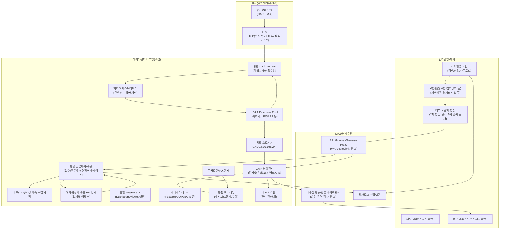
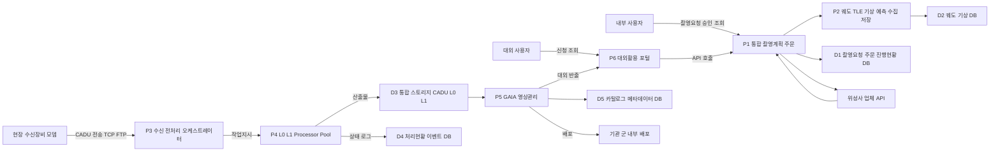
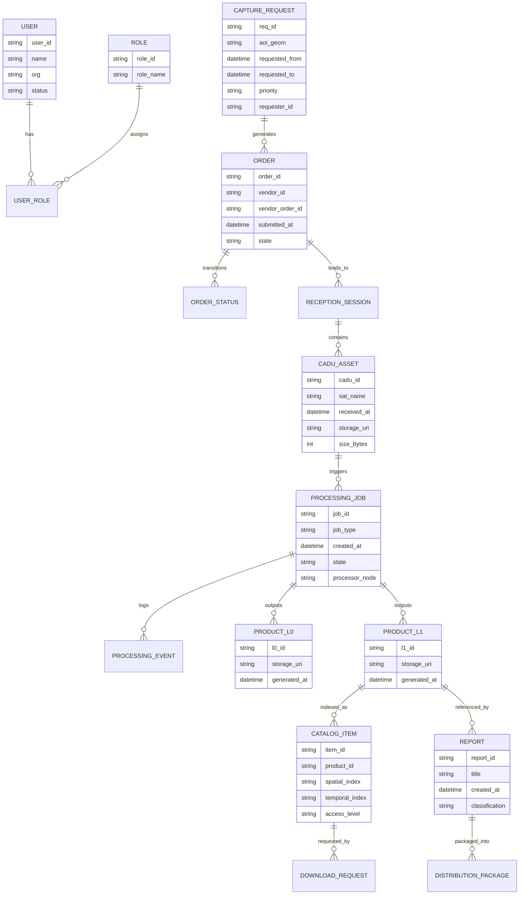
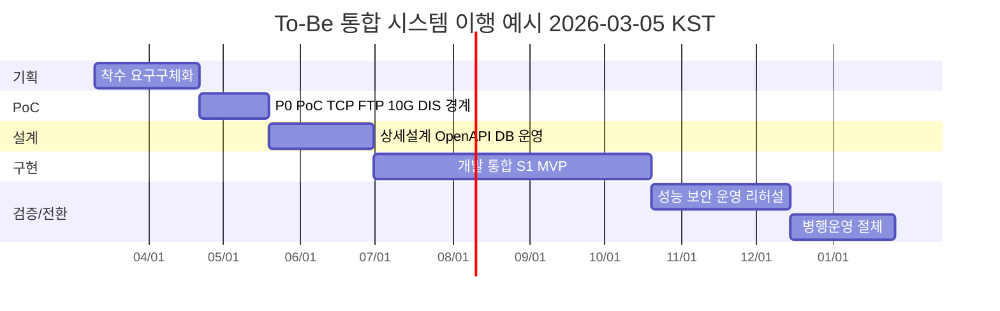

# 문서 A/B 종합 기반 To-Be 위성영상 통합 시스템 모델 설계 보고서

## Executive Summary

본 보고서는 **문서 A(구성도 중심: AS-IS/To-Be 통합 구성 및 모듈/화면 예시 포함)**, **문서 B(데이터센터 적용 가능성/구축 관점 분석: 프로토콜 전환·자원·업무방식 비교 포함)**를 참조하여, 두 문서의 내용을 **통합(To-Be)** 관점에서 재구성하고 **하나의 To-Be 시스템 모델**을 설계한 결과물이다. (현재 시점: **2026-03-05 KST**)

핵심 결론은 다음과 같다.

문서 A는 To-Be에서 **통합 촬영계획(접수/주문/진행현황/시뮬레이션)**, **국내위성 통합 수신·전처리(CADU→L0→L1 생성)**, **통합 DB/스토리지**, **GAIA 기반 영상관리(검색/분석/보고서/배포/GIS)**, **통합 모니터링/운영(VDI·관제)**, **내부망/인터넷망 분리 및 대외활용(다운로드/보안툴/대용량 전송)**의 큰 청사진을 제시한다(출처: 문서 A p.2~p.8). 또한 문서 A는 GIS 연계를 **OGC 표준(WMS/WPS/WTS)** 기반 웹서비스로 기술하며(출처: 문서 A p.4), 수신·전처리 내부 모듈을 **Pipe/MQ/REST 수신 + 표준 메시지 변환 + 신규 Processor 확장** 구조로 제시한다(출처: 문서 A p.7).

문서 B는 데이터센터 중심화의 “현실 제약”을 구체화한다. 특히 **현행 ECL 방식 수신을 데이터센터 적용을 위해 TCP 또는 FTP 기반으로 변경해야 함**, **DIS는 DRC 카드와의 프로토콜 확인이 필요하고 데이터센터 적용이 어려울 수 있음**, **실시간 수신은 로컬(고대역) 네트워크가 필요하며 10G 연결 필요**, **위성 수 증가에 따른 CADU/L0/L1 데이터 증가와 동시수신 처리 자원관리 필요**, **촬영계획의 직접/간접 방법 비교 및 API 기반 통합 촬영요청 가능성**을 제시한다(출처: 문서 B p.1~p.6, p.8).

따라서 To-Be 통합 설계의 “가장 중요한 의사결정 지점(P0)”은 **수신 프로토콜 전환(ECL→TCP/FTP)과 DIS 기능 경계 재정의(현장 잔존 vs DC 코어화)**이며(출처: 문서 B p.1~p.2, p.8), “확장성과 자동화 수준”에 따라 최소 2가지 시나리오 설계 대안이 타당하다.

- **시나리오 S1(전환 리스크 최소화형)**: 문서 A/B에서 공통적으로 등장하는 “FTP/TCP 기반 수신 + 중앙 오케스트레이션”을 **파일/DB 중심(폴링 포함)**으로 빠르게 구현하여 조기 안정화(출처: 문서 A p.5~p.7, 문서 B p.2).
- **시나리오 S2(확장·자동화 극대화형)**: 문서 A의 “MQ Subscriber/RESTful Receiver/신규 Processor” 구조를 적극 채택하여 **이벤트 기반(메시지 큐+워크플로)** 처리로 동시 수신/대량 재처리/우선순위 제어를 고도화(출처: 문서 A p.7).

본 보고서는 또한 API/문서화 표준으로 **OpenAPI 3.1.1**을 적용하여 HTTP API를 형식적으로 명세할 것을 권고한다. OpenAPI는 “HTTP API에 대한 표준적·언어 비종속 인터페이스”를 정의하여 사람과 도구가 API 기능을 이해·활용할 수 있게 한다. HTTP 의미/동작은 **RFC 9110(HTTP Semantics)**의 표준 의미체계에 맞추어 설계하고 , 보안 전송은 **TLS 1.3(RFC 8446)** 적용을 기본으로 권고한다. 인증·인가 모델은 **OAuth 2.0(RFC 6749)** 기반을 권고한다.

중요한 한계로서, 두 문서는 “그림/구축 방향/기술 검토” 중심이며 **정량 SLA, 데이터 분류등급, 권한 매트릭스, 기관별 배포 규정, 외부 계약 SLA** 등은 다수 **명시되지 않음**이다. 따라서 향후 실제 요구사항 명세/인터페이스 정의/보안 요구가 제공되면 본 To-Be 설계는 **재작성(정밀화)** 되어야 한다.

## 문서 입력과 요구사항 추출 템플릿

본 절은 문서 A/B를 직접 참조하여, 통합 설계를 위한 **요구사항 추출 템플릿**을 먼저 제시하고, 해당 템플릿으로 문서 A/B의 확인 가능 내용을 **통합 요약(설계 입력값)** 형태로 재구성한다. (문서 내 미확인/부재 항목은 **‘명시되지 않음’** 처리)

### 문서 유형 정리

문서 A는 AS-IS/To-Be **시스템 구성도**, **GAIA(영상관리) 시스템 개요**, **국내위성 통합 수신·전처리 처리 흐름 및 내부 모듈 상세**, **운영 화면 예시**가 포함된 “아키텍처/구성도 중심 문서”로 해석된다(출처: 문서 A p.1~p.9).  
문서 B는 “데이터센터 적용 분석 문서”로서 **수신 프로토콜 전환 필요성(ECL→TCP/FTP)**, **DIS/DRC 제약**, **데이터 증가/자원관리/전송 고려**, **촬영계획 업무 방식(직접/간접) 비교 및 통합 촬영요청 가능성**을 제시한다(출처: 문서 B p.1~p.6, p.8).

### 통합 설계용 요구사항 추출 템플릿

| 추출 항목        | 정의                                  | 문서 A에서 추출 포인트(예)                                                                     | 문서 B에서 추출 포인트(예)                                                         |
| ---------------- | ------------------------------------- | ---------------------------------------------------------------------------------------------- | ---------------------------------------------------------------------------------- |
| 목표/범위        | To-Be가 해결하려는 문제와 시스템 경계 | 내부망/인터넷망 분리, 통합 촬영계획, 통합 수신·전처리, GAIA 연계 (출처: 문서 A p.2)            | 데이터센터 SW 적용, 수신 방식 전환 필요 (출처: 문서 B p.1~p.2)                     |
| 이해관계자       | 사용 주체·운영 주체·연계 기관         | 촬영계획 담당관/판독관/분석관/관리자 등 역할 (출처: 문서 A p.1, p.4)                           | 사용자(촬영계획 수행)·위성보유기관/업체·운영센터/데이터센터 (출처: 문서 B p.4~p.6) |
| 기능 요구        | 업무 기능(업무흐름)                   | 촬영요청/승인/배포, 영상검색/분석/보고서, GIS 서비스 (출처: 문서 A p.4)                        | 주문·진행현황 중심 간접방식, 업체 API 기반 통합 촬영요청 (출처: 문서 B p.4~p.6)    |
| 비기능 요구      | 성능/가용성/보안/운영                 | 모니터링/대시보드/통계, 로그관리, 2차 인증(블록), 운영 화면(서버자원) (출처: 문서 A p.2, p.8)  | 실시간 수신 시 10G 필요, 동시수신 자원관리 (출처: 문서 B p.2, p.8, p.3)            |
| 제약/리스크      | 기술·조직·망·제도 제약                | 망 분리/망연계/대외 다운로드 보안 (출처: 문서 A p.2)                                           | DIS/DRC 프로토콜, ECL→TCP/FTP 전환 필요 (출처: 문서 B p.1)                         |
| 데이터/메타 모델 | 주요 데이터(원본/산출물/메타)         | CADU/L0/L1 정의 및 파일 유형(출처: 문서 A p.5)                                                 | 데이터 기하급수 증가, L1 서울센터 전송 고려(출처: 문서 B p.3)                      |
| 현재 아키텍처    | AS-IS 구성 및 기술스택                | GAIA: 2017 구축(시스템명 AURORA)→2023 개편(GAIA), DB(PostgreSQL/PostGIS) 등 (출처: 문서 A p.3) | 현행 수신 ECL (출처: 문서 B p.1)                                                   |
| 프로세스/흐름    | DFD/시퀀스로 표현 가능한 흐름         | To-Be 수신·전처리 처리 흐름(CADU→L0→L1) (출처: 문서 A p.5)                                     | 직접/간접 촬영계획 절차 정의(출처: 문서 B p.4)                                     |

### 문서 A/B 통합 요약

문서 A 통합 요약(핵심): To-Be는 데이터센터 내부망에 **통합 촬영계획 시스템(접수/주문/진행현황/시뮬레이션)**, **국내위성 통합 수신·전처리(CADU→L0→L1 생성)**, **통합 DB/통합 스토리지**, **영상관리시스템(GAIA)**, **통합 모니터링/운영**을 배치하고, 인터넷망에서 대외활용(검색/신청/다운로드)과 보안툴·대용량 전송을 분리한다(출처: 문서 A p.2). GAIA는 2017년 최초 구축(시스템명 AURORA) 후 2023년 개편(GAIA)되었고, DBMS로 PostgreSQL/PostGIS가 사용된 것으로 기재되어 있다(출처: 문서 A p.3). GIS 연계는 OGC 기반 웹서비스(WMS/WPS/WTS)로 설명한다(출처: 문서 A p.4). 수신·전처리 시스템은 CADU 데이터(위성 원시 데이터 단위)와 L0/L1 산출물 정의 및 파일 유형을 명시하고, 처리서버 수량(22대)을 제시한다(출처: 문서 A p.5). 내부적으로는 작업지시/처리현황 수신, Pipe/MQ/REST 수신, 표준 메시지 변환, 신규 Processor 확장 구조가 제시된다(출처: 문서 A p.7).

문서 B 통합 요약(핵심): 현행 수신은 ECL 방식이며, SW를 전부 데이터센터에 적용하려면 TCP 또는 FTP 방식으로 수신 변경이 필요하다(출처: 문서 B p.1). DIS는 DRC 카드와의 프로토콜 확인이 필요하여 데이터센터 적용이 어려울 수 있다(출처: 문서 B p.1). TCP/FTP 수신은 HW/SW 역할 분리를 통해 SW 전체를 데이터센터에 적용 가능하게 하나, 대용량 영상의 실시간 수신은 로컬 네트워크 연결이 필요하고 “저장 CADU를 FTP로 가져오는 방식”은 원격지여도 가능하다(출처: 문서 B p.2). 데이터는 위성 수 증가에 따라 기하급수적으로 증가하므로 관리정책과 동시간대 수신 처리 H/W 자원관리 방안이 필요하며, 최종 생성 데이터(L1)의 서울센터 전송 방안을 고려해야 한다(출처: 문서 B p.3). 촬영계획은 직접방법(위성별 계획 수립 후 결과 전송)과 간접방법(가용 위성 촬영가능일 확인 후 주문·진행현황 확인)으로 구분되며, 업체가 제공하는 촬영 API 확산으로 통합 촬영요청이 가능하다고 본다(출처: 문서 B p.4~p.6). 또한 데이터센터 DIS가 운영센터 장비와 연결되어 TCP 실시간 수신 및 FTP 다운로드를 수행하려면(실시간은 10G) 네트워크 구축이 필요하다(출처: 문서 B p.8).

## 두 문서 통합 분석과 상충사항 해결안

본 절은 문서 A/B의 **공통점·차이점·상충사항**을 정리하고, 통합 To-Be 설계에서의 **우선순위(P0/P1/P2)** 및 **해결 방안**을 제시한다.

### 공통점·차이점·상충사항 정리 표

| 구분              | 공통점                                   | 차이점                                                                                                         | 상충/리스크                                                               | 우선순위 | 해결 방안(권고)                                                                                                                                                   |
| ----------------- | ---------------------------------------- | -------------------------------------------------------------------------------------------------------------- | ------------------------------------------------------------------------- | -------- | ----------------------------------------------------------------------------------------------------------------------------------------------------------------- |
| 데이터센터 중심화 | 처리 SW를 데이터센터에 집중시키는 방향성 | A는 “전체 통합 청사진”, B는 “적용 가능성·제약” 중심                                                            | “이관 목표”와 “DIS는 어렵다” 제약이 충돌 (출처: 문서 B p.1)               | P0       | **현장 HW(모뎀/DRC 연계) 잔존 + DC 코어(오케스트레이션/처리/저장) 이관**으로 기능 경계 재정의. DIS 기능을 “현장 어댑터”와 “DC 처리코어”로 분해(출처: 문서 B p.1). |
| 수신 프로토콜     | TCP/FTP 기반 수신이 To-Be 기준           | A는 CADU 수신을 FTP Polling 등으로 표현, B는 ECL→TCP/FTP 전환을 명시                                           | ECL 유지 시 DC 적용 불가(핵심 기준 위반)                                  | P0       | **ECL→TCP/FTP 전환을 핵심 기준으로 고정**. 실시간(TCP)과 비실시간(FTP 다운로드) 경로를 분리해 단계 전환(출처: 문서 B p.2).                                        |
| 처리 파이프라인   | CADU→L0→L1 생성 흐름 필요                | A는 상세 모듈/표준 메시지·Receiver·Processor 확장 구조 제시(출처: 문서 A p.7)                                  | 데이터 증가/동시 수신 시 병목 가능(출처: 문서 B p.3)                      | P0       | 파이프라인을 **수집(Transfer)-오케스트레이션(Job)-처리(Processor)-카탈로그/배포(Publish)**로 분리. 우선순위/재처리/동시성 제어를 오케스트레이터에서 담당.         |
| 처리 자원(서버)   | 처리 서버 풀 운영 필요                   | A는 처리서버 수량 22대 제시(출처: 문서 A p.5)                                                                  | B는 동시수신 처리 자원관리 필요를 제시(출처: 문서 B p.3)                  | P0       | “서버 수량=정원”이 아니라 **큐 기반 할당**으로 자원관리. 목표 처리량/동시성은 비기능 요구에서 KPI로 명시.                                                         |
| 촬영계획 업무모델 | 통합 촬영요청이 필요                     | B는 직접/간접 방법 명확 비교(출처: 문서 B p.4), A는 통합 촬영계획(시뮬레이션 포함) 블록 제시(출처: 문서 A p.2) | 외부 위성별 최적화·비공개 시스템으로 직접방식 확장 한계(출처: 문서 B p.5) | P1       | 기본은 **간접방법(주문/진행현황 중심)**으로 통합. 고급 시뮬레이션·최적화는 특정 위성/업체부터 단계 도입(ROI 기반).                                                |
| GIS 표준          | OGC 기반 연계 필요                       | A는 WMS/WPS/WTS로 표기 및 정의 설명(출처: 문서 A p.4)                                                          | 표준 용어 정합성 필요(“WTS”는 통상 WMTS)                                  | P2       | 용어를 **WMS/WMTS/WPS**로 표준 정합화. WMS는 지오리퍼런싱된 지도 이미지 HTTP 인터페이스 표준. WMTS는 타일 기반 지도 제공 표준. WPS는 처리 서비스 입력/출력 표준.  |
| 대외 활용/보안    | 내부망/인터넷망 분리 전제                | A는 대외 다운로드/보안툴/망 분리 구조를 그림으로 포함(출처: 문서 A p.2)                                        | 보안 통제(등급/감사/반출 승인) 상세는 명시되지 않음                       | P0       | DMZ/API Gateway + 승인·검역·감사 로그 경로를 고정. 인증/인가 체계는 OAuth 2.0 기반 권고.                                                                          |

### 통합 설계 원칙

통합 To-Be 모델은 “EA 관점의 일관된 산출물”이 필요하므로, 엔터프라이즈 아키텍처 프레임워크로 TOGAF 적용이 합리적이다. TOGAF는 기업 아키텍처 표준으로서 핵심 개념/실무 가이드를 제공한다. 또한 설계 표현은 UML을 사용하면 아키텍처/컴포넌트/프로세스를 표준적으로 문서화할 수 있다.

## 통합 To-Be 시스템 설계

본 절은 “문서 A/B 통합 요약”을 근거로 **통합 To-Be 아키텍처**, **컴포넌트 다이어그램**, **DFD**, **주요 인터페이스 명세**, **ERD 초안**, 그리고 **시나리오 기반 대안(S1/S2)**을 제시한다.

### 원문 문서의 핵심 구조 시각자료

아래 이미지는 사용자가 제공한 원문 문서 중 To-Be 및 프로토콜 전환 논의를 대표하는 페이지이다.

(출처: 문서 A p.2)

(출처: 문서 B p.1)

### 통합 To-Be 컴포넌트 아키텍처

#### 기본 통합안

아래 Mermaid 다이어그램은 문서 A의 To-Be 통합 블록(통합 촬영계획, 통합 수신·전처리, 통합 DB/스토리지, GAIA, 모니터링/운영, 인터넷망 대외활용)과 문서 B의 전환 제약(TCP/FTP, 10G)을 반영하여 **논리 컴포넌트 구조**로 재구성한 것이다(출처: 문서 A p.2, p.5~p.7 / 문서 B p.2, p.8).

#### 시나리오 기반 대안 설계

| 시나리오                | 핵심 개념                                                                          | 장점                                                                   | 단점/리스크                                                    | 적합 조건                                          |
| ----------------------- | ---------------------------------------------------------------------------------- | ---------------------------------------------------------------------- | -------------------------------------------------------------- | -------------------------------------------------- |
| S1 전환 리스크 최소화형 | **TCP/FTP 수신 + 파일/폴링/DB 중심 오케스트레이션** (출처: 문서 A p.5, 문서 B p.2) | 구현·운영 단순, 레거시 전환 부담 감소                                  | 동시 수신/대량 재처리에서 폴링·DB 병목 위험, 자동화 한계       | 초기 통합(단기), 장애/변경 리스크가 매우 큰 조직   |
| S2 확장·자동화 극대화형 | **MQ/REST + 이벤트 기반(큐/워크플로) 오케스트레이션** (출처: 문서 A p.7)           | 동시성·확장성 우수, 우선순위·재처리 자동화, 신규 Processor 온보딩 용이 | 초기 복잡도 증가(큐/워크플로 운영), 관측성/장애 대응 체계 필요 | 위성/수신량 증가가 빠르고, 운영자동화가 KPI인 조직 |

권고: “P0 제약(프로토콜 전환, DIS 경계)”이 최우선이므로, 일반적으로 **S1로 조기 안정화 후 S2로 점진 고도화**(단계적 전환)가 리스크-가치 균형이 좋다(출처: 문서 B p.1~p.3).

### 데이터 흐름도 DFD

문서 A의 CADU→L0→L1 흐름(출처: 문서 A p.5)과 문서 B의 주문/진행현황·전송 고려(출처: 문서 B p.3~p.6)를 통합한 상위 DFD는 다음과 같다.

### 주요 인터페이스 명세 초안

API는 HTTP 기반 표준 의미체계(RFC 9110) 준수를 권고한다. 또한 API 문서화는 OpenAPI 3.1.1 적용을 권고한다.

| IF ID          | 송신 → 수신                     | 프로토콜/형태                  | 주요 데이터                      | 인증/암호화                  | 비고                                                                                                 |
| -------------- | ------------------------------- | ------------------------------ | -------------------------------- | ---------------------------- | ---------------------------------------------------------------------------------------------------- |
| IF-PLAN-REQ    | 포털/내부UI → 통합 촬영계획     | HTTPS REST(OpenAPI)            | 촬영요청(AOI, 기간, 우선순위 등) | TLS 1.3 권고 / OAuth2 권고   | 응답시간 목표는 비기능에서 정의(명시되지 않음→권고치 제시)                                           |
| IF-PLAN-VENDOR | 통합 촬영계획 ↔ 위성사/업체     | HTTPS REST                     | 주문/상태조회(업체별 스키마)     | 업체별 정책(명시되지 않음)   | 업체 API 제공 확산으로 통합 가능(출처: 문서 B p.6)                                                   |
| IF-ORBIT-TLE   | 외부 TLE 제공처 → 궤도 수집     | HTTPS/파일                     | TLE(2-line element)              | TLS                          | 문서 A는 CelesTrak/Space-Track를 언급(출처: 문서 A p.2). TLE 포맷은 CelesTrak 문서로 구조 확인 가능. |
| IF-RX-CADU     | 현장 모뎀 → DC 수신 API         | TCP(실시간) 또는 FTP(다운로드) | CADU(Binary)                     | 전용망/망분리(명시되지 않음) | TCP/FTP 전환 필요(출처: 문서 B p.1~p.2), 실시간은 10G 필요(출처: 문서 B p.8)                         |
| IF-PROC-JOB    | 오케스트레이터 → Processor      | MQ/REST/PIPE(시나리오별)       | 작업지시(Job spec)               | 내부 mTLS 권고               | 문서 A의 Pipe/MQ/REST Receiver 구조 반영(출처: 문서 A p.7)                                           |
| IF-PROC-RESULT | Processor → 수신/오케스트레이터 | MQ/REST                        | 처리결과 표준메시지              | 내부망                       | 문서 A는 처리결과 표준 메시지 예시를 제시(출처: 문서 A p.7)                                          |
| IF-GIS-WMS     | GAIA → GIS 클라이언트           | OGC WMS                        | 지도 이미지(PNG/JPEG 등)         | TLS                          | WMS는 지오등록 지도 이미지 요청을 위한 HTTP 인터페이스 표준.                                         |
| IF-GIS-WMTS    | GAIA → GIS 클라이언트           | OGC WMTS                       | 타일 이미지                      | TLS                          | WMTS는 사전 정의된 타일로 지도 제공 표준.                                                            |
| IF-GIS-WPS     | GAIA → 처리 서비스              | OGC WPS                        | 공간처리 입력/출력               | TLS                          | WPS는 처리 서비스의 입력/출력 표준화.                                                                |

### 데이터 모델 ERD 초안

문서 A의 데이터 단위(CADU/L0/L1) 및 처리/현황/카탈로그(출처: 문서 A p.5, p.8), 문서 B의 주문·진행현황(출처: 문서 B p.4~p.6)을 반영하여 최소 ERD를 제시한다.

#### 메타데이터 표준(옵션)

문서 A가 “카탈로그 뷰/검색”을 포함하고(출처: 문서 A p.8), 대외 활용까지 고려한다면, 위성영상 자산 메타데이터 구조를 표준화하는 것이 장기적으로 유리하다. STAC은 지리공간 자산 메타데이터의 구조와 질의를 표준화하려는 “스펙 패밀리”로 정의되며, OGC도 STAC 표준군을 공개한다. 다만, 발주/운영기관의 표준 채택 정책은 문서에 **명시되지 않음**이므로 옵션으로 제시한다.

## 비기능 요구사항

본 절은 성능/보안/가용성/확장성/운영·모니터링 요구를 **정량 목표**로 제시하며, 문서에서 확인되지 않는 항목은 **‘명시되지 않음’**으로 표기한다. 단, 문서 B는 “실시간 수신 10G”라는 정량 조건을 명시한다(출처: 문서 B p.8).

### 비기능 요구사항 표

| 영역                      | 요구사항(목표치)                                                                       | 근거/상태                                                                                                              |
| ------------------------- | -------------------------------------------------------------------------------------- | ---------------------------------------------------------------------------------------------------------------------- |
| 성능(수신 네트워크)       | 실시간 수신 경로: **10GbE 이상**                                                       | 문서 B 명시(출처: 문서 B p.8)                                                                                          |
| 성능(수신 방식)           | 실시간(TCP) + 비실시간(FTP 다운로드) **이중 경로 지원**                                | 문서 B 명시(출처: 문서 B p.2)                                                                                          |
| 성능(처리 파이프라인)     | CADU 수신→Job 생성: **≤ 60초(권고)** / L1 생성 p95: **≤ 30분(권고)**                   | 문서에 정량 SLA **명시되지 않음** → 운영 KPI로 권고(근거: 문서 A의 진행률/재처리/단계 모니터링 전제, 출처: 문서 A p.8) |
| 처리 자원                 | 처리서버 풀: **최소 22대 기준 + 수평 확장 가능**                                       | 문서 A 처리서버 22대 명시(출처: 문서 A p.5)                                                                            |
| 확장성(프로세서/프로토콜) | 신규 위성/프로세서 추가 시 “플러그인/모듈 추가” 방식으로 확장                          | 문서 A의 신규 Processor/신규 Protocol 및 Receiver 구조(출처: 문서 A p.7)                                               |
| 보안(전송)                | 외부/내부 API는 TLS 1.3 수준 적용 권고                                                 | TLS 1.3은 도청/변조/위조 방지를 목표로 표준화.                                                                         |
| 보안(인증/인가)           | OAuth 2.0 기반 토큰 인가 + (필요 시) OIDC 인증(권고)                                   | OAuth 2.0 표준 정의.                                                                                                   |
| 보안(대외 반출 통제)      | 대외 다운로드/전송은 “승인·검역·감사로그” 단일 경로로 고정(권고)                       | 문서 A는 대외활용/보안툴/로그관리 블록 존재(출처: 문서 A p.2). 상세 기준은 **명시되지 않음**                           |
| 가용성(SLO)               | 핵심 내부(수신/처리/GAIA): **월 99.9%(권고)** / 대외 포털: **월 99.5%(권고)**          | 문서에 **명시되지 않음** → 운영 목표로 권고                                                                            |
| DR(RTO/RPO)               | RTO **4시간(권고)** / RPO **15분(권고)**                                               | 문서에 **명시되지 않음** → 대용량 자산·메타DB 분리 기준으로 권고                                                       |
| 운영·모니터링             | 처리 단계(CADU/L0/L1), 진행률, 오류, 재처리, 카탈로그, 서버 CPU/메모리 모니터링 제공   | 문서 A UI/모니터링 요소 명시(출처: 문서 A p.8)                                                                         |
| 보안 거버넌스             | ISMS-P 통제항목(인증·권한관리, 접근통제, 암호화, 개발보안 등)과 설계 산출물 매핑(권고) | KISA는 ISMS-P 제도 소개 및 인증기준 항목을 공개.                                                                       |

## 이행 계획

본 절은 문서 A/B의 현실 제약을 고려해 **마일스톤**, **리스크**, **검증·테스트**, **전환(마이그레이션)**을 제시한다. 특히 P0는 수신 전환(ECL→TCP/FTP)과 동시수신 처리 자원관리, 데이터 폭증 대응이다(출처: 문서 B p.1~p.3).

### 단계별 마일스톤 및 타임라인

| 단계                  | 기간(예시) | 핵심 목표                                                        | 산출물/게이트                                       |
| --------------------- | ---------: | ---------------------------------------------------------------- | --------------------------------------------------- |
| 착수/요구 구체화      |        6주 | 업무범위·연계목록·데이터 분류/권한·성능 KPI 확정                 | 요구사항 베이스라인(명시되지 않음 항목 목록 포함)   |
| P0 PoC                |        4주 | **TCP/FTP 수신 전환 PoC**, 10G 경로 검증, DIS 경계(현장/DC) 정의 | PoC 결과보고, 전환 방식 확정(출처: 문서 B p.2, p.8) |
| 상세설계              |        6주 | 컴포넌트/인터페이스(OpenAPI)/DB/운영 설계                        | 설계검토(보안/운영 포함)                            |
| 개발/통합             |       16주 | S1 기준 MVP 구현(촬영요청-주문-수신-처리-카탈로그-배포)          | 통합 테스트 통과                                    |
| 성능/보안/운영 리허설 |        8주 | 부하/장애/복구/감사/반출 절차 검증                               | 성능·보안 성적서, 런북                              |
| 병행운영/절체         |        6주 | 병행운영 후 절체, 롤백 검증                                      | 절체 체크리스트 완료                                |

### 주요 리스크와 대응(우선순위 포함)

| 리스크                      | 내용                                             | 우선순위 | 대응                                                                             |
| --------------------------- | ------------------------------------------------ | -------- | -------------------------------------------------------------------------------- |
| ECL→TCP/FTP 전환 실패       | DC 적용 전제가 무너짐(출처: 문서 B p.1)          | P0       | PoC에서 실시간(TCP)·비실시간(FTP) 경로를 분리 검증(출처: 문서 B p.2)             |
| DIS/DRC 프로토콜 불확실     | DRC 카드 연동 제약(출처: 문서 B p.1)             | P0       | DIS 기능을 “현장 어댑터+DC 코어”로 분해, 벤더 협의/문서화                        |
| 동시 수신 처리 병목         | 위성 수 증가로 동시 처리 요구(출처: 문서 B p.3)  | P0       | 큐/스케줄링 기반 자원관리(S2로 고도화), 서버풀(22대) 기준 확장(출처: 문서 A p.5) |
| 데이터 폭증/비용            | CADU/L0/L1 데이터 증가(출처: 문서 B p.3)         | P0       | 데이터 수명주기(보관/아카이브/파기) 정책 수립(현재 **명시되지 않음**)            |
| 촬영계획 직접방식 확장 한계 | 외부 시스템 비공개/최적화 필수(출처: 문서 B p.5) | P1       | 간접방식 중심 통합, 어댑터 패턴·계약 SLA 기반 단계 확대                          |
| 대외 다운로드 보안          | 내부망 자산 반출 통제 필요(출처: 문서 A p.2)     | P0       | DMZ 게이트, 승인·검역·감사로그. ISMS-P 통제 항목에 매핑 권고                     |

### 검증·테스트 전략

API는 HTTP 의미체계(RFC 9110) 기반으로 상태코드/메서드 준수를 검증하고 , API 정의서는 OpenAPI 3.1.1 스키마 검증을 통해 품질을 확보한다.

테스트는 최소한 다음을 포함해야 한다.

기능(E2E): 촬영요청→주문→수신→L0/L1→등록/카탈로그→검색→보고서→배포를 E2E 시나리오로 검증(출처: 문서 A p.2, p.5 / 문서 B p.4~p.6).  
성능: 실시간 수신 10G 조건에서 지속 수신 및 동시수신 상황을 부하로 재현(출처: 문서 B p.8).  
보안: TLS 1.3 적용 여부(암호강도/취약 설정), OAuth2 토큰 흐름 및 권한(RBAC) 검증.  
표준 적합성: WMS/WMTS/WPS 요청·응답 기본 적합성 검증.

### 전환(마이그레이션) 전략

권고 전환 전략은 “기술 전환(P0) → 기능 통합 → 운영 절체” 순서의 단계적 접근이다.

- 1단계(P0): 수신 프로토콜 전환(ECL→TCP/FTP) 및 DIS 경계 재정의(출처: 문서 B p.1~p.2).
- 2단계: S1(MVP)로 통합 촬영요청(간접방식)·오케스트레이션·카탈로그·GAIA 연계를 안정화(출처: 문서 A p.2, p.7 / 문서 B p.6).
- 3단계: 수신량 증가/자동화 KPI가 확인되면 S2(이벤트 기반)로 단계 전환(출처: 문서 A p.7).

데이터 마이그레이션(무엇을 옮길지): CADU/L0/L1 원본 및 메타데이터/카탈로그 항목(출처: 문서 A p.5, p.8). 다만 “보관기간/이관범위/파기정책”은 **명시되지 않음**이므로, 착수 단계에서 정책을 먼저 확정해야 한다(출처: 문서 B p.3).

## 산출물과 책임·검토 기준

본 절은 To-Be 설계를 “PDF/감리/검토가 가능한 산출물 세트”로 정리한다. 역할/조직명은 문서에 명시되어 있지 않으므로 **역할 기반(Owner/Reviewer)**으로 제시한다.

TOGAF는 표준/가이드/템플릿 라이브러리를 통해 EA 산출물 구성을 지원한다. UML은 시스템 표현을 위한 국제 표준 명세로, 다이어그램 기반 문서화를 정합화한다.

### 산출물 목록 표

| 산출물                         | Owner(책임)         | Reviewer(검토)          | 검토 기준(DoD)                                                       |
| ------------------------------ | ------------------- | ----------------------- | -------------------------------------------------------------------- |
| 통합 요구사항 명세서(SRS)      | BA/PO               | 현업/운영/보안/아키텍트 | ‘명시되지 않음’ 목록 포함, 우선순위(P0/P1/P2) 확정, 상충 해결 기록   |
| To-Be 아키텍처 정의서          | EA/솔루션 아키텍트  | 아키텍처 위원회/PMO     | TOGAF 관점 계층 정합(비즈니스/데이터/앱/기술)                        |
| 컴포넌트/배치/DFD/UML 패키지   | 솔루션 아키텍트     | 개발리드/운영리드       | UML 표기 일관, 인터페이스/데이터 흐름 추적 가능                      |
| 인터페이스 명세(OpenAPI)       | API 리드            | 개발/QA/보안            | OpenAPI 3.1.1 스키마 검증 통과, 버전관리 정책 명시                   |
| 데이터 모델(ERD/DDL)           | DBA/데이터 아키텍트 | 아키텍트/개발/운영      | 촬영요청·주문·수신·처리·카탈로그·배포·감사 엔터티 커버               |
| 보안 설계서                    | 보안 담당           | CISO/감사               | TLS 1.3, OAuth2, 망분리, 감사로그 정책 포함                          |
| GIS 표준 적합성 문서           | GIS/플랫폼 리드     | 아키텍트/개발           | WMS/WMTS/WPS 인터페이스 적합성 기준 정의                             |
| 테스트 계획/케이스/성적서      | QA 리드             | 개발/운영/보안          | E2E·부하·보안·표준 적합성 테스트 포함(OpenAPI/OGC)                   |
| 전환/절체 계획서(롤백 포함)    | PM/운영리드         | 전 구성원               | 병행운영·롤백·절체 리허설 완료                                       |
| 운영 매뉴얼/런북/대시보드 정의 | SRE/운영리드        | 현업/PM                 | 처리 단계·진행률·재처리·서버 상태 등 운영지표 포함(출처: 문서 A p.8) |

### 실제 문서 제공 시 재작성 조건 명시

본 보고서는 제공된 두 문서가 “구성도/기술 검토” 중심이어서, 다음 정보가 다수 **명시되지 않음** 상태로 남아 있다.

- 데이터 분류등급/반출 등급 정책, 권한 매트릭스, 감사로그 보관기간
- 기관별 배포 규정 및 대외 다운로드 통제 기준
- 외부 위성사/업체 API의 SLA/에러코드/버전 정책
- 성능 목표(응답시간/처리시간/처리량) 정량 SLA

따라서 **요구사항 명세서, 인터페이스 정의서, 보안 요구서, 운영 SLA**가 추가 제공되면 본 To-Be 설계(아키텍처/DFD/ERD/NFR/이행계획)는 해당 근거에 맞추어 **재작성(정밀화)** 되어야 한다.

## 참고 표준·프레임워크

- TOGAF(The Open Group) 표준/가이드: https://www.opengroup.org/togaf
- UML 2.5.1(OMG) 표준: https://www.omg.org/spec/UML/2.5.1
- OpenAPI Specification 3.1.1: https://spec.openapis.org/oas/v3.1.1.html
- HTTP Semantics(RFC 9110): https://www.rfc-editor.org/rfc/rfc9110
- TLS 1.3(RFC 8446): https://www.rfc-editor.org/rfc/rfc8446
- OAuth 2.0(RFC 6749): https://www.rfc-editor.org/rfc/rfc6749
- OGC WMS / WMTS / WPS 표준:
  - WMS: https://www.ogc.org/standards/wms
  - WMTS: https://www.ogc.org/standards/wmts
  - WPS: https://www.ogc.org/standards/wps
- STAC(OGC/커뮤니티) 표준:
  - STAC Spec: https://stacspec.org/
  - OGC STAC: https://www.ogc.org/standards/stac
- KISA ISMS-P 제도/기준(한국어):
  - 제도 안내: https://isms.kisa.or.kr/main/ispims/intro/
  - 인증 기준/고시 안내: https://isms.kisa.or.kr/main/ispims/notice/
- TLE 포맷(공식 문서 예: CelesTrak): https://celestrak.org/NORAD/documentation/tle-fmt.php

(원문 문서 출처: 사용자 제공 **문서 A=구성도.pdf**, **문서 B=분석.pdf**, 페이지 표기는 본문에 기재)
