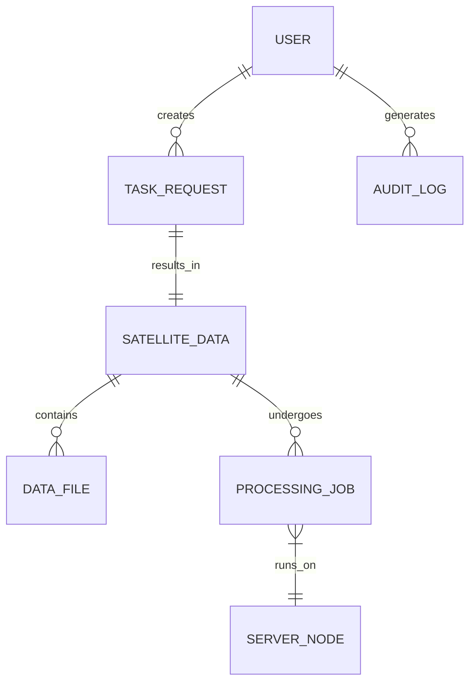
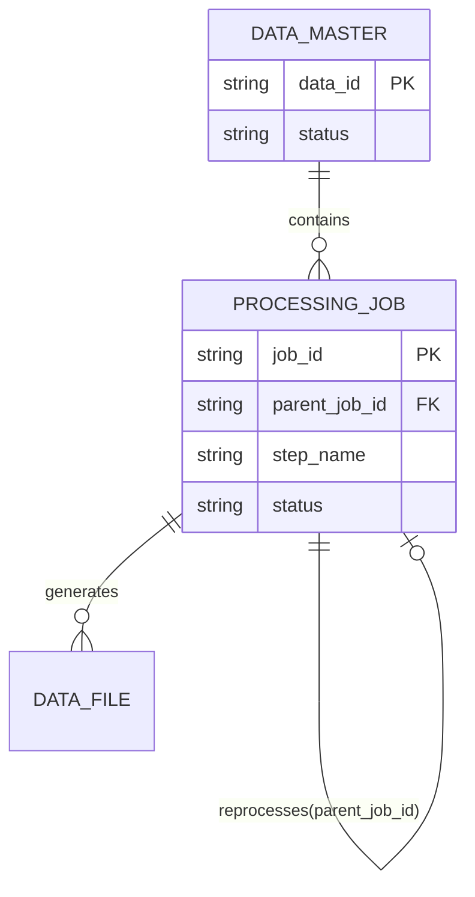
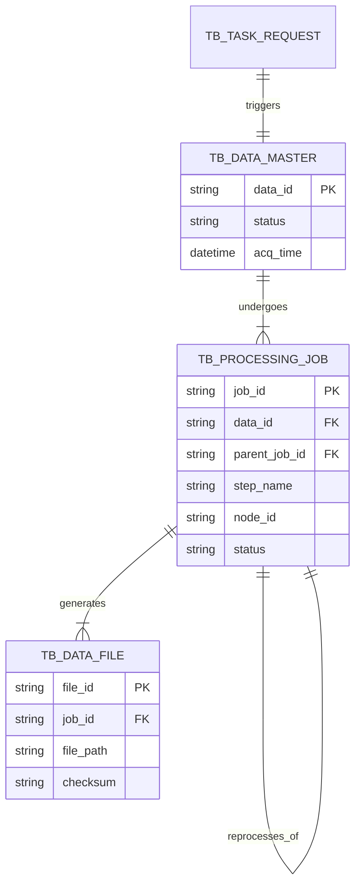
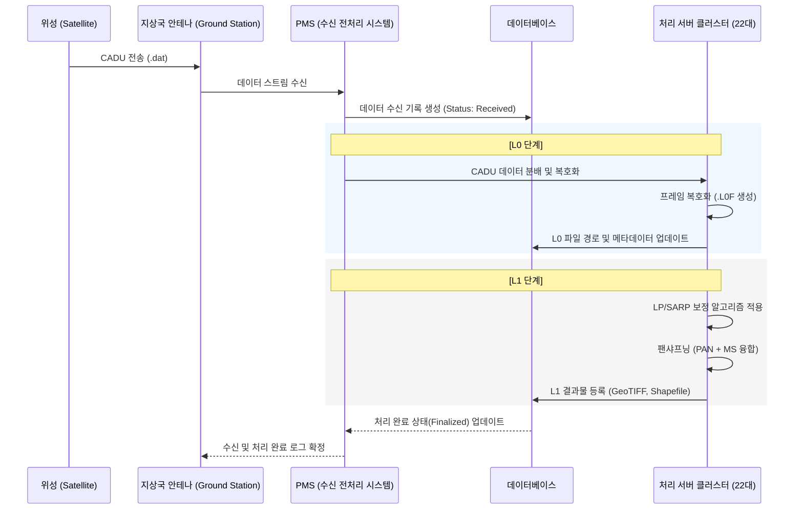
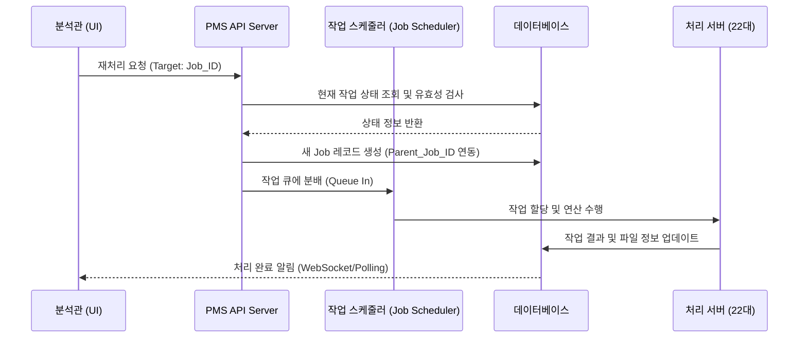

영상관리시스템(PMS)의 데이터 모델링을 위해서는 **데이터의 생애주기(수신 → 처리 → 저장 → 분석/배포)**와 **운영 자원(서버/사용자/권한)**이라는 두 축을 중심으로 엔터티를 설계해야 합니다.

핵심 엔터티를 4가지 논리적 그룹으로 나누어 정리해 드립니다.

---

### 1. 데이터 관리 엔터티 (핵심 데이터)

위성 영상의 원천부터 결과물까지를 추적하는 가장 중요한 영역입니다.

- **Satellite_Data (데이터 세트):** 모든 영상의 중심 테이블. 위성 정보, 수집 시간, 촬영 영역(Bounding Box), 상태값(수신/처리/완료/오류)을 포함합니다.
- **Data_File (파일 상세):** 실제 파일 정보. `CADU`, `L0`, `L1` 등 단계별로 생성되는 파일(`*.raw`, `*.tiff`, `*.shp` 등)과 파일 경로를 매핑합니다.
- **Metadata (메타데이터):** 위성 센서 파라미터, 위성 자세 정보, 보정 히스토리 등을 저장합니다.

### 2. 처리 및 작업 관리 엔터티 (작업 추적)

시스템의 작업 흐름과 서버 부하를 관리합니다.

- **Processing_Job (처리 작업):** 수신, 복호화, 팬샤프닝, NUC 보정 등 단위 작업을 관리합니다. 현재 작업 상태(진행 중, 대기, 오류, 완료)와 작업 시 시작/종료 시간을 기록합니다.
- **Server_Node (처리 서버):** 작업이 할당되는 서버 자원(22대). CPU, Memory 점유율, 서버 상태 등을 실시간으로 모니터링합니다.
- **Job_Assignment (작업 할당):** 어떤 작업이 어떤 서버에 할당되어 처리되고 있는지 매핑하는 엔터티입니다.

### 3. 사용자 및 권한 엔터티 (운영 및 보안)

역할별 접근 제어(RBAC)를 위한 엔터티입니다.

- **User (사용자):** 판독관, 분석관, 관리자의 계정 정보.
- **Role_Permission (권한):** 메뉴별 접근 권한 및 기능 수행 권한.
- **Audit_Log (로그):** 시스템 내 모든 활동(로그인, 촬영요청, 데이터 삭제 등)에 대한 기록.

### 4. 업무 프로세스 엔터티 (촬영 및 분석)

시스템의 목적이 되는 핵심 서비스들입니다.

- **Task_Request (촬영/분석 요청):** 촬영요청 정보, 요청자, 우선순위, 요청 내역.
- **Target (표적 정보):** 분석관이 관리하는 관심 지역이나 표적지 정보.
- **Thematic_Map (주제도):** 생성된 주제도 결과물 및 연관된 분석 리포트 정보.

---

### [데이터 모델 관계도 개념(ERD)]



### 설계를 위한 제언

1. **계층적 상태 관리:** `SATELLITE_DATA` 엔터티에 `Data_Level` 속성(CADU, L0, L1)을 두어 데이터의 현재 상태를 구분하면 재처리(Reprocessing) 로직을 훨씬 쉽게 구현할 수 있습니다.
2. **이력 관리:** `PROCESSING_JOB`과 `AUDIT_LOG`는 시스템 오류 발생 시 원인을 파악하고 재처리를 수행하는 데 필수적이므로, 타임스탬프와 서버 ID를 반드시 포함해야 합니다.
3. **확장성:** 향후 위성 데이터 종류(SAR, 광학 등)가 늘어날 경우를 대비해 `Satellite_Sensor` 마스터 엔터티를 분리하여 관리하는 것을 추천합니다.

위 엔터티들을 바탕으로 **"촬영요청부터 결과물 배포까지"의 상세 테이블 속성(Attribute) 정의**가 필요하신가요? 아니면 특정 엔터티 간의 관계를 더 구체화해 드릴까요?

데이터 모델링을 본격적으로 시작하기 위해서는 **'어떤 데이터가 어떤 속성을 가지고, 어떻게 서로 연결되는지'**를 구체적인 테이블 명세로 정리해야 합니다.

시스템 설계 시 가장 중요한 **핵심 엔터티(Entity)**들의 속성(Attribute) 예시를 정리해 드립니다. 이 설계를 기초로 삼으면 안정적인 시스템 구축이 가능합니다.

---

### 1. 핵심 데이터 모델 상세 속성 (예시)

#### ① Satellite_Data (위성 영상 기본 정보)

- `data_id` (PK): 영상 고유번호
- `satellite_name`: 위성 명칭
- `acquisition_time`: 촬영 시간
- `sensor_type`: 센서 유형 (Optical, SAR 등)
- `data_level`: 데이터 단계 (CADU, L0, L1)
- `cloud_coverage`: 운량
- `file_path`: 물리적 저장 경로

#### ② Processing_Job (작업 관리)

- `job_id` (PK): 작업 고유번호
- `data_id` (FK): 연관된 영상 ID
- `job_type`: 작업 유형 (Decrypt, Calibration, Pan-Sharpening, Resampling)
- `status`: 작업 상태 (대기, 진행 중, 완료, 오류)
- `server_id` (FK): 수행 중인 서버 ID
- `error_code`: 오류 발생 시 코드 (밴드 정합 오류 등)
- `start_time`, `end_time`: 처리 시간

#### ③ Server_Node (서버 상태 관리)

- `server_id` (PK): 서버 고유번호
- `ip_address`: 서버 IP
- `cpu_load`: CPU 사용률
- `mem_load`: 메모리 사용률
- `is_active`: 운영 여부 (True/False)

---

### 2. 설계 시 고려해야 할 중요한 포인트 (Best Practices)

1. **데이터 무결성(Data Integrity):** L0에서 L1으로 넘어가는 과정에서 데이터가 유실되지 않도록, `Processing_Job`에서 각 단계가 완료될 때마다 **데이터 체크섬(Checksum)** 값을 저장하여 파일 변조 여부를 확인해야 합니다.
2. **재처리(Reprocessing) 로직:** 데이터 분석 중 오류가 발견되면 원본(`Raw`)을 다시 가져오는 것이 아니라, 마지막 성공 단계(`L0` 또는 중간 단계)부터 다시 시작하도록 `Job_Sequence`를 관리해야 합니다. 이를 위해 **이전 작업 ID(Parent_Job_ID)**를 속성으로 추가하는 것이 좋습니다.
3. **메타데이터의 분리:** 영상 정보(이미지)와 속성 정보(위성 궤도, 센서 설정)를 테이블로 분리하면, 추후 다양한 종류의 위성 데이터가 들어오더라도 시스템 구조를 변경하지 않고도 유연하게 확장할 수 있습니다.

---

### 다음 단계 제안

데이터 모델의 큰 그림이 잡혔으니, 이제 시스템 운영의 핵심인 **'촬영 요청부터 최종 결과물 배포까지의 데이터 흐름(Workflow)'**을 구체적으로 도식화하거나, 특정 기능(예: 위성 촬영계획 최적화)을 위한 알고리즘 모델링으로 넘어가 볼까요?

데이터 모델링에서 **"어떤 것이 먼저인가"**에 대한 질문은, 시스템의 **데이터 무결성(Integrity)**과 **워크플로우의 연속성**을 확보하는 데 매우 중요한 질문입니다.

결론부터 말씀드리면, **[마스터 데이터(위성 정보)] → [작업 단위(Job)] → [결과 데이터(File)]** 순으로 모델링하고 설계하는 것이 가장 안정적입니다.

---

### 1. 설계의 우선순위 (엔터티 생성 순서)

시스템이 데이터를 받아 처리하기 위한 논리적 순서는 다음과 같습니다.

1. **기준 정보(Master Data) 설계 (가장 먼저):** \* 시스템에 등록된 위성, 센서 정보, 서버 노드, 사용자 정보 등 **'변하지 않는 기본 틀'**을 먼저 정의해야 합니다. 이들이 정의되어야 나중에 들어올 영상 데이터가 "어느 위성에서 왔는지", "어떤 서버에서 처리할지"를 식별할 수 있습니다.
2. **데이터 세트(Satellite_Data) 엔터티 생성:**

- 위성이 데이터를 전송하는 즉시 데이터의 '껍데기(Record)'가 생성됩니다. 파일 자체는 나중에 들어오더라도, **'데이터가 들어올 예정'**이라는 메타데이터(수신 시간, 위성 ID, 단계 = CADU)가 먼저 DB에 등록되어야 시스템이 이 작업을 추적(Tracking)할 수 있습니다.

3. **작업 관리(Processing_Job) 엔터티 생성:**

- 수신된 `CADU`를 `L0`로, 다시 `L1`으로 변환하는 **'행위'**를 모델링합니다. 여기서 '재처리'를 위한 연결 고리(`Parent_Job_ID`)가 중요해집니다.

4. **파일 상세(Data_File) 엔터티 매핑:**

- 최종적으로 생성되는 파일(`*.tiff`, `*.shp` 등)들의 경로와 체크섬 값을 저장합니다.

---

### 2. 왜 이 순서인가요? (데이터 흐름의 논리)

- **식별자(ID)의 의존성:** `Satellite_Data` 엔터티가 생성되어야 `data_id`라는 키 값이 생깁니다. 모든 후속 작업(복호화, 팬샤프닝, 보정)은 이 `data_id`를 참조(FK)해야 합니다. 이를 거꾸로 하면 참조 무결성 오류가 발생합니다.
- **상태 추적의 용이성:** 위에서 말씀드린 순서대로 설계하면, 특정 데이터가 지금 시스템의 어느 단계(CADU, L0, L1)에 있는지, 어떤 서버에서 작업 중인지(Server_Node)를 쿼리 한 번으로 즉시 파악할 수 있습니다.

---

### 3. 실제 적용을 위한 '선행 작업' 추천

지금 바로 설계를 시작하신다면, **데이터 생애주기 테이블**을 가장 먼저 그려보시길 추천합니다.

1. **위성/센서 테이블 (기본)**
2. **수신된 데이터 기록 테이블 (생성)**
3. **작업 이력 테이블 (실행)**

**다음 단계 제안:**
혹시 위 순서대로 엔터티를 작성할 때, **"재처리를 위해 L0에서 오류가 났을 때 원본 데이터를 어떻게 링크로 연결할지(FK 구조)"**에 대해 구체적인 테이블 스키마 예시를 보여드릴까요? 이 부분은 시스템 안정성에 결정적인 역할을 합니다.

좋습니다. 시스템 안정성을 위해 **재처리(Reprocessing) 로직**이 포함된 핵심 테이블 스키마와 데이터 흐름을 구체적으로 설계해 보겠습니다.

### 1. 핵심 데이터 모델링 (스키마 설계)

시스템의 '데이터 생애주기'를 관리하기 위해 `Data_Master`와 `Processing_Job`을 **1:N 관계**로 설정하는 것이 핵심입니다.

| 엔터티             | 주요 속성 (Attributes)                                                     | 역할                                        |
| ------------------ | -------------------------------------------------------------------------- | ------------------------------------------- |
| **Data_Master**    | `data_id`(PK), `acquisition_date`, `sensor_type`, `status`                 | 전체 영상의 기본 정보와 현재 처리 단계 관리 |
| **Processing_Job** | `job_id`(PK), `data_id`(FK), `step_name`(L0/L1), `parent_job_id`, `status` | 각 단계별 작업 이력 및 재처리 추적          |
| **Data_File**      | `file_id`(PK), `job_id`(FK), `file_path`, `checksum`, `file_type`          | 생성된 결과 파일과 데이터 무결성 기록       |

---

### 2. 재처리 로직 구현 (데이터 흐름)

오류 발생 시 원본(`Raw`)부터 다시 시작하면 자원 낭비가 심합니다. 이를 위해 **이전 작업 ID(parent_job_id)**를 활용한 **분기 처리**를 권장합니다.

1. **정상 흐름:** `CADU` → `L0` → `L1` (각 단계 `job_id`가 체인처럼 연결)
2. **오류 발생 시:** 시스템이 `status='ERROR'`를 감지하고, 해당 `data_id`를 대상으로 마지막 `job_id`를 찾아 **재처리 명령(Retry)**을 생성합니다.
3. **데이터 링크:** 새로운 `job_id`를 생성할 때 `parent_job_id`에 직전 성공 단계의 ID를 할당하여, **'어디서부터 다시 시작했는지'**를 DB에 명확히 기록합니다.

---

### 3. 테이블 간의 관계 (ERD 관점)

이 모델을 머메이드 차트로 표현하면 다음과 같습니다. `Processing_Job`이 `Data_Master`를 참조하고, 스스로를 참조(Recursive Relationship)하여 재처리 흐름을 제어합니다.



---

### 💡 설계를 위한 팁

- **체크섬(Checksum) 관리:** `Data_File` 테이블에 `MD5` 또는 `SHA-256` 해시값을 반드시 기록하세요. 파일이 네트워크로 이동하거나 서버 간 복사될 때 데이터 깨짐 현상을 즉각 인지할 수 있습니다.
- **병렬 작업 구분:** `Processing_Job` 엔터티에 `node_id`를 추가하여, 어떤 서버(`Server_Node`)가 이 작업을 수행했는지 기록하면 향후 특정 서버의 하드웨어 이슈(메모리 부족 등)를 원인 분석하기 훨씬 수월합니다.

위성 영상관리시스템(PMS)의 핵심인 **'촬영 요청 → 수신 → 전처리(L0) → 정밀처리(L1) → 배포'**에 이르는 프로세스 로직과 데이터 모델링을 정리해 드립니다.

---

### 1. 프로세스 로직 (Workflow)

시스템의 상태 변화를 중심으로 로직을 작성합니다.

1. **촬영 요청(Tasking):**

- 사용자가 `Task_Request` 등록 → 위성 스케줄러 시스템 연동 → 승인 시 `Satellite_Data` 레코드 생성(Status: Scheduled).

2. **데이터 수신(Acquisition):**

- 안테나로 `CADU` 수신 → `PMS(수신전처리시스템)`가 수신된 스트림을 `*.ccsds` 파일로 저장 → `Data_Master` 상태 변경(Status: Receiving/Received).

3. **복호화 및 L0 생성(Preprocessing):**

- `Processing_Job` 생성 (Type: Decryption) → 22개 서버 분산 처리 → `L0F` 및 `Raw` 데이터 생성 → `Data_File` 매핑(Status: L0_Completed).

4. **정밀 보정 및 팬샤프닝(Processing):**

- `Processing_Job` 생성 (Type: LP/SARP/Pan-sharpening) → 알고리즘 적용 → `L1` 데이터(`*.tiff`, `*.shp` 등) 생성(Status: L1_Completed).

5. **품질 검사 및 완료:**

- 시스템 자동 체크(밴드 정합 등) → 오류 시 `Job_Retry` 발생 / 성공 시 `Catalog View` 등록(Status: Finalized).

---

### 2. 데이터 모델링 (상세 ERD 구성)

앞서 정의한 모델을 기반으로 프로세스 실행 시 필요한 **속성(Attribute)**을 포함한 상세 구조입니다.

#### [데이터 모델 구조]

- **`TB_DATA_MASTER`**: 영상의 총괄 정보 (진행 단계 관리)
- **`TB_PROCESSING_JOB`**: 서버/작업 단위 이력 (재처리 핵심 테이블)
- **`TB_DATA_FILE`**: 생성된 물리 파일의 위치 및 무결성 정보
- **`TB_TASK_REQUEST`**: 촬영 요청 및 우선순위 정보



---

### 3. 개발 및 설계 시 고려사항 (프로세스 로직)

- **상태 머신(State Machine) 설계:** 시스템은 각 `Data_Master`의 상태를 촘촘하게 관리해야 합니다(`CADU` -> `L0` -> `L1` -> `Ready`). 그래야 관리자가 대시보드에서 어느 단계에서 멈췄는지 즉시 식별할 수 있습니다.
- **재처리 로직(Retry Logic):**
- 오류 발생 시 `TB_PROCESSING_JOB`에 에러 코드를 저장합니다.
- '재처리' 요청 시 `parent_job_id`를 참조하여 마지막으로 성공했던 단계(`L0` 등)부터 연산 서버에 다시 배정합니다.

- **병렬 처리를 위한 큐(Queue):** 22대의 서버가 데이터를 나눠가질 수 있도록 **RabbitMQ**나 **Kafka** 같은 메시지 큐를 사용하여 작업을 비동기적으로 분배하는 것이 좋습니다.

---

### 다음 단계 제안

이제 전체적인 로직과 모델링이 갖춰졌습니다.

- **성능 최적화:** 22대 서버의 부하 분산을 위한 **작업 스케줄링 알고리즘**을 상세화해 볼까요?
- **UI/UX 구현:** 사용자가 오류를 발견하고 '재처리' 버튼을 누를 때, 시스템 내부적으로 **API 호출과 DB 업데이트가 일어나는 흐름**을 구체화해 볼까요?

위성 영상관리시스템(PMS) 개발을 위한 **기능/화면/DB 설계서의 핵심 가이드라인**을 정리해 드립니다. 이 내용은 앞서 논의한 시스템의 구조적 안정성을 확보하는 데 중점을 두었습니다.

---

### 1. 기능 설계서 (Functional Specification)

시스템이 수행해야 할 핵심 로직을 기능 단위로 분할합니다.

- **수신 및 전처리(Ingestion):**
- 수신된 `CADU`(`*.ccsds`) 파일 감지 및 등록.
- 복호화 알고리즘 적용 및 `L0F` 메타데이터 파싱.

- **영상 분석(Processing):**
- **팬샤프닝(Pan-sharpening):** 흑백(PAN)과 멀티스펙트럼(MS) 밴드 정합 및 융합.
- **품질보정(Calibration):** 방사 및 기하 보정(LP/SARP).

- **작업 제어(Job Control):**
- 서버 자원 할당 및 로드 밸런싱(22개 노드).
- 오류 발생 시 자동 로그 수집 및 재처리 트리거.

- **배포 및 연계(Distribution):**
- OGC 표준(WMS/WPS/WMTS) 서비스 제공.
- 외부 시스템(군/본청) 데이터 전송.

---

### 2. 화면 설계서 (UI/UX Specification)

사용자의 역할(판독관, 분석관, 관리자)별로 최적화된 화면을 설계합니다.

- **[화면 ID: PMS-01] 실시간 관제 대시보드:**
- **구성:** 전체 수신 데이터 타임라인, 서버별 자원 점유율(CPU/Mem) 그래프.
- **기능:** 작업 진행률 실시간 프로그레스 바(Progress Bar), 상태값 색상 표시.

- **[화면 ID: PMS-02] 영상 상세/재처리 화면:**
- **구성:** 퀵룩(JPG) 조회 영역, 메타데이터 정보창, 로그 뷰어.
- **기능:** 재처리(Retry) 버튼, 수동 정합 보정 기능.

- **[화면 ID: PMS-03] 분석/관리 화면:**
- **구성:** 지도기반(GIS) 표적 관리 인터페이스, 보고서 생성 폼.

---

### 3. DB 설계서 (Database Specification)

재처리와 이력 관리가 가능한 정규화된 데이터 모델입니다.

- **테이블 정의서:**
- `TB_DATA_MASTER`: 영상의 생애주기 관리 (현재 상태값 포함).
- `TB_PROCESSING_JOB`: 단계별 작업 이력 (Parent_Job_ID를 통한 재처리 로직 구현).
- `TB_DATA_FILE`: 각 단계별 생성된 파일 상세 경로 및 Hash(무결성 체크).
- `TB_SERVER_NODE`: 처리 서버의 가동 상태 및 부하 실시간 기록.

---

### [설계의 핵심: 프로세스-데이터 연계]

| 프로세스 단계     | 관련 테이블         | 화면 주요 항목              |
| ----------------- | ------------------- | --------------------------- |
| **데이터 수신**   | `TB_DATA_MASTER`    | 수신 목록 리스트            |
| **복호화/L0처리** | `TB_PROCESSING_JOB` | 진행률 바, 서버 점유율      |
| **정밀보정(L1)**  | `TB_PROCESSING_JOB` | 밴드 정합 상태, 오류 메시지 |
| **데이터 배포**   | `TB_DATA_FILE`      | 파일 다운로드 링크, 경로    |

---

정상적인 위성 영상 데이터의 수신부터 최종 처리(L1)까지의 흐름은 **데이터의 무결성 검증**과 **단계별 변환**이 핵심입니다. 이를 시퀀스 다이어그램으로 나타내면 다음과 같습니다.

### 정상 수신 영상 데이터 처리 시퀀스



---

### 단계별 상세 처리 로직

1. **데이터 입수 (Ingestion):**

- 안테나를 통해 수신된 `CADU` 바이너리 데이터를 `PMS`가 즉시 레코딩합니다. 이때 `TB_DATA_MASTER`에 레코드가 생성되며, `status`는 `RECEIVED`가 됩니다.

2. **L0 생성 단계 (Raw Processing):**

- 분산 처리 서버들이 `CADU`의 `Frame` 단위로 작업을 나눕니다.
- 복호화된 원시 데이터는 `*.raw`, `*.L0F` 등으로 저장됩니다. 이 과정에서 `TB_DATA_FILE`에 파일 경로와 무결성 체크를 위한 `Checksum`이 저장됩니다.

3. **L1 정밀 처리 단계 (Product Generation):**

- 이미지 정합(Registration) 및 기하/방사 보정을 수행합니다.
- 특히 팬샤프닝(Pan-sharpening) 단계에서 밴드 정합이 성공적으로 완료되면 최종 `L1G` 산출물이 생성됩니다.

4. **최종 완료:**

- 시스템은 최종적으로 생성된 `*.tiff`, `*.shp` 파일의 메타데이터를 카탈로그에 등록하여 분석관이 `Catalog View`를 통해 즉시 검색/분석할 수 있도록 합니다.

**운영 팁:** 정상 처리 중 시스템 부하가 높을 때는 **'우선순위(Priority)'** 로직을 적용하여, 긴급 촬영 영상(예: 재난 지역)을 일반 영상보다 앞서 처리 서버에 할당하도록 스케줄러를 설계하는 것이 좋습니다.

이 시퀀스 다이어그램에서 특정 단계(예: 팬샤프닝의 수학적 융합 과정)에 대해 더 깊이 알고 싶으시거나, 데이터 배포를 위한 OGC 서비스 연동 로직을 추가하고 싶으신가요?

---

시스템 설계를 실무 단계로 끌어올리기 위해, **[1] 재처리 요청 시퀀스 다이어그램**과 **[2] 시스템 상태 조회를 위한 REST API 정의서**를 작성해 드립니다.

---

### 1. 재처리 요청 시퀀스 다이어그램

분석관이 오류가 난 영상을 식별하고 '재처리' 버튼을 눌렀을 때, 시스템 내부에서 발생하는 흐름입니다.



---

### 2. REST API 정의서 (초안)

대시보드와 관제 UI에서 활용할 주요 API 인터페이스입니다.

#### A. 처리 서버 부하 상태 조회

- **Endpoint:** `GET /api/v1/servers/load-status`
- **Description:** 실시간 서버 부하량(CPU/Mem)을 조회하여 대시보드 그래프에 반영.
- **Response:**

```json
{
  { "server_id": "SRV_01", "cpu_usage": 80, "mem_usage": 90, "status": "BUSY" },
  { "server_id": "SRV_02", "cpu_usage": 7, "mem_usage": 4, "status": "IDLE" }
}
```

#### B. 데이터 재처리 요청

- **Endpoint:** `POST /api/v1/jobs/retry`
- **Description:** 오류가 발생한 데이터의 직전 단계부터 작업을 재실행.
- **Request:**

```json
{
  "data_id": "K3A_20240921...",
  "target_job_id": "JOB_ERR_001",
  "reason": "Band registration failure"
}
```

---

### 3. 실무 설계를 위한 제언

- **서버 부하 분산(Load Balancing):** API 서버는 단순 조회를 넘어, 부하가 가장 낮은 서버(`status: IDLE`)를 우선순위로 하여 `S`에 작업을 전달하는 **라운드 로빈(Round-robin) 또는 가중치 기반 분산 로직**을 포함해야 합니다.
- **상태 동기화:** 처리 서버(W)에서 결과가 나오면 즉시 `DB`를 업데이트하고, `WebSocket`을 통해 접속 중인 모든 사용자 UI에 즉각 반영되도록 구성하십시오. 그래야 여러 분석관이 동일한 화면을 보고 협업할 수 있습니다.
